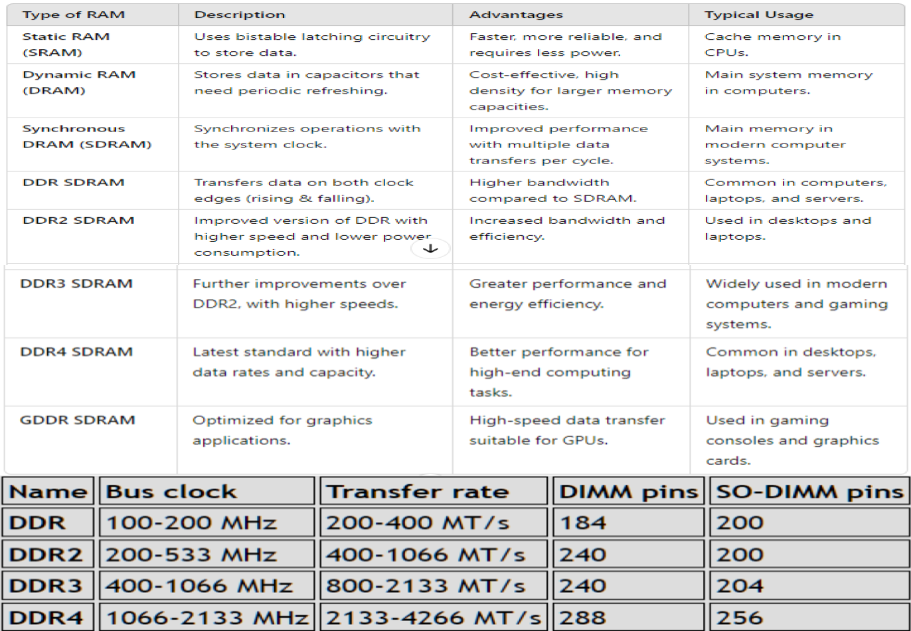

# IT Essentials Lecture One

## 1.1 Personal Computer

### Computer Definition

A **computer** can be defined as:

1. **Person:**  
   A person who performs calculations, often with a calculating machine.

2. **Programmable Device:**  
   A device capable of **storing**, **retrieving**, and **processing** data.

3. **Electronic Device:**  
   An electronic device that processes, stores, retrieves, and outputs data, typically in **binary form**, based on instructions from a variable program.

4. **Mathematical & Logical Operations:**  
   A programmable electronic device designed to **accept data**, perform **mathematical** and **logical** operations, store data, and **display results**.

**Types of computers** include:  
- **Mainframes**  
- **Desktops**  
- **Laptops**  
- **Tablets**  
- **Smartphones**  
- **Smartwatches**  
- **IoT devices**

### **Basic Personal Computer System**

- A **computer system** comprises both **hardware** and **software** components.

#### **Hardware:**
- The **physical equipment** of a computer system, including:
  - Case
  - Storage drives
  - Keyboards
  - Monitors
  - Cables
  - Speakers
  - Printers

#### **Software:**
- The **operating system** and **programs**:
  - The **operating system** instructs the computer on how to operate.
  - **Programs** or **applications** perform various functions.

## 1.2 PC Components

### Cases
- The **case** houses the internal components such as:
  - **Power supply**
  - **Motherboard**
  - **CPU** (Central Processing Unit)
  - **Memory**
  - **Disk drives**
  - Assorted **adapter cards**
- Case types include: 
  - **Super tower**
  - **Full tower**
  - **Mid-tower**
  - **Mini tower**
  - **Cube case**, and more.

### Power Supplies

- Provides **power** to all computer components.
- Must be chosen based on **current** and **future needs**.
- Delivers different **voltage levels** for various internal components.
- Converts **AC power** from the wall socket into low-voltage **DC power**.
- Must provide **sufficient power** for current and future additions.
- Has an **input voltage selector** on the back.
- Measured in **Wattage**.
- **Ohm’s Law:**  
  - **W = V x A** (Watts = Volts x Amps)

### Connectors

- A power supply includes several different connectors, used to power various internal components like the motherboard and disk drives.
- The number of connectors varies based on the wattage of the power supply.

**Some examples include:**
- **20-pin or 24-pin main power connector**
- **SATA keyed connector** (for hard drives and SSDs)
- **Molex keyed connector** (for older hard drives, optical drives, and fans)
- **Berg keyed connector** (used for powering floppy drives, now mostly obsolete)
- **4-pin to 8-pin auxiliary power connector** (additional power to the CPU, also known as the ATX12V connector)
- **6/8-pin PCIe power connector** (supplies power to high-performance graphics cards)

## Power Supply Voltage

- Power supply connectors provide various **voltages**.
- The most common voltages are **3.3 volts**, **5 volts**, and **12 volts**.
- **3.3V** and **5V** supplies are generally used by **digital circuits** like the **CPU**, **RAM**, and **chipset** on the motherboard.
- The **12V** supply is typically used to power **motors** in disk drives and **fans**.
- Power supplies can be **single rail**, **dual rail**, or **multi rail**:
  - A **rail** is the **Printed Circuit Board (PCB)** inside the power supply to which the external cables connect.
  - Known as a **Modular Power Supply**.
- Computers can tolerate minor power fluctuations, but significant deviations can cause power supply failure.

## Motherboard

- The **backbone** of the computer, interconnecting its components.
- The **main Printed Circuit Board (PCB)** containing **buses** (electrical pathways) that enable data flow among components.
- Supports various components, including:
  - **CPU**
  - **RAM**
  - **Expansion slots**
  - **Heat sink/fan assembly**
  - **BIOS chip**
  - **Chipset**
  - **Sockets**
  - **Internal and external connectors**
  - **Ports** and embedded wires connecting components
- Components may be **soldered** directly or added via **sockets, expansion slots,** and **ports**.
- Main power is supplied via a **20 or 24-pin connector**.

## Motherboard Components

- **CPU** (Central Processing Unit)
- **RAM** (Random Access Memory)
- **Expansion slots**
- **Chipset**
- **BIOS** chip and **UEFI** chip
- **SATA connectors**
- **Internal USB connector**

## Motherboard Chipset

- The **chipset** includes integrated circuits that manage interactions between system hardware, the **CPU**, and the **motherboard**, affecting:
  - **System performance**
  - **System limitations** (e.g., max memory capacity)
- **Types of Chipset:**
  - **Northbridge** controls:
    - Access to **RAM**
    - Access to the **video card**
    - Access to the **CPU**
    - **CPU communication speed**
  - **Southbridge** controls:
    - Communication between the **CPU** and **expansion ports** (e.g., hard drives, sound card, USB ports, and other I/O ports)

## Motherboard Form Factors

- **Form factor** refers to the **size and shape** of the motherboard.
- **Common form factors**:
  - **ATX** (Advanced Technology eXtended)
  - **Micro-ATX**
  - **ITX**

- The form factor affects:
  - How **components attach**
  - The **power supply type** needed
  - The **shape** of the computer case

## CPU (Central Processing Unit)

- The **CPU** interprets and executes commands, functioning as the **brain** of the computer.
- Resides as a small microchip within a **CPU package**.

### CPU Connections
- The **CPU socket** connects the processor to the motherboard.
- **CPU socket architectures**:
  - **PGA** (Pin Grid Array): Pins on the processor package, inserted into the motherboard socket.
  - **LGA** (Land Grid Array): Pins on the socket, higher pin density.
  - **BGA** (Ball Grid Array): Pins are soldered to the motherboard, commonly used in laptops and mobile devices.

### CPU Features
- **Hyper-Threading**: Creates two virtual cores per physical core, improving CPU utilization.
- **HyperTransport**: Enhances high-speed, low-latency communication between CPU and other components (e.g., memory, I/O controllers).

### CPU Performance
- Data processing capacity depends on the **processor data bus** size.
- Speed is measured in **MHz** or **GHz** (cycles per second).
- **Multi-core CPUs** allow for multiple cores on a single chip:
  - **Dual-Core**: 2 cores
  - **Triple-Core**: 3 cores
  - **Quad-Core**: 4 cores
  - **Hexa-Core**: 6 cores
  - **Octa-Core**: 8 cores
  - **Up to sixteen cores** in high-end CPUs

## Cooling Systems

- **Cooling** is essential for optimal computer performance.
- **Case fans** enhance cooling efficiency.

### Types of Cooling
- **Heat Sink and Fan**: A heat sink pulls heat from the CPU core, and the fan disperses it. Some fans are dedicated to cooling the **GPU**.

#### Active Cooling
- Requires **power** and includes fans or liquid cooling systems.
- Actively removes heat from components.
- Example: **Case fans**

#### Passive Cooling
- Requires **no power**; relies on natural heat dissipation.
- Example: **Heat sinks** (made from aluminum or copper) attach to components like the CPU or GPU, transferring and dissipating heat without consuming power.

## Types of Memory

- **Memory chips** store data as bytes, each consisting of eight bits stored as either `0` or `1`.

### Read-Only Memory (ROM)
- **ROM** stores basic boot instructions for loading the operating system.
- Retains data even when powered off and **cannot be erased or rewritten**.

#### Types of ROM:
- **ROM**: **Read-Only Memory**. Programmed at the factory; non-erasable.
- **PROM**: **Programmable ROM**. Blank at manufacture; programmable once.
- **EPROM**: **Erasable Programmable ROM**. Erasable with ultraviolet light.
- **EEPROM**: **Electrically Erasable Programmable ROM**. Reprogrammable while in the computer.

### Random-Access Memory (RAM)
- **RAM** temporarily stores data and programs for CPU access.
- Volatile memory, so contents are erased when powered off.
- More **RAM** enhances system performance and capacity for larger files.
- All data moving in or out of the processor **must be loaded** into RAM first.
- **RAM** capacity is limited by the motherboard chipset.

#### Types of RAM:
- **SRAM** (Static RAM)
- **DRAM** (Dynamic RAM)
- **SDRAM** (Synchronous Dynamic RAM)
- **DDR SDRAM** (Double Data Rate SDRAM) with variations:
  - **DDR2 SDRAM**
  - **DDR3 SDRAM**
  - **DDR4 SDRAM**
- **GDDR SDRAM**: Specialized for video graphics with a dedicated **GPU**.

### Cache

- **SRAM** serves as **cache memory**, storing frequently accessed data for faster CPU retrieval compared to **DRAM** (main memory).
- **Memory speed** directly affects the processor’s data processing capacity.

#### Types of Cache Memory:
- **L1 Cache**: Integrated within the **CPU**, provides fastest access.
- **L2 Cache**: Originally mounted on the motherboard; now integrated into the **CPU**.
- **L3 Cache**: Found in high-end workstations and server CPUs for additional cache support.