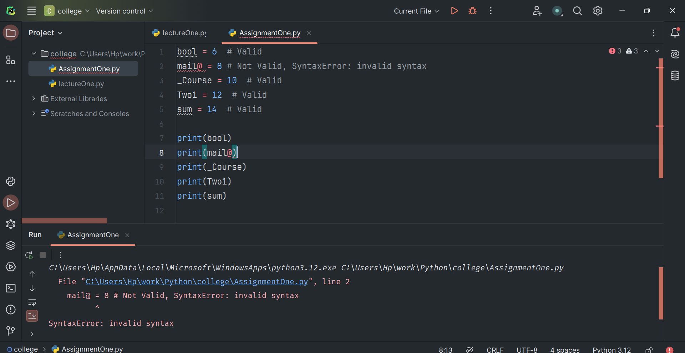
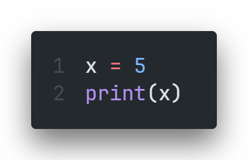
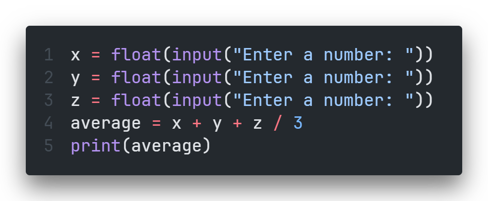
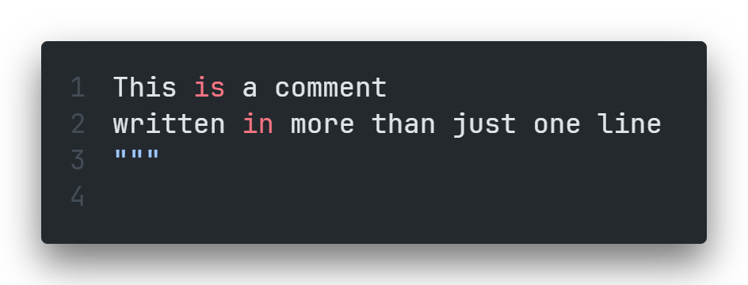
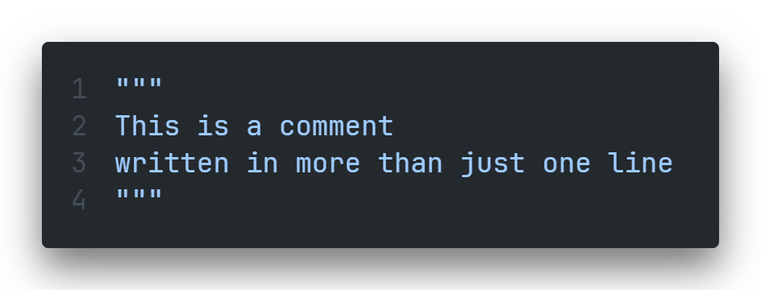
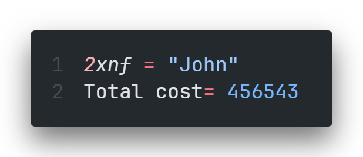
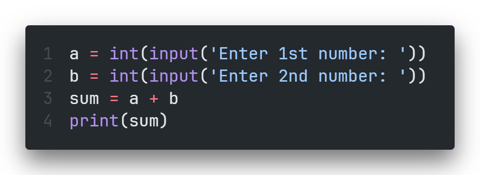
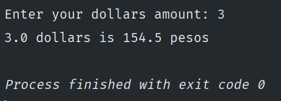
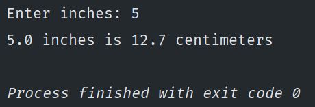

# Ahmad Ali Ahmad Othman - Section 1 - Assignment 1

## 1. Detect whether these variable names are valid or not:

- `bool`
- `mail@`
- `_Course`
- `Two1`
- `sum`

- **Valid identifiers**: `bool` (not recommended), `_Course`, `Two1`, `sum` (not recommended)
- **Invalid identifier**: `mail@`

Although `bool` and `sum` are reserved words, but python allows using them as variable names which is not recommended because it disables their functionality.



## 2. Determine the type of errors:

```Python
x="student"
y="hello"
print("""hello my students ""'+ " "+x+" "+y)
```

**SyntaxError**: unterminated triple-quoted string literal (detected at line 3)

## 3. What will be the output of the following code snippet?

```Python
print(2**3 + (5 + 6) ** (1 + 1)) # 8 + 11**2 = 8 + 121 + 129
```

<mark>A) 129</mark>
B) 8
C) 121
D) None of the above.

## 4. What will be the output of the following code snippet?

```Python
print(type(5 / 2))  # <class 'float'>
print(type(5 // 2)) # <class 'int'>
```

<mark>A) float and int</mark>
B) int and float
C) float and float
D) int and int

## 5. What will be the datatype of the var in the below code snippet?

```Python
var = 10
print(type(var))  # <class 'int'>
var = "Hello"
print(type(var))  # <class 'str'>
```

## 6. What is the actual and expected output of this program and if there is an error what is the type of it and how to solve it?

```Python
# This program takes two numbers from the user and prints the sum.
x = input("Enter a number: ")  # "3"
y = input("Enter another number: ") # "4"
sum = x + y
print(sum)  # "34"
```

**Expected vs. Actual Output**

- **Expected Output** (if we want the sum as a number): If `x = 3` and `y = 4`, the expected output should be `7`.
- **Actual Output**: For the same inputs, the actual output will be `34`.

**Type of Error**

- This is a logical/semantic error: **TypeError**, where the program performs concatenation instead of addition because `x` and `y` are strings, not integers.

**Solution**

- To fix this, we need to convert `x` and `y` to integers (or floats) before adding them:

```Python
# This program takes two numbers from the user and prints the sum.
x = int(input("Enter a number: "))  # 3
y = int(input("Enter another number: "))  # 4
sum = x + y
print(sum)  # 7
```

## 7. What is the output?

```Python
f = 5
y = 6
z = 4
w = 33

p = ((f + y) * z / w) ** F  # NameError: name 'F' is not defined.
print(p)
```

It will result in a `NameError` Because `F` is not defined.

**Error Identification**:

- **NameError**: The variable `F` (uppercase) in line 6 is undefined, which will raise a `NameError` when this line is executed.
- **Type of Error**: `NameError` occurs because `F` has not been defined in the code. Python is case-sensitive, so `f` (lowercase) and `F` (uppercase) are distinct variables.

## 8. Discover the errors, and keywords for the following sub Python programs which was written by some friends in the same company. Then correct each type of error and Identifiers.

| NO  | Before correction    | Type of Error                            | After correcting                                               |
| --- | -------------------- | ---------------------------------------- | -------------------------------------------------------------- |
| 1   |   | SyntaxError (missing double quote)       |                                             |
| 2   |   | IndentationError (incorrect indentation) |                                            |
| 3   |   | LogicalError (division precedence)       |                                             |
| 4   |   | SyntaxError (incorrect comment format)   |                                             |
| 5   |  | SyntaxError (invalid variable name)      |                                            |
| 6   |  | ZeroDivisionError (division by zero)     | Add a check to avoid division by zero or change X to non-zero. |
| 7   |  | TypeError (string concatenation)         |                                            |

## 9. Essay Questions:

- Create a program to compute the volume of a sphere. Use the formula `V = (4/3) * pi * r^3` where `pi` is equal to `3.1416` approximately. The `r` is the radius of sphere. Display the result.

```Python
# Prompt the user to enter the radius and convert the input to a float
radius = float(input("Enter the radius: "))
PI = 3.1416  # Define the constant value for PI
volume = (4 / 3) * PI * radius**3  # Calculate the sphere's volume

print(volume)
```


- Write a program that converts the input Celsius degree into its equivalent Fahrenheit degree. Use the formula `F = (9 / 5) * C + 32`.

```Python
Celsius = float(input("Enter Celsius: "))
Fahrenheit = (9 / 5) * Celsius + 32

print(Fahrenheit)
```


- Write a program that converts the input dollar to its peso exchange rate equivalent. Assume that the present exchange rate is `51.50` pesos for one dollar. Then display the peso equivalent exchange rate.

```Python
dollars = float(input("Enter your dollars amount: "))
peso_dollar_ratio = 51.5
pesos = dollars * peso_dollar_ratio

# Used formatted strings for better output display
print(f"{dollars} dollars is {pesos} pesos")
```



- Write a program that converts the input inches into its equivalent centimeters. Take note that one inch is equal to `2.54` centimeters.

```Python
inches = float(input("Enter inches: "))

centimeters = inches * 2.54

# Used formatted strings for better output display
print(f"{inches} inches is {centimeters} centimeters")
```


