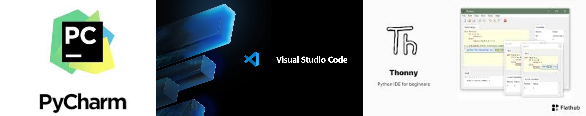
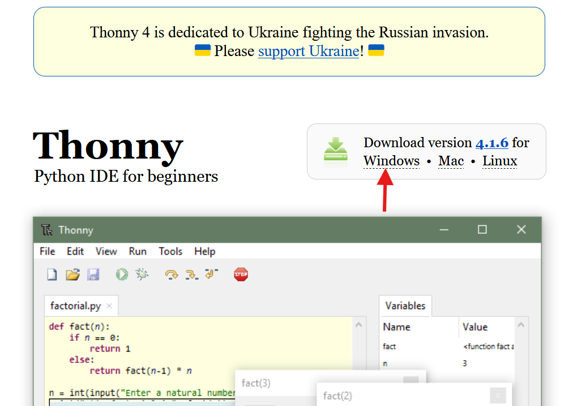
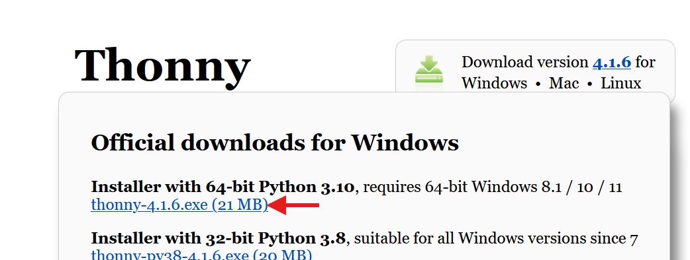
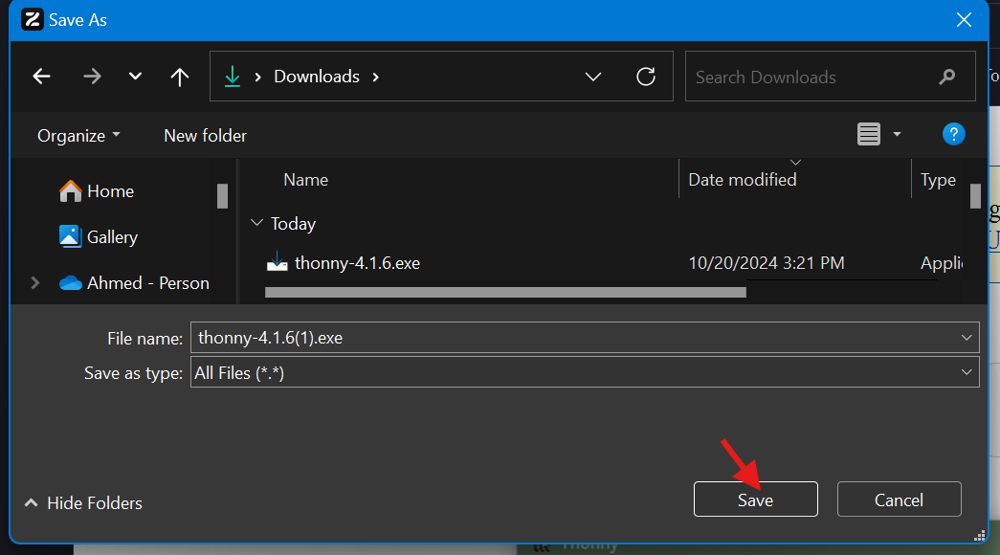
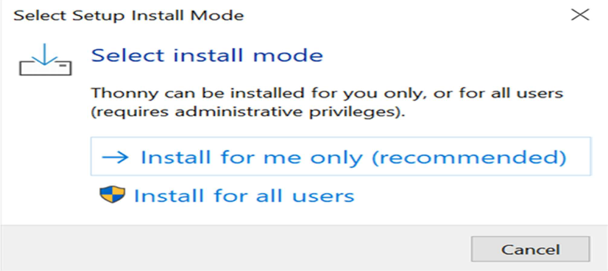

# Programming Essentials in Python Lecture 1

## What is Python

- Python is a popular, **interpreted** programming language.
- Created by **Guido van Rossum** and released in **1991**.
- It is highly favored for **rapid application development**.
- The language features a **simple**, **easy-to-learn**, **readable** syntax that **reduces program maintenance costs**.

## Uses of Python

1. Data analysis and machine learning.
2. Web development.
3. Automation or scripting.
4. Software testing and prototyping.
5. Everyday tasks.

## What Can Python Do

**Python can:**

- Build web applications on a server.
- Connect to databases, read, and modify files.
- Handle big data and perform complex mathematical operations.
- Be used for rapid prototyping.

### Python Features and Advantages

- **Easy to Code**
  Python is a high-level language that is **effortless to learn**.

- **Easy to Read**
  Python code is **readable** and looks like simple English words.

- **Free and Open-Source**
  Python is developed under an **OSI-approved open source license**, making it completely free to use.

- **Portable**
  Python is **portable**, allowing the same code to run on different machines.

- **Object-Oriented and Procedure-Oriented**
  Python supports both **object-oriented** (focused on data and objects) and **procedure-oriented** (focused on reusable functions) programming paradigms.

- **Robust Standard Library**
  Python offers a **rich standard library**, reducing the need for developers to write code from scratch for many functionalities.

- **Support for GUI**
  Python provides **support for GUIs (Graphical User Interfaces)**, enabling easy user interaction with applications.

- **Dynamically Typed**
  Python is **dynamically typed**, meaning variable types are decided at runtime.
  Many programming languages need to declare the type of the variable before runtime like C++ and Java.
  Examples:

```C++
  int x = 20 // In C++ type declaration is mandatory
```

```Python
x = 20  # No need to declare variable type in Python
```

## Examples of Python

```Python
print("Hello, World!") # Output: Hello, World!
x = 5
y = 9
z = x + y # 5 + 9 = 14
print(z) # Output: 14
print(type(z)) # Output: <class 'int'>
print(type(type(z))) # Output: <class 'type'>
```

output:


## Python Uses Different IDEs

An **Integrated Development Environment (IDE)** is a software application that provides essential tools for software development, including:

- A **source code editor**
- **Build automation** tools
- A **debugger**
- A **compiler** or **interpreter**

It streamlines the development process by integrating these tools into a single interface for programmers.

Examples include:

- [Visual Studio Code](https://code.visualstudio.com/download) ([YouTube Tutorial](https://www.youtube.com/watch?v=kE_PFvBkgGA))
- [PyCharm](https://www.jetbrains.com/pycharm/download/)
- [Thonny](https://thonny.org/)
- [Programiz Online Compiler](https://www.programiz.com/python-programming/online-compiler/)



## How to install IDE (Thonny)








