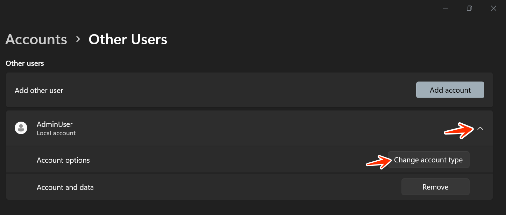
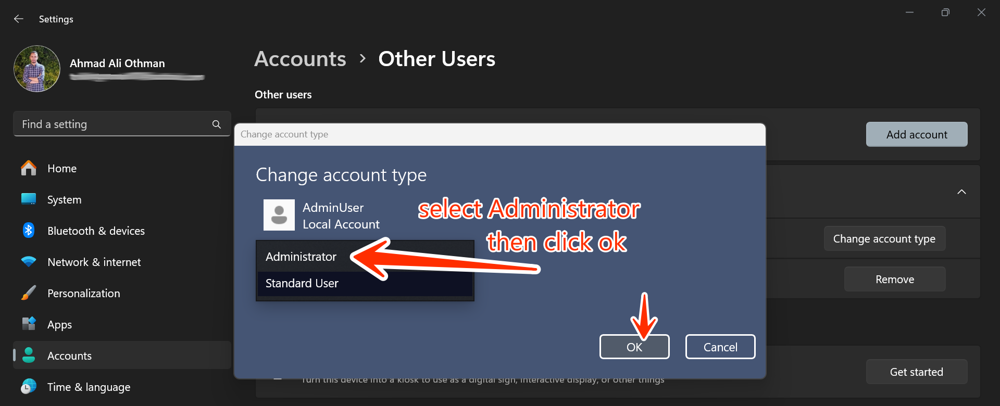

---
prev:
   text: 'Task Five'
   link: '/College/IT-Essentials/Assignments/AssignmentFive'
next:
   text: 'Task Seven'
   link: '/College/IT-Essentials/Assignments/AssignmentSeven'
---

# Task 6

## **Step 1: Open User Account Settings**

1. **Log in to your Windows 11 system** using an account with administrative privileges.

2. **Press `Win + I`** to open the **Settings** app or search for it in the start menu.

3. In the **Settings** window, go to **Accounts** -> **Other users**.

---

## **Step 2: Create the "AdminUser" Account with Administrative Rights**

1. Under the **Other users** section, click **Add account**.
   

2. In the pop-up: - Select **I don't have this person's sign-in information**.
    - Then click **Add a user without a Microsoft account**
   

3. Enter the following details: - **Username**: `AdminUser` - **Password**: Use a strong password like `P@ssw0rd123!`. - Confirm the password.
    - Set up **security questions** (for password recovery).
   

4. Once the account is created, it will appear under "Other users".

5. **Change the account type to Administrator**:

   - Click on the newly created `AdminUser` account.
   - Select **Change account type**.
     

   - In the dropdown menu, choose **Administrator**.
   - Click **OK** to save changes.
     
     

## **Step 3: Create the "GuestUser" Account with Limited Permissions**

1. Under **Other users**, click **Add account** again.
   
2. Follow the same steps: - Select **I don't have this person's sign-in information**.
    - Choose **Add a user without a Microsoft account**.
   
3. Enter the following details: - **Username**: `GuestUser` - **Password**: A simple password like `1234`.
    - Confirm the password and set the security questions.
   
4. By default, **GuestUser** will be created as a **Standard User**.
   

## **Summary**

- **AdminUser**: Has full administrative rights—can install applications, manage settings, and access system files.
- **GuestUser**: A standard user with limited permissions—restricted from installing applications or changing system settings.
