---
prev:
  text: "Exams"
  link: "/College/IT-Essentials/Exams/index"
next:
  false
  # text: "Exam Three"
  # link: "/College/IT-Essentials/Lectures/ExamThree"
---

# Assignment Two

## Scenario

- You are tasked with setting up a small office network for a company that consists of 10 computers, a server, and a printer.
- The company is located in a single-floor building.
- The network needs to allow all computers to share files, access the internet, and print documents to the shared printer.
- The company needs reliable communication and secure access to its resources.

## Task No.01

1. What are the essential components required to set up the network in this office?
2. What are the seven layers of the OSI model, and how does each layer contribute to enabling communication between the devices at the office network?
3. What are the suggested network type and topology for the office network? Explain why these are the most suitable options for this setup.
4. Compare between TCP and UDB protocols.
5. Using Cisco Packet Tracer, design and implement a basic network setup for the office. Include the network type, devices, and topology. Simulate and test communication between the devices to ensure the setup is functional. Explain your design choices and the results of your simulation.

## Task No.02

6. What are the basic functions of an Operating system?
7. Install Windows 10 on a virtual machine (e.g., VirtualBox) and configure basic system settings:
   a) Start a fresh installation of Windows 10.
   b) During the installation, set the language, time zone, and region.
   c) After installation, create user accounts and set up user permissions.
   d) Compare between FAT32 and NTFS file systems then Configure a storage device with the appropriate file system based on its intended use
   e) Set up a local area network (LAN) connection or Wi-Fi, ensuring internet access.
8. After successfully installing Windows 10, configure security settings such as Windows Defender, Firewall, and User Account Control.

## Answers

### Task No.01

#### Q1: What are the essential components required to set up the network in this office?

- **Router**: To connect the network to the internet.
- **Switch**: To interconnect all devices (computers, server, printer) within the network.
- **Ethernet cables (Cat5e or Cat6)**: For wired connections between devices.
- **Access Point (optional)**: If wireless connectivity is needed.
- **Firewall**: For securing the network from external threats.
- **Network Interface Cards (NICs)**: Required in all devices for network communication.
- **Server**: For file sharing, printer management, and possibly hosting applications.
- **Printer**: Configured to be network-accessible.

#### Q2: What are the seven layers of the OSI model, and how does each layer contribute to enabling communication between the devices at the office network?

1. **Physical Layer**: Transmits raw bit streams over physical media like cables or Wi-Fi.
2. **Data Link Layer**: Handles MAC addressing and error detection (e.g., Ethernet protocol).
3. **Network Layer**: Manages IP addressing and routing (e.g., ensuring devices can access the internet).
4. **Transport Layer**: Ensures data is sent reliably (TCP) or quickly (UDP).
5. **Session Layer**: Maintains, establishes, and terminates connections (e.g., managing active file transfers).
6. **Presentation Layer**: Handles data translation, encryption, and compression.
7. **Application Layer**: Interfaces with software applications (e.g., browsers, email clients).

#### Q3: What are the suggested network type and topology for the office network? Explain why these are the most suitable options for this setup.

- **Network Type**: LAN (Local Area Network) for internal communication, and WAN (Wide Area Network) for internet access.
- **Topology**:
  - **Star Topology**: Centralized connection through a switch/router. This ensures ease of troubleshooting and scalability.
  - **Reason**: A star topology minimizes downtime (only affected devices fail) and supports centralized management.

#### Q4: Compare between TCP and UDB protocols.

##### TCP (Transmission Control Protocol)

- **Features**:
  - Reliable, ensures data integrity.
  - Acknowledges received data.
  - Resends unacknowledged data.
  - Maintains data sequencing.

##### UDP (User Datagram Protocol)

- **Features**:
  - Unreliable, best-effort delivery.
  - No acknowledgments or retransmissions.
  - Fast, low overhead.
  - Delivers data as it arrives.

| Feature         | TCP                                 | UDP                             |
| --------------- | ----------------------------------- | ------------------------------- |
| Reliability     | Reliable; acknowledges data.        | Unreliable; no acknowledgments. |
| Overhead        | Higher; ensures data integrity.     | Lower; fast, lightweight.       |
| Use Case        | Email, file transfer, web browsing. | Streaming, gaming, voice calls. |
| Data Sequencing | Data delivered in order.            | No guarantee of order.          |

#### Q5: Using Packet Tracer, design and implement a basic network setup for the office. Include the network type, devices, and topology. Simulate and test communication between the devices to ensure the setup is functional. Explain your design choices and the results of your simulation.

#### Q6: What are the basic functions of Operating system?

#### Q7: Install Windows 10 on a virtual machine and configure basic system settings.

##### a) Fresh Installation:

- Create a new VM in VirtualBox.
  

- Attach the Windows 10 ISO.
  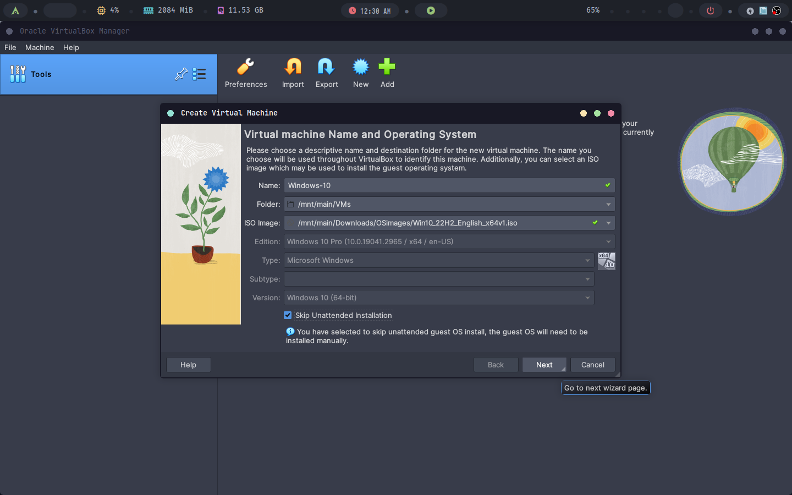

- Give it at least 4GB of RAM, 30GB storage and 4 cores of your CPU.
  

  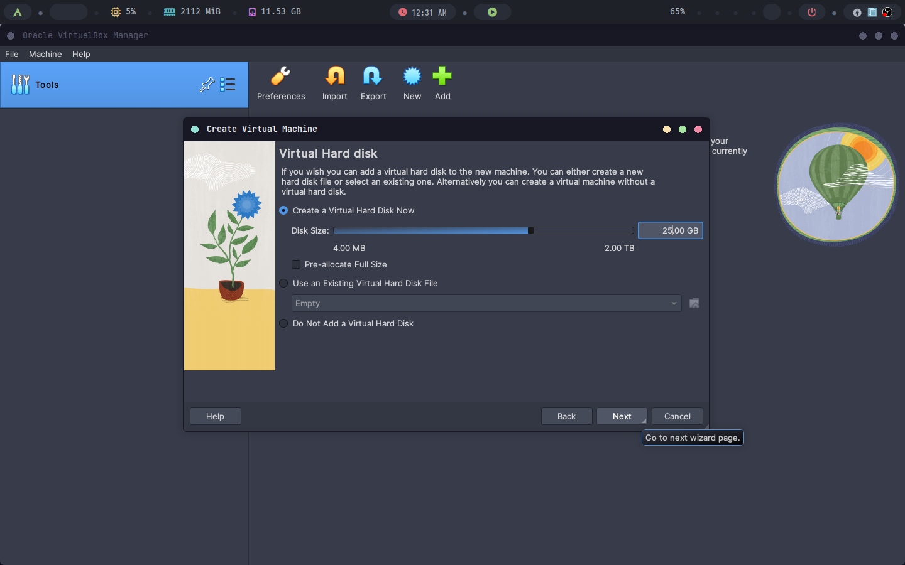

- Follow the installation wizard.
  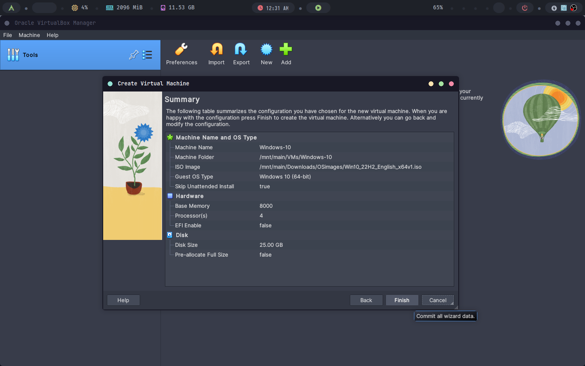

- Run the virtual machine.
  

#### b) Configure Language, Time Zone, and Region:

- Select language, local and keyboard layout.
  

- Start windows installation
  

- Enter your product key if available, we will click `I don't have a product key`.
  

- Select the windows version to install (Home, Education, Pro, Enterprise). We will choose windows 10 pro.
  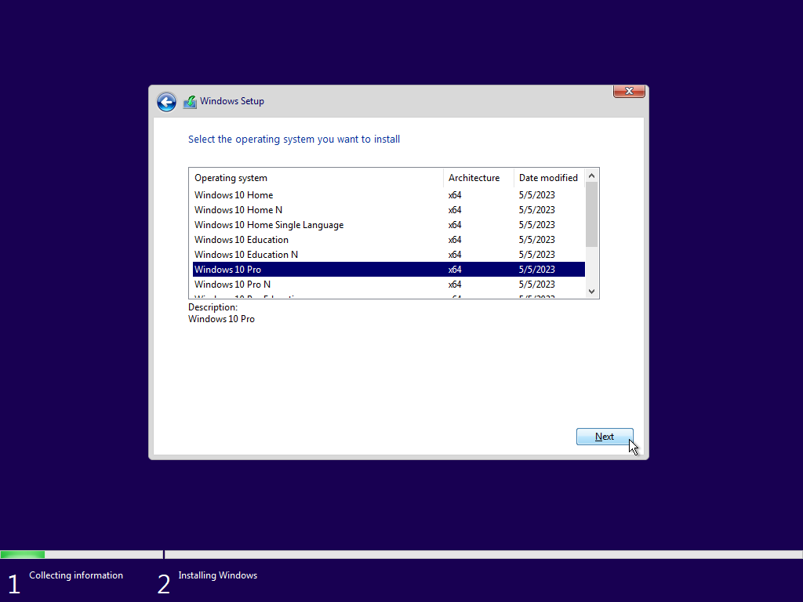

- Accept terms and conditions
  

- Choose custom install (to format out disk).
  

- Choose the right disk then click `next`.
  

- Installation has begun.
  

  

- Wait until it finishes.
  

  

  

  

- Choose your region.
  

- Keyboard layout.
  

- Add second layout (optional).
  

- Setup networking.
  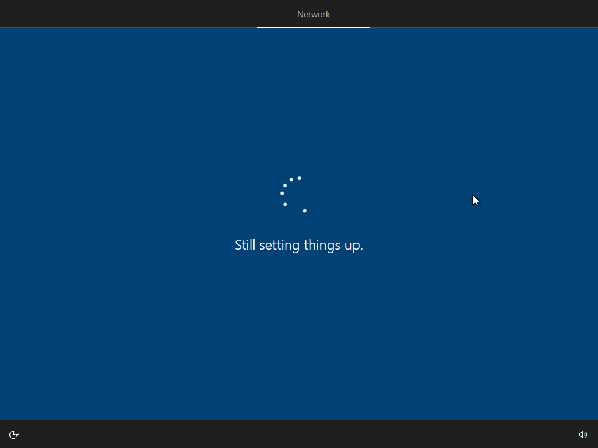

- Answer some questions.
  

- Add/Create your microsoft account or continue with an offline account.
  

- Skip unnecessary features.
  

- Enter your username.
  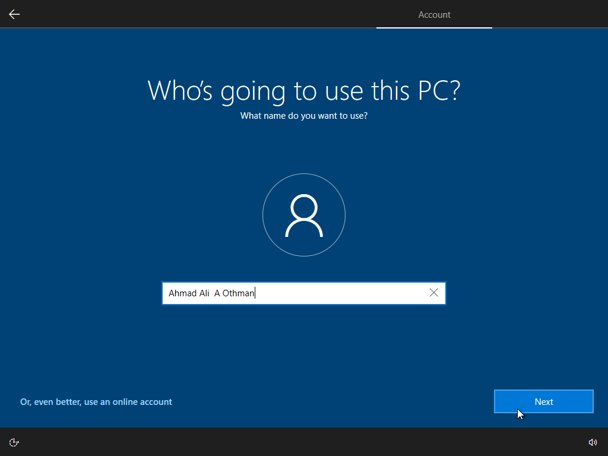

- Create a password (optional but recommended).
  

- Confirm your password.
  

- Answer security questions (3 questions).
  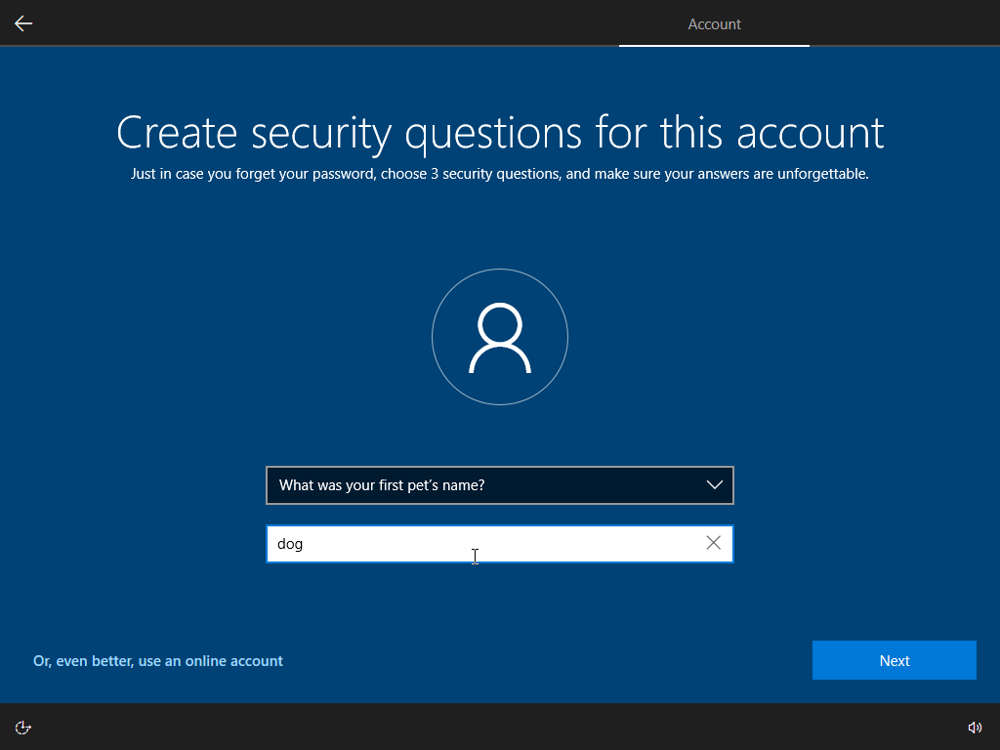

  

  

- Turn off telemetry.
  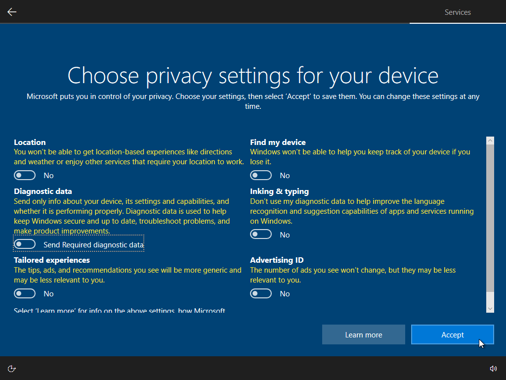

- Skip marketing questions.
  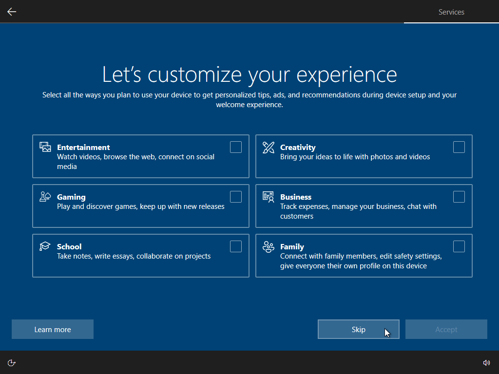

- Skip setting up Cortana.
  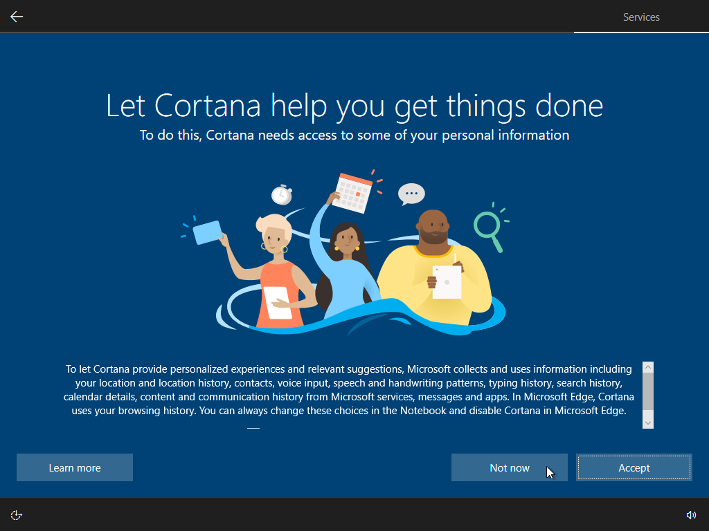

- Finishing up the installation.
  

- Installation completed.
  

#### c) Create User Accounts and Permissions:

- Open windows settings app
  
- Select `Accounts` -> `Family & Other Users`
  
- Select `Add someone else to this PC` -> `I don't have this person's sign-in information`
  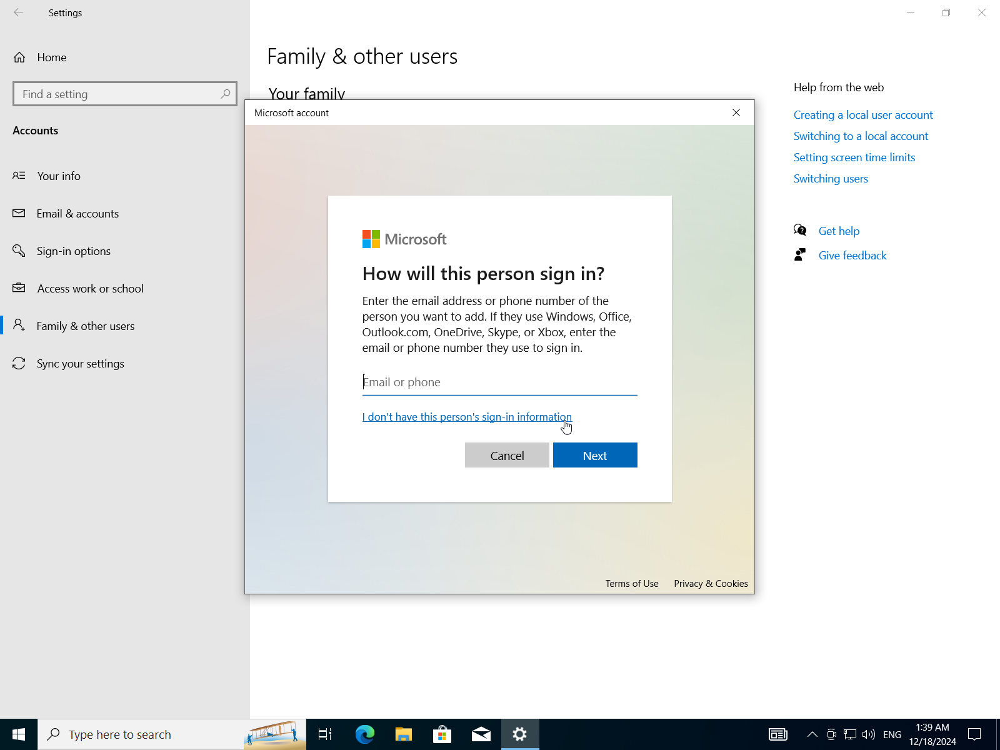
- Add a user without microsoft account.
  
- Insert username, password, confirm-password, and security questions.
  
- Repeat to add another account.
  
- Change account type.
  
- Change account to `Administrator` or `Standard User`.
  
  
- Now we have two users one is Administrator and the other one is a standard user.
  

#### d) FAT32 vs NTFS:

FAT32 (File Allocation Table 32) and NTFS (New Technology File System) are two popular file systems used in various operating systems. Here's a comparison of their intended uses:

**FAT32:**

1. **Simple, low-end devices**: FAT32 is suitable for simple, low-end devices such as USB drives, SD cards, and older computers with limited storage capacity.
2. **Cross-platform compatibility**: FAT32 is widely supported by most operating systems, including Windows, macOS, Linux, and Android.
3. **Limited features**: FAT32 has limited features compared to NTFS, making it suitable for simple file transfer and sharing.

**NTFS:**

1. **High-performance storage devices**: NTFS is designed for high-performance storage devices such as hard drives, solid-state drives (SSDs), and NAS (Network-Attached Storage) devices.
2. **Advanced security features**: NTFS offers advanced security features such as file system encryption, access control, and compression, making it suitable for sensitive data storage.
3. **Large file support**: NTFS can handle large files and directories, making it ideal for storing and sharing large files and folders.

**Key differences:**

1. **Maximum partition size**: FAT32 has a maximum partition size of 2TB (4GB sectors), while NTFS has no such limit.
2. **File system limitations**: FAT32 has limited file system features compared to NTFS, including no support for symbolic links, journaling, or file compression.
3. **Security features**: NTFS offers more advanced security features than FAT32, including file system encryption and access control.

**When to use each:**

1. Use FAT32 when:

- You need a simple, low-end file system that is easy to set up and manage.
- You're working with devices that have limited storage capacity (e.g., USB drives, SD cards).
- Cross-platform compatibility is essential.

2. Use NTFS when:

- You need a high-performance file system for large storage devices (e.g., hard drives, SSDs).
- Advanced security features are required (e.g., encryption, access control).
- Large files and directories need to be stored and shared.

In summary, FAT32 is suitable for simple, low-end devices with limited storage capacity, while NTFS is designed for high-performance storage devices that require advanced security features.
