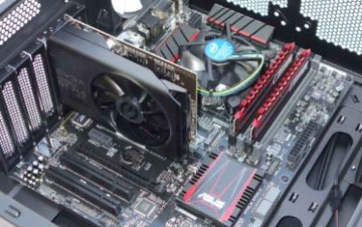
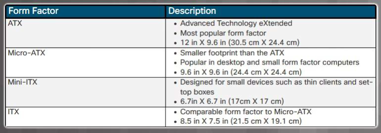
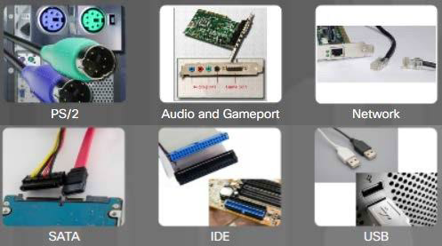
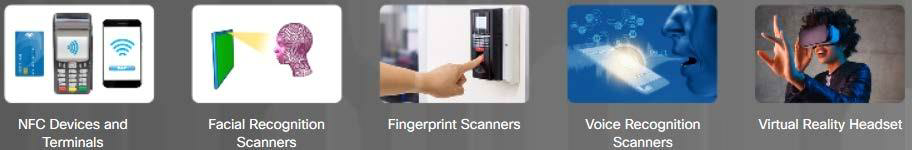

---
prev:
  text: "IT-Essentials"
  link: "/College/IT-Essentials/Lectures/index"
next:
  text: "Lecture Two"
  link: "/College/IT-Essentials/Lectures/LectureTwo"
---

# IT Essentials Lecture 1

## 1.1 Personal Computer

### Computer Definition

A **computer** can be defined as:

1. **Person:**
   A person who performs calculations, often with a calculating machine.

2. **Programmable Device:**
   A device capable of **storing**, **retrieving**, and **processing** data.

3. **Electronic Device:**
   An electronic device that processes, stores, retrieves, and outputs data, typically in **binary form**, based on instructions from a variable program.

4. **Mathematical & Logical Operations:**
   A programmable electronic device designed to **accept data**, perform **mathematical** and **logical** operations, store data, and **display results**.

**Types of computers** include:

- **Mainframes**
- **Desktops**
- **Laptops**
- **Tablets**
- **Smartphones**
- **Smartwatches**
- **IoT devices**

### **Basic Personal Computer System**

- A **computer system** consists of **hardware** and **software** components.
#### **Hardware:**

- The **physical equipment** of a computer system, including:
  - Case
  - Storage drives
  - Keyboards
  - Monitors
  - Cables
  - Speakers
  - Printers

#### **Software:**

- The **operating system** and **programs**:
  - The **operating system** instructs the computer on how to operate.
  - **Programs** or **applications** perform various functions.

## 1.2 PC Components

### Cases

- The **case** houses the internal components such as:
  - **Power supply**
  - **Motherboard**
  - **CPU** (Central Processing Unit)
  - **Memory**
  - **Disk drives**
  - Assorted **adapter cards**
- Case types include:
  - **Super tower**
  - **Full tower**
  - **Mid-tower**
  - **Mini tower**
  - **Cube case**, and more.

### Power Supplies

- Provides **power** to all computer components.
- Must be chosen based on **current** and **future needs**.
- Delivers different **voltage levels** for various internal components.
- Converts **AC power** from the wall socket into low-voltage **DC power**.
- Must provide **sufficient power** for current and future additions.
- Has an **input voltage selector** on the back.
- Measured in **Wattage**.
- **Ohm’s Law:**
  - $\text{W} = \text{V} \times \text{A}$ (Watts = Volts x Amps)

### Connectors

- A power supply includes several different connectors, used to power various internal components like the motherboard and disk drives.
- The number of connectors varies based on the wattage of the power supply.

**Some examples include:**

- **20-pin or 24-pin main power connector**
- **SATA keyed connector** (for hard drives and SSDs)
- **Molex keyed connector** (for older hard drives, optical drives, and fans)
- **Berg keyed connector** (used for powering floppy drives, now mostly obsolete)
- **4-pin to 8-pin auxiliary power connector** (additional power to the CPU, also known as the ATX12V connector)
- **6/8-pin PCIe power connector** (supplies power to high-performance graphics cards)

## Power Supply Voltage

- Power supply connectors provide various **voltages**.
- The most common voltages are **3.3 volts**, **5 volts**, and **12 volts**.
- **3.3V** and **5V** supplies are generally used by **digital circuits** like the **CPU**, **RAM**, and **chipset** on the motherboard.
- The **12V** supply is typically used to power **motors** in disk drives and **fans**.
- Power supplies can be **single rail**, **dual rail**, or **multi rail**:
  - A **rail** is the **Printed Circuit Board (PCB)** inside the power supply to which the external cables connect.
  - Known as a **Modular Power Supply**.
- Computers can tolerate minor power fluctuations, but significant deviations can cause power supply failure.

## Motherboard

- The **backbone** of the computer, interconnecting its components.
- The **main Printed Circuit Board (PCB)** containing **buses** (electrical pathways) that enable data flow among components.
- Supports various components, including:
  - **CPU**
  - **RAM**
  - **Expansion slots**
  - **Heat sink/fan assembly**
  - **BIOS chip**
  - **Chipset**
  - **Sockets**
  - **Internal and external connectors**
  - **Ports** and embedded wires connecting components
- Components may be **soldered** directly or added via **sockets, expansion slots,** and **ports**.
- Main power is supplied via a **20 or 24-pin connector**.

## Motherboard Components

- **CPU** (Central Processing Unit)
- **RAM** (Random Access Memory)
- **Expansion slots**
- **Chipset**
- **BIOS** chip and **UEFI** chip
- **SATA connectors**
- **Internal USB connector**

## Motherboard Chipset

- The **chipset** includes integrated circuits that manage interactions between system hardware, the **CPU**, and the **motherboard**, affecting:
  - **System performance**
  - **System limitations** (e.g., max memory capacity)
- **Types of Chipset:**
  - **Northbridge** controls:
    - Access to **RAM**
    - Access to the **video card**
    - Access to the **CPU**
    - **CPU communication speed**
  - **Southbridge** controls:
    - Communication between the **CPU** and **expansion ports** (e.g., hard drives, sound card, USB ports, and other I/O ports)

## Motherboard Form Factors

- **Form factor** refers to the **size and shape** of the motherboard.
- **Common form factors**:
  - **ATX** (Advanced Technology eXtended)
  - **Micro-ATX**
  - **ITX**
    
- The form factor affects:
  - How **components attach**
  - The **power supply type** needed
  - The **shape** of the computer case

## CPU (Central Processing Unit)

- The **CPU** interprets and executes commands, functioning as the **brain** of the computer.
- Resides as a small microchip within a **CPU package**.

### CPU Connections

- The **CPU socket** connects the processor to the motherboard.
- **CPU socket architectures**:
  - **PGA** (Pin Grid Array): Pins on the processor package, inserted into the motherboard socket.
  - **LGA** (Land Grid Array): Pins on the socket, higher pin density.
  - **BGA** (Ball Grid Array): Pins are soldered to the motherboard, commonly used in laptops and mobile devices.

### CPU Features

- **Hyper-Threading**: Creates two virtual cores per physical core, improving CPU utilization.
- **HyperTransport**: Enhances high-speed, low-latency communication between CPU and other components (e.g., memory, I/O controllers).

### CPU Performance

- Data processing capacity depends on the **processor data bus** size.
- Speed is measured in **MHz** or **GHz** (cycles per second).
- **Multi-core CPUs** allow for multiple cores on a single chip:
  - **Dual-Core**: 2 cores
  - **Triple-Core**: 3 cores
  - **Quad-Core**: 4 cores
  - **Hexa-Core**: 6 cores
  - **Octa-Core**: 8 cores
  - **Up to sixteen cores** in high-end CPUs

## Cooling Systems

- **Cooling** is essential for optimal computer performance.
- **Case fans** enhance cooling efficiency.

### Types of Cooling

- **Heat Sink and Fan**: A heat sink pulls heat from the CPU core, and the fan disperses it. Some fans are dedicated to cooling the **GPU**.

#### Active Cooling

- Requires **power** and includes fans or liquid cooling systems.
- Actively removes heat from components.
- Example: **Case fans**

#### Passive Cooling

- Requires **no power**; relies on natural heat dissipation.
- Example: **Heat sinks** (made from aluminum or copper) attach to components like the CPU or GPU, transferring and dissipating heat without consuming power.

## Types of Memory

- **Memory chips** store data as bytes, each consisting of eight bits stored as either `0` or `1`.

### Read-Only Memory (ROM)

- **ROM** stores basic boot instructions for loading the operating system.
- Retains data even when powered off and **cannot be erased or rewritten**.

#### Types of ROM:

- **ROM**: **Read-Only Memory**. Programmed at the factory; non-erasable.
- **PROM**: **Programmable ROM**. Blank at manufacture; programmable once.
- **EPROM**: **Erasable Programmable ROM**. Erasable with ultraviolet light.
- **EEPROM**: **Electrically Erasable Programmable ROM**. Reprogrammable while in the computer.

### Random-Access Memory (RAM)

- **RAM** temporarily stores data and programs for CPU access.
- Volatile memory, so contents are erased when powered off.
- More **RAM** enhances system performance and capacity for larger files.
- All data moving in or out of the processor **must be loaded** into RAM first.
- **RAM** capacity is limited by the motherboard chipset.

#### Types of RAM:

- **SRAM** (Static RAM)
- **DRAM** (Dynamic RAM)
- **SDRAM** (Synchronous Dynamic RAM)
- **DDR SDRAM** (Double Data Rate SDRAM) with variations:
  - **DDR2 SDRAM**
  - **DDR3 SDRAM**
  - **DDR4 SDRAM**
- **GDDR SDRAM**: Specialized for video graphics with a dedicated **GPU**.

### Cache

- **SRAM** serves as **cache memory**, storing frequently accessed data for faster CPU retrieval compared to **DRAM** (main memory).
- **Memory speed** directly affects the processor’s data processing capacity.

The fastest memory is typically **static RAM** (SRAM) which is used as
cache memory for storing the most recently used data and instructions
by the CPU.

#### Types of Cache Memory:

- **L1 Cache**: Integrated within the **CPU**, provides fastest access.
- **L2 Cache**: Originally mounted on the motherboard; now integrated into the **CPU**.
- **L3 Cache**: Found in high-end workstations and server CPUs for additional cache support.

### Adapter Cards

- **Adapter cards** enhance a computer's functionality by adding controllers for specific devices or replacing malfunctioning ports.

#### Common Adapter Cards:

- **Sound adapter**
- **Network Interface Card (NIC)**
- **Wireless NIC**
- **Video adapter** (display adapter)
- **Video capture card**
- **TV tuner card**
- **Universal Serial Bus (USB) controller card**
- **eSATA card**

- Computers have **expansion slots** on the motherboard for installing adapter cards, and the card connector must match the expansion slot type.

#### Common Expansion Slots:

- **Peripheral Component Interconnect (PCI)**
- **Mini-PCI**
- **PCI eXtended (PCI-X)**
- **PCI Express (PCIe)**
- **Riser card**
- **Accelerated Graphics Port (AGP)**

### Types of Storage Devices

- **Data drives** provide non-volatile storage for user data, applications, and the operating system.
- These drives can be **internal** or **external** and may feature **fixed media** or **removable media**.

#### Classification of Data Storage Devices:

- **Magnetic**: Examples include hard disk drives (HDD) and tape drives.
- **Solid State**: Examples include solid state drives (SSD).
- **Optical**: Examples include CDs and DVDs.

- Storage devices connect to the motherboard using **Serial AT Attachment (SATA)** connections, with **Parallel ATA (EIDE)** as the legacy interface.
- **Interface standards** define data transfer methods, rates, and physical characteristics of cables and connectors.

#### SATA Standard Versions:

- **SATA 1**: First version, lower transfer speeds.
- **SATA 2**: Improved transfer speeds.
- **SATA 3**: Highest transfer speeds.

The cables and connectors remain consistent across all versions, but data transfer speeds vary.

### Magnetic Media Storage

Magnetic media storage represents binary data using magnetized or non-magnetized areas on magnetic media.

#### Common Types of Magnetic Media Storage:

- **Hard Disk Drive (HDD)**: Traditional storage with capacities ranging from gigabytes (GB) to terabytes (TB). HDDs have motors that spin magnetic platters and move drive heads. Speeds are measured in **revolutions per minute (RPM)**, with common speeds being:

  - 5400 RPM
  - 7200 RPM
  - 10,000 RPM

- **Tape Drive**: Used primarily for **data archiving**. Uses a magnetic read/write head and a removable tape cartridge. Capacities range from a few GB to several TB.

- **Floppy Disk Drive (FDD)**: Uses **3.5-inch floppy disks** with a maximum storage capacity of **1.44 MB**.

### Semiconductor Storage

**Solid-State Drives (SSD)** store data as electrical charges in semiconductor flash memory, resulting in:

- Faster data access, improved performance, and higher reliability
- Reduced power consumption, no moving parts, no noise, and minimal heat production
- Increased resistance to vibrations

**SSD Form Factors**:

- **Disc Drive Form Factor**: Resembles a traditional HDD
- **Expansion Cards**: Connect directly to the motherboard
- **mSATA or M.2 Modules**: Compact design using special sockets, with **M.2** being a standard for expansion cards

### Optical Storage Devices

Optical drives are removable media storage devices that use lasers to read and write data. Developed to improve on storage limitations of floppy disks, optical drives come in three types:

- **Compact Disc (CD)**: For audio and data
- **Digital Versatile Disc (DVD)**: For digital video and data
- **Blu-ray Disc (BD)**: For high-definition (HD) digital video and data

### Ports and Cables

Input/output (I/O) ports allow a computer to connect to peripheral devices such as printers, scanners, and external drives. Common types of ports include:

- **Personal System 2 (PS/2)**
- **Audio and Game Ports**
- **Network Port**
- **Parallel AT Attachment (PATA)**
- **Serial AT Attachment (SATA)**
- **External SATA (eSATA)**
- **Small Computer System Interface (SCSI)**
- **Universal Serial Bus (USB)**
- **Integrated Drive Electronics (IDE)**
- **Enhanced Integrated Drive Electronics (EIDE)**

- **Serial Port**

  - **Connector**: DB-9 or DB-25
  - **Usage**: Connecting devices like modems, mice, and older printers, transmitting one bit at a time.

- **USB (Universal Serial Bus)**

  - **Functionality**: Standard for connecting hot-swappable devices, some can also be powered via USB.
  - **Usage**: Widely used for keyboards, mice, external storage, and printers.

- **FireWire (IEEE-1394)**

  - **Functionality**: High-speed, hot-swappable; supports up to 63 devices, some powered via port.
  - **Usage**: Used with digital cameras, external drives, and audio/video equipment.

- **Parallel Port (IEEE-1284)**

  - **Functionality**: Transmits 8 bits of data at once.
  - **Usage**: Primarily for older printers and scanners, before USB standardization.

- **SCSI (Small Computer System Interface)**

  - **Data Rate**: Exceeds 320 Mbps, supports up to 15 devices; requires termination at chain endpoints.
  - **Usage**: High-performance connections for hard drives, scanners, and peripherals.

- **Network Port (RJ-45)**

  - **Functionality**: Connects computers to networks; maximum cable length is 328 ft (100 m).

- **Telephone Port (RJ-11)**

  - **Usage**: Connects a modem to a telephone line.

- **BNC (Bayonet Neill–Concelman)**

  - **Usage**: Used for data networks over coaxial cables; common in video, broadcast, and some networking (e.g., 10BASE2 Ethernet).

- **PS/2 Port**

  - **Connector**: 6-pin mini-DIN
  - **Usage**: Connects keyboards or mice.

- **Audio Port**

  - **Usage**: Connects audio devices like headphones and speakers.

- **Video Port**
  - **Usage**: Connects monitors to the computer.

These ports enable various data transfer and connectivity options for both internal and external devices.

### Video Ports and Cables

- **Functionality**: Video ports connect a monitor to a computer via cables, transferring analog signals, digital signals, or both.

- **Types of Video Ports and Cables**:
  - **Digital Visual Interface (DVI)**: Supports digital and analog signals.
  - **DisplayPort**: Designed for high-resolution displays, supporting audio and video.
  - **High-Definition Multimedia Interface (HDMI)**: Transmits both audio and video signals in high definition.
  - **Thunderbolt 1 or 2**: High-speed interface for data, video, and power.
  - **Thunderbolt 3**: Supports higher data rates and can connect to USB-C devices.
  - **Video Graphics Array (VGA)**: Older analog video connector, primarily for monitors.
  - **Radio Corporation of America (RCA)**: Used for audio and video signals, often in composite video applications.

### Adapters and Converters

- **Definition**: Adapters and converters are components used to bridge different connection standards in technology.

  - **Converter**: Performs the same function as an adapter but also translates signals from one technology to another.
  - **Adapter**: Physically connects one technology to another without altering the signal.

- **Examples of Adapters and Converters**:
  - **DVI to VGA Adapter**: Connects DVI output to VGA monitors.
  - **USB to Ethernet Adapter**: Enables a USB port to connect to an Ethernet network.
  - **USB to PS/2 Adapter**: Allows USB devices to connect to PS/2 ports.
  - **DVI to HDMI Adapter**: Converts DVI connections to HDMI for display.
  - **Molex to SATA Adapter**: Adapts a Molex power connector to SATA drives.
  - **HDMI to VGA Converter**: Converts HDMI signals to VGA for older monitors.

### The Original Input Devices

- **Definition**: Input devices enable users to communicate and interact with a computer.

- **Early Input Devices**:
  - **Keyboard and Mouse**: The two most commonly used input devices for text input and navigation.
  - **ADF / Flatbed Scanner**: Devices that digitize images or documents for electronic use.
  - **Joystick and Gamepad**: Controllers designed specifically for gaming, enhancing the interactive experience.
  - **KVM Switch**: A hardware device allowing control of multiple computers using a single keyboard, video monitor, and mouse.

### New Input Devices

- **Touch Screen**: Input devices featuring touch or pressure-sensitive screens for direct interaction.

- **Stylus**: A pen-like tool used by designers or artists for creating digital artwork.

- **Magnetic Strip Reader**: A device that reads information magnetically encoded on the back of plastic cards.

- **Barcode Scanner**: A device that reads information contained in barcodes affixed to products.

### More New Input Devices

- **Digital Camera**: Devices that capture digital images and videos.

- **Webcams**: Video cameras that can be integrated into computers for video communication.

- **Signature Pad**: A device that electronically captures a person's signature.

- **Smart Card Reader**: A device used to authenticate users with a smart card, typically the size of a credit card, containing an embedded microprocessor.

- **Microphone**: A device that allows users to speak into a computer, digitizing their voice.

### Most Recent Input Devices

- **NFC Devices and Terminals**: Near Field Communication (NFC) tap-to-pay devices for contactless transactions.

- **Biometric Devices**:
  - **Facial Recognition Scanners**: Devices that identify users based on unique facial features.
  - **Fingerprint Scanners**: Devices that identify users based on unique fingerprints.
  - **Voice Recognition Scanners**: Devices that identify users based on unique voice patterns.

### Output Devices

- **Definition**: Output devices take binary information from the computer and convert it into a form that is easily understood by the user.

- **Examples**:
  - **Monitors**: Display visual output from the computer.
  - **Projectors**: Project visual content onto larger surfaces for presentations or displays.
  - **Printers**: Produce physical copies of digital documents and images.
  - **Speakers**: Convert digital audio signals into sound.
  - **Headphones**: Provide personal audio output for listening.
  - **VR Headsets**: Create immersive virtual reality experiences by displaying visual and audio output directly to the user.

### Monitors and Projectors

- **Types of Monitor Technology**:

  - **Liquid Crystal Display (LCD)**: Commonly used in laptops and some projectors; available in two forms:
    - **Active Matrix**: Offers better response times and image quality.
    - **Passive Matrix**: Generally slower and used in older displays.
  - **Light-Emitting Diode (LED)**: An LCD that uses LED backlighting to enhance brightness and color.
  - **Organic LED (OLED)**: Uses a layer of organic material to emit light, providing superior color accuracy and contrast.

- **Monitor Resolution**:

  - Refers to the level of image detail that can be reproduced; higher resolution settings yield better image quality.
  - **Factors Influencing Resolution**:
    - **Pixel**: The smallest unit of a digital image.
    - **Dot Pitch**: The distance between pixels; smaller dot pitch means sharper images.
    - **Contrast Ratio**: The difference in intensity between the brightest and darkest parts of the image.
    - **Refresh Rate**: The number of times the image is refreshed per second.
    - **Interlace/Non-Interlace**: Determines how images are displayed.
    - **Horizontal and Vertical Color**: Refers to color distribution across the display.
    - **Aspect Ratio**: The ratio of width to height of the display.
    - **Native Resolution**: The resolution that the monitor is designed to display optimally.

- **Projector Technology**:
  - Most video projectors use either **LCD** or **Digital Light Processing (DLP)** technology.
  - **Lumens**: Different projectors have varying lumen ratings, which affect the brightness of the projected image.

### VR and AR Headsets

- **Virtual Reality (VR) Headset**:

  - Used in computer games, simulators, and training applications with VR functionalities.
  - Creates a simulated, three-dimensional environment using computer technology.
  - Completely encases the upper portion of users’ faces, blocking out ambient light.

- **Augmented Reality (AR)**:
  - Superimposes images and audio over the real world in real-time.
  - Provides immediate access to information about surroundings.
  - AR headsets allow ambient light to enter, enabling users to see their real-life environment.

### Printers

- **Definition**: Output devices that create hard copies of files, which can be on paper or in a 3D-printed form.
- **Types of Printers**:
  - Inkjet
  - Impact
  - Thermal
  - Laser
  - 3D printers
- **Connections**: Printers may use wired or wireless connections.
- **Materials Required**: Printing materials such as ink, toner, or liquid plastic.
- **Driver**: Printers require a driver to communicate with the operating system.

### Speakers and Headphones

- **Speakers**: Auditory output devices that produce sound.

  - Integrated audio support is typically found in the motherboard or on an adapter card.

- **Headphones**: Include earbuds and headset earphones, also functioning as auditory output devices.
  - Available in wired or wireless options, with some models supporting Wi-Fi or Bluetooth connectivity.
