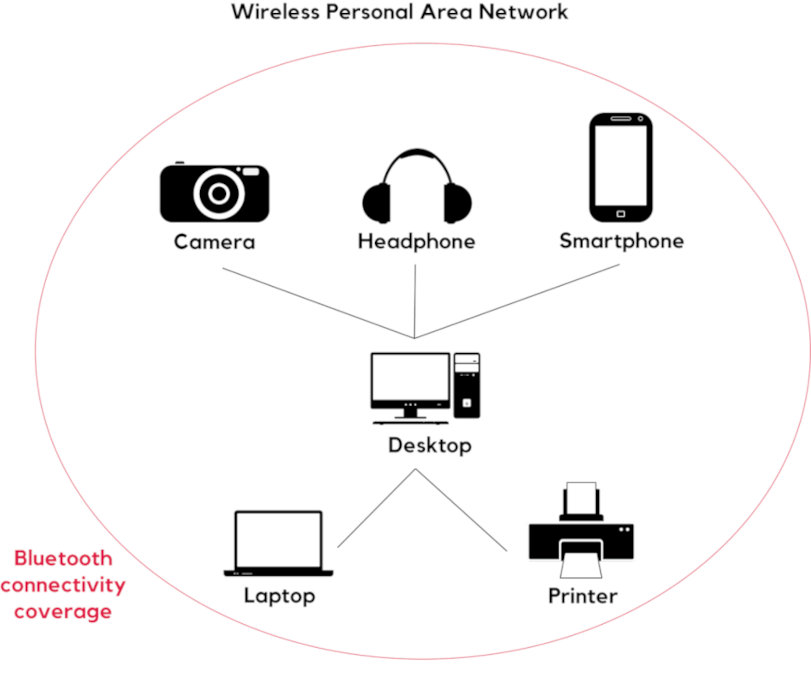
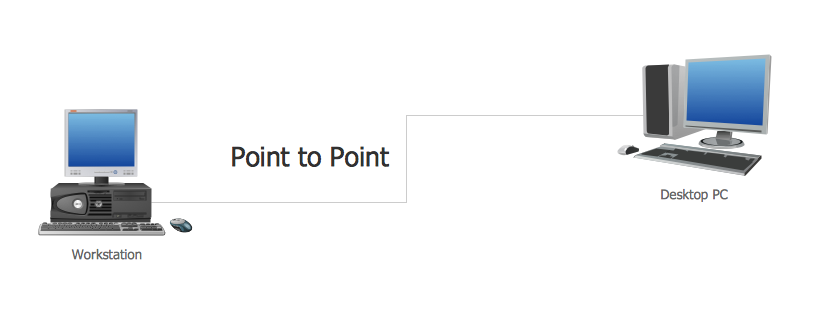
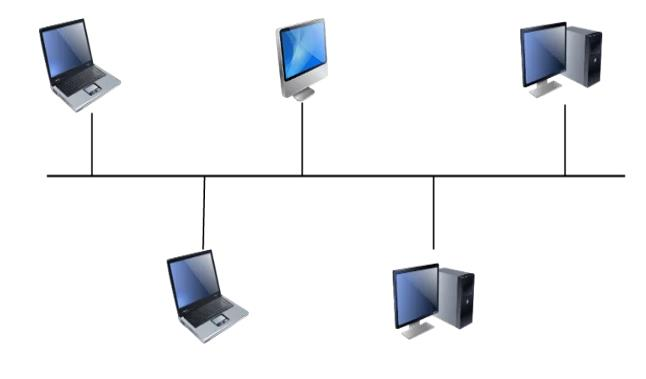
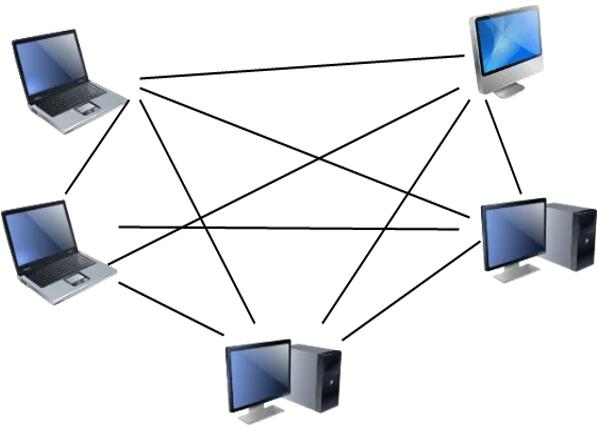
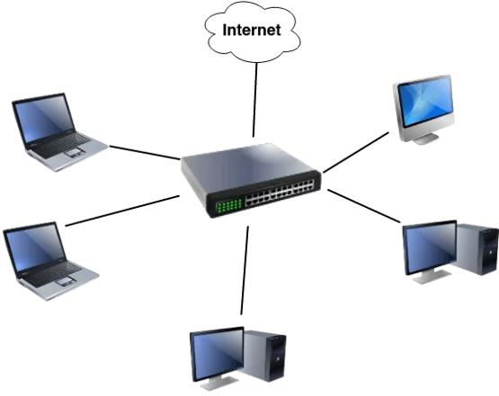

---
prev:
  text: "Section Four"
  link: "/College/IT-Essentials/Sections/SectionFour"
next:
  false
  # text: "Section Six"
  # link: "/College/IT-Essentials/Sections/SectionSix"
---

# IT Essentials Lab 5: Computer Network

## Introduction

A computer network is a set of interconnected computers and devices designed to share resources, enable communication, and provide access to services. Networks vary in size, scope, and purpose.

## Computer Network Devices and Components

### Host Devices (End Devices)

Devices that send and receive information, such as computers and printers.

### Intermediary Devices

Devices that facilitate communication between host devices, such as:

- **Modem**
- **Switch**
- **Access Point**
- **Router**
- **Firewall**

### Network Media

The physical components over which messages travel from source to destination.

---

### Intermediary Devices

#### Modem

- Modem stands for **Mod**ulation / **Dem**odulation
- Connects to the Internet via an ISP.
- Converts digital data to analog signals for phone lines (**Modulation/Demodulation**).
- Types: Internal (expansion slots) and External (serial/USB).

#### Switch

- Connects network devices (e.g., computers, printers) for data exchange.

#### Access Point (AP)

- Extends access to a wireless network within a limited range.

#### Router

- Connects two or more packet-switched networks or sub networks.
- Connects and manages traffic between multiple networks by forwarding data packets to their intended IP addresses.
- Allows multiple devices to share a single Internet connection.

#### Firewall

- Protects networks from unauthorized access using **Access Control Lists (ACLs)** (rules) to allow or deny data.

## Network

A network involves two or more interconnected devices sharing resources and information.

- **Downloading**: Receiving information from a network.
- **Uploading**: Sending information over a network.

### Types of Networks

#### Personal Area Network (PAN)

- A personal network (used by one person) for connecting devices like laptops and scanners.

#### Local Area Network (LAN)

- Covers a limited geographical area (e.g., offices, schools).

#### Wireless Local Area Network (WLAN)

- Wireless devices connected to access points within a specified area.

#### Metropolitan Area Network (MAN)

- Spans across a city or a large urban area.

#### Wide Area Network (WAN)

- Covers large geographical areas, such as cities, states, or countries.

---

### LAN Physical Topologies

Defines the physical connection of devices in a network.

#### Point-to-Point

- A direct link between two nodes.

#### Bus Topology

- Devices share a common cable with terminators at each end to prevent signal reflections and network errors.
- Only one device transmits at a time to avoid collisions.

#### Ring Topology

- Devices are connected in a circular layout.
- A **token** circulates to control data transmission.

#### Mesh Topology

- Every device connects to every other device.
- Common in WANs and the Internet.

#### Star Topology

- Central connection point (hub, switch, or router).
- Simplifies troubleshooting as each device connects independently to the central hub.

## Computer Network Architecture

### Peer-to-Peer Networks

- No dedicated servers.
- No central administration or security.
- Each computer decides which resources to share.

### Client-Server Networks

- Centralized server manages resources and security.
- Features centralized storage and secure access to confidential data.
- Requires regular backups for critical data.

---

### Client-Server vs. Peer-to-Peer Networks

| Feature              | Peer-to-Peer                             | Client-Server                                |
| -------------------- | ---------------------------------------- | -------------------------------------------- |
| **Administration**   | No central administration                | Centralized management                       |
| **Resource Sharing** | Each computer shares individually        | Controlled by the server                     |
| **Security**         | Minimal, Not centrally controlled        | Strong centralized security                  |
| **Storage**          | Distributed storage across computers     | Central backing store accessible to all      |
| **Backup**           | Must be done separately on each computer | Done centrally on the server                 |
| **Scalability**      | Limited scalability                      | Supports hundreds/thousands of users         |
| **Setup**            | Easy to set up, best for small setups    | More complex, suited for large organizations |

## Reference Models

Organizations, such as IEEE, IETF, and ISO, develop open standards for networks so that any client running any operating system can access network resources.

### OSI Model and TCP/IP Model

Both models describe the process of data communication:

- **[OSI Model](../Lectures/LectureSix.md#osi-model)**: A theoretical framework for network communication.
- **[TCP/IP Model](../Lectures/LectureSix.md#tcp-ip-model)**: Practical implementation for Internet protocols.

**Encapsulation Process**: Data is passed through layers, with protocol information added at each level.
