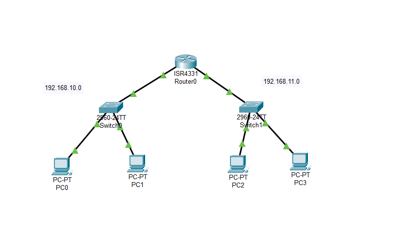

---
prev:
  text: "Section Five"
  link: "/College/IT-Essentials/Sections/SectionFive"
next:
  false
  # text: "Section Seven"
  # link: "/College/IT-Essentials/Sections/SectionSeven"
---

# IT Essentials Lab 6: Cisco Packet Tracer

## Overview

Cisco Packet Tracer is a cross-platform visual simulation tool developed by Cisco Systems. It allows users to create, configure, and simulate network topologies and operations. This tool is especially useful for learning and practicing networking concepts by simulating real-world computer networks.

## Key Features

- **Simulation of Cisco Devices**: Users can simulate the configuration of Cisco routers, switches, and other networking devices using a simulated command line interface.
- **Drag-and-Drop Interface**: The software includes an intuitive drag-and-drop interface, making it easy for users to add and remove network devices.
- **Multi-Platform Support**: Packet Tracer is compatible with different operating systems, providing flexibility to users across platforms.

## Usage

Packet Tracer enables users to design complex network topologies and test network configurations without the need for physical hardware. It is an essential tool for network professionals and students, helping to bridge the gap between theoretical knowledge and hands-on experience.

## Download

You can download Cisco Packet Tracer from [here](https://www.netacad.com/resources/lab-downloads?courseLang=en-US).

## Example 1:

## Example 2:

