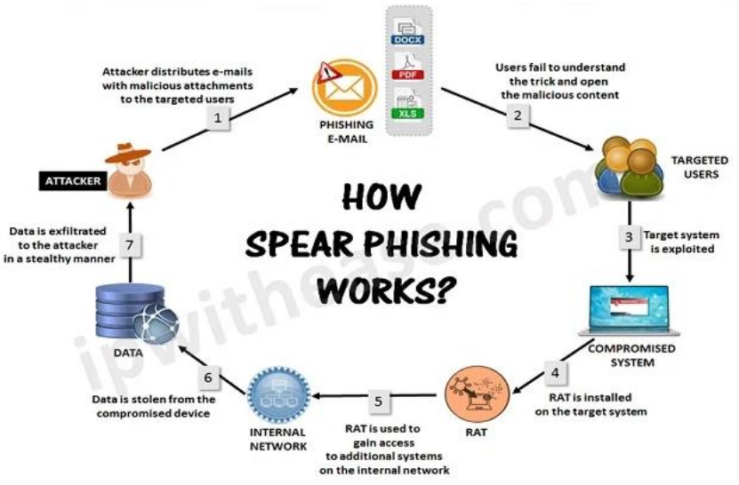
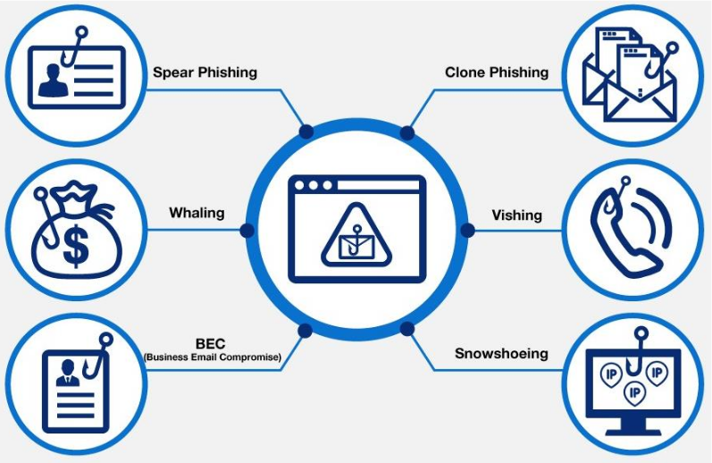

---
prev:
  text: Lecture Four
  link: /College/IntroToCyberSecurity/LectureFour
next:
  text: Lecture Six
  link: /College/IntroToCyberSecurity/LectureSix
---

# Introduction To Cybersecurity Lecture 5

## Phishing

Phishing is a type of cybersecurity threat or social engineering tactic that targets individuals through various communication channels such as email, text messages, social media, and voice calls. The attacker typically impersonates a trusted entity to steal sensitive information like login credentials, account numbers, and credit card details.

### How Does Phishing Work?

1. **Initial Attack**: The attacker gathers contact information of potential victims and sends phishing messages via email or text.
2. **Impersonation**: The email or message appears to be from a trusted source, such as a bank (e.g., Chase), complete with logos and branding.
3. **Urgency and Deception**: The message creates a sense of urgency, urging the victim to click on a link or reply with sensitive information.
4. **Fake Website**: If the victim clicks the link, they are directed to a fraudulent website designed to steal data (e.g., login details).

### Common Tactics Used in Phishing

- **Fake Email Address**: The attacker uses an email address that appears similar to a legitimate one.
- **Imitation of Trusted Websites**: A fake website is created to look like that of a legitimate business.
- **Professional-Looking Content**: The email is well-worded, grammatically correct, and features realistic logos or branding.

### Types of Phishing

1. **Spear Phishing**

   - Targets specific individuals within an organization.
   - The email is personalized with the victim’s details (e.g., name, title, phone number) to increase believability.

2. **Whaling**

   - A form of spear phishing aimed at high-ranking executives ("whales").
   - The risk is higher due to the executive's access to sensitive corporate data.

3. **BEC (Business Email Compromise)**

   - Impersonates senior executives to trick employees, customers, or vendors into making fraudulent payments.

4. **Clone Phishing**

   - A replica of a legitimate email is created, but the link or attachment is replaced with a malicious one.

5. **Vishing (Voice Phishing)**

   - The attacker calls the victim, impersonating a trusted organization, to obtain personal information.
   - Can include voicemail scams asking the victim to call back and provide sensitive data.

6. **Snowshoeing**
   - Attackers send phishing emails from multiple domains and IP addresses in small volumes, bypassing spam filters.

### How to Protect Yourself from Phishing

Organizations and individuals can take several preventive actions to protect against phishing attacks:

1. **Use a Spam Filter**

   - Email programs like Outlook and G Suite include spam filters that help detect and block phishing emails.

2. **Update Security Software Regularly**

   - Ensure that all security patches are up-to-date to detect and remove malware or viruses that may have been introduced via phishing.

3. **Use Multi-factor Authentication (MFA)**

   - MFA adds an extra layer of security by requiring multiple forms of verification, even if an attacker has stolen login credentials.

4. **Back Up Your Data**

   - Regularly back up data and use encryption to safeguard against data breaches or ransomware attacks.

5. **Don't Click on Links or Attachments**

   - Educate employees to avoid clicking on suspicious links or downloading attachments from untrusted sources.

6. **Block Unreliable Websites**
   - Implement web filters to block access to known malicious websites and prevent accidental visits to phishing sites.

By staying vigilant and adopting these preventive measures, individuals and organizations can significantly reduce the risk of falling victim to phishing attacks.
