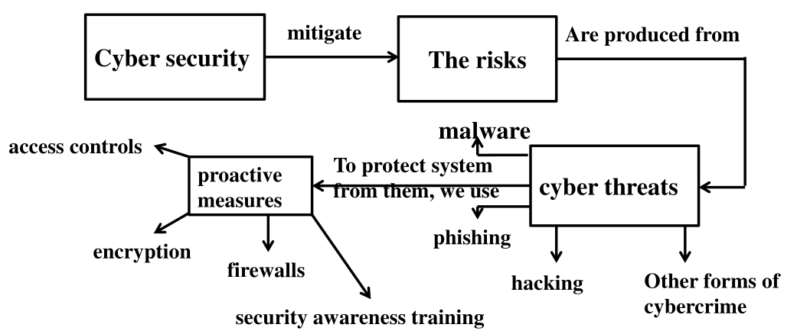
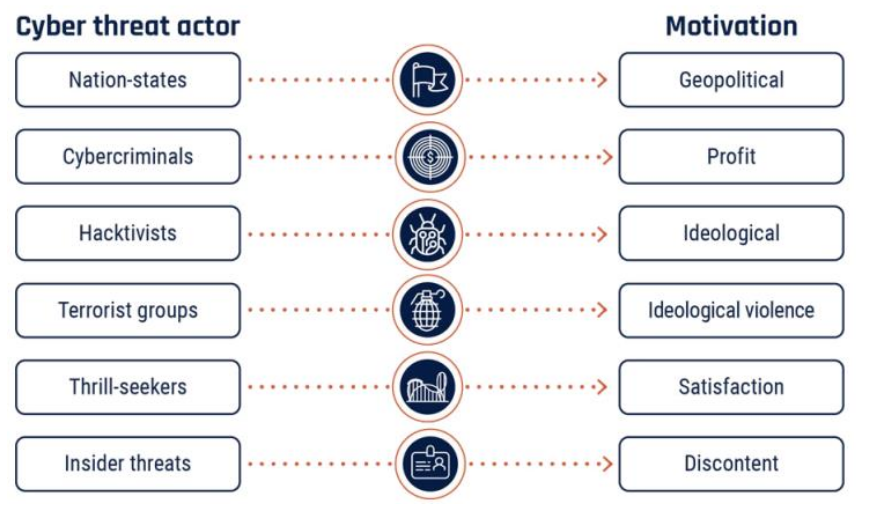
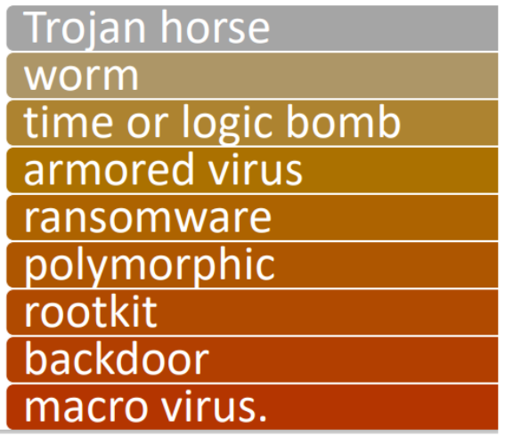

---
prev:
  text: Lecture Three
  link: /College/IntroToCyberSecurity/Lectures/LectureThree
next:
  text: Lecture Five
  link: /College/IntroToCyberSecurity/Lectures/LectureFive
---

# Introduction To Cybersecurity Lecture 4

## Key Concepts of Cybersecurity

Cybersecurity encompasses practices, technologies, and principles designed to protect digital systems and data from threats. Below are key concepts that define the scope of cybersecurity.

### Cyber Threats

Cyber threats are activities that aim to compromise the security of information systems, impacting the **availability**, **integrity**, or **confidentiality** of data. Common types of cyber threats include:

- **Malware**: Malicious software that harms devices and systems.
- **Phishing**: Deceptive practices used to steal personal information.
- **Hacking**: Unauthorized access to systems.
- **Other cybercrimes**: Activities that aim to disrupt or exploit systems for malicious purposes.

### Cybersecurity Measures

To defend against these threats, several proactive measures are utilized:

- **Firewalls**: Act as barriers between trusted and untrusted networks, filtering traffic.
- **Encryption**: Protects data by converting it into a secure format.
- **Access Controls**: Restrict access to sensitive information based on user roles.
- **Security Awareness Training**: Educates users about common threats and best practices.

### Principles of Risk Management in Cybersecurity

Cybersecurity relies heavily on managing risks associated with cyber threats. Core principles of risk management include:

1. **Risk Identification**: Recognizing potential threats, vulnerabilities, and risks to an organization’s assets.
2. **Risk Assessment**: Analyzing the likelihood and impact of identified risks.
3. **Risk Mitigation**: Implementing controls to minimize risks.
4. **Risk Monitoring and Review**: Continuously observing and assessing the effectiveness of controls.
5. **Risk Communication and Reporting**: Sharing risk-related information with stakeholders.
6. **Compliance and Regulatory Requirements**: Adhering to legal and industry standards.
7. **Integration with Business Objectives**: Aligning risk management practices with organizational goals.

**Importance**: Effective risk management ensures the **protection of information assets**, **business continuity**, and **minimization of security incidents**. It also supports the **resilience** of an organization’s information infrastructure.

### Types of Cyber Threat Actors and Motivations

Cyber threat actors are individuals or groups with malicious intent to exploit vulnerabilities in systems. Their motivations and sophistication vary:

- **Motivations**:

  - **Geopolitical**: Nation-states aiming for strategic advantage.
  - **Profit-driven**: Cybercriminals seeking financial gain.
  - **Ideological**: Hacktivists and terrorists promoting agendas.
  - **Thrill-seeking**: Individuals motivated by challenge or notoriety.
  - **Insider Threats**: Employees or associates with access to internal systems.

- **Types of Threat Actors**:
  - **Nation-states**: Engage in espionage or disrupt other nations.
  - **Hacktivists**: Seek to spread political or social messages.
  - **Cybercriminals**: Attack for monetary gain.
  - **Insiders**: Internal personnel with knowledge of vulnerabilities.

### Malware

Malware, or malicious software, is a key cyber threat. It includes various types of harmful programs designed to steal, destroy, or gain access to data.

#### Types of Malware

- **Trojan Horse**: Disguises itself as legitimate software.
- **Worm**: Self-replicating malware spreading across networks.
- **Ransomware**: Encrypts data, demanding payment for decryption.
- **Rootkit**: Hides malicious activity from detection.
- **Backdoor**: Allows unauthorized access to systems.

#### Attack Vectors and Entry Points

Malware can be delivered through various means:

- **Attack Vectors**: Email attachments, infected websites, or removable media.
- **Entry Points**: Exploiting vulnerabilities in outdated software, unpatched systems, or insecure configurations.

### Cyber Threat Environment

The cyber threat environment consists of networks, devices, and methods that cyber actors use to target systems. The internet’s global nature allows these actors to attack from anywhere, impacting systems and data regardless of location.

### Operator Precedence in Risk Assessment

In cybersecurity risk management, identifying and prioritizing threats is akin to **operator precedence** in programming. It determines which risks to address first, focusing on those with the highest potential impact.
