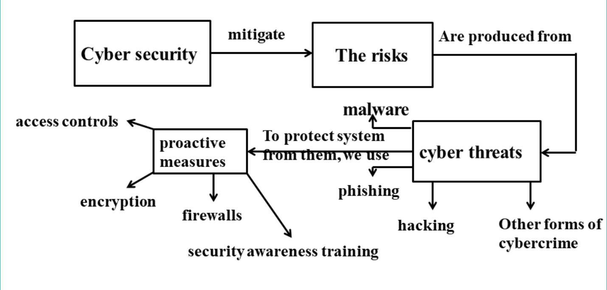
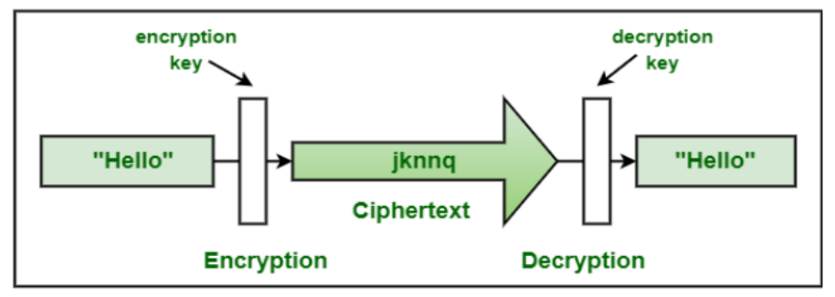
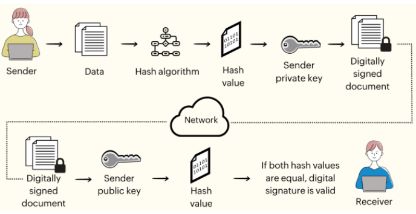
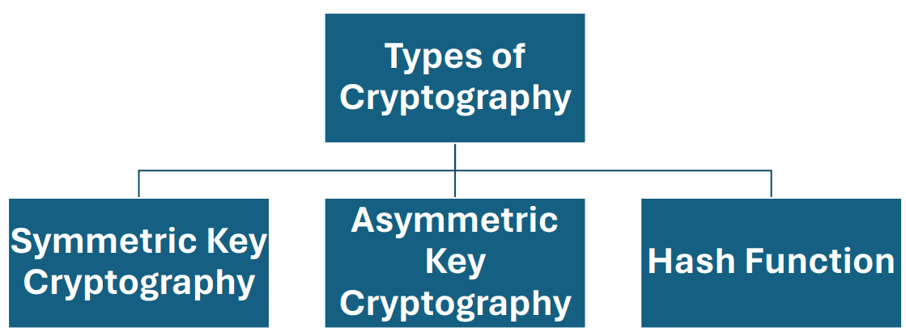
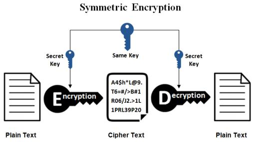
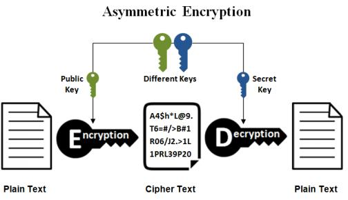

---
prev:
  text: Lecture Eight
  link: /College/IntroToCyberSecurity/Lectures/LectureEight
next: false
---

# Introduction to Cybersecurity Lecture 9

## Proactive Measures

### 1. Encryption

#### What is Cryptography?

- Cryptography secures communication and information by converting plain text into unintelligible cipher text and back into readable text.
- Ensures confidentiality, integrity, authentication, and non-repudiation of data.
- Involves mathematical algorithms for encryption and decryption.
- Encryption transforms plain text into cipher text, while cryptography is the art/science of secret writing.

#### Encryption vs. Decryption

| **Process**    | **Encryption**                                                                               | **Decryption**                                                                                           |
| -------------- | -------------------------------------------------------------------------------------------- | -------------------------------------------------------------------------------------------------------- |
| **Definition** | Converts plain text or data into cipher text using an encryption algorithm and a secret key. | Converts cipher text back into plain text using a decryption algorithm and the corresponding secret key. |
| **Purpose**    | Secures information, making it unreadable to unauthorized parties.                           | Unlocks encrypted information, making it readable to authorized parties.                                 |
| **Result**     | Cipher text appears random and unintelligible.                                               | Recovers the original plain text from the cipher text.                                                   |

#### Cryptography Terms

- **Key**: A secret (like a password) used for encryption and decryption.
- **Key Management**: Includes key generation, distribution, storage, and protection to ensure only authorized access.
- **Steganography**: Hides information so it is undetectable, differing from encryption, which transforms data visibly.
- **Digital Signatures**: Provide authentication and non-repudiation by associating unique signatures with electronic documents/messages.

- **Cryptographic Hash Functions**: Generate fixed-size hash values from data for verifying integrity, password hashing, and digital signatures.

#### Objectives of Cryptography

1. **Confidentiality**: Ensures that only authorized individuals can access information, protecting it from unauthorized access throughout its lifecycle.
2. **Integrity**: Safeguards information from unauthorized alterations, ensuring accuracy and completeness of data.
3. **Availability**: Guarantees timely and uninterrupted access to information systems for authorized users.
4. **Authentication**: Verifies the identity of users or entities accessing the system.
5. **Non-repudiation**: Prevents denial of actions or communications by ensuring that a sender or receiver cannot refute their involvement. Techniques include digital signatures, message authentication codes, and timestamps.

#### Types of Cryptography

##### 1. Symmetric Key Cryptography

Also known as secret-key cryptography, symmetric encryption uses a single key for both encryption and decryption. The sender and receiver must securely exchange this key, which is a significant challenge.

###### Pros and Cons of Symmetric Encryption

| **Pros**                                                                         | **Cons**                                             |
| -------------------------------------------------------------------------------- | ---------------------------------------------------- |
| Faster: Utilizes a single key, making execution quicker.                         | Secure key sharing is challenging and prone to risk. |
| Identity verification: Uses password authentication for receiver identity proof. | Not scalable for large networks or multiple users.   |
| Easy to execute & manage: Single key simplifies management.                      |                                                      |

---

##### 2. Asymmetric Key Cryptography

Also known as public-key cryptography, asymmetric encryption employs a pair of keys: a public key for encryption and a private key for decryption. The public key is shared openly, while the private key remains confidential to the user.

###### Pros and Cons of Asymmetric Encryption

| **Pros**                                                            | **Cons**                                                      |
| ------------------------------------------------------------------- | ------------------------------------------------------------- |
| No issue with distributing keys due to the public-private key pair. | Slower performance compared to symmetric encryption.          |
| Scalable: Easily accommodates communication with multiple parties.  | Complex implementation and management due to large key sizes. |

---

##### Symmetric vs. Asymmetric Encryption

| **Aspect**    | **Symmetric Encryption**                         | **Asymmetric Encryption**                                     |
| ------------- | ------------------------------------------------ | ------------------------------------------------------------- |
| Key Usage     | Single shared key for encryption and decryption. | Public-private key pair for encryption and decryption.        |
| Technique Age | An older technique.                              | A newer technique developed to address symmetric limitations. |
| Key Sharing   | Requires secure key exchange between parties.    | Eliminates key sharing by using public-private keys.          |
| Performance   | Faster.                                          | Slower due to complex computations.                           |
| Scalability   | Limited scalability.                             | Highly scalable for large networks.                           |

---

##### Key Differences Between Symmetric and Asymmetric Encryption

| **Aspect**               | **Symmetric Encryption**                                                  | **Asymmetric Encryption**                                     |
| ------------------------ | ------------------------------------------------------------------------- | ------------------------------------------------------------- |
| **Size of Cipher Text**  | Smaller compared to the original plain text file.                         | Larger compared to the original plain text file.              |
| **Data Size**            | Suitable for transmitting large amounts of data.                          | Best for transmitting small data.                             |
| **Resource Utilization** | Low resource usage.                                                       | High resource consumption.                                    |
| **Key Lengths**          | 128 or 256-bit key sizes.                                                 | RSA 2048-bit or higher key sizes.                             |
| **Security**             | Less secure due to the use of a single key for encryption and decryption. | More secure as it uses a public-private key pair.             |
| **Number of Keys**       | Uses a single key for encryption and decryption.                          | Uses two keys: one for encryption and one for decryption.     |
| **Techniques**           | An older encryption technique.                                            | A modern encryption technique.                                |
| **Confidentiality**      | Higher risk of compromise due to a shared key.                            | No key sharing required, enhancing confidentiality.           |
| **Speed**                | Faster encryption and decryption.                                         | Slower encryption and decryption due to complex computations. |
| **Algorithms**           | Examples: RC4, AES, DES, 3DES, QUAD.                                      | Examples: RSA, Diffie-Hellman, ECC.                           |

---

##### 3. Hash Functions

- Hash functions generate a fixed-length hash value from input data, making it impossible to retrieve the original data from the hash.
- They ensure data integrity by comparing hash values before and after changes.

---

#### Applications of Cryptography

1. **Secure Communications**

   - Used to encrypt communications between entities, e.g., a web browser and server.

2. **End-to-End Encryption (E2EE)**

   - Prevents third-party access to data, widely used in messaging systems.
   - Data is encrypted at the sender’s end and decrypted only by the intended recipient.

3. **Data Storage**

   - Ensures secure storage of sensitive data.
   - Example: Office 365 encrypts data during communication and access.

4. **Password Storage**

   - Protects passwords from being read or hacked when stored in systems.

---

#### Caesar Cipher in Cryptography

- **Definition**: A substitution cipher that shifts each letter in the plaintext by a fixed number of positions in the alphabet.
- **Named After**: Julius Caesar, who used it to encrypt messages.
- **Mathematical Representation**:
  - Transform letters into numbers ($A = 0, B = 1, ..., Z = 25$).
  - Apply the formula for encryption: $E(x) = (x + n) \mod{26}$, where $n$ is the shift value.
  - Decrypt by reversing the shift: $D(x) = (x - n) \mod{26}$.

##### Example: Encrypting "HELLO" with a Shift of 3

1. Write the plaintext: **HELLO**.
2. Apply the shift of 3 to each letter:
   - H → K
   - E → H
   - L → O
   - L → O
   - O → R
3. Result: **KHOOR**.

##### Decryption

- Reverse the shift (3 positions back): **KHOOR → HELLO**.

---

##### Key Characteristics of the Caesar Cipher

- Simple and easy to implement.
- Vulnerable to brute force due to limited key space (only 26 possible shifts).
- Provides basic encryption, suitable for educational purposes or low-security requirements.
