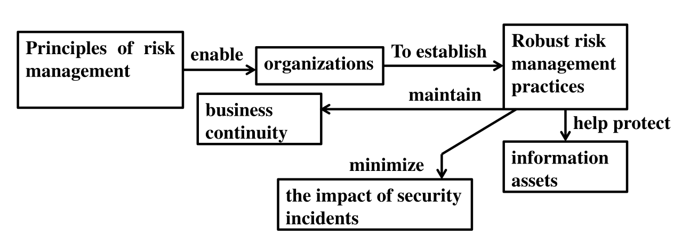
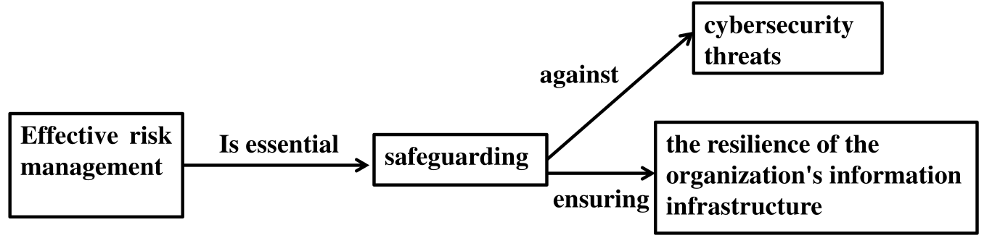
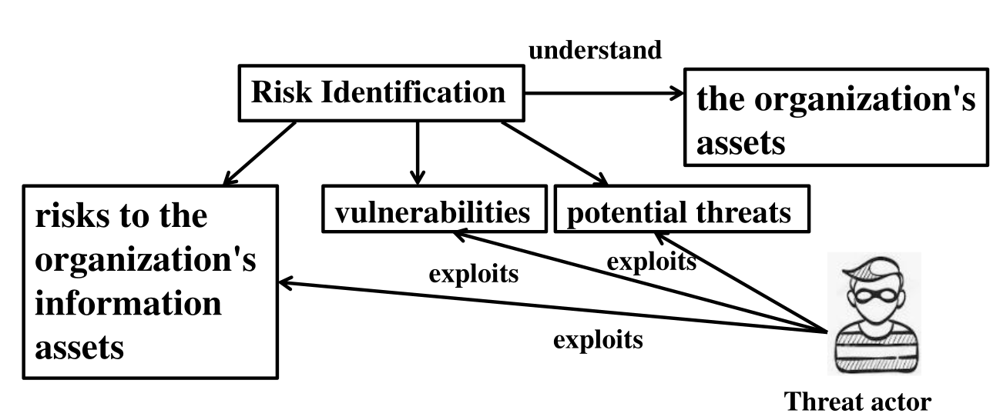
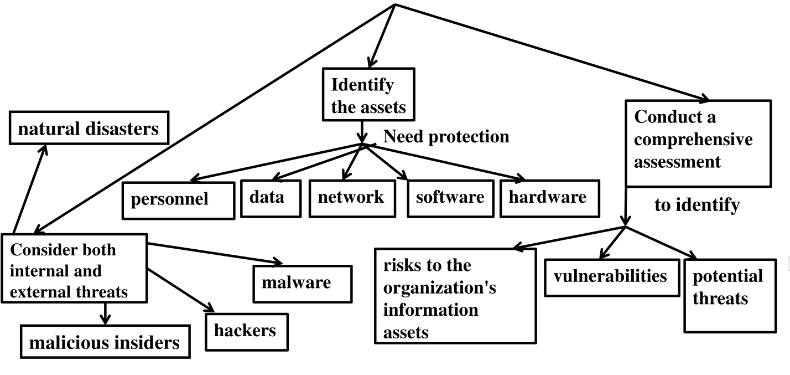
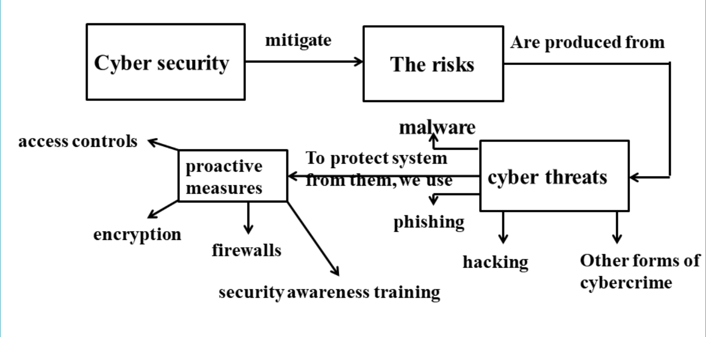
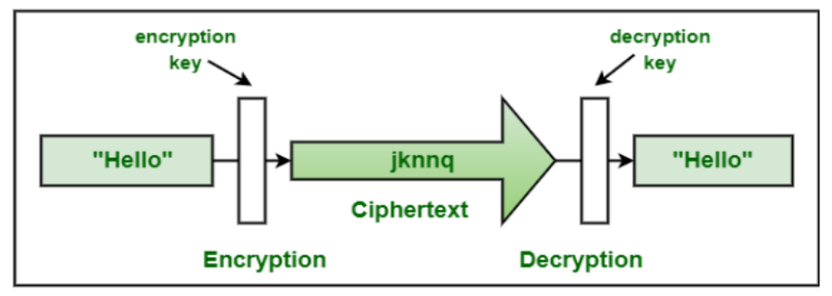
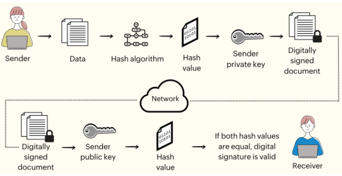
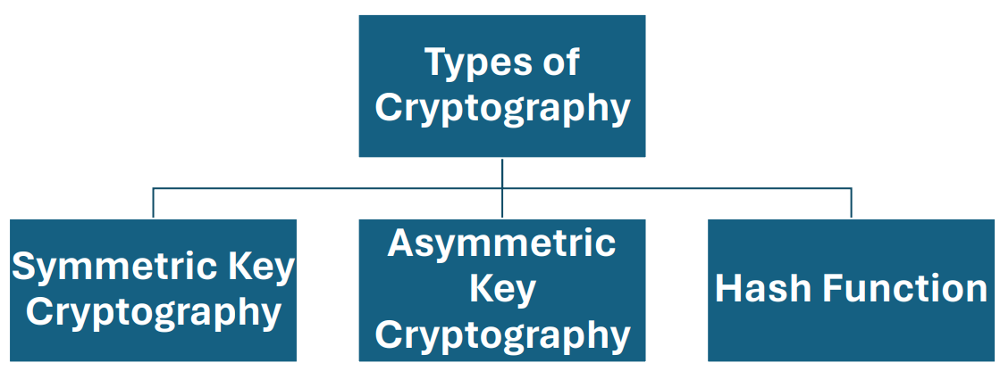
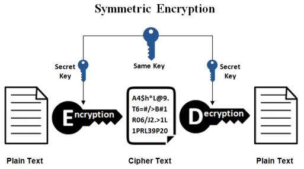
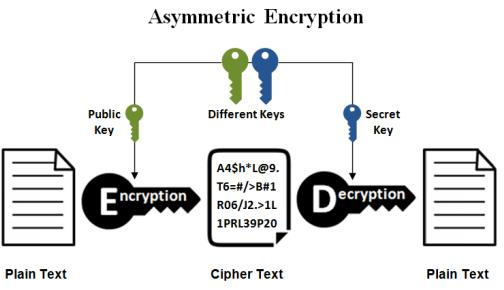

---
prev:
  text: Lecture Six
  link: /College/IntroToCyberSecurity/LectureSix
next:
  false
  # text: Lectures Seven to Nine
  # link: /College/IntroToCyberSecurity/LectureSevenToNine
---

# Introduction To Cybersecurity Lectures 7~9

## Principles of Risk Management in Cyber Security

The principles of risk management in cyber security enable organizations to establish robust risk management practices that help protect their information assets, maintain business continuity, and minimize the impact of security incidents.

**Principles of Risk Management Enable Organizations to:**

- Establish robust risk management practices
- Help protect information assets
- Minimize the impact of security incidents
- Maintain business continuity

## Effective Risk Management is Essential for:

- Safeguarding against cyber security threats
- Ensuring the resilience of the organization's information infrastructure
- Protecting sensitive data and minimizing risks to business operations

## Key Components of Risk Management in Cyber Security:

1. **Risk Identification**: The process of identifying potential risks to an organization's information assets.
2. **Risk Assessment**: The evaluation of identified risks to determine their likelihood and impact.
3. **Risk Mitigation**: The implementation of measures to reduce or eliminate identified risks.
4. **Risk Monitoring and Review**: Ongoing monitoring and review of risk management practices to ensure they remain effective.
5. **Risk Communication and Reporting**: The sharing of risk information with stakeholders, including executives, employees, and regulatory bodies.
6. **Compliance and Regulatory Requirements**: Ensuring that risk management practices comply with relevant laws, regulations, and industry standards.
7. **Integration with Business Objectives**: Aligning risk management practices with the organization's overall business objectives and strategy.

## Principles of risk management in cybersecurity

### 1. Risk Identification

Risk identification involves identifying potential threats, vulnerabilities, and risks to an organization's information assets.

#### Identifying Risks:

1. **Threats**: Identified potential security breaches or attacks.
2. **Vulnerabilities**: Weaknesses in systems, networks, or applications that could be exploited by attackers.
3. **Risks**: The likelihood and impact of a threat or vulnerability being exploited.

#### Examples of Risk Identification:

1. Analyzing past security incidents to identify patterns and causes.
2. Conducting vulnerability assessments to identify weaknesses in systems and networks.
3. Monitoring threat intelligence feeds to stay informed about emerging threats and trends.

#### Benefits of Effective Risk Identification:

- Helps organizations anticipate and prepare for potential security threats.
- Enables the identification of high-risk areas that require immediate attention.
- Supports the development of effective risk mitigation strategies.
- Enhances overall information asset resilience and security.

### 2. Risk Assessment

#### Likelihood and Impact

- **Likelihood**: The probability that a given event will occur, expressed using qualitative terms (Extreme, High, Medium, Low or Negligible), as a percent probability, or as a frequency.
- **Impact**: The potential consequences or severity of a risk event.

#### The Risk Position Matrix

- A tool used to assess and classify risks based on their potential impact and likelihood.
- Assigning values to likelihood and impact helps prioritize mitigation efforts.

#### Guidelines for Accurate Risk Assessment

- Identifying unique threats to your organization
- Assessing the likelihood and impact of each threat
- Understanding the need for clear risk awareness in decision-making
- Recognizing the importance of combining likelihood and impact to produce a residual risk rating

#### Simple Risk Equation

Risk score = (Threat $\times$ Vulnerabilities) $\times$ Impact

- Calculates the overall risk by multiplying the threat, vulnerabilities, and impact.

#### Risk Score Calculation

Risk Score = Likelihood $\times$ Impact

- Combines likelihood and impact to produce a residual risk rating of Low, Medium or High.

#### Benefits of Risk Assessments

- Provides insight into key factors for decision-making
- Helps IT departments understand their role in reducing risks
- Enables sharing of risk assessment results with IT teams
- Facilitates collaboration between leadership and IT to address security concerns

### 3. Risk Mitigation

- Implement security controls and best practices to protect against potential threats.
- Develop and implement policies, procedures, and guidelines for a culture of security awareness.
- Consider security technologies such as firewalls, antivirus software, intrusion detection systems, encryption, and multi-factor authentication.

**Example**: Implementing encryption and access controls to protect patient health records.

### 4. Risk Monitoring and Review

- Establish ongoing monitoring and review of risk mitigation measures.
- Monitor for new threats and vulnerabilities through regular security assessments, vulnerability scans, and penetration tests.
- Stay informed about emerging threats, security vulnerabilities, and best practices through threat intelligence feeds and industry publications.

**Example**: A technology company continuously monitoring its network traffic using intrusion detection systems (IDS) and security information and event management (SIEM) tools.

### 5. Risk Communication and Reporting

- Communicate risk findings and mitigation efforts to relevant stakeholders.
- Provide regular updates on security status, including incidents, breaches, or near misses.
- Ensure transparency in risk communication to support stakeholder trust.

**Example**: Communicating incident details to senior management, affected customers, and regulatory authorities.

### 6. Compliance and Regulatory Requirements

- Consider legal and regulatory requirements related to cybersecurity risk management.
- Ensure compliance with laws, regulations, and industry standards governing cybersecurity, privacy, and data protection.
- Stay informed about regulatory requirements and industry best practices to align with obligations.

**Example**: Ensuring compliance with the Payment Card Industry Data Security Standard (PCI DSS) by implementing controls for customer payment card data.

### 7. Integration with Business Objectives

- Integrate risk management into overall business objectives.
- Align risk management strategies with business goals.
- Ensure security investments support business objectives.

**Example**: Aligning cybersecurity investments with business objectives of maintaining production uptime and protecting intellectual property.

---

## Proactive Measures

### 1. Encryption

#### What is Cryptography?

- Cryptography secures communication and information by converting plain text into unintelligible cipher text and back into readable text.
- Ensures confidentiality, integrity, authentication, and non-repudiation of data.
- Involves mathematical algorithms for encryption and decryption.
- Encryption transforms plain text into cipher text, while cryptography is the art/science of secret writing.

#### Encryption vs. Decryption

| **Process**    | **Encryption**                                                                               | **Decryption**                                                                                           |
| -------------- | -------------------------------------------------------------------------------------------- | -------------------------------------------------------------------------------------------------------- |
| **Definition** | Converts plain text or data into cipher text using an encryption algorithm and a secret key. | Converts cipher text back into plain text using a decryption algorithm and the corresponding secret key. |
| **Purpose**    | Secures information, making it unreadable to unauthorized parties.                           | Unlocks encrypted information, making it readable to authorized parties.                                 |
| **Result**     | Cipher text appears random and unintelligible.                                               | Recovers the original plain text from the cipher text.                                                   |

#### Cryptography Terms

- **Key**: A secret (like a password) used for encryption and decryption.
- **Key Management**: Includes key generation, distribution, storage, and protection to ensure only authorized access.
- **Steganography**: Hides information so it is undetectable, differing from encryption, which transforms data visibly.
- **Digital Signatures**: Provide authentication and non-repudiation by associating unique signatures with electronic documents/messages.

- **Cryptographic Hash Functions**: Generate fixed-size hash values from data for verifying integrity, password hashing, and digital signatures.

#### Objectives of Cryptography

1. **Confidentiality**: Ensures that only authorized individuals can access information, protecting it from unauthorized access throughout its lifecycle.
2. **Integrity**: Safeguards information from unauthorized alterations, ensuring accuracy and completeness of data.
3. **Availability**: Guarantees timely and uninterrupted access to information systems for authorized users.
4. **Authentication**: Verifies the identity of users or entities accessing the system.
5. **Non-repudiation**: Prevents denial of actions or communications by ensuring that a sender or receiver cannot refute their involvement. Techniques include digital signatures, message authentication codes, and timestamps.

#### Types of Cryptography

##### 1. Symmetric Key Cryptography

Also known as secret-key cryptography, symmetric encryption uses a single key for both encryption and decryption. The sender and receiver must securely exchange this key, which is a significant challenge.

###### Pros and Cons of Symmetric Encryption

| **Pros**                                                                         | **Cons**                                             |
| -------------------------------------------------------------------------------- | ---------------------------------------------------- |
| Faster: Utilizes a single key, making execution quicker.                         | Secure key sharing is challenging and prone to risk. |
| Identity verification: Uses password authentication for receiver identity proof. | Not scalable for large networks or multiple users.   |
| Easy to execute & manage: Single key simplifies management.                      |                                                      |

---

##### 2. Asymmetric Key Cryptography

Also known as public-key cryptography, asymmetric encryption employs a pair of keys: a public key for encryption and a private key for decryption. The public key is shared openly, while the private key remains confidential to the user.

###### Pros and Cons of Asymmetric Encryption

| **Pros**                                                            | **Cons**                                                      |
| ------------------------------------------------------------------- | ------------------------------------------------------------- |
| No issue with distributing keys due to the public-private key pair. | Slower performance compared to symmetric encryption.          |
| Scalable: Easily accommodates communication with multiple parties.  | Complex implementation and management due to large key sizes. |

---

##### Symmetric vs. Asymmetric Encryption

| **Aspect**    | **Symmetric Encryption**                         | **Asymmetric Encryption**                                     |
| ------------- | ------------------------------------------------ | ------------------------------------------------------------- |
| Key Usage     | Single shared key for encryption and decryption. | Public-private key pair for encryption and decryption.        |
| Technique Age | An older technique.                              | A newer technique developed to address symmetric limitations. |
| Key Sharing   | Requires secure key exchange between parties.    | Eliminates key sharing by using public-private keys.          |
| Performance   | Faster.                                          | Slower due to complex computations.                           |
| Scalability   | Limited scalability.                             | Highly scalable for large networks.                           |

---

##### Key Differences Between Symmetric and Asymmetric Encryption

| **Aspect**               | **Symmetric Encryption**                                                  | **Asymmetric Encryption**                                     |
| ------------------------ | ------------------------------------------------------------------------- | ------------------------------------------------------------- |
| **Size of Cipher Text**  | Smaller compared to the original plain text file.                         | Larger compared to the original plain text file.              |
| **Data Size**            | Suitable for transmitting large amounts of data.                          | Best for transmitting small data.                             |
| **Resource Utilization** | Low resource usage.                                                       | High resource consumption.                                    |
| **Key Lengths**          | 128 or 256-bit key sizes.                                                 | RSA 2048-bit or higher key sizes.                             |
| **Security**             | Less secure due to the use of a single key for encryption and decryption. | More secure as it uses a public-private key pair.             |
| **Number of Keys**       | Uses a single key for encryption and decryption.                          | Uses two keys: one for encryption and one for decryption.     |
| **Techniques**           | An older encryption technique.                                            | A modern encryption technique.                                |
| **Confidentiality**      | Higher risk of compromise due to a shared key.                            | No key sharing required, enhancing confidentiality.           |
| **Speed**                | Faster encryption and decryption.                                         | Slower encryption and decryption due to complex computations. |
| **Algorithms**           | Examples: RC4, AES, DES, 3DES, QUAD.                                      | Examples: RSA, Diffie-Hellman, ECC.                           |

---

##### 3. Hash Functions

- Hash functions generate a fixed-length hash value from input data, making it impossible to retrieve the original data from the hash.
- They ensure data integrity by comparing hash values before and after changes.

---

#### Applications of Cryptography

1. **Secure Communications**

   - Used to encrypt communications between entities, e.g., a web browser and server.

2. **End-to-End Encryption (E2EE)**

   - Prevents third-party access to data, widely used in messaging systems.
   - Data is encrypted at the sender’s end and decrypted only by the intended recipient.

3. **Data Storage**

   - Ensures secure storage of sensitive data.
   - Example: Office 365 encrypts data during communication and access.

4. **Password Storage**

   - Protects passwords from being read or hacked when stored in systems.

---

#### Caesar Cipher in Cryptography

- **Definition**: A substitution cipher that shifts each letter in the plaintext by a fixed number of positions in the alphabet.
- **Named After**: Julius Caesar, who used it to encrypt messages.
- **Mathematical Representation**:
  - Transform letters into numbers (A = 0, B = 1, ..., Z = 25).
  - Apply the formula for encryption: E(x)=(x+n)mod  26E(x) = (x + n) \mod 26, where nn is the shift value.
  - Decrypt by reversing the shift: D(x)=(x−n)mod  26D(x) = (x - n) \mod 26.

##### Example: Encrypting "HELLO" with a Shift of 3

1. Write the plaintext: **HELLO**.
2. Apply the shift of 3 to each letter:
   - H → K
   - E → H
   - L → O
   - L → O
   - O → R
3. Result: **KHOOR**.

##### Decryption

- Reverse the shift (3 positions back): **KHOOR → HELLO**.

---

##### Key Characteristics of the Caesar Cipher

- Simple and easy to implement.
- Vulnerable to brute force due to limited key space (only 26 possible shifts).
- Provides basic encryption, suitable for educational purposes or low-security requirements.
