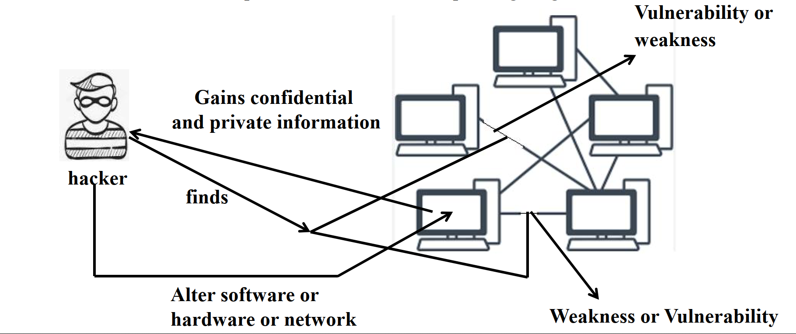

---
prev:
  text: Lecture Five
  link: /College/IntroToCyberSecurity/Lectures/LectureFive
next:
  text: Lectures Seven
  link: /College/IntroToCyberSecurity/Lectures/LectureSeven
---

# Introduction to Cybersecurity Lecture 6

## Hacking

Hacking involves exploiting vulnerabilities in computer systems, networks, or software to gain unauthorized access and obtain confidential information. Hackers may alter software, hardware, or networks for illegal purposes.

### Hacker Workflow

1. Identify weaknesses or vulnerabilities.
2. Exploit the vulnerabilities.
3. Gain confidential and private information.
4. Alter software, hardware, or networks.

## Types of Hackers

### 1. Black Hat Hacker

- **Motivation**: Malicious intent, often financial.
- **Actions**: Exploits vulnerabilities to commit cybercrimes such as data theft, fraud, and identity theft.
- **Legality**: Illegal and punishable by law.

### 2. White Hat Hacker

- **Motivation**: Ethical intent, focused on security improvement.
- **Actions**: Tests and fixes system vulnerabilities with permission to enhance security.
- **Legality**: Authorized and legal.

### 3. Gray Hat Hacker

- **Motivation**: A mix of ethical and unethical practices.
- **Actions**: Identifies vulnerabilities and may alert authorities or demand payment to fix them.
- **Legality**: Operates in a legal gray area.

## Cracking

Cracking is the process of breaching software or system security, often using repetitive techniques rather than sophisticated exploitation.

### Types of Cracking

1. **Password Cracking**:

   - **Techniques**:
     - **Brute Force**: Tries all possible combinations.
     - **Dictionary**: Uses common words.
     - **Rainbow Table**: Precomputed hashes to find encrypted passwords.

2. **Software Cracking**:

   - **Tools**:
     - **Keygen**: Generates valid serial numbers.
     - **Patch**: Modifies software to remove restrictions.
     - **Loader**: Bypasses security features.

3. **Network Cracking**:

   - Targets local area networks (LAN) or wireless networks (Wi-Fi).
   - Easier to breach wireless networks due to proximity requirements.

4. **Application Cracking**:

   - Modifies software to disable licensing or authentication mechanisms.
   - Exploits vulnerabilities to access sensitive data or execute code.

5. **Wireless Cracking**:
   - Gains unauthorized access to Wi-Fi networks.
   - Exploits security protocol weaknesses to intercept communications or steal data.

## How to Prevent Cracking

1. **Keep Software Updated**:

   - Regular updates fix vulnerabilities.
   - Enable automatic updates.

2. **Use Antivirus Software**:

   - Protects against malware and spyware.
   - Scans systems for infections.

3. **Avoid Public Wi-Fi**:

   - Use VPNs to secure connections on public networks.

4. **Use Unique Passwords**:

   - Avoid using the same password across accounts.
   - Ensure passwords are strong and secure.

5. **Secure Devices**:
   - Change default usernames and passwords on routers and smart devices.
   - Enable HTTPS encryption when browsing.

## Devices Most Vulnerable to Hacking

### 1. Smart Devices

- Often run open-source operating systems like Android, making them prone to attacks.

### 2. Webcams

- Hackers use Remote Access Trojans (RATs) to hijack webcams and spy on users.

### 3. Routers

- Compromise data sent and received.
- Enable wider malicious actions like DDoS attacks and DNS spoofing.

### 4. Email

- Used for phishing and spreading malware.
- Common target for cyberattacks.

## How to Protect Yourself from Hacking

1. **Keep Software Updated**:

   - Regularly install updates for all devices and programs.

2. **Use Unique Passwords**:

   - Avoid reusing passwords; create strong, unique ones for each account.

3. **Enable HTTPS Encryption**:

   - Verify secure connections by checking for `https://` in URLs.

4. **Avoid Suspicious Links and Ads**:

   - Do not click on strange links or pop-up ads.

5. **Secure Default Settings**:
   - Replace default usernames and passwords on devices with unique combinations.
