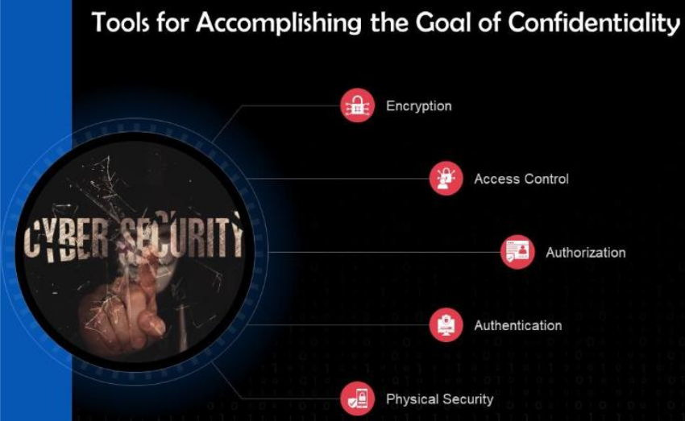

---
prev:
  text: Lecture Two
  link: /College/IntroToCyberSecurity/Lectures/LectureTwo
next:
  text: Lecture Four
  link: /College/IntroToCyberSecurity/Lectures/LectureFour
---

# Introduction to Cybersecurity Lecture 3

## Concepts of Cybersecurity (part II)

The five core concepts of cybersecurity are:

- **Authentication**
- **Authorization**
- **Confidentiality**
- **Integrity**
- **Availability**

### What is a Protocol?

- **Definition**: In networking, a protocol is a standardized set of rules for formatting and processing data.
- **Purpose**: Protocols enable computers to communicate with one another.
- **Examples**:
  - **FTP**: File Transfer Protocol
  - **HTTP**: Hypertext Transfer Protocol
  - **HTTPS**: Hypertext Transfer Protocol Secure

### What is a Technique?

- **Definition**: A technique refers to a method used to enhance security.

### The CIA Triad

The CIA Triad is a security model developed to help individuals consider various aspects of IT security. It comprises three key principles:

- **Confidentiality**: Ensuring that data is only accessible to authorized individuals.
- **Integrity**: Ensuring that data remains unchanged and trustworthy.
- **Availability**: Ensuring that data and resources are accessible when needed.

### Confidentiality

**Confidentiality in ATM Security:**

- Use a unique and difficult-to-guess PIN number.
- Avoid associating your PIN with personal information such as birthdays or phone numbers.
- Keep your PIN confidential, memorized, and never recorded.
- Institutions, like Arab Bank, will never ask you to disclose your PIN.
- Avoid using ATMs in remote or unprotected areas and steer clear of those near obvious hiding places.
- Protect your account number and card number, ensuring physical security (e.g., using a locked door).

**Tools to Achieve Confidentiality:**

- **Encryption**: Converts data into a format readable only by the holder of the decryption key.
- **Access Control**: Determines who has access to sensitive information.
- **Authorization**: Grants specific permissions to users based on their role.
- **Authentication**: Verifies the identity of users before granting access.
- **Physical Security**: Protects physical access to data and resources.

Confidentiality protects against unauthorized or unintentional access to sensitive information, addressing ethical and legal obligations. It involves protective measures to prevent unauthorized access, ensuring that only those with a "need to know" can access certain data. Access is implemented through rights and privileges assigned to individual users.

**Confidentiality in Payroll Systems:**

- For example, an employee managing a company's social media accounts does not require access to payroll information.
- Trust is not the only concern; if a user's password is stolen, a hacker could access sensitive data.
- Even another employee could potentially steal the password.
- Encryption plays a key role in confidentiality by ensuring that only authorized individuals can read sensitive data.

### Integrity

**Integrity in ATM Security:**

- Integrity ensures that any transaction made via the ATM is accurately reflected in the user’s bank account.
- It requires that data cannot be altered during processing, maintaining the correctness of exchanged data, including insertion, deletion, and modification.
- Important data, such as withdrawal amounts and PIN information, must be recorded accurately to prevent tampering.
- The ATM network must support the integrity of both stored and communicated data, protecting user-related information.

**Core Principles of Integrity:**

- Integrity is a fundamental component of the CIA Triad, designed to protect data from unauthorized deletion or modification.
- It ensures that any changes made by authorized individuals can be reversed if necessary.
- Integrity protects information from unauthorized changes, maintaining it in a correct and uncorrupted state.
- Changes to data must be documented and authorized to ensure accountability.

**Maintaining Data Integrity:**

- Prevent malicious actors from altering, deleting, or tampering with data to ensure data integrity.

**Integrity in Payroll Systems:**

- Employees in the payroll department should not be able to change their wages or delete performance reviews for friends, as this would compromise data integrity.
- File permissions can help maintain integrity; for instance, a user may have read-only access to a payroll folder, preventing any changes to the files within.

**Nonrepudiation:**

- Nonrepudiation tracks changes made by specific user accounts, ensuring users cannot deny their actions.
- This process is vital for maintaining a historical reference of changes, which can be important in legal matters, proving user actions in criminal or civil cases.

### Availability

**Availability in ATM Security:**

- Availability ensures that customers can access ATMs whenever needed, including after bank hours through secure methods like card swipes.
- ATMs must be operational and promptly repaired to provide consistent service, instilling customer confidence in the bank's availability.

**Core Principle of Availability:**

- Availability is the third principle in the CIA triad, emphasizing that data and resources must be accessible when required.
- Factors like hardware failures or hacking attacks can disrupt access to data, necessitating proactive measures.

**Ensuring Availability:**

- Security professionals must implement solutions to guarantee access to data during disruptions.

**Tools for Achieving Availability:**

- **Physical Protection:** Safeguarding physical assets to prevent unauthorized access and damage.
- **Computational Redundancy:** Using redundant systems and backups to ensure continuous access to data and resources.
