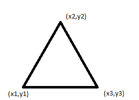
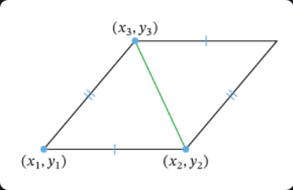
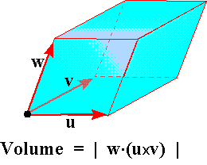

---
prev:
  text: "Lecture Three"
  link: "/College/Math/Lectures/LectureThree"
next:
  false
  # text: "Lecture Five"
  # link: "/College/Math/Lectures/LectureFive"
---

# Lecture Four: Applications on Determinants

## 1. Area of triangle

**Formula:**

$$
\frac{1}{2} \cdot \begin{vmatrix}
x_1 & y_1 & 1 \\
x_2 & y_2 & 1 \\
x_3 & y_3 & 1
\end{vmatrix}
$$

## 2. Area of Parallelogram

**Formula:**

$$
\begin{vmatrix}
x_1 & y_1 & 1 \\
x_2 & y_2 & 1 \\
x_3 & y_3 & 1
\end{vmatrix}
$$

## 3. Area of parallelepiped

**Formula:**

$$
\begin{vmatrix}
\uparrow & \uparrow  & \uparrow \\
\vec{u} & \vec{v} & \vec{w} \\
\downarrow & \downarrow  & \downarrow
\end{vmatrix}
$$

 

---

 

> [!IMPORTANT]
> If the determinant is zero then, points/vectors are collinear (lie on the same line), and the area/volume is zero.

## Examples

### 1. Find the area of $\triangle \space abc$ where $a = (1,2), \space b = (3, -2), \space c = (4, -1)$

 

$$
\begin{gather}
\text{area of} \space \triangle \space abc
= \frac{1}{2} \space
\begin{vmatrix}
1 & 2 & 1 \\
3 & -2 & 1 \\
4 & -1 & 1
\end{vmatrix}
\\ \\
= 1 \begin{vmatrix}
-2 & 1 \\
-1 & 1
\end{vmatrix}
-2 \begin{vmatrix}
3 & 1 \\
4 & 1
\end{vmatrix}
+ 1 \begin{vmatrix}
3 & -2 \\
4 & -1
\end{vmatrix}
\\ \\
= \frac{1}{2} \space \cdot \space 1(-2+1) - 2(3-4) + 1(-3 + 8) \\ \\
= \frac{1}{2} \space \cdot \space 6 \space = 3 \space cm^2
\end{gather}
$$

> [!Tip]
> Remember to apply the [Sign rule](LectureTwo.md#sign-rule-for-determinants) when calculating the determinant.

---

### 2. Find the Area of the Parallelogram $abcd$ where $a = (5,3), \space b = (2, 4), \space c = (1, 6)$

$$
\begin{gather}
\text{area of} \space abc
\space = \space
\begin{vmatrix}
5 & 3 & 1 \\
2 & 4 & 1 \\
1 & 6 & 1
\end{vmatrix} \\ \\
= 5 \begin{vmatrix}
4 & 1 \\
6 & 1
\end{vmatrix}
-3 \begin{vmatrix}
2 & 1 \\
1 & 1
\end{vmatrix}
+ 1 \begin{vmatrix}
2 & 4 \\
1 & 6
\end{vmatrix} \\ \\
= 5(4-6) - 3(2-1) + 1(12-4)
= \space 37 \space cm^2
\end{gather}
$$

---

### 3. Find $x$ in These Cases:

**Given:**

$$
\vec{u} = \begin{pmatrix}
4 \\ 5 \\ 6
\end{pmatrix}, \quad
\vec{v} = \begin{pmatrix}
-2 \\ -1 \\ 4
\end{pmatrix}, \quad
\vec{w} = \begin{pmatrix}
8 \\ 10 \\ x
\end{pmatrix}
$$

$I$. The 3-vectors are colinear ($V = 0$)

For vectors $\vec{u}, \space \vec{v}, \space \vec{w}$ to be colinear the determinant must be zero.

$$
\begin{gather}
\begin{vmatrix}
4 & -2 & 8 \\
5 & -1 & 10 \\ 
6 & 4 & x
\end{vmatrix}
 = 0 
\\ \\ 
\Rightarrow 4
\begin{vmatrix}
-1 & 10 \\
4 & x
\end{vmatrix} + 2
\begin{vmatrix}
5 & 10 \\
6 & x
\end{vmatrix} + 8
\begin{vmatrix}
5 & -1 \\
6 & 4
\end{vmatrix}
\\ \\ 
\Rightarrow 4(-x - 40) + 2(5x - 60) + 8(20 + 6) = 0 
\\ \\
\Rightarrow 
-4x - 160 + 10x - 120 + 208 
\\ \\
\Rightarrow 
6x - 72 = 0, \space 6x = 72
\\ \\
\Rightarrow x = 12
\end{gather}
$$

$II$. The volume of the parallelepiped is $18cm^3$

$$
\begin{gather}
\begin{vmatrix}
4 & -2 & 8 \\
5 & -1 & 10 \\ 
6 & 4 & x
\end{vmatrix}
 = 18 
\\ \\ 
\Rightarrow 4
\begin{vmatrix}
-1 & 10 \\
4 & x
\end{vmatrix} + 2
\begin{vmatrix}
5 & 10 \\
6 & x
\end{vmatrix} + 8
\begin{vmatrix}
5 & -1 \\
6 & 4
\end{vmatrix}
\\ \\ 
\Rightarrow 4(-x - 40) + 2(5x - 60) + 8(20 + 6) = 0 
\\ \\
\Rightarrow 
-4x - 160 + 10x - 120 + 208 
\\ \\
\Rightarrow 
6x - 72 = 18, \space 6x = 90
\\ \\
\Rightarrow x = 15
\end{gather}
$$
