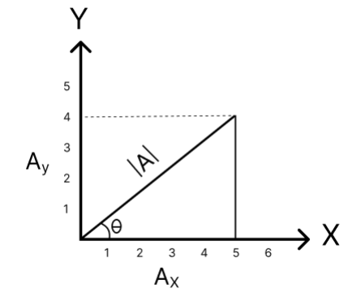

---
prev:
  text: "Lectures"
  link: "/College/Physics/Lectures/index"
next:
  false
  # text: "Lecture Two"
  # link: "/College/Physics/Lectures/LectureTwo"
---

# Physics Lecture One: Dimensional Analysis and Vector Operations

## Physics and Physical Quantities

### Definition of Physics

**Physics** is the branch of science that studies matter, energy, and the fundamental forces of nature. It seeks to understand how the universe behaves, from the smallest particles to the largest structures, such as galaxies. Physics plays a crucial role in explaining natural phenomena, driving technological advancements, and contributing to scientific research.

### Definition of Physical Quantity

A **physical quantity** is any property of a material or system that can be measured or calculated. Each physical quantity has two parts: a magnitude and a unit of measurement. Physical quantities are essential for describing and predicting the behavior of natural phenomena.

---

## Types of Physical Quantities

### Scalar and Vector Quantities

1. **Scalar Quantities**: Quantities that have only magnitude (size) and a unit.

   - **Examples**: Mass, speed, energy, time, and temperature.

2. **Vector Quantities**: Quantities that have both magnitude and direction.
   - **Examples**: Force, velocity, acceleration, and displacement.

### Fundamental and Derived Quantities

1. **Fundamental (Base) Quantities**: Basic building blocks that cannot be expressed in terms of other quantities.

   - **Examples**: Mass, length, and time.

2. **Derived Quantities**: Quantities derived from the fundamental ones through mathematical relationships.
   - **Examples**: Velocity, acceleration, and force.

---

## Unit Systems

### International, Gaussian, and British Systems

| Physical Quantity | International System (SI) | Gaussian System (CGS) | British System |
| ----------------- | ------------------------- | --------------------- | -------------- |
| Length            | Meter (m)                 | Centimeter (cm)       | Foot (ft)      |
| Mass              | Kilogram (kg)             | Gram (g)              | Pound (lb)     |
| Time              | Second (s)                | Second (s)            | Second (s)     |

### Length and Mass Conversions

- **Length**:
  - $1 \, \text{m} = 100 \, \text{cm}$
  - $1 \, \text{m} = 3.3 \, \text{ft}$
- **Mass**:
  - $1 \, \text{kg} = 1000 \, \text{g}$
  - $1 \, \text{kg} = 2.2 \, \text{lb}$

---

## Length Conversion Table

| Unit       | Symbol | Conversion from Meter                   |
| ---------- | ------ | --------------------------------------- |
| Terameter  | Tm     | $1 \, \text{Tm} = 10^{12} \, \text{m}$  |
| Gigameter  | Gm     | $1 \, \text{Gm} = 10^9 \, \text{m}$     |
| Megameter  | Mm     | $1 \, \text{Mm} = 10^6 \, \text{m}$     |
| Kilometer  | km     | $1 \, \text{km} = 10^3 \, \text{m}$     |
| Hectometer | hm     | $1 \, \text{hm} = 10^2 \, \text{m}$     |
| Decameter  | dam    | $1 \, \text{dam} = 10^1 \, \text{m}$    |
| Meter      | m      | $1 \, \text{m} = 1 \, \text{m}$         |
| Decimeter  | dm     | $1 \, \text{dm} = 10^{-1} \, \text{m}$  |
| Centimeter | cm     | $1 \, \text{cm} = 10^{-2} \, \text{m}$  |
| Millimeter | mm     | $1 \, \text{mm} = 10^{-3} \, \text{m}$  |
| Micrometer | µm     | $1 \, \text{µm} = 10^{-6} \, \text{m}$  |
| Nanometer  | nm     | $1 \, \text{nm} = 10^{-9} \, \text{m}$  |
| Angstrom   | Å      | $1 \, \text{Å} = 10^{-10} \, \text{m}$  |
| Picometer  | pm     | $1 \, \text{pm} = 10^{-12} \, \text{m}$ |

---

## Dimensional Analysis

| Derived Quantity         | Formula                        | Dimensional Formula | SI Unit                                                                      |
| ------------------------ | ------------------------------ | ------------------- | ---------------------------------------------------------------------------- |
| Area                     | Length × Length                | $L^2$               | Square meter ($\text{m}^2$)                                                  |
| Volume                   | Length × Length × Length       | $L^3$               | Cubic meter ($\text{m}^3$)                                                   |
| Density                  | Mass / Volume                  | $\frac{M}{L^3}$     | $\frac{\text{kg}}{\text{m}^3}$                                               |
| Linear Density           | Mass / Length                  | $\frac{M}{L}$       | $\frac{\text{kg}}{\text{m}}$                                                 |
| Velocity                 | Distance / Time                | $\frac{L}{T}$       | m/s or $\text{ms}^{-1}$                                                      |
| Acceleration             | Velocity / Time                | $\frac{L}{T^2}$     | $\text{m/s}^2$ or $\text{ms}^{-2}$                                           |
| Force                    | Mass × Acceleration            | $\frac{ML}{T^2}$    | Newton (N) or $\text{kg} \cdot \text{m/s}^2$                                 |
| Torque                   | Force × Length                 | $\frac{ML^2}{T^2}$  | $\text{kg} \cdot \frac{\text{m}^2}{\text{s}^2}$ or $\text{N} \cdot \text{m}$ |
| Pressure                 | Force / Area                   | $\frac{M}{L T^2}$   | Pascal (Pa) or $\frac{\text{N}}{\text{m}^2}$                                 |
| Work or Energy           | Force × Distance               | $\frac{ML^2}{T^2}$  | Joule (J) or $\text{N} \cdot \text{m}$                                       |
| Power                    | Work / Time                    | $\frac{ML^2}{T^3}$  | Watt (W) or $\text{kg} \cdot \frac{\text{m}^2}{\text{s}^3}$                  |
| Intensity                | Energy / Time                  | $\frac{M}{T^3}$     | $\frac{\text{kg}}{\text{s}^3}$                                               |
| Velocity Gradient        | Velocity / Distance            | $T^{-1}$            | $\text{s}^{-1}$                                                              |
| Volumetric Rate          | Volume / Time                  | $\frac{L^3}{T}$     | $\frac{\text{m}^3}{\text{s}}$                                                |
| Momentum                 | Mass × Velocity                | $\frac{ML}{T}$      | $\text{kg} \cdot \frac{\text{m}}{\text{s}}$                                  |
| Coefficient of Viscosity | Force × Time / Area × Velocity | $\frac{M}{L T}$     | $\frac{\text{kg}}{\text{m} \cdot \text{s}}$                                  |

---

## Dimensional Analysis Examples

### Example 1: Verifying Formula Correctness

Given equations:

1. $d = V_0 t^2 + \frac{1}{2} at$
2. $d = V_0 t + \frac{1}{2} at^2$

where:

- $d$: Distance in meters ($[d] = L$)
- $V_0$: Initial velocity in m/s ($[V_0] = LT^{-1}$)
- $a$: Acceleration in m/s$^2$ ($[a] = LT^{-2}$)
- $t$: Time in seconds ($[t] = T$)

#### Solution

For **Equation 1**: $d = V_0 t^2 + \frac{1}{2} at$

- **LHS**: $[d] = L$
- **RHS**:
  $$
  [V_0 t^2] + \frac{1}{2} [a t] = (LT^{-1})(T^2) + \frac{1}{2}(LT^{-2})(T) = LT + LT^{-1} \neq L
  $$
- **Conclusion**: Equation 1 is incorrect.

For **Equation 2**: $d = V_0 t + \frac{1}{2} at^2$

- **LHS**: $[d] = L$
- **RHS**:
  $$
  [V_0 t] + \frac{1}{2} [a t^2] = (LT^{-1})(T) + \frac{1}{2}(LT^{-2})(T^2) = L + L = 2L
  $$
- **Conclusion**: Equation 2 is correct.

---

### Example 2: Periodic Time of a Simple Pendulum

Find the relation between the periodic time $T$, length $L$, and gravitational acceleration $g$.

Given:

- **Periodic time** $T$: $[T] = T$
- **Length** $L$: $[L] = L$
- **Acceleration due to gravity** $g$: $[g] = LT^{-2}$

Assume:

$$
T \propto L^a g^b
$$

or

$$
T = k L^a g^b
$$

Expanding:

$$
[T] = [L]^a [LT^{-2}]^b = L^a L^b T^{-2b} = L^{a+b} T^{-2b}
$$

Equating dimensions:

$$
L^0 T^1 = L^{a+b} T^{-2b}
$$

Solving:

1. For $T$: $-2b = 1 \Rightarrow b = -\frac{1}{2}$
2. For $L$: $a + b = 0 \Rightarrow a = \frac{1}{2}$

Thus:

$$
T = k \sqrt{\frac{L}{g}}
$$

---

## Distance vs. Displacement

### Distance

If a body moves from point `A` to point `D` following a curved path `ABCD`, then the total length of the path `ABCD` is called the **distance** moved by the body. Distance is a scalar quantity, as it has only magnitude.

### Displacement

The **displacement** is the shortest straight-line distance from the initial point `A` to the final point `D`. Displacement is a vector quantity, as it has both magnitude and direction.

### Difference Between Distance and Displacement

If a body travels a path `ABCD` and returns to point `A` through another path `DA`, the **total distance** traveled is the length of the path `ABCDA`. However, since the initial and final points are the same, the **displacement** is zero.

---

## Vector Representation and Magnitude

A vector $\vec{A}$ in two-dimensional space can be expressed as:

$$
\vec{A} = A_x \, \hat{i} + A_y \, \hat{j}
$$

where:

- $A_x$ and $A_y$ are the components in the x and y directions.
- $\hat{i}$ is the unit vector in the x-direction.
- $\hat{j}$ is the unit vector in the y-direction.

For example, if $\vec{A} = 5 \, \hat{i} + 4 \, \hat{j}$, then:

- $A_x = 5$
- $A_y = 4$

#### Magnitude of a Vector

The magnitude (or length) of $\vec{A}$, denoted $|| \vec{A} ||$, is calculated as:

$$
|| \vec{A} || = \sqrt{A_x^2 + A_y^2}
$$

#### Direction of a Vector

The angle $\theta$ of $\vec{A}$ with the x-axis can be found using:

$$
\theta = \tan^{-1} \left( \frac{A_y}{A_x} \right)
$$

---

## Vector Operations

Vectors are quantities with both magnitude and direction, and vector operations are essential in solving problems in physics, mathematics, and engineering. These operations are especially useful when dealing with quantities like force, velocity, and displacement.

Consider two displacement vectors $\vec{A}$ and $\vec{B}$, where:

$$
\vec{A} = 3 \, \hat{i} + 2 \, \hat{j} \quad \text{and} \quad \vec{B} = 1 \, \hat{i} + 4 \, \hat{j}
$$

### 1. Vector Addition

#### Geometrically:

Two vectors can be added using the triangle or parallelogram rule. To add vectors **A** and **B**:

- Place the tail of the second vector at the head of the first vector.
- Draw the resultant vector from the tail of the first vector to the head of the second vector.

#### Mathematically:

The sum of $\vec{A}$ and $\vec{B}$ is:

$$
\vec{A} + \vec{B} = (A_x + B_x) \, \hat{i} + (A_y + B_y) \, \hat{j}
$$

Substituting values:

$$
\vec{A} + \vec{B} = (3 + 1) \, \hat{i} + (2 + 4) \, \hat{j} = 4 \, \hat{i} + 6 \, \hat{j}
$$

### 2. Vector Subtraction

#### Geometrically:

To subtract vector **B** from **A**:

- Add the vector **-B** (which has the same magnitude as **B** but the opposite direction) to **A**.

#### Mathematically:

The difference of $\vec{A}$ and $\vec{B}$ is:

$$
\vec{A} - \vec{B} = (A_x - B_x) \, \hat{i} + (A_y - B_y) \, \hat{j}
$$

Substituting values:

$$
\vec{A} - \vec{B} = (3 - 1) \, \hat{i} + (2 - 4) \, \hat{j} = 2 \, \hat{i} - 2 \, \hat{j}
$$

### 3. Vector Products

#### Dot Product

The **dot product** of two vectors results in a scalar (a number), representing the product of their magnitudes and the cosine of the angle between them:

$$
\vec{A} \cdot \vec{B} = |\vec{A}| |\vec{B}| \cos \theta
$$

where:

- $\vec{A} \cdot \vec{B}$ is the scalar value.
- $\theta$ is the angle between the vectors **A** and **B**.

The dot product (or scalar product) of $\vec{A}$ and $\vec{B}$ is:

$$
\vec{A} \cdot \vec{B} = A_x B_x + A_y B_y
$$

Substituting values:

$$
\vec{A} \cdot \vec{B} = (3)(1) + (2)(4) = 3 + 8 = 11
$$

#### Cross Product

The **cross product** of two vectors, **A** and **B**, results in a vector perpendicular to the plane containing **A** and **B**. Its magnitude is given by:

$$
| \vec{A} \times \vec{B} | = |\vec{A}| |\vec{B}| \sin \theta
$$

where:

- $\vec{A} \times \vec{B}$ is the vector perpendicular to both **A** and **B**.
- $\theta$ is the angle between the two vectors.

The cross product (or vector product) of $\vec{A}$ and $\vec{B}$ is given by:

Using the determinant method:

$$
\vec{A} \times \vec{B} = \begin{vmatrix} A_x & A_y \\ B_x & B_y \end{vmatrix} = A_x B_y\hat{i} - A_y B_x\hat{j}
$$

Or directly use:

$$
\vec{A} \times \vec{B} = A_x B_y \, \hat{i} - A_y B_x \, \hat{j}
$$

Substituting values:

$$
\vec{A} \times \vec{B} = (3)(4) - (2)(1) = 12 - 2 = 10
$$

---

## Magnitude and Angle Between Vectors

Given:

$$
|| \vec{A} || = \sqrt{3^2 + 2^2} = \sqrt{9 + 4} = \sqrt{13}
$$

$$
|| \vec{B} || = \sqrt{1^2 + 4^2} = \sqrt{1 + 16} = \sqrt{17}
$$

#### Dot Product in Terms of Cosine

The dot product can also be expressed in terms of the angle $\theta$ between $\vec{A}$ and $\vec{B}$:

$$
\vec{A} \cdot \vec{B} = || \vec{A} || \, || \vec{B} || \cos(\theta)
$$

If $\theta = 30^\circ$, then:

$$
\vec{A} \cdot \vec{B} = \sqrt{13} \cdot \sqrt{17} \cdot \cos(30^\circ)
$$

#### Cross Product in Terms of Sine

The cross product can be expressed in terms of $\theta$ as:

$$
\vec{A} \times \vec{B} = || \vec{A} || \, || \vec{B} || \sin(\theta)
$$

If $\theta = 90^\circ$, then:

$$
\vec{A} \times \vec{B} = \sqrt{13} \cdot \sqrt{17} \cdot \sin(90^\circ)
$$
