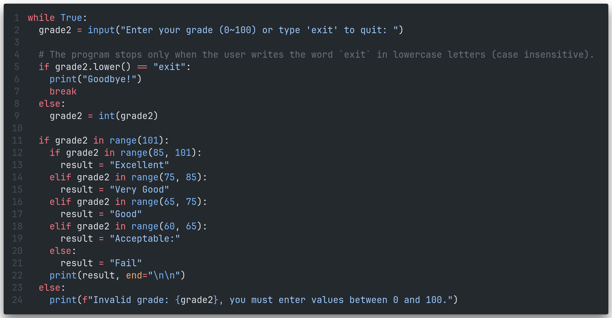
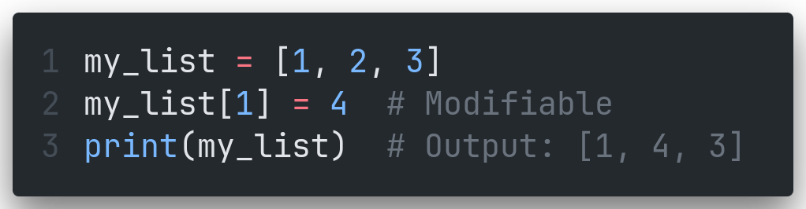
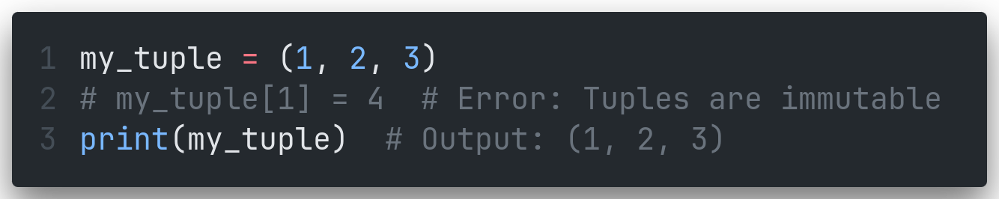
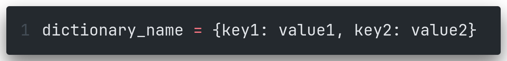
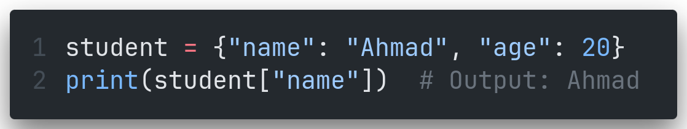
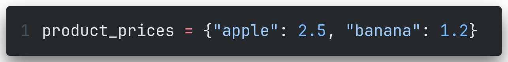
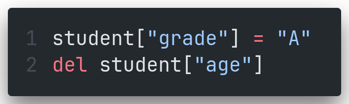
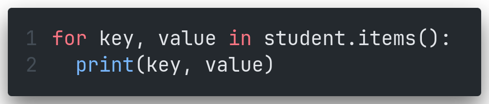
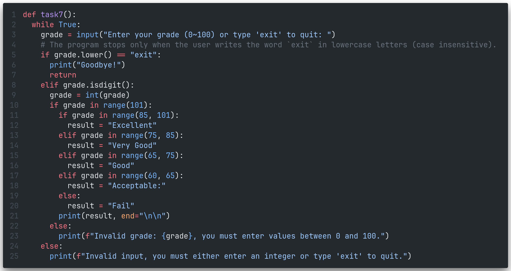
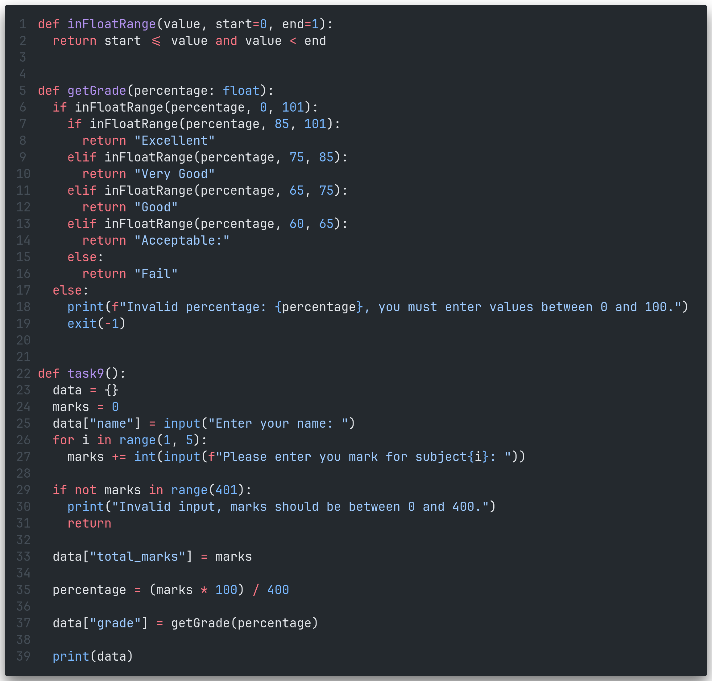

---
prev:
  text: "Exams"
  link: "/College/Python/Exams/index"
next: false
---

# Python Assignment Two

## Scenario

You are applying for the position of a programmer in the Department of Computer Science and Systems at New Cairo Technological University.
The director has assigned the following tasks:

- Test your understanding of Python programming's fundamental ideas and subjects.
- Assess whether you can approach challenges with "software engineer thinking" to find the optimal solution.

## Task 1

Write a Python program using `elif` to take a student's grade as input, with the grade ranging from 0 to 100. The program should determine the student's grade category based on the following criteria:

- **Excellent**: 85 or higher, up to 100.
- **Very Good**: 75 or above but less than 85.
- **Good**: 65 or above but less than 75.
- **Acceptable**: 60 or above but less than 65.
- **Fail**: Less than 60.

If the input value is outside the range of 0 to 100, the program should display an error message indicating that the supplied value is invalid.

## Task 2

Mention the differences between `while` loop and `for` loop.

## Task 3

Repeat the program from Task 1 to use loops, allowing the program to run repeatedly an unlimited number of times. The program should only stop when the user enters `exit` (case-insensitive).

> [!Note]
> Solve this task without using functions.

## Task 4

Create a program that entertains workers recording students’ grades during their break. The program should ask the user to enter the number of lines needed to print the following shape:

```
*
**
***
```

Use loops to allow the program to run repeatedly an unlimited number of times. The program should only stop when the user enters `exit` in lowercase letters.

> [!Note]
> Solve this task without using functions.

## Task 5: Define lists and tuples and compare between them

## Task 6: Define the dictionary in Python and mention its uses

## Task 7: Re-write task 3 with using function

## Task 8: Write program using a dictionary to store student name and degree data

## Task 9

Write a program using a dictionary to store student names and their grades for four subjects. The program should accept the student's name and grades as input. Each subject has a maximum score of 100 marks. The program should calculate and output the total score and classify the student's general grade according to the following criteria:

- **Excellent**: 85% or higher, up to 100%.
- **Very Good**: 75% or above but less than 85%.
- **Good**: 65% or above but less than 75%.
- **Acceptable**: 60% or above but less than 65%.
- **Fail**: Less than 60%.

> [!Note]
> Use all the notes mentioned above and apply everything you have learned, including control structures, functions, and lists.

## Answers

### Task 1


### Task 2

| **Aspect**                | **While Loop**                                                                           | **For Loop**                                                                                        |
| ------------------------- | ---------------------------------------------------------------------------------------- | --------------------------------------------------------------------------------------------------- |
| **Definition**            | Repeats a block of code as long as a specified condition evaluates to `True`.            | Iterates over a sequence (e.g., list, range) or other iterable objects.                             |
| **Use Case**              | Suitable when the number of iterations is unknown beforehand and depends on a condition. | Ideal for scenarios with a known sequence or range of items to iterate over.                        |
| **Syntax**                | `while condition:`                                                                       | `for variable in sequence:`                                                                         |
| **Control**               | Relies on a condition that may change within the loop to terminate.                      | Automatically terminates after iterating over all items in the sequence.                            |
| **Flexibility**           | Can emulate a `for` loop by managing counters manually.                                  | Specifically designed for sequential iteration, eliminating the need for manual counter management. |
| **Risk of Infinite Loop** | Higher risk if the condition is not properly handled.                                    | Low risk since iteration is defined by the sequence length.                                         |

### Task 3



### Task 4


### Task 5

#### Lists

- **Definition**: Lists are mutable, ordered collections of items, where the items can be of any data type.
- **Syntax**: `[item1, item2, item3]`

#### Tuples

- **Definition**: Tuples are immutable, ordered collections of items, where the items can be of any data type.
- **Syntax**: `(item1, item2, item3)`

#### Comparison Between Lists and Tuples

| **Aspect**            | **List**                                                        | **Tuple**                                            |
| --------------------- | --------------------------------------------------------------- | ---------------------------------------------------- |
| **Mutability**        | Mutable (items can be added, removed, or changed).              | Immutable (items cannot be modified once defined).   |
| **Syntax**            | `[item1, item2]`                                                | `(item1, item2)`                                     |
| **Performance**       | Slower due to mutability overhead.                              | Faster due to immutability.                          |
| **Memory Efficiency** | Requires more memory.                                           | More memory-efficient.                               |
| **Use Case**          | Use when the data is expected to change frequently.             | Use when the data is constant and should not change. |
| **Methods**           | Has numerous built-in methods like `append()`, `remove()`, etc. | Has limited methods like `count()` and `index()`.    |

#### Example

- **List**:



- **Tuple**:


### Task 6

#### Definition of Dictionary in Python

A **dictionary** is an unordered collection of key-value pairs in Python. Each key in a dictionary is unique and immutable, while the values can be of any data type and are mutable.

- **Syntax**:


#### Uses of Dictionaries

1. **Key-Based Data Retrieval**: Accessing data quickly using keys instead of indices.
   Example:

2. **Mapping Relationships**: Representing relationships such as ID-to-name or product-to-price mappings.
   Example:

3. **Dynamic Data Storage**: Storing dynamic key-value data, such as configurations or user inputs.
   Example:
   
4. **Efficient Updates**: Easily updating, adding, or removing elements.
   Example:
   
5. **Iterating Over Items**: Iterating through keys, values, or both using loops.
   Example:
   

#### Example Dictionary in Python


### Task 7



### Task 8


### Task 9


