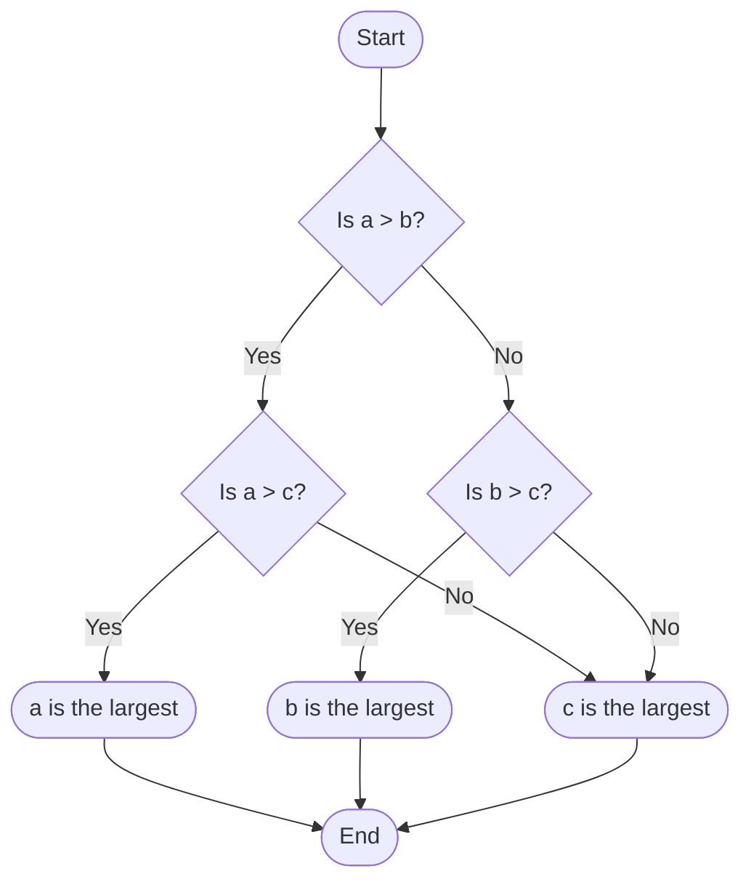
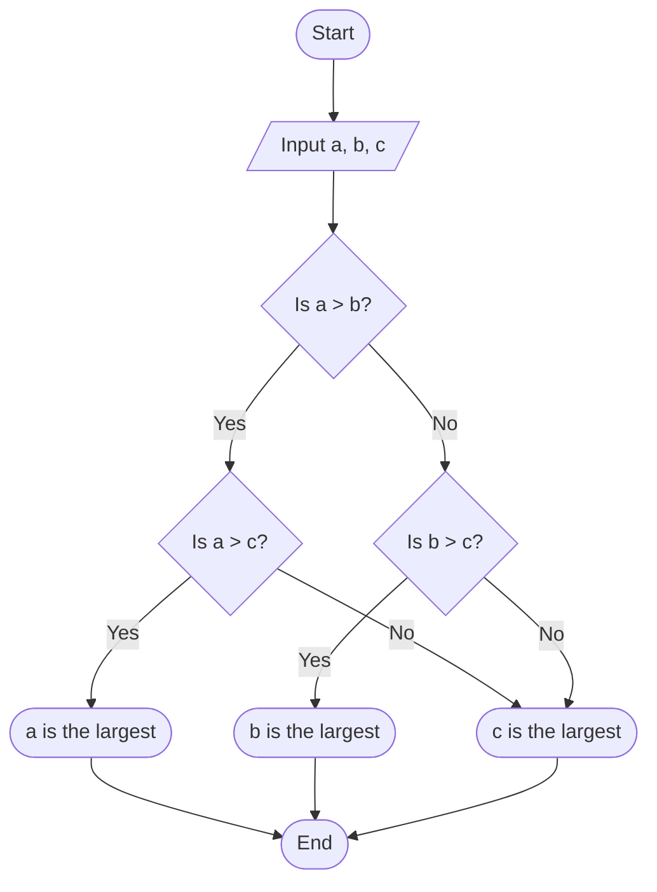

---
prev:
  text: "Section Three (Part I)"
  link: "/College/Python/Sections/SectionThreePartOne"
next: false
#   text: "Section Four"
#   link: "/College/Python/Sections/SectionFour"
---

# Programming Essentials in Python Section 3 (Part II)

## Symbols Used in Flowcharts

Flowcharts use various symbols to visually represent the structure of algorithms and processes. Each symbol has a specific meaning, allowing viewers to quickly understand the flow and logic of a program.

### 1. Oval

- **Function**: Used to indicate the `START` or `STOP` of the program.

### 2. Parallelogram

- **Function**: Represents input and output operations. Statements like `INPUT`, `READ`, and `PRINT` are typically enclosed within this shape.

### 3. Rectangle

- **Function**: Used to indicate processing operations, such as storing values or performing arithmetic calculations.

### 4. Diamond

- **Function**: Indicates a decision-making step, known as the decision box. This shape is used to test conditions, ask questions, and direct the flow based on responses.

### 5. Flow Lines

- **Function**: Arrows indicate the direction of flow in a flowchart. Every line must have an arrow to specify the process sequence.

### 6. Circle

- **Function**: Known as on-page connectors, circles help join different parts of a flowchart on the same page. They also assist in shaping complex flowcharts by connecting sections.

### Flowchart Example for Decision-Making Using Mermaid



## Decision Structures in Flowcharts

There are two common ways to represent decisions in a flowchart:

1. **Binary Questions**: The condition is framed as a question with two possible outcomes:

   - `Yes`
   - `No`

2. **Binary Statements**: The condition is expressed as a statement with two possible outcomes:
   - `True`
   - `False`

## Decision-Making in Python

In Python, the `if` statement is used to execute code based on a condition.

### 1. If Statement

The `if` statement executes a block of code if the condition evaluates to `True`.

**Syntax**:

```python
# Check a condition
if condition:
    statement1_here  # Executes if condition is True
```

**Example**:

```python
# Check if a number is positive
num = 5
if num > 0:
    print("The number is positive")
```

### 2. If-Else Statement

The `if-else` structure provides an alternative set of actions if the condition is `False`.

**Syntax**:

```python
if condition:
    statement1_here  # Executes if condition is True
else:
    statement2_here  # Executes if condition is False
```

**Example**:

```python
# Check if a number is positive or negative
num = -3
if num > 0:
    print("The number is positive")
else:
    print("The number is negative")
```

### 3. Nested If Statements

Nested `if` statements allow for more complex decision structures by placing `if` statements inside other `if` statements.

**Example**:

```python
# Find the largest of three numbers
a = 10
b = 15
c = 7

if a > b:
    if a > c:
        print("a is the largest")
    else:
        print("c is the largest")
else:
    if b > c:
        print("b is the largest")
    else:
        print("c is the largest")
```

## Algorithm to Find the Largest of Three Numbers

1. **Start**
2. **Input** three numbers: `a`, `b`, and `c`
3. **Check** if `a` is greater than `b`
   - If **yes**, then check if `a` is also greater than `c`
     - If **yes**, `a` is the largest
     - Otherwise, `c` is the largest
   - If **no**, check if `b` is greater than `c`
     - If **yes**, `b` is the largest
     - Otherwise, `c` is the largest
4. **End**

### Flowchart Example Using Mermaid


