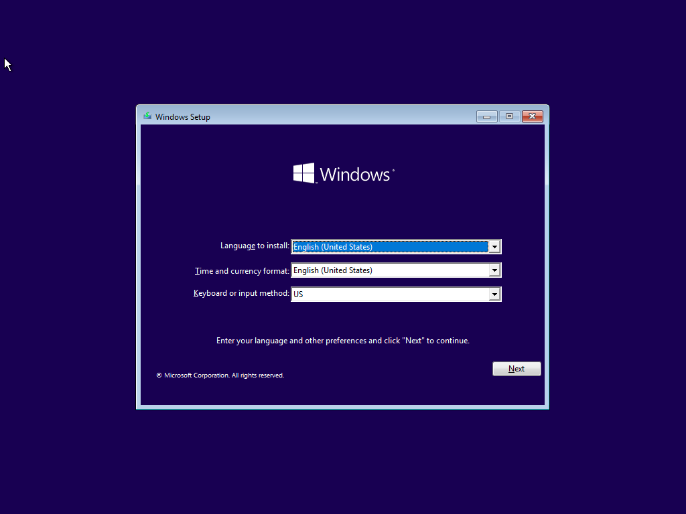
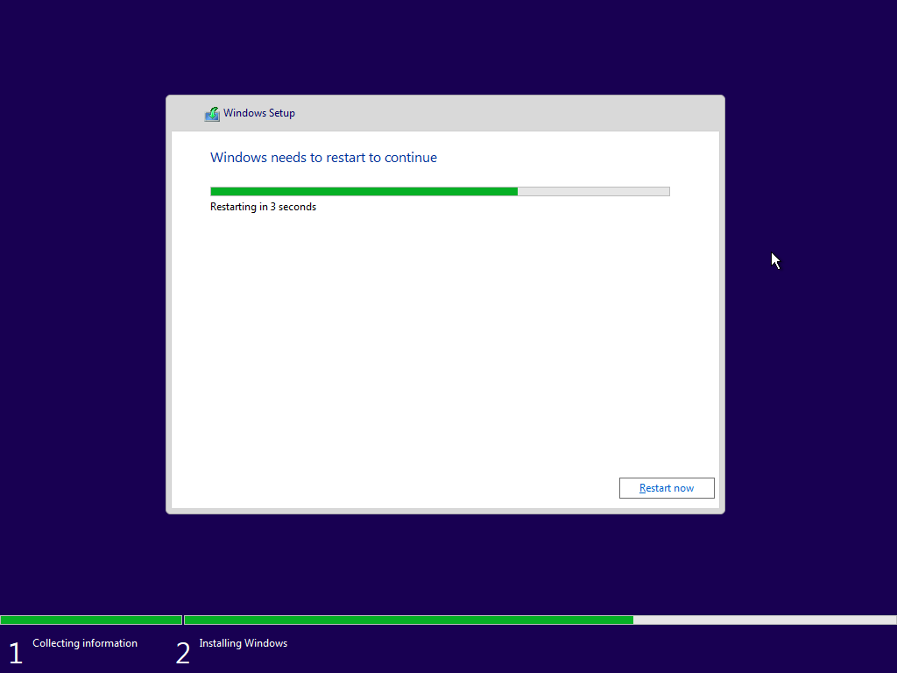
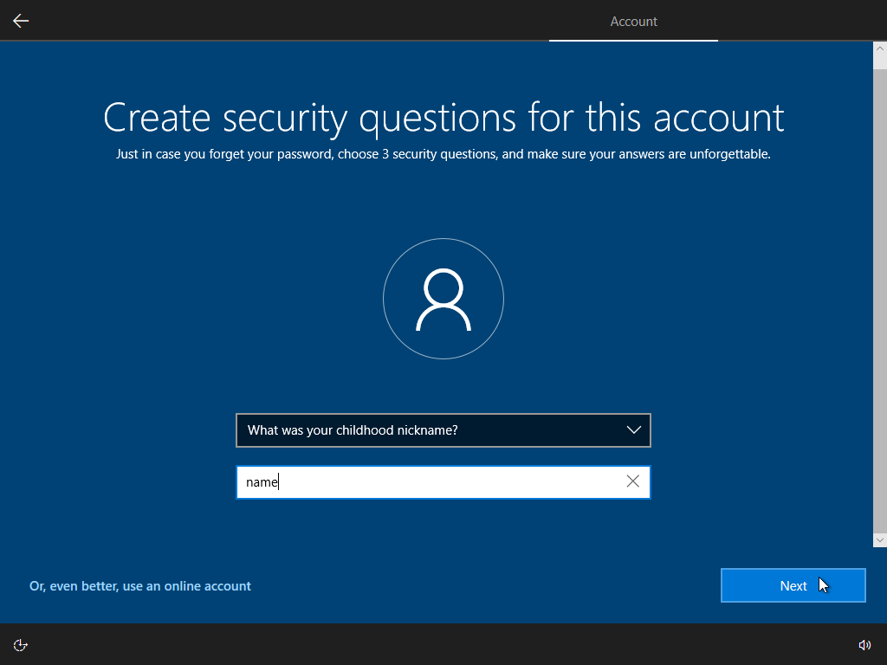
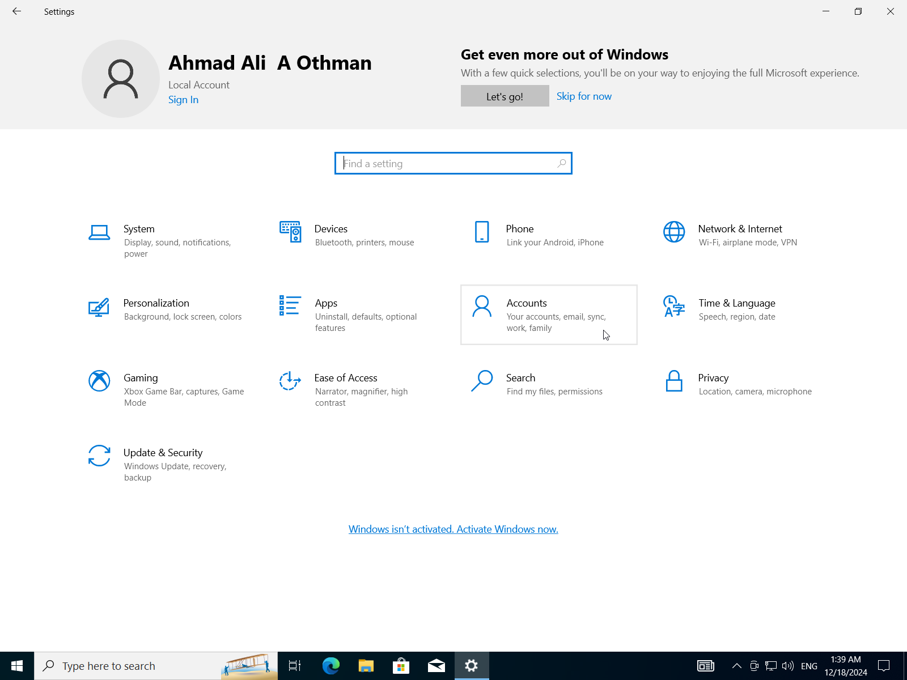
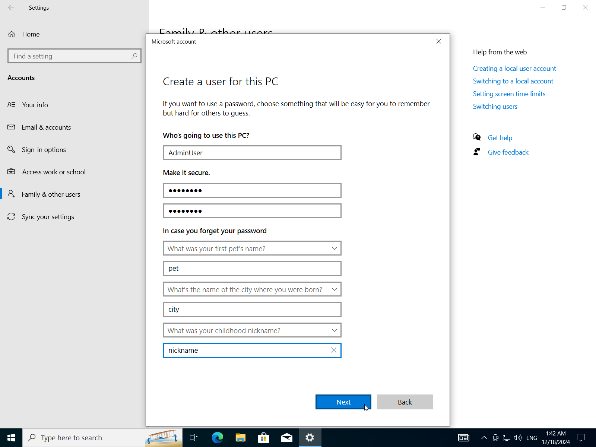

# IT Essentials Assignment Two

## Scenario

- You are tasked with setting up a small office network for a company that consists of 10 computers, a server, and a printer.
- The company is located in a single-floor building.
- The network needs to allow all computers to share files, access the internet, and print documents to the shared printer.
- The company needs reliable communication and secure access to its resources.

## Task No.01

1. What are the essential components required to set up the network in this office? (P6)
2. What are the seven layers of the OSI model, and how does each layer contribute to enabling communication between the devices at the office network? (P7)
3. What are the suggested network type and topology for the office network? Explain why these are the most suitable options for this setup. (M6)
4. Compare between TCP and UDB protocols. (M7)
5. Using Cisco Packet Tracer, design and implement a basic network setup for the office. Include the network type, devices, and topology. Simulate and test communication between the devices to ensure the setup is functional. Explain your design choices and the results of your simulation. (D5)

## Task No.02

6. What are the basic functions of an Operating system? (P8)
7. Install Windows 10 on a virtual machine (e.g. VirtualBox) and configure basic system settings:
   a) Start a fresh installation of Windows 10. (P9)
   b) During the installation, set the language, time zone, and region. (P9)
   c) After installation, create user accounts and set up user permissions. (P9)
   d) Compare between FAT32 and NTFS file systems then Configure a storage device with the appropriate file system based on its intended use. (M8)
   e) Set up a local area network (LAN) connection or Wi-Fi, ensuring internet access. (M9)
8. After successfully installing Windows 10, configure security settings such as Windows Defender, Firewall, and User Account Control. (D6)

## Answers

### Task No.01

#### Q1: What are the essential components required to set up the network in this office?

##### 1. Networking Hardware

###### a. Router

- **Purpose:** Connects the office network to the internet.
- **Features:**
  - Supports DHCP to assign IP addresses.
  - Includes firewall capabilities for added security.
  - May have built-in Wi-Fi for wireless devices.

###### b. Switch

- **Purpose:** Acts as the central hub for connecting all devices in a star topology.
- **Recommended Specification:**
  - A **16-port Gigabit switch** to accommodate the 10 computers, server, printer, and future expansion.

###### c. Ethernet Cables

- **Purpose:** Physically connects computers, the server, the printer, and networking devices.
- **Recommendation:**
  - Use **Cat5e** or **Cat6** cables for high-speed and reliable data transfer.

###### d. Access Point

- **Purpose:** Provides Wi-Fi connectivity for mobile devices or laptops, if needed.
- **Alternative:** A router with integrated Wi-Fi.

###### e. Printer

- **Purpose:** A shared printer capable of network printing.
- **Recommendation:**
  - A printer with **Ethernet** or **Wi-Fi** connectivity for direct integration into the network.

---

##### 2. Server

- **Purpose:** Provides centralized storage, file sharing, and possibly application hosting.
- **Recommended Features:**
  - Adequate storage capacity (e.g., RAID configuration for redundancy).
  - Gigabit network interface card (NIC) for high-speed connectivity.
  - An appropriate operating system (e.g., Linux, Windows Server).

---

##### 3. Computers

- **Purpose:** End-user devices for work and communication.
- **Connectivity:**
  - Ethernet ports for wired connections.
  - Wireless adapters (optional, if Wi-Fi is used).

---

##### 4. Internet Connection

- **Purpose:** Provides external access for browsing, email, and cloud services.
- **Requirement:**
  - A broadband connection (e.g., fiber or DSL) with sufficient bandwidth for 10 users.

---

##### 5. Software and Configuration

###### Network Configuration Tools

- DHCP: For automatic IP address assignment (often provided by the router).
- DNS: For resolving domain names (via the router or ISP).

###### Security Tools

- Firewalls: Provided by the router or server.
- Antivirus software: For all devices.

##### Summary of Components:

| **Component**           | **Quantity** | **Purpose**                            |
| ----------------------- | ------------ | -------------------------------------- |
| Router                  | 1            | Internet access and firewall.          |
| Switch                  | 1 (16-port)  | Central connection point.              |
| Ethernet Cables         | ~15          | Wired connections.                     |
| Printer                 | 1            | Shared printing.                       |
| Server                  | 1            | Centralized file and resource sharing. |
| Computers               | 10           | End-user devices.                      |
| Power Backup (UPS)      | 1-2          | Uninterrupted power for key devices.   |
| Access Point (Optional) | 1            | Wireless connectivity (if needed).     |

#### Q2: What are the seven layers of the OSI model, and how does each layer contribute to enabling communication between the devices at the office network?

##### OSI Model Layers

**Physical Layer**

- **Role in the Network:**
  - Establishes the physical connection between devices.
  - Transmits raw binary data over the medium (e.g., Ethernet cables or Wi-Fi signals).
- **Example:**
  - Ethernet cables connect the computers, server, printer, and router.
  - Network switch and Wi-Fi access points facilitate signal distribution.

---

**Data Link Layer**

- **Role in the Network:**
  - Provides MAC addressing to identify devices on the same network.
  - Ensures error detection and reliable data delivery within the local area network (LAN).
- **Example:**
  - Ensures that a print request from Computer A is directed to the correct printer.
  - Switches forward frames based on MAC addresses within the office network.

---

**Network Layer**

- **Role in the Network:**
  - Handles logical addressing (IP addresses) and routes data between different networks.
  - Enables internet access by routing packets from the office network to external networks.
- **Example:**
  - Assigns IP addresses to all devices (e.g., via DHCP from the router).
  - Routes data from the server to the computers and manages traffic to the internet.

---

**Transport Layer**

- **Role in the Network:**
  - Ensures reliable communication through error checking, acknowledgments, and retransmissions.
  - Handles segmentation of data into packets and flow control.
- **Example:**
  - Ensures a file transfer from the server to a computer completes without errors (TCP).
  - Handles streaming of video content over a web browser (UDP).

---

**Session Layer**

- **Role in the Network:**
  - Manages and maintains sessions between devices or applications.
  - Keeps sessions active for tasks like printing or shared folder access.
- **Example:**
  - Maintains a session for remote desktop access to the server.
  - Ensures a stable connection for a user editing a document on the shared server.

---

**Presentation Layer**

- **Role in the Network:**
  - Formats data for the application layer, including encryption and compression.
  - Ensures data is understandable by both sender and receiver.
- **Example:**
  - Encrypts sensitive data sent from a computer to the server (SSL/TLS).
  - Compresses large files for faster transmission across the network.

---

**Application Layer**

- **Role in the Network:**
  - Interfaces with user applications and provides services such as file sharing, email, and printing.
  - Uses protocols to enable communication between applications.
- **Example:**
  - Facilitates file sharing via SMB (Server Message Block) or FTP.
  - Sends emails through SMTP and retrieves them with IMAP.
  - Sends print jobs to the shared printer using print protocols.

---

##### End-to-End Scenario

1. A user on Computer A sends a print job to the printer.
   - **Layer 7:** User interacts with the print application.
   - **Layer 6:** Data is formatted and encrypted for secure transmission.
   - **Layer 5:** A session is established with the printer.
   - **Layer 4:** Data is segmented into packets with error checking.
   - **Layer 3:** Packets are routed to the printer using its IP address.
   - **Layer 2:** Frames are directed to the printer based on its MAC address.
   - **Layer 1:** Electrical signals transmit the data to the printer.

2. A user on Computer B accesses the internet.
   - **Layer 7:** Web browser sends an HTTP request.
   - **Layer 6:** Data is encrypted using HTTPS.
   - **Layer 5:** Session is maintained for the HTTP connection.
   - **Layer 4:** TCP ensures reliable delivery of the request and response.
   - **Layer 3:** Packets are routed to and from the external web server.
   - **Layer 2:** Frames are switched within the office network.
   - **Layer 1:** Data is transmitted through the router and ISP.

#### Q3: What are the suggested network type and topology for the office network? Explain why these are the most suitable options for this setup.

##### Network Type: Local Area Network (LAN)

- **Why LAN?**
  - **Localized coverage:** A LAN is designed for devices within a small geographical area, such as a single-floor office.
  - **Cost-effective:** LAN setups are affordable and ideal for connecting a small number of devices.
  - **High-speed communication:** Ensures fast data transfer rates for file sharing, printing, and internet access.
  - **Ease of management:** Simple to configure and maintain with modern networking devices (e.g., switches and routers).

---

##### Topology: Star Topology

- **Why Star Topology?**
  - **Centralized management:**
    - A network switch acts as the central hub, connecting all devices (computers, server, printer).
    - Easy to troubleshoot since each device connects independently to the switch.
  - **Scalability:**
    - New devices can be added easily without affecting the existing connections.
  - **Reliability:**
    - A failure in one device or cable does not affect the entire network, as each device has an independent connection to the central switch.
  - **Performance:**
    - Eliminates data collisions by using switches with full-duplex communication, ensuring efficient bandwidth usage.
  - **Cost-effective:**
    - Affordable for small networks with a limited number of devices.

---

##### Implementation Example

1. **Core Devices:**
   - A central **network switch**.
   - A **router** connected to the switch to provide internet access.
   - Ethernet cables for wired connections (Cat5e or Cat6 for better speeds).

2. **Connections:**
   - All computers, the server, and the printer are connected to the switch via Ethernet.
   - The router connects to the switch to enable internet access.
   - A wireless access point (or a router with Wi-Fi) can be added for mobile or Wi-Fi-enabled devices.

---

##### Benefits of this Setup

- **Efficiency:** All devices can share files, print, and access the internet seamlessly.
- **Security:** A LAN allows for better control of network access and implementation of security protocols (e.g., firewalls, VLANs).
- **Cost-effectiveness:** Uses affordable and readily available hardware.
- **Reliability:** Minimizes downtime by isolating potential failures to individual connections.

#### Q4: Compare between TCP and UDB protocols.

##### TCP (Transmission Control Protocol)

- **Features**:
  - Reliable, ensures data integrity.
  - Acknowledges received data.
  - Resend unacknowledged data.
  - Maintains data sequencing.

##### UDP (User Datagram Protocol)

- **Features**:
  - Unreliable, best-effort delivery.
  - No acknowledgments or retransmissions.
  - Fast, low overhead.
  - Delivers data as it arrives.

| Feature         | TCP                                 | UDP                             |
| --------------- | ----------------------------------- | ------------------------------- |
| Reliability     | Reliable; acknowledges data.        | Unreliable; no acknowledgments. |
| Overhead        | Higher; ensures data integrity.     | Lower; fast, lightweight.       |
| Use Case        | Email, file transfer, web browsing. | Streaming, gaming, voice calls. |
| Data Sequencing | Data delivered in order.            | No guarantee of order.          |

#### Q5: Using Packet Tracer, design and implement a basic network setup for the office. Include the network type, devices, and topology. Simulate and test communication between the devices to ensure the setup is functional. Explain your design choices and the results of your simulation.

##### 1. Design Choices

###### a. Network Type

- **Local Area Network (LAN):**
  - Suitable for a small office within a single floor.
  - Centralized control for file sharing, internet access, and printing.

###### b. Topology

- **Star Topology:**
  - A central switch connects all devices.
  - Scalable and easy to manage.

###### c. Devices

- **Router:** Provides internet access and acts as a DHCP server.
- **Switch:** Serves as the central connecting point.
- **End Devices:** 10 PCs, 1 server, 1 printer.
- **Cables:** Copper straight-through cables for wired connections.

##### 2. Steps for Implementation in Cisco Packet Tracer

###### a. Add Devices

1. Place the following devices on the workspace:
   - **1 Router:** (Cisco 4331)
   - **1 Switch:** (Cisco 2960)
   - **10 PCs:** Representing office computers.
   - **1 Server:** For file sharing and print management.
   - **1 Printer:** Network-enabled printer.

###### b. Physical Connections

- Connect devices using **copper straight-through cables:**
  - Router to switch.
  - Switch to all PCs, server, and printer.

###### c. IP Addressing

1. **Router Configuration:**
   - Assign a static IP address `192.168.1.1` to the router's interface `GigabitEthernet0/0/0`.
   - Connect the switch to the router on the `GigabitEthernet0/0/0` interface (which we assigned an IP earlier).

2. **Server and Printer:**
   - Assign static IP addresses for easier identification (`192.168.1.2` for the server and `192.168.1.3` for the printer).

###### d. Device Configuration

- **PCs:**
  - Configure each PC with a static IP address from `192.168.1.4` to `192.168.1.13`.
  - Test connectivity with the router (click on the device -> desktop -> command prompt -> run `ping 192.168.1.1`).

- **Server:**
  - Assign the static IP `192.168.1.2`.
  - Configure the default gateway to `192.168.1.1`.

- **Printer:**
  - Assign the static IP `192.168.1.3`.
  - Configure the default gateway to `192.168.1.1`.

##### 3. Testing Communication

###### Pinging Devices

- **Test 1:** Ping between two PCs (e.g., `PC1 -> PC2`) to verify internal LAN communication.
- **Test 2:** Ping the server (`192.168.1.2`) and printer (`192.168.1.3`) to ensure reachability.

##### 4. Simulation Results

- **All PCs were successfully assigned static IP addresses.**
- **PCs can communicate with each other, the server, and the printer.**

#### 5. Final Design

---

## Task No.02

#### Q6: What are the basic functions of Operating system?

An Operating System (OS) is essential software that manages a computer's hardware and software resources, acting as an intermediary between users and the hardware. Its key functions include:

- **Resource Management:** Controlling hardware resources like the CPU, memory, storage, and peripherals.
- **User Interface:** Providing an interface (Command Line Interface (CLI) or Graphical User Interface (GUI)) for user interaction.

One of the OS's main roles is **controlling hardware access**. It achieves this by using **device drivers**, small programs written by hardware manufacturers, to enable communication between applications and hardware. **Plug and Play (PnP)** automates this process by automatically detecting PnP-compatible hardware and installing the necessary drivers. The OS then configures the device and updates the **registry**, a database containing information about the computer's applications, users, hardware, network settings, and file types.

#### Q7: Install Windows 10 on a virtual machine and configure basic system settings.

###### A) Start a Fresh Installation of Windows 10

- Create a new VM in VirtualBox.
  

- Attach the Windows 10 ISO.
  

- Give it at least 4GB of RAM, 30GB storage and 4 cores of your CPU.
  

  

- Follow the installation wizard.
  

- Run the virtual machine.
  

##### B) During the Installation, Set the Language, Time Zone, and Region

- Select language, local and keyboard layout.
  

- Start windows installation
  

- Enter your product key if available, we will click `I don't have a product key`.
  

- Select the windows version to install (Home, Education, Pro, Enterprise). We will choose windows 10 pro.
  

- Accept terms and conditions
  

- Choose custom install (to format out disk).
  

- Choose the right disk then click `next`.
  

- Installation has begun.
  

  

- Wait until it finishes.
  

  

- Choose your region.
  

- Keyboard layout.
  

- Add second layout (optional).
  

- Setup networking.
  

- Answer some questions.
  

- Add/Create your microsoft account or continue with an offline account.
  

- Skip unnecessary features.
  

- Enter your username.
  

- Create a password (optional but recommended).
  

- Confirm your password.
  

- Answer security questions (3 questions).
  

  

  

- Turn off telemetry.
  

- Skip marketing questions.
  

- Skip setting up Cortana.
  

- Finishing up the installation.
  

- Installation completed.
  

##### C) After Installation, Create User Accounts and Set Up User Permissions

- Open windows settings app
  
- Select `Accounts` -> `Family & Other Users`
  
- Select `Add someone else to this PC` -> `I don't have this person's sign-in information`
  
- Add a user without microsoft account.
  
- Insert username, password, confirm-password, and security questions.
  
- Repeat to add another account.
  
- Change account type.
  
- Change account to `Administrator` or `Standard User`.
  
  
- Now we have two users one is Administrator and the other one is a standard user.
  

##### D) Compare Between Fat32 and Ntfs File Systems Then Configure a Storage Device With the Appropriate File System Based on Its Intended Use

###### NTFS vs. FAT32

FAT32 (File Allocation Table 32) and NTFS (New Technology File System) are two popular file systems used in various operating systems. Here's a comparison of their intended uses:

**FAT32:**

1. **Simple, low-end devices**: FAT32 is suitable for simple, low-end devices such as USB drives, SD cards, and older computers with limited storage capacity.
2. **Cross-platform compatibility**: FAT32 is widely supported by most operating systems, including Windows, macOS, Linux, and Android.
3. **Limited features**: FAT32 has limited features compared to NTFS, making it suitable for simple file transfer and sharing.

**NTFS:**

1. **High-performance storage devices**: NTFS is designed for high-performance storage devices such as hard drives, solid-state drives (SSDs), and NAS (Network-Attached Storage) devices.
2. **Advanced security features**: NTFS offers advanced security features such as file system encryption, access control, and compression, making it suitable for sensitive data storage.
3. **Large file support**: NTFS can handle large files and directories, making it ideal for storing and sharing large files and folders.

**Key differences:**

1. **Maximum partition size**: FAT32 has a maximum partition size of 2TB (4GB sectors), while NTFS has no such limit.
2. **File system limitations**: FAT32 has limited file system features compared to NTFS, including no support for symbolic links, journaling, or file compression.
3. **Security features**: NTFS offers more advanced security features than FAT32, including file system encryption and access control.

**When to use each:**

1. Use FAT32 when:

- You need a simple, low-end file system that is easy to set up and manage.
- You're working with devices that have limited storage capacity (e.g., USB drives, SD cards).
- Cross-platform compatibility is essential.

2. Use NTFS when:

- You need a high-performance file system for large storage devices (e.g., hard drives, SSDs).
- Advanced security features are required (e.g., encryption, access control).
- Large files and directories need to be stored and shared.

###### Configure a storage device with the appropriate file system.

- Open `Disk Manager` from the start menu.
  
- Select unallocated space (or select an existing **EMPTY** partition and change its file system)
  
- Click `New simple volume`.
  
- Click `Next`.
  
- Enter the size of the partition in MBs.
  
- Assign a letter to the partition.
  
- Choose the file system (FAT32 or NTFS). I will choose NTFS for better performance.
  
- Add a label to the partition then click `next`.
  
- Click `Finish`.
  
- Now we have a new `4.82GB NTFS` partition `test` with the letter `E`.
  

##### E) Set Up a Local Area Network (Lan) Connection or Wi-Fi, Ensuring Internet Access.

- Open `Network & Internet` in the settings.
  
- Because of the virtual machine the network is already working.
  
- To verify click on `Change adapter options`.
  
- Select your adapter (Wi-Fi for WLAN or Ethernet for LAN) I will choose my Ethernet adapter.
  
- Right click on it then select `Status`.
  
- It shows the following info:

| Property    | Value                         |
| ----------- | ----------------------------- |
| IPv4        | Internet                      |
| IPv6        | No Internet Access (disabled) |
| Media State | Enabled                       |
| Duration    | 57 Minutes                    |
| Speed       | 1 Gbps (Giga bits per second) |

Which tells us that this Ethernet cable utilizes IPv4 for internet access and IPv6 is disabled, the cable has been up for 57 minutes at speed of 1Gbps.

- To further verify we will try to ping into a website e.g. [archlinux.org](https://archlinux.org/). Open the command prompt using start menu.
  
- type the command `ping archlinux.org` then press Enter.
  
- It says `4 packets transmitted, 4 received, 0% packet loss` which means we have internet connection.
  

#### Q8: After Successfully Installing Windows 10, Configure Security Settings Such as Windows Defender, Firewall, User Account Control.

##### Enable firewall:

- Launch Control Panel from the start menu.
  
- Open `Windows Defender Firewall`.
  
- Here it's disabled so let's enable it.
  
- Check both boxes to turn on the firewall, then click `OK`.
  

###### Verify that the firewall is working:

- Open `settings` -> `Updates & Security`.
  
- Click on `Windows Security` -> `Open Windows Security`.
  
- Go to `Firewall & Network Protection`.
  
- Firewall is successfully enabled.
  

##### Setup User Account Control:

- In settings search for `User Account Control`.
  
- User Account Control for this device is disabled let's enable it.
  
- Drag the slider to the top for maximum security.
  
- It will prompt you to verify this operation, click `OK` and you're done.
  
