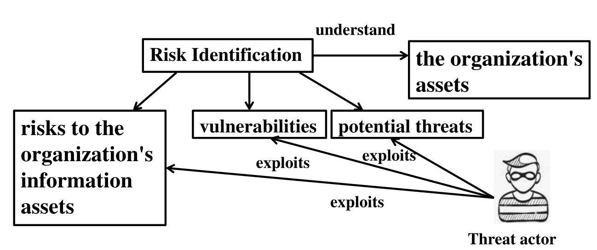
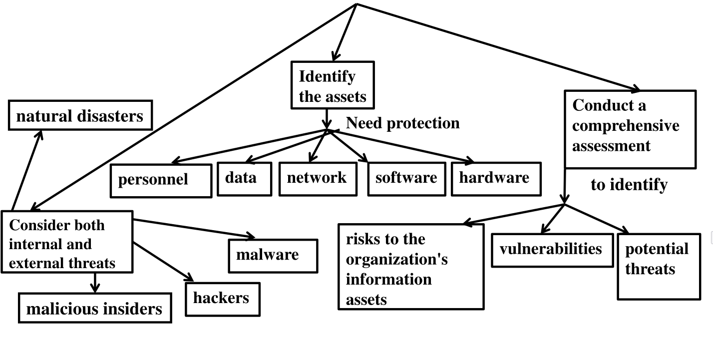

# Introduction to Cybersecurity Lecture 7

## Principles of Risk Management in Cyber Security

The principles of risk management in cyber security enable organizations to establish robust risk management practices that help protect their information assets, maintain business continuity, and minimize the impact of security incidents.

**Principles of Risk Management Enable Organizations to:**

- Establish robust risk management practices
- Help protect information assets
- Minimize the impact of security incidents
- Maintain business continuity

## Effective Risk Management is Essential for:

- Safeguarding against cyber security threats
- Ensuring the resilience of the organization's information infrastructure
- Protecting sensitive data and minimizing risks to business operations

## Key Components of Risk Management in Cyber Security:

1. **Risk Identification**: The process of identifying potential risks to an organization's information assets.
2. **Risk Assessment**: The evaluation of identified risks to determine their likelihood and impact.
3. **Risk Mitigation**: The implementation of measures to reduce or eliminate identified risks.
4. **Risk Monitoring and Review**: Ongoing monitoring and review of risk management practices to ensure they remain effective.
5. **Risk Communication and Reporting**: The sharing of risk information with stakeholders, including executives, employees, and regulatory bodies.
6. **Compliance and Regulatory Requirements**: Ensuring that risk management practices comply with relevant laws, regulations, and industry standards.
7. **Integration with Business Objectives**: Aligning risk management practices with the organization's overall business objectives and strategy.

## Principles of risk management in cybersecurity (Part I)

### 1. Risk Identification

Risk identification involves identifying potential threats, vulnerabilities, and risks to an organization's information assets.

#### Identifying Risks:

1. **Threats**: Identified potential security breaches or attacks.
2. **Vulnerabilities**: Weaknesses in systems, networks, or applications that could be exploited by attackers.
3. **Risks**: The likelihood and impact of a threat or vulnerability being exploited.

#### Examples of Risk Identification:

1. Analyzing past security incidents to identify patterns and causes.
2. Conducting vulnerability assessments to identify weaknesses in systems and networks.
3. Monitoring threat intelligence feeds to stay informed about emerging threats and trends.

#### Benefits of Effective Risk Identification:

- Helps organizations anticipate and prepare for potential security threats.
- Enables the identification of high-risk areas that require immediate attention.
- Supports the development of effective risk mitigation strategies.
- Enhances overall information asset resilience and security.

### 2. Risk Assessment

#### Likelihood and Impact

- **Likelihood**: The probability that a given event will occur, expressed using qualitative terms (Extreme, High, Medium, Low or Negligible), as a percent probability, or as a frequency.
- **Impact**: The potential consequences or severity of a risk event.

#### The Risk Position Matrix

- A tool used to assess and classify risks based on their potential impact and likelihood.
- Assigning values to likelihood and impact helps prioritize mitigation efforts.

#### Guidelines for Accurate Risk Assessment

- Identifying unique threats to your organization
- Assessing the likelihood and impact of each threat
- Understanding the need for clear risk awareness in decision-making
- Recognizing the importance of combining likelihood and impact to produce a residual risk rating

#### Simple Risk Equation

Risk score = (Threat $\times$ Vulnerabilities) $\times$ Impact

- Calculates the overall risk by multiplying the threat, vulnerabilities, and impact.

#### Risk Score Calculation

Risk Score = Likelihood $\times$ Impact

- Combines likelihood and impact to produce a residual risk rating of Low, Medium or High.

#### Benefits of Risk Assessments

- Provides insight into key factors for decision-making
- Helps IT departments understand their role in reducing risks
- Enables sharing of risk assessment results with IT teams
- Facilitates collaboration between leadership and IT to address security concerns
