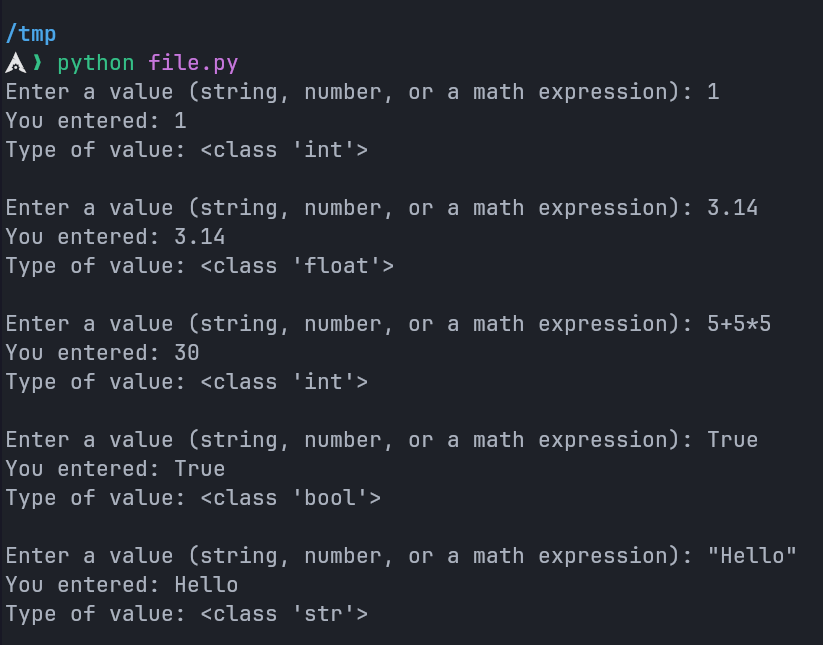
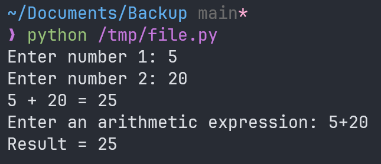
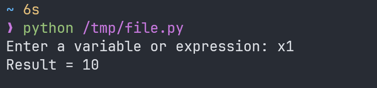

---
prev:
  text: "Lecture Three"
  link: "/College/yearOne/firstTerm/Python/Lectures/LectureThree"
next:
  text: "Lecture Five"
  link: "/College/yearOne/firstTerm/Python/Lectures/LectureFive"
title: Lecture 4
---

# Programming Essentials in Python Lecture 4

## The `eval()` Function in Python

The `eval()` function evaluates a string as if it were Python code, making it extremely versatile. Below is a summary of its usage with examples.

### Basic Usage

The `eval()` function processes a string input and evaluates it in the current context:

```Python
# Example: Evaluating basic inputs
value = eval(input("Enter a value (string, number, or a math expression): "))
print("You entered:", value)
print("Type of value:", type(value))
```

#### Evaluating Various Input Types



---

### Arithmetic Expression Evaluation

The `eval()` function can evaluate arithmetic expressions input by the user:

```python
# Example: Handling arithmetic expressions
num1 = eval(input("Enter number 1: "))  # 5
num2 = eval(input("Enter number 2: "))  # 20
print(num1, "+", num2, "=", num1 + num2) # 5 + 20 = 25

# Example: Direct expression evaluation
result = eval(input("Enter an arithmetic expression: "))  # 5 + 20
print("Result =", result) # Result = 20
```

**Output:**



---

### Handling Variables Dynamically

The `eval()` function resolves variable names if they exist in the current context. If not, it raises a `NameError`.

```python
x1 = 10  # Define a variable
user_input = eval(input("Enter a variable or expression: "))  # x1
print("Result =", user_input) # 10
```

**Output Example:**



## Bugs in Python Programs

In Python, errors can generally be categorized into three types: **syntax errors**, **runtime errors**, and **logic errors**. Understanding and identifying these errors is crucial for debugging and writing reliable code.

---

### Syntax Errors

A **syntax error** occurs when Python's interpreter cannot translate a statement into machine code due to **incorrect syntax**. These errors are detected during the parsing phase, **before execution begins**.

#### Examples of Syntax Errors

```python
# SyntaxError: cannot assign to expression here. Maybe you meant '==' instead of '='?
if x = 5:
  print("Incorrect syntax!")  # Correct: Use '==' for comparison, not '=' for assignment.

# SyntaxError: unexpected indent
    dividend = eval(input('Enter numbers to divide: '))  # Unexpected indent.

# SyntaxError: invalid character (U+2018)
dividend = eval(input(‘Enter numbers to divide: ’))  # Incorrect quotes (smart quotes).

# Correct syntax:
dividend = eval(input('Enter numbers to divide:'))  # Correct usage of quotes and indentation.
```

---

### Runtime Errors

A **runtime error** (or exception) occurs while the program is executing. These errors are context-dependent and only **arise during the program's runtime**.

#### Examples of Runtime Errors

```python
# NameError: Using a variable that hasn't been defined
x = N + 2  # Variable 'N' is not defined.
# Output:
# NameError: name 'N' is not defined

# ZeroDivisionError: Division by zero
num1 = eval(input('Enter first number to divide: '))  # Example input: 40
num2 = eval(input('Enter second number to divide: '))  # Example input: 0
print(num1, '/', num2, "=", num1 / num2)
# Output:
# ZeroDivisionError: division by zero
```

#### Preventing Runtime Errors

```python
# Safeguard against division by zero
num1 = eval(input('Enter first number to divide: '))
num2 = eval(input('Enter second number to divide: '))
if num2 != 0:
  print(num1, '/', num2, "=", num1 / num2)
else:
  print("Error: Division by zero is not allowed.")
```

---

### Logic Errors

A **logic error** occurs when the program **runs without crashing** but produces **incorrect results**. These errors stem from flaws in the algorithm or code logic.

#### Example of a Logic Error

```python
# Incorrect logic
num1 = 40
num2 = 5
result = num2 / num1  # Logic error: Should be dividend / divisor.
print("Result:", result)  # Produces incorrect output.
```

#### Corrected Code

```python
num1 = 40
num2 = 5
result = num1 / num2  # Correct logic.
print("Result:", result)  # Output: 8.0
```

---

### Control Structures (`if` Statements)

Boolean expressions enable programs to adapt based on conditions. The `if` statement executes specific blocks of code when conditions evaluate to `True`.

#### Basic `if` Statement

```python
age = 15
if age <= 18:
  print("You are still a boy.")

age = 20
if age >= 18:
  print("You are in the youth stage.")
```

#### `if-else` Example

```python
n = 14
if 0 <= n <= 20:
  print(n, "is accepted.")
else:
  print(n, "is not accepted!")
```

#### Using `and` and `or` in Conditions

```python
x = 2
if x == 1 or x == 2 or x == 3:
  print(x, "is available.")
else:
  print(x, "is not available!")

a, b, c = 200, 33, 500
if a > b and c > a:
  print("Both conditions are True")

a, b = 33, 200
if not a > b:
  print("a is NOT greater than b")
```

#### Nested `if` Statements

```python
x = 41
if x <= 20:
  print("x is less than or equal to 20!")
  if x >= 5:
    print("x is between 5 and 20!")
else:
  print("x is greater than 40!")
```

---

### Summary

1. **Syntax Errors**: Issues with code structure or syntax; identified before program execution.
2. **Runtime Errors**: Errors occurring during execution, such as division by zero or using undefined variables.
3. **Logic Errors**: Flaws in the code logic that lead to incorrect results despite successful execution.

Understanding these errors and how to handle them is essential for writing robust Python programs.
