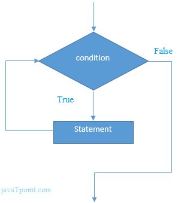
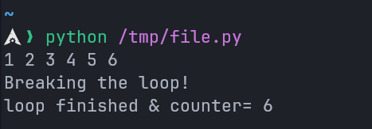
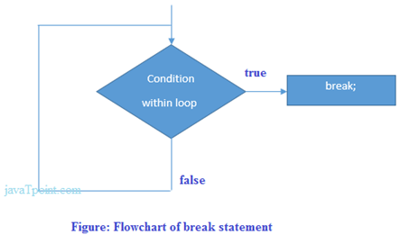
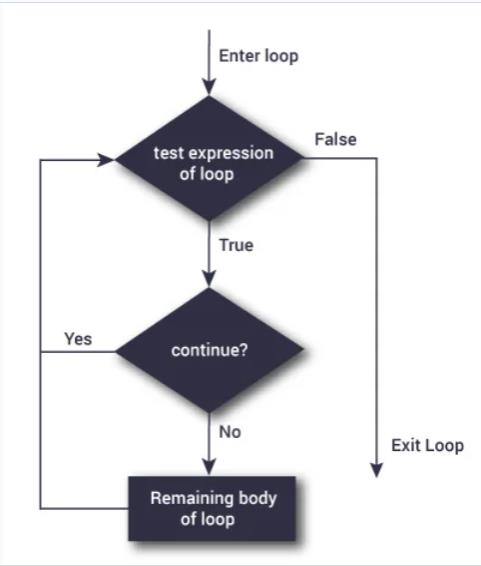
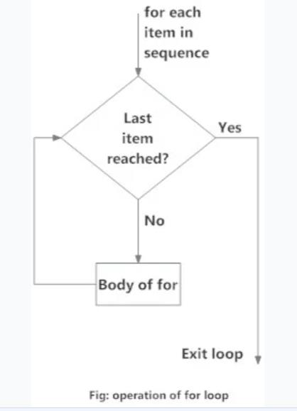

---
prev:
  text: "Section Four"
  link: "/College/Python/Sections/SectionFour"
next:
  text: "Section Six"
  link: "/College/Python/Sections/SectionSix"
title: Section 5
---

# Programming Essentials in Python Section 5

## Loops in Python

Loops allow the execution of a block of code repeatedly as long as a specified condition is met. They save time, reduce errors, and make code more readable. Python supports three types of loops:

1. **`while` loop**
2. **`do while` loop** (not directly available but can be emulated using a `while` loop)
3. **`for` loop**

## `while` Loop

A `while` loop is used to repeatedly execute a block of code as long as the condition evaluates to `True`.
It is recommended for use when the number of iterations is **not fixed**.

### Syntax:

```python
while condition:
  # Block of statements
  print("This will execute as long as the condition is True")
```

### Example:

```python
x = 1
while x <= 10:
  print(x)  # Prints numbers from 1 to 10
  x += 1
```

### flowchart representation:



## Common Pitfall: Infinite Loops

An infinite loop occurs if the condition in a `while` loop always evaluates to `True`.
**Example:**

```python
a = 1
while a == 1:  # This condition is always True
  b = input("What’s your name? ")
  print(f"Hi {b}, welcome to the infinite loop!")
# To terminate, use keyboard interrupt (Ctrl+C).
```

## `break` Statement

The `break` statement is used to exit a loop prematurely, irrespective of the loop's condition.

### Example:

```python
counter = 0
while True:
  counter += 1
  print(counter, end=' ')
  if counter >= 6:
    print("\nBreaking the loop!")
    break  # Exits the loop
print(f"Loop finished & counter = {counter}")
```

**Output:**



### flowchart representation:



## `continue` Statement

The `continue` statement skips the rest of the code in the current iteration and moves to the next iteration of the loop.

### Example:

```python
counter = 0
while True:
  counter += 1
  if counter % 2 == 0:
    continue  # Skips the even numbers
  print(f"Odd: {counter}")
  if counter >= 5:
    print("Breaking the loop!")
    break  # Exits the loop
```

### flowchart representation:



## `range()` Function

The `range()` function generates a sequence of numbers, often used in loops.
**Syntax:** `range(start, stop, step)`

| Parameter | Description                                              | Default |
| --------- | -------------------------------------------------------- | :-----: |
| `start`   | Optional. Start position of the sequence.                | 0       |
| `stop`    | Required. Stop position (exclusive).                     | None    |
| `step`    | Optional. Increment between each number in the sequence. | 1       |

### Example:

```python
# Generate numbers from 3 to 19, incrementing by 2
for i in range(3, 20, 2):
  print(i, end=" ")  # Output: 3 5 7 9 11 13 15 17 19
```

## `for` Loop

The `for` loop is used to iterate over sequences (like lists, tuples, or strings) or other iterable objects. This process is called **traversal**.

### Syntax:

```python
for variable in sequence:
  # Block of statements
  print(variable)
```

### Example:

```python
for i in range(1, 6):
  print(i, end=' ')  # Output: 1 2 3 4 5
```

### flowchart representation:



## Tasks and Challenges:

### Task 1: Custom Range

Generate a sequence of numbers starting from `3` to `19`, incrementing by `2`:

```python
for i in range(3, 20, 2):
  print(i, end=" ")  # Output: 3 5 7 9 11 13 15 17 19
```
