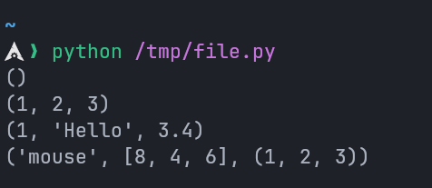
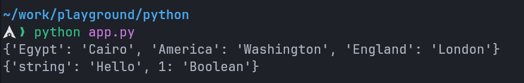
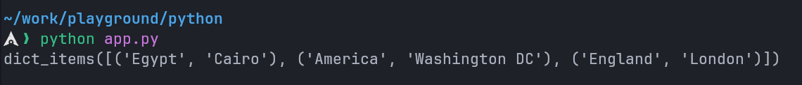
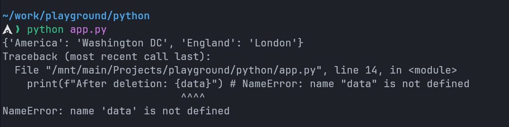

---
prev:
  text: "Section Four"
  link: "/College/Python/Sections/SectionFour"
next: false
---

# Programming Essentials in Python Section 5

## Tuples vs Lists

- **Tuples** and **Lists** are both data structures in Python that store collections of items.
- **Key Differences:**
  1. Tuples are immutable, meaning their elements cannot be changed once assigned. Lists are mutable and can be modified.
  2. Tuples are generally used for different data types, while lists are used for similar data types.
  3. Iterating through a tuple is faster than a list because of its immutability.

## Tuples

- **Definition:** A tuple is an ordered, immutable collection of items.
- **Usage:** Tuples are often used when you want to ensure the data remains unchanged.

```python
# Empty tuple
my_tuple = ()
print(my_tuple)

# Tuple having integers
my_tuple = (1, 2, 3)
print(my_tuple)

# tuple with mixed datatypes
my_tuple = (1, "Hello", 3.4)
print(my_tuple)

# nested tuple
my_tuple = ("mouse", [8, 4, 6], (1, 2, 3))
print(my_tuple)
```

**Output:**



### Creating Tuples with One Element

- Creating a tuple with one element is a bit tricky. Having one element within parentheses is not enough.
- We will need a trailing comma to indicate that it is a tuple

```python
# Without a comma, it's not a tuple
var1 = (1)
print(type(var1))  # Output: <class 'int'>

# With a comma, it becomes a tuple
var2 = (1,)
print(type(var2))  # Output: <class 'tuple'>

# Parentheses are optional for multiple elements
var3 = 1, 2, 3 # Same as (1, 2, 3)
print(type(var3))  # Output: <class 'tuple'>

# Single element tuple without parentheses
var4 = 1,
print(type(var4))  # Output: <class 'tuple'>
```

### Accessing Tuple Elements

- Tuple elements can be accessed using their index.

```python
languages = ('Python', 'Swift', 'C++')

# Access the first item
print(languages[0])  # Output: Python

# Access the third item
print(languages[2])  # Output: C++
```

### Slicing Tuples

```python
my_tuple = ('p', 'r', 'o', 'g', 'r', 'a', 'm', 'i', 'z')

# Elements from 2nd to 4th index
print(my_tuple[1:4])  # Output: ('r', 'o', 'g')

# Elements from beginning to 3rd
print(my_tuple[:-6])  # Output: ('p', 'r', 'o')

# Elements from 8th to end
print(my_tuple[7:])  # Output: ('i', 'z')

# All elements
print(my_tuple[:])  # Output: ('p', 'r', 'o', 'g', 'r', 'a', 'm', 'i', 'z')
```

### Tuple Methods

Tuples support only two methods:

- `count()`: Counts the occurrences of an element in the tuple.
- `index()`: Returns the index of the first occurrence of an element.

```python
my_tuple = ('a', 'p', 'p', 'l', 'e')

print(my_tuple.count('p'))  # Output: 2
print(my_tuple.index('l'))  # Output: 3
```

### Iterating Through a Tuple

```python
languages = ('Python', 'Swift', 'C++')

# Iterating through the tuple
for language in languages:
  print(language)
```

### Check if an Item Exists in Tuple

```python
languages = ('Python', 'Swift', 'C++')

print('C' in languages)       # Output: False
print('Python' in languages)  # Output: True
```

## Dictionaries

- **Definition:** A dictionary is an ordered collection of key-value pairs (starting from Python 3.7).
- **Usage:** Useful for storing data with unique keys.

### Creating a Dictionary

```python
# Example 1
countries = {
  "Egypt": "Cairo",
  "America": "Washington",
  "England": "London"
}
print(countries)

# Example 2 (Keys and values of different data types)
data = {
  "string": "Hello",
  1: "Integer",
  True: "Boolean"  # 1 and True will overwrite each other because they're the same
}
print(data)
```

**Output:**



### Adding Elements to a Dictionary

```python
data = {
  "Egypt": "Cairo",
  "America": "Washington DC",
  "England": "London"
}

# Add new entry
data["Japan"] = "Tokyo"
print(data)
```

### Modifying Values

```python
data = {
  "name": "Othman",
  "age": 18
}

# Modify value
data["age"] = 19
print(data)
```

### Accessing Dictionary Elements

```python
data = {
  "name": "Othman",
  "age": 19
}

# Access value using key
print(data["name"])  # Output: Othman
```

### Dictionary Methods

#### `get()` Method

- Retrieves the value of a key. Returns `None` if the key does not exist.

```python
data = {
  "Egypt": "Cairo",
  "America": "Washington DC",
  "England": "London"
}

print(data.get("Egypt"))   # Output: Cairo
print(data.get("Brazil"))  # Output: `None` (known as `null` in other languages)
```

#### `keys()` and `values()` Methods

- `keys()`: Returns all keys.
- `values()`: Returns all values.

```python
data = {
  "Egypt": "Cairo",
  "America": "Washington DC",
  "England": "London"
}

print(data.keys())   # Output: dict_keys(['Egypt', 'America', 'England'])
print(data.values()) # Output: dict_values(['Cairo', 'Washington DC', 'London'])
```

#### `items()` Method

- Returns each key-value pair as tuples in a list.

```python
data = {
  "Egypt": "Cairo",
  "America": "Washington DC",
  "England": "London"
}

print(data.items())
```

**Output:**


### Removing Items from a Dictionary

#### Using `del`

- Deletes a specific key or the entire dictionary.

```python
data = {
  "Egypt": "Cairo",
  "America": "Washington DC",
  "England": "London"
}

# Remove an entry
del data["Egypt"]
print(data)  # Output: {'America': 'Washington DC', 'England': 'London'}

# Delete the dictionary
del data

print(f"After deletion: {data}") # NameError: name "data" is not defined
```

> [!CAUTION]
> The `del` statement deletes the whole variable not only the dictionary. <br/>
> Any attempt to access it later would raise a `NameError`.



#### Using `pop()`

- Removes the specified key and returns its value. Raise `KeyError` if the key is not found.

```python
data = {
  "Egypt": "Cairo",
  "America": "Washington DC",
  "England": "London"
}

value = data.pop("America") # Would raise a `KeyError` if key not found.
print(value)  # Output: Washington DC
print(data)   # Output: {'Egypt': 'Cairo', 'England': 'London'}

```

#### Using `popitem()`

- Removes the last inserted key-value pair. If the dictionary is empty it would raise a `KeyError`

```python
data = {
  "Egypt": "Cairo",
  "America": "Washington DC",
  "England": "London"
}

item = data.popitem() # Would raise a `KeyError` if dictionary is empty.
print(item)  # Output: ('England', 'London')
print(data)  # Output: {'Egypt': 'Cairo', 'America': 'Washington DC'}
```

### Check if a Key Exists in Dictionary

- We can test if a key is in a dictionary or not using the keyword `in`.

```python
data = {
  "Egypt": "Cairo",
  "America": "Washington DC",
  "England": "London"
}

print("Brazil" in data) # False
print("Egypt" in data) # True
print("Japan" not in data) # True
```

> [!NOTE]
> The membership test is **only** for **the keys** and not for the values.

### Iterating Through a Dictionary

```python
squares = {
  "1": 1,
  "3": 9,
  "5": 25,
  "7": 49,
  "9": 81
}

print("Keys & Values:")
# Iterate over keys and values
for key, value in squares.items():
  print(f"{key}: {value}")

print("\nKeys Only:")
# Iterate over keys
for key in squares:
  print(key)
```

### Other Dictionary Methods

| Method         | Description                                                  |
| -------------- | ------------------------------------------------------------ |
| `clear()`      | Removes all elements from the dictionary                     |
| `copy()`       | Returns a shallow copy of the dictionary                     |
| `fromkeys()`   | Creates a dictionary from the given keys and value           |
| `get()`        | Retrieves the value of a key                                 |
| `items()`      | Returns a view object with key-value pairs                   |
| `keys()`       | Returns a view object with dictionary keys                   |
| `pop()`        | Removes the specified key and returns its value              |
| `popitem()`    | Removes the last inserted key-value pair                     |
| `setdefault()` | Inserts a key with a default value if the key does not exist |
| `update()`     | Updates the dictionary with the specified key-value pairs    |
| `values()`     | Returns a view object with dictionary values                 |
