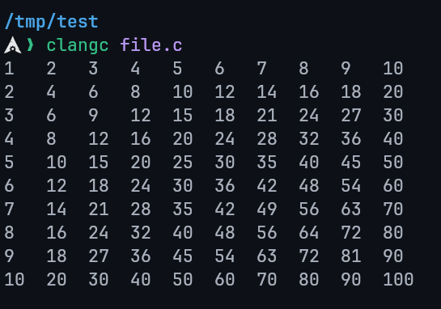

# Programming Essentials in C - Lecture 5

## Introduction

- Loops are programming constructs that repeat a block of code either a specific number of times or while a certain condition is true.
- They improve efficiency, reduce code duplication, and enhance readability.
- C provides three loop constructs: `while`, `do–while`, and `for`.

## `while` Loop

- Executes a block of code **as long as** the specified condition is true.
- The condition is checked **before** the loop body is executed.
- Known as an **entry-verified loop**.

### Example

```c
char letter = 'A';

// Print the uppercase alphabet from A to Z
while (letter <= 'Z') {
  printf("%c ", letter);
  letter++;
}
```

## `do-while` Loop

- Executes the block of code **once**, then checks the condition.
- Repeats the loop as long as the condition is true.

### Example

```c
int i = 6;

// This loop runs once even though the condition is false
do {
  printf("i = %d\n", i);
  i++;
} while (i < 5);

printf("End of the loop\n");
```

## Difference Between `while` and `do-while`

| Feature             | `while` Loop                                            | `do-while` Loop                      |
| ------------------- | ------------------------------------------------------- | ------------------------------------ |
| Condition Check     | **Before** execution of the loop body                   | **After** execution of the loop body |
| Execution Guarantee | May **not execute** if the condition is false initially | Always executes **at least once**    |

## `for` Loop

- Ideal when the number of iterations is known in advance.
- Combines initialization, condition check, and update in a single line.

### `for` Loop Components

- **Initialization**: Runs once before the loop starts.
- **Condition**: Determines if the loop continues.
- **Update**: Executes after each loop iteration.

**Syntax:**

```c
for (Initialization; Condition; Update) {
  // Loop body
}
```

### Example 1: Basic for Loop

```c
for (int i = 0; i < 5; i++) {
  printf("i = %d\n", i);
}
```

### Example 2: Initialization Before Loop

```c
int i = 0;

for (; i < 5; i++) {
  printf("i = %d\n", i);
}
```

### Example 3: Multiple Counters

- Multiple variables can be initialized and updated in a `for` loop.
- Only one condition is allowed to control the loop.

```c
for (int i = 0, j = 10; i <= 5; i++, j--) {
  printf("i = %d, j = %d\n", i, j);
}

/*
Output:
  i = 0, j = 10
  i = 1, j = 9
  i = 2, j = 8
  i = 3, j = 7
  i = 4, j = 6
  i = 5, j = 5
*/
```

### Example 4: Factorial Calculation

```c
int x = 5, factorial = 1;

for (int i = 1; i <= x; i++) {
  factorial *= i;
}

printf("%d! = %d\n", x, factorial);  // Output: 5! = 120
```

## Nested Loops

- A loop placed inside another loop is called a nested loop.
- Outer loop controls the number of complete iterations of the inner loop.
- Any type of loop (`while`, `do-while`, or `for`) can be nested within each other.

### Example: Multiplication Table

```c
// Print a 10x10 multiplication table
for (int i = 1; i <= 10; i++) {
  for (int j = 1; j <= 10; j++) {
    // %-4d => adds right padding the output to be always 4 characters long
    printf("%-4d", i * j);
  }

  printf("\n");
}
```

**Output:**



### Example: Infinite Loop

```c
while (1) {
  printf("hello\n");  // Runs indefinitely
}
```

- Infinite loops run endlessly unless interrupted manually or by a `break` statement.

## Break and Continue

### `break` Statement

- Immediately exits the loop when encountered.

#### Example

```c
int i = 0, limit = 10;

while (1) {
  if (i == limit) break;  // Exit loop when i reaches limit

  printf("%d\n", i);
  i++;
}

printf("i reached the limit\n");
```

### `continue` Statement

- Skips the current iteration and proceeds to the next one.

#### Example

```c
for (int i = 1; i <= 10; i++) {
  if (i % 2 != 0) continue;  // Skip odd numbers

  printf("%d\n", i);  // Print only even numbers
}
```
