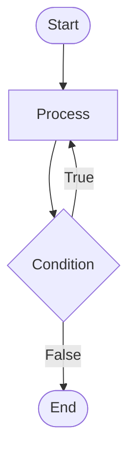

# Programming Essentials in C - Lecture 1

## What is Problem-Solving?

- Problem-solving is the process of identifying a problem, analyzing its causes, and finding effective solutions to
  address it.
- This skill is essential in various fields, from technology and business to everyday life situations.

## Key Steps in Problem-Solving

1. **Identify the Problem**: Clearly define the issue to understand its scope and impact.

2. **Analyze the Problem**: Break down the problem to identify root causes and contributing factors.

3. **Generate Possible Solutions**: Brainstorm multiple approaches to address the issue.

4. **Evaluate and Select Solutions**: Compare potential solutions based on feasibility, effectiveness, and resources.

5. **Implement the Solution**: Put the chosen solution into action with a clear plan.

6. **Evaluate the Outcome**: Assess the effectiveness of the solution and make adjustments if necessary.

## Problem-Solving Techniques

### 1. Root Cause Analysis (RCA)

A systematic approach to identify the fundamental cause of a problem.
**Steps**:

- Define the problem.
- Collect data and evidence.
- Analyze the data to identify the cause.
- Implement solutions to prevent recurrence.

**Example**:

- **Problem**: A website is loading slowly.
- **Root Cause**: Unoptimized database queries.
- **Solution**: Optimize database indexes and queries.

---

### 2. Brainstorming

A collaborative method to generate creative ideas.

**Steps**:

- Clearly define the problem.
- Allow free-flowing idea generation.
- Avoid criticism during the idea phase.
- Select the best ideas.

**Example**:

- **Problem**: Designing a new UI feature for better user engagement.
- **Solutions**:
  - Introduce interactive elements.
  - Implement dark mode.
  - Use personalized content recommendations.

---

#### 3. The 5 Whys Technique

A method to uncover root causes by repeatedly asking "why."

**Steps**:

- Ask "why" iteratively until the root cause is identified (typically 5 times).

**Example**:

- **Problem**: A server crashes frequently.

  1. Why? CPU usage spiked.
  2. Why? A process consumed too much power.
  3. Why? Infinite loop in the code.
  4. Why? Incorrect exit condition.
  5. Why? Inadequate code review.

- **Root Cause**: Lack of thorough code review.

---

#### 4. SWOT Analysis

A strategic tool to evaluate **Strengths**, **Weaknesses**, **Opportunities**, and **Threats**.

**Steps**:

- Identify internal strengths and weaknesses.
- Evaluate external opportunities and threats.

**Example**:

- **Problem**: Choosing a cloud provider for a scalable web app.
- **SWOT Table**:

| **Strengths**    | **Weaknesses**         | **Opportunities** | **Threats**    |
| ---------------- | ---------------------- | ----------------- | -------------- |
| High reliability | Higher cost            | Growing demand    | Security risks |
| Global reach     | Steeper learning curve | New services      | Vendor lock-in |

---

#### 5. Trial and Error

Testing solutions iteratively until success is achieved.
**Steps**:

- Try a solution.
- Evaluate effectiveness.
- Modify or choose a new solution if needed.
- Repeat until resolved.

**Example**:

- **Problem**: A machine learning model produces inaccurate predictions.

- **Steps**:
  1. Adjust learning rate (failed).
  2. Add more training data (partial improvement).
  3. Fine-tune hyperparameters (success).

### Summary

| Technique                     | Purpose                      | Example Use Case               |
| ----------------------------- | ---------------------------- | ------------------------------ |
| **Root Cause Analysis (RCA)** | Identify fundamental causes  | Debugging software issues      |
| **Brainstorming**             | Generate creative solutions  | Designing new app features     |
| **5 Whys Technique**          | Uncover deep causes          | Fixing performance bottlenecks |
| **SWOT Analysis**             | Evaluate strategic decisions | Choosing a cloud provider      |
| **Trial and Error**           | Experiment until success     | Tuning machine learning models |

## Flowcharts

Flowcharts visually represent processes using symbols and arrows.

#### Common Symbols in Flowcharts:

##### 1. Oval

- **Function**: Indicate the `START` or `END` of the program.

---

##### 2. Parallelogram

- **Function**: Input and output operations like `INPUT`, `READ`, and `PRINT`.

---

##### 3. Rectangle

- **Function**: Processing steps, such as storing values or performing arithmetic calculations.

---

##### 4. Diamond

- **Function**: Indicates decision-making (e.g., condition checks).

---

##### 5. Circle

- **Function**: On-page connectors, circles help join different parts of a flowchart on the same page.

---

##### 6. Flow Lines

- **Function**: Arrows Indicating process flow.

---

### Flowchart Structures

1. **Sequence:** Executes steps in order.

---

2. **Decision:** Uses conditions to determine next steps.

---

3. **Loop:** Repeats steps until a condition is met.

### Decision Binary Structure

> [!Note]
> Two acceptable representations for decision structures: **Condition as a Statement** or **Condition as a Question**.

#### 1. Condition as a Statement

- **Outcomes**: `True` or `False`.
- **Example**:

---

#### 2. Condition as a Question

- **Outcomes**: `Yes` or `No`.
- **Example**:

---

### Repetition Structure

Requires a **termination condition** to stop the loop.

#### Termination Condition Testing:

1. **Pre-test Loop (while loop)**:

   - Condition checked **before** loop execution.

---

2. **Post-test Loop (do-while loop)**:
   - Condition checked **after** loop execution.

---

### Flowchart Examples

#### 1. Average of Three Numbers

---

#### 2. Sum of First 100 Positive Integers

---

#### 3. Largest Among a, b, c

## Fundamentals of Programming

### Algorithms

An algorithm is a finite set of steps to solve a problem. It must be:

- **Finite** (Terminates after a certain number of steps)
- **Definite** (Clear and unambiguous)
- **Accept input** and **produce output**
- **Effective** (Executable in a reasonable time)

### Example Algorithms

#### 1. Find the Maximum of Two Numbers

**Steps**:

1. Start
2. Input two numbers, `A` and `B`
3. If `A > B`, display `A` as the largest
4. Else, display `B` as the largest
5. End

---

#### 2. Find the Largest of Three Numbers

**Problem**: Identify the largest among three numbers.
**Steps**:

1. Start
2. Input `A`, `B`, `C`
3. If `A > B` and `A > C`, print `A`
4. Else if `B > C`, print `B`
5. Otherwise, print `C`
6. End

---

#### 3. Sum of First N Natural Numbers

**Problem**: Calculate the sum of numbers from 1 to N.
**Steps**:

1. Start
2. Input `N`
3. Initialize `sum = 0`
4. For `i = 1` to `N`:
   1. `sum = sum + i`
5. Print `sum`
6. End

---

### Algorithms vs. Flowcharts

|                       **Algorithm**                        |                              **Flowchart**                              |
| :--------------------------------------------------------: | :---------------------------------------------------------------------: |
| Step-by-step logical procedure using English descriptions. |          Diagrammatic representation using symbols and arrows.          |
|                Suitable for small problems.                |               Effective for visualizing complex programs.               |
|            Less effective for complex programs.            |               More suitable for detailed, complex logic.                |
|  Example: Conditional checks (e.g., "if A > B, print A").  | Example: Decision diamonds (`True`/`False` branches) and process boxes. |

---

### Algorithm vs. Flowchart vs. Program

| Concept       |                        Description                        |
| ------------- | :-------------------------------------------------------: |
| **Algorithm** |       Step-by-step instructions to solve a problem.       |
| **Flowchart** |         Graphical representation of an algorithm.         |
| **Program**   | Implementation of an algorithm in a programming language. |

## Textbooks & Readings

- _Computer Programming in C for Beginners_ – A. C. Rao (2019)
- _Beej's Guide to C Programming_ – Beej Jorgensen Hall (2022)
