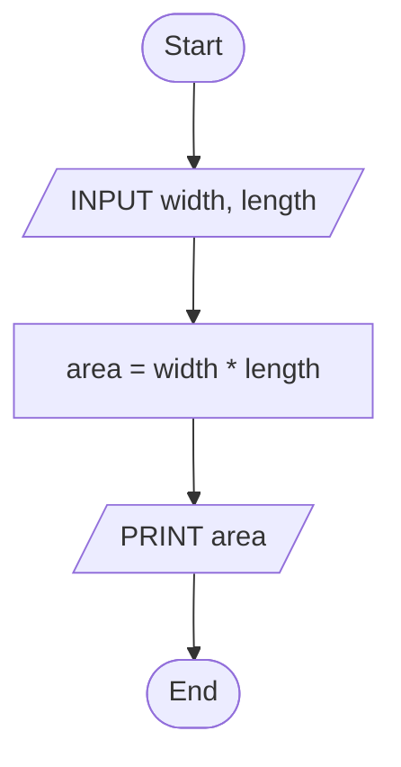
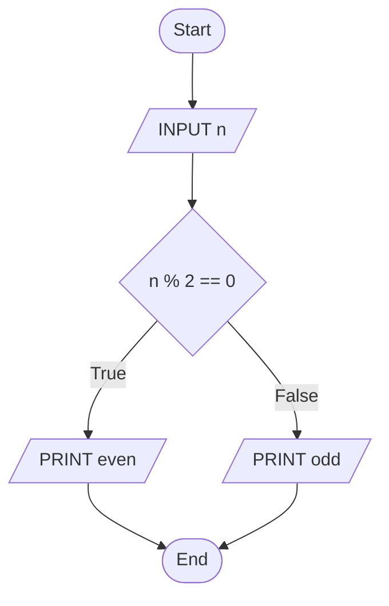
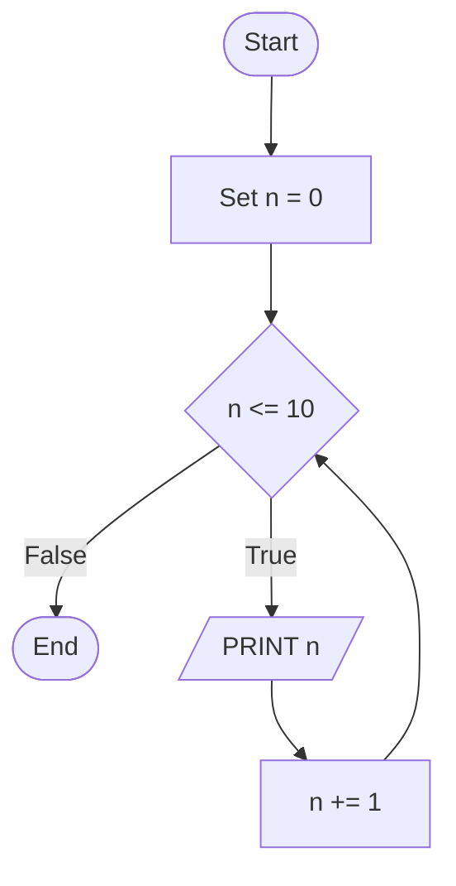
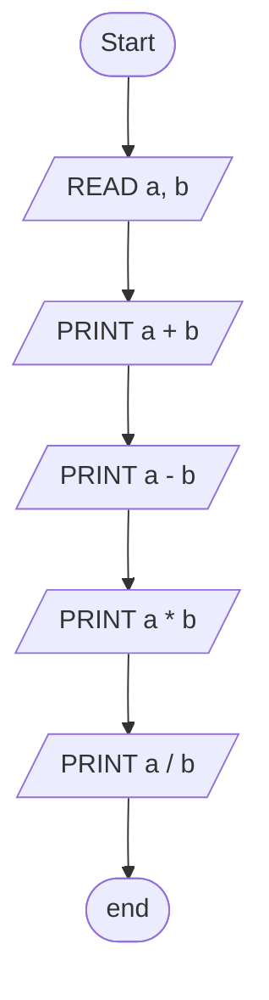
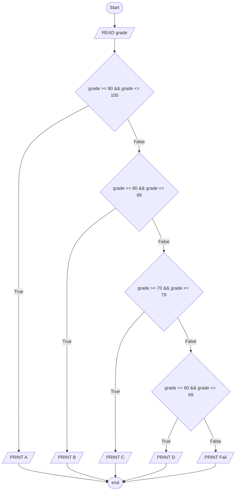

# Programming Essentials in C - Task One

## Question 1

Draw a flowchart to calculate the area of a rectangle given its length and width. The user should input the values, and the program should display the result.

### Answer:



## Question 2

Create a flowchart that checks whether a number entered by the user is even or odd and displays the result accordingly

### Answer



## Question 3

Design a flowchart that prints the numbers from 1 to 10 using a loop.

### Answer



## Question 4

Draw a flowchart to take two numbers as input, perform addition, subtraction, multiplication, and division, and display the results

### Answer



## Question 5

Create a flowchart for a grading system where a student enters their marks, and the system assigns grades based on the following criteria:

- 90-100: A
- 80-89: B
- 70-79: C
- 60-69: D
- Below 60: Fail

### Answer



## Question 6

Write an algorithm to check if a number is even or odd.

### Answer

```
Input: Read an integer n
Process: Compute n % 2.
  If n % 2 == 0, then Print "n is even".
  Else, Print "n is odd".
Output: Print whether `n` is even or odd.
```

## Question 6

Solve all the above questions in C

### Answer

```C
#include <stdio.h>

void q1() {
  int width, length;
  scanf("%i %i", &width, &length);

  double area = width * length;

  printf("area = %d * %d = %.2f\n", width, length, area);
}

void q2() { // solution for Questions 2 and 6
  int n;
  scanf("%i", &n);

  printf(n % 2 == 0 ? "Even\n" : "Odd\n");
}

void q3() {
  for (int i = 1; i <= 10; i++)
    printf("%i\n", i);
}

void q4() {
  int a, b;

  scanf("%i %i", &a, &b);

  printf("a + b = %i\na - b = %i\na * b = %i\na / b = %.2f\n",
    a + b,
    a - b,
    a * b,
    a / (b * 1.0)
  );
}

void q5() {
  float grade;
  scanf("%f", &grade);

  if (grade <= 100 && grade >= 90) printf("A\n");
  else if (grade <= 80 && grade >= 89) printf("B\n");
  else if (grade <= 70 && grade >= 79) printf("C\n");
  else if (grade <= 60 && grade >= 69) printf("D\n");
  else printf("Fail\n");
}

int main() {
  // q1();
  // q2();
  // q3();
  // q4();
  // q5();
  return 0;
}
```
