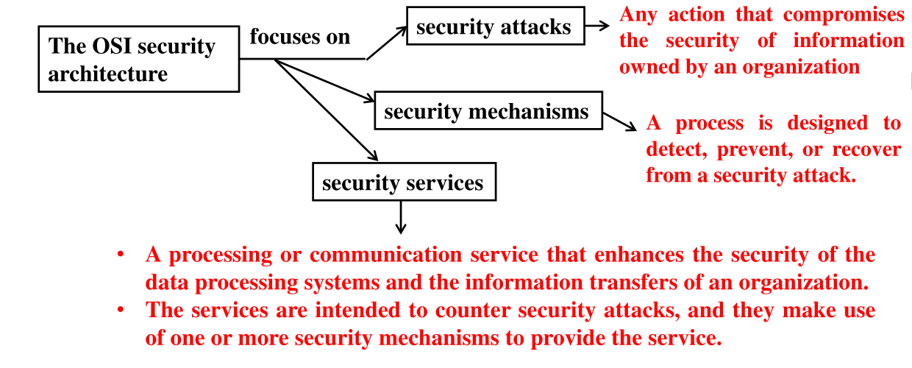

# Cybersecurity Essentials Lecture Two

## What is Security of Data Model?

The OSI security architecture provides a structured approach to implementing and managing security. Developed as an international standard, it helps vendors align their security features to meet defined services and mechanisms.

### Threat, Vulnerability, Attack

- **Threat:** Any event or circumstance with the potential to negatively impact organizations or individuals through unauthorized access, disclosure, modification, destruction, or denial of service.
- **Vulnerability:** A system weakness that can be exploited to cause harm.
- **Attack (Incident):** Occurs when a threat exploits a vulnerability.
- **Countermeasure (Control):** Actions that reduce threats or vulnerabilities, aiming to prevent, deflect, or respond to attacks.

### Security Attacks

- **Passive Attacks:** Attempt to gain information without affecting system resources.
- **Active Attacks:** Aim to alter system resources or disrupt operations.

### Security Services

Security services support requirements such as:

- Confidentiality
- Integrity
- Availability
- Authenticity
- Access Control
- Non-repudiation

They are implemented via specific security mechanisms.

### Security Mechanisms

- **Cryptographic Algorithms:**
  - _Reversible:_ Encryption algorithms for encryption and decryption.
  - _Irreversible:_ Hash functions and message authentication codes (e.g., digital signatures).
- **Data Integrity:** Ensures data remains unchanged.
- **Digital Signature:** Verifies source and integrity of data.
- **Authentication Exchange:** Confirms identity through information exchange.
- **Traffic Padding:** Obscures patterns in data transmission.
- **Routing Control:** Chooses secure transmission paths.
- **Notarization:** Uses a trusted third party to verify data exchange properties.
- **Access Control:** Enforces access permissions.

## Cryptography

Cryptography is the mathematical science of securing data through transformation. It's vital for ensuring safe communication and data storage.

## Cryptographic Algorithms

- **Keyless Algorithms:** Do not use keys; includes hash functions and pseudorandom number generators.
- **Single-Key Algorithms:** Use one secret key for encryption and decryption.
- **Two-Key Algorithms:** Use a pair of related keys — a public key and a private key.

### Keyless Algorithms

Used for integrity and verification. Main types include:

- **Cryptographic Hash Functions:** Convert variable-length data into a fixed-size output (digest).
  - Properties:
    1. Same input gives the same output.
    2. Fixed output length.
    3. Fast computation.
    4. Unpredictable and non-reversible.
    5. Collision-resistant.
  - Common Algorithms:
    - Secure Hash Algorithms (SHA-0, SHA-1, SHA-2, SHA-3)
    - Message Digest (MD2, MD4, MD5, MD6)
- **Pseudorandom Number Generators:** Produce seemingly random, deterministic sequences.

## SHA-1 (Secure Hash Algorithm 1)

SHA-1 produces a 160-bit (20-byte) message digest from input data, typically displayed as a 40-character hexadecimal number.

### SHA-1 Logic Operations

| `a` | `b` | `!a` | `a&b` | `a\|b` | `a^b` |
| :-: | :-: | :--: | :---: | :----: | :---: |
|  0  |  0  |  1   |   0   |   0    |   0   |
|  0  |  1  |  1   |   0   |   1    |   1   |
|  1  |  0  |  0   |   0   |   1    |   1   |
|  1  |  1  |  0   |   1   |   1    |   0   |

- **Right Shift (`>>`)**: Shifts bits right, discards least significant bits.
- **Left Shift (`<<`)**: Shifts bits left, fills with zeroes.

## Example: Encrypting "hi" using SHA-1

1. **ASCII Conversion**: Convert each character to ASCII (h -> 104, i -> 105).
2. **Binary Conversion**: Convert ASCII to 8-bit binary (104 -> `01101000`, 105 -> `01101001`).
3. **Combine Binary**: Concatenate binary bits (`0110100001101001`, 16 bits).
4. **Append 1**: Add a single 1 bit (`01101000011010011`, 17 bits).
5. **Pad with Zeros**: Add `0`s to reach **448 bits**.
6. **Append Length**: Add 64-bit binary representation of original length (16) to form a **512-bit chunk**.
7. **Split into Words**: Divide 512-bit chunk into **16 words** (32 bits each).
8. **Extend Words**: Expand 16 words to **80 words** using XOR operations (e.g., $W16 = W13 \oplus W8 \oplus W2 \oplus W0$).
9. **Initialize Constants**:
   - h0 = `01100111010001010010001100000001` (A = h0)
   - h1 = `11101111110011011010101110001001` (B = h1)
   - h2 = `10011000101110101101110011111110` (C = h2)
   - h3 = `00010000001100100101010001110110` (D = h3)
   - h4 = `11000011110100101110000111110000` (E = h4)
10. **Process 80 Words in 4 Functions** (20 words each):
    - **Function 1 (W0–W19)**:
      - $F = (B \land C) \lor (\lnot B \land D)$
      - $K = 01011010100000100111100110011001$
      - $Temp = (A << 5) + F + K + E + W_i$
      - Truncate Temp to 32 bits
      - Update: $E = D$, $D = C$, $C = B << 30$, $B = A$, $A = Temp$
    - **Function 2 (W20–W39)**:
      - $F = B \oplus C \oplus D$
      - $K = 01011010100000100111100110011001$
      - Same Temp and update steps
    - **Function 3 (W40–W59)**:
      - $F = (B \land C) \lor (B \land D) \lor (C \land D)$
      - K = 01011010100000100111100110011001
      - Same Temp and update steps
    - **Function 4 (W60–W79)**:
      - $F = B \oplus C \oplus D$
      - $K = 11001010011000101100000111010110$
      - Same Temp and update steps
11. **Final Hash**:
    - Compute: $h0 += A$, $h1 += B$, $h2 += C$, $h3 += D$, $h4 += E$
    - Truncate each to 32 bits
    - Convert to hexadecimal
12. **Output**: Concatenate h0, h1, h2, h3, h4 as the final SHA-1 hash.
