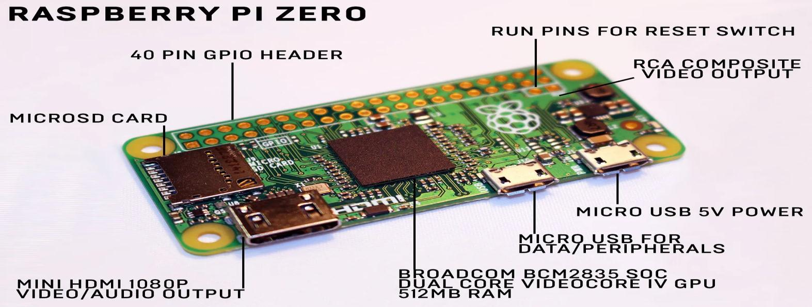
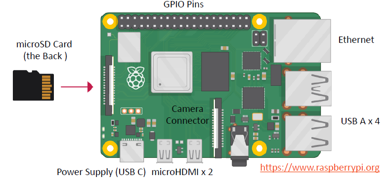
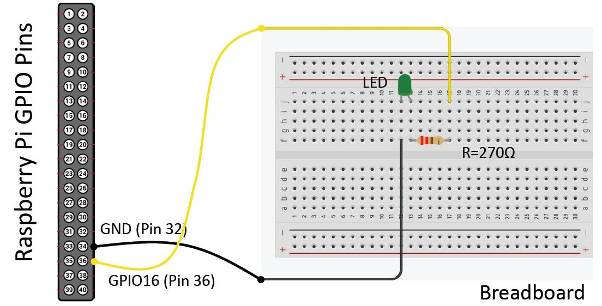

# Introduction to IoT - Lecture 3

## What is Raspberry Pi?

Raspberry Pi is a credit-card-sized computer that plugs into a TV and a keyboard, functioning almost like a full-fledged computer. It was developed in the United Kingdom by the Raspberry Pi Foundation to promote computer science education in schools.

### Key Features:

- Fully featured microcomputer on a circuit board.
- Uses Raspberry Pi OS (Linux-based) as the recommended operating system.
- Small footprint ($9 \times 6$ cm) and affordable (priced between $5–35).
- Can connect to a monitor, keyboard, and mouse.
- Includes GPIO (General Purpose Input/Output) pins for interfacing with sensors and actuators.
- Ideal for learning programming, IT, and technical skills.
- Uses a microSD card as its hard drive.

## Raspberry Pi Models

| Aspect/Model     | Raspberry Pi 1 Model A | Raspberry Pi 1 Model A+ | Raspberry Pi 1 Model B | Raspberry Pi 1 Model B+ | Raspberry Pi 2 Model B | Raspberry Pi 3 Model B | Raspberry Pi Zero  |
| ---------------- | ---------------------- | ----------------------- | ---------------------- | ----------------------- | ---------------------- | ---------------------- | ------------------ |
| **Release Date** | 2013                   | 2014                    | 2012                   | 2014                    | 2015                   | 2016                   | 2015               |
| **SoC**          | Broadcom BCM2835       | Broadcom BCM2835        | Broadcom BCM2835       | Broadcom BCM2835        | Broadcom BCM2836       | Broadcom BCM2837       | Broadcom BCM2835   |
| **CPU Speed**    | 700 MHz ARM-1176JZF-S  | 700 MHz ARM-1176JZF-S   | 700 MHz ARM-1176JZF-S  | 700 MHz ARM-1176JZF-S   | 900 MHz ARM-Cortex-A7  | 1.2 GHz ARM-Cortex-A53 | 1 GHz ARM1176JZF-S |
| **Cores**        | 1                      | 1                       | 1                      | 1                       | 4                      | 4                      | 1                  |
| **SDRAM**        | 256 MB                 | 256 MB                  | 512 MB                 | 512 MB                  | 1 GB                   | 1 GB                   | 512 MB             |

## Raspberry Pi Features

- Uses a **Broadcom SoC** with an **ARM CPU** and **VideoCore IV GPU**.
- **CPU speeds** range from **700 MHz to 1.2 GHz**, with **256 MB to 1 GB RAM**.
- **SD/MicroSD cards** store the OS and programs.
- Includes **1 to 4 USB ports, HDMI, composite video output, and a 3.5mm audio jack**.
- **GPIO pins** provide lower-level output for hardware interfacing.
- **Networking**:
  - **B-models** have **Ethernet**.
  - **Pi 3 and Pi Zero** include **Wi-Fi (802.11n) and Bluetooth**.

### Raspberry Pi 3 Highlights

- **1.2GHz 64-bit quad-core ARMv8 CPU**.
- **Built-in 802.11n Wi-Fi and Bluetooth 4.1 (BLE)**.
- Ideal for **IoT projects**, with multiple sensor connectivity.
- Features a **40-pin GPIO connector** for external sensors and hardware integration.

### Raspberry Pi Zero

- **Smallest Raspberry Pi** model.
- **Less powerful** than the Pi 3 but ideal for **embedded projects** like wearables due to its **compact size**.



## Raspberry Pi Hardware



## Raspberry Pi vs. Arduino

| **Arduino**                                | **Raspberry Pi**                                  |
| ------------------------------------------ | ------------------------------------------------- |
| Development circuit board                  | Single-board computer                             |
| Microcontroller-based                      | Microprocessor-based                              |
| No OS                                      | Runs Raspberry Pi OS (Linux)                      |
| Executes simple tasks                      | Can multitask with a full OS                      |
| Uses Arduino Shields                       | Uses Raspberry Pi HATs (Hardware Attached on Top) |
| Programmed in C/C++                        | Supports Python, Scratch, Ruby, C, C++            |
| Logic voltage: 5V                          | Logic voltage: 3.3V                               |
| Requires shields for internet connectivity | Built-in Wi-Fi and Ethernet                       |
| Open-source: Can be modified by the public | Closed-source: Cannot be altered by the public    |
| Standard boards cost **$16–$20**           | Standard boards cost **~$35**                     |

## Strengths

### Arduino:

- Analog input and PWM support
- Real-time control for motors and sensors

### Raspberry Pi:

- Full Linux OS with multi-threading
- Supports multiple programming languages
- Ideal for IoT, AI, and web applications

### Raspberry Pi or Arduino

- **Arduino**: Best for precise software timing and simple tasks.
- **Raspberry Pi**: Ideal for internet connectivity, video display, and camera use.
- **Both**: Can be used together via I2C or SPI for advanced projects.

## Getting Started with Raspberry Pi

### Hardware Requirements:

- **Essential:**
  - Raspberry Pi board
  - MicroSD card
  - USB keyboard
  - Display (HDMI, DVI, or Composite input)
  - Power supply
- **Recommended extras:**
  - USB mouse
  - Internet connection (LAN or Wi-Fi)
  - Heat sink for the processor
  - Protective case

### Operating System (OS):

- The Raspberry Pi OS (formerly Raspbian) is recommended.
- Can also run Ubuntu MATE, Windows 10 IoT Core, and other third-party OS.
- Installed using the Raspberry Pi Imager tool.

## Connecting to Wi-Fi

To connect your Raspberry Pi to Wi-Fi:

1. Insert the microSD card.
2. Connect a monitor, keyboard, and mouse.
3. Power on the device and follow on-screen instructions to set up Wi-Fi.

## Using the Linux Terminal

Raspberry Pi OS (Linux based) comes with a GUI but relies heavily on terminal commands for system management.

### Updating Raspberry Pi OS:

```sh
# Update package repositories
sudo apt update

# Upgrade all installed packages
sudo apt full-upgrade
```

### Shutting Down Properly:

Unlike other devices, the Raspberry Pi has no **off** switch.

- **Do not** unplug it directly.
- Use the terminal to shut it down safely:

```sh
sudo shutdown # or sudo poweroff
```

This ensures a clean shutdown before unplugging the power source. To turn it back on, simply plug it in.

## Remote Access

To remotely access your Raspberry Pi from a desktop computer, you can use:

- **SSH** – Command-line access
- **Remote Desktop software**, such as:
  - XRDP/RDC (not for root user)
  - TeamViewer
  - VNC

## Python with Raspberry Pi

Python, an older language (1991) compared to C# (2000), Swift (2014), Java (1995), and PHP (1995), comes pre-installed on Raspberry Pi OS with the built-in Thonny editor for coding.

### LED Blinking Example:

This simple script continuously blinks an LED connected to GPIO pin 16.

```python
from gpiozero import LED  # Import LED control from gpiozero
from time import sleep    # Import sleep for delays

pin = 16          # Define the GPIO pin where the LED is connected
led = LED(pin)    # Create an LED object

while True:       # Infinite loop to blink the LED
  led.on()        # Turn the LED on
  sleep(1)        # Wait for 1 second
  led.off()       # Turn the LED off
  sleep(1)        # Wait for 1 second
```


