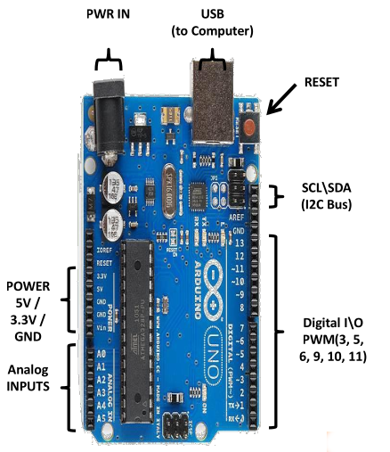
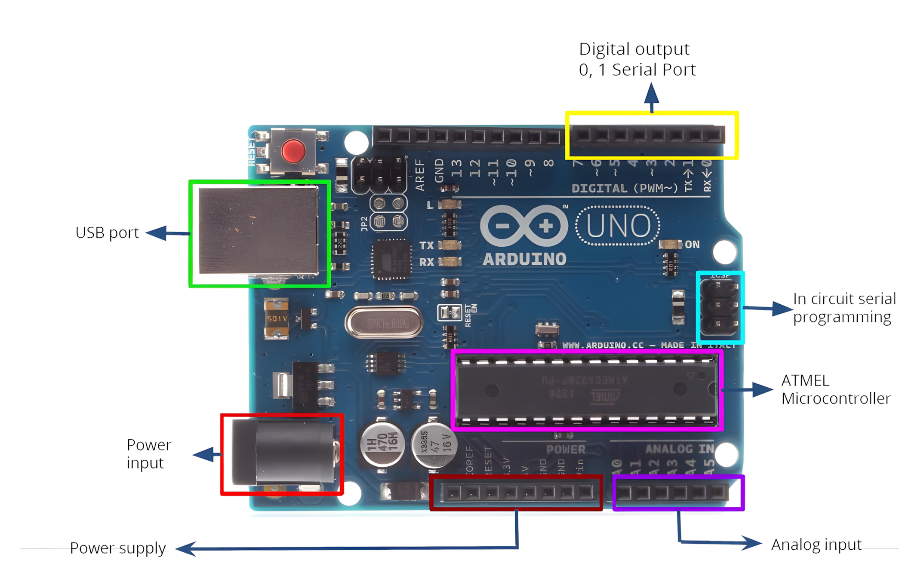
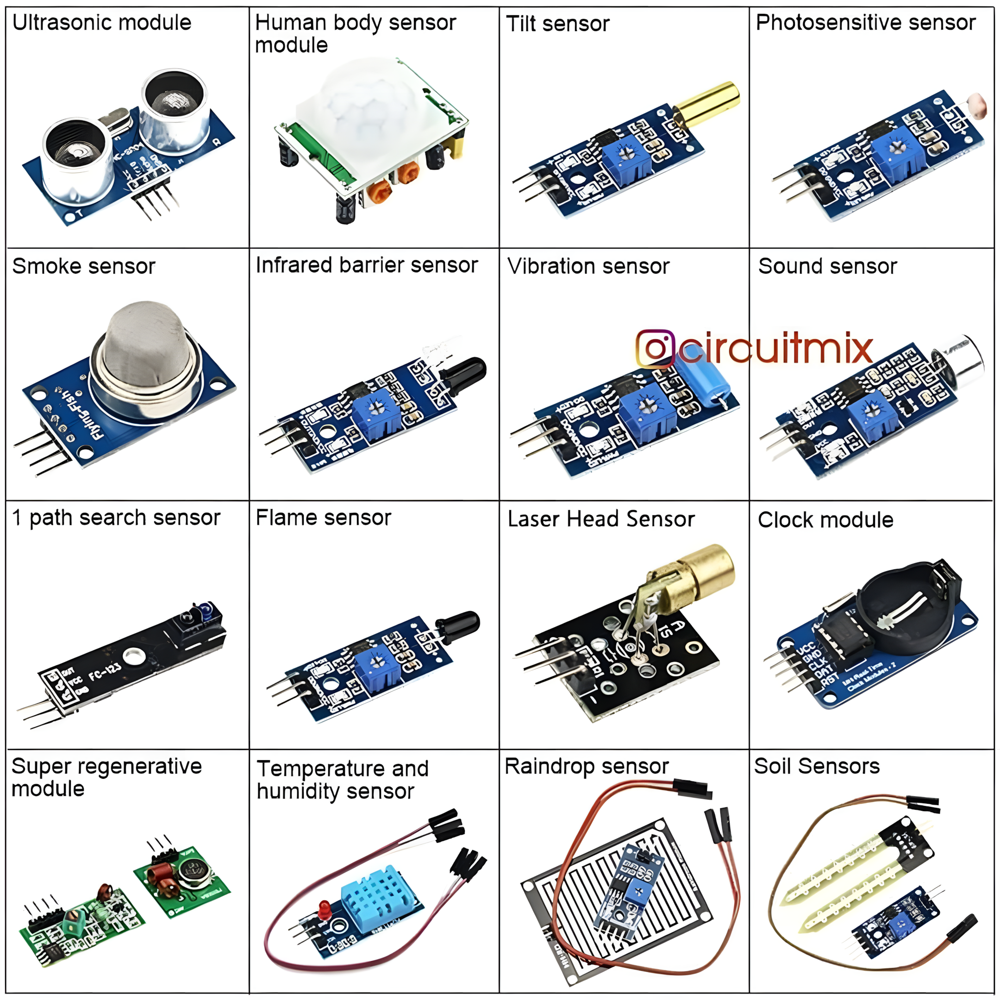
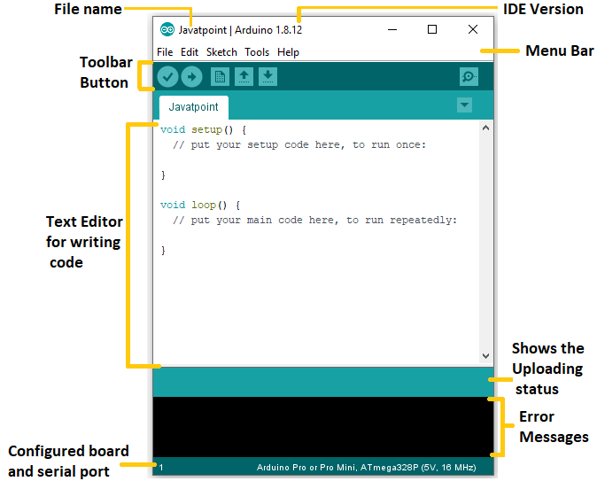

# Introduction to IoT - Lecture 2

## Outline

1. Introduction to Embedded Systems
2. Microprocessor vs. Microcontroller
3. What is Arduino?
4. Differences Between Arduino Boards
5. Arduino Uno
6. Arduino Sensors
7. Arduino IDE
8. Arduino and TinkerCAD

## Introduction to Embedded Systems

A computing system consists of a processor, memory, and I/O peripherals. It is divided into:

- **General-purpose systems**: Designed for multiple applications.
- **Specific-purpose systems**: Designed for dedicated functions (embedded systems).

### Common Characteristics

- **Dependability**: Reliable operation.
- **Single-functioned**: Executes a single program repeatedly.
- **Tightly-constrained**: Low cost, low power, compact size, fast performance.
- **Reactive and Real-time**: Instantly responds to environmental changes with no delay.

### Embedded System Workflow

1. **Environment**: Provides real-world data.
2. **Sensors**: Collect environmental data.
3. **Analog-to-Digital Converter**: Converts sensor data into digital format.
4. **Embedded Computing**: Processes data using processors and memory.
5. **Output Data Flow**:
   - Sent to **Display** for visualization.
   - Sent to **Digital-to-Analog Converter** for actuator control.
6. **Actuators**: Interact with the environment based on processed data.

## Microprocessor (CPU)

A microprocessor is a single processor core that fetches, decodes, and executes instructions. It's suited for general-purpose computing but requires external memory (ROM/RAM), a memory decoder, an oscillator, and I/O ports to form a complete microcomputer.

### Microprocessor Architecture Workflow

1. **Instruction Fetcher**: Retrieves instructions from memory.
2. **Instruction Decoder**: Interprets instructions.
3. **Register Banks**: Store temporary data.
4. **Arithmetic Logic Unit (ALU)**: Performs computations and logic operations.
5. **Memory Interface**: Manages data exchange with memory.

## Microcontroller

A microcontroller is a compact system-on-chip with an integrated CPU, memory (RAM, ROM), and programmable I/O peripherals, designed for specific tasks.

## Microprocessor vs. Microcontroller

| **Feature**           | **Microprocessor**                             | **Microcontroller**                     |
| --------------------- | ---------------------------------------------- | --------------------------------------- |
| **Usage**             | Computer systems and General-purpose computing | Embedded systems (e.g., appliances)     |
| **Components**        | CPU only; external RAM, ROM, I/O needed        | Contains CPU, RAM, ROM, and peripherals |
| **Circuit Size**      | Large and complex                              | Small and compact                       |
| **Power Consumption** | High                                           | Low                                     |
| **Registers**         | Few; relies on external memory (slower)        | Many; faster processing                 |

## What is Arduino?

Arduino is an open-source microcontroller-based prototyping board programmed using the Arduino IDE. It supports simplified C++ programming and is widely used in robotics, automation, and IoT projects.

## Different Types of Arduino

| **Arduino Board** | **Processor**     | **Memory**             | **Digital I/O** | **Analog I/O**     |
| ----------------- | ----------------- | ---------------------- | --------------- | ------------------ |
| Arduino Uno       | 16MHz ATmega328   | 2KB SRAM, 32KB flash   | 14              | 6 input, 0 output  |
| Arduino Due       | 84MHz AT91SAM3X8E | 96KB SRAM, 512KB flash | 54              | 12 input, 2 output |
| Arduino Mega      | 16MHz ATmega2560  | 8KB SRAM, 256KB flash  | 54              | 16 input, 0 output |
| Arduino Leonardo  | 16MHz ATmega32u4  | 2.5KB SRAM, 32KB flash | 20              | 12 input, 0 output |

### Differences Between Arduino Boards


## Arduino Uno

Arduino Uno is an entry-level microcontroller board based on the ATmega328, it's a beginner-friendly board in the Arduino family.

### Features

- **14 Digital I/O Pins** (6 support PWM for analog-like control)
- 6 Analog Inputs
- **6 Analog Inputs**
- **USB Connection**
- **Power Jack**
- **Reset Button**
- **On-board LED**
- **SCL/SDA Pins** (I2C communication and Serial Clock/Data)

It's self-contained—connect via USB or power with an adapter/battery to start.





## Arduino Sensors

Sensors detect environmental changes (e.g., temperature, pressure, light) and convert them into electronic signals. The sensor data is recorded and processed by the Arduino.



## Arduino IDE

Arduino is programmed using the **Arduino IDE**, an open-source platform for writing and uploading code to Arduino boards. It supports:

- **Operating Systems**: Windows, macOS, Linux
- **Languages**: C, C++
- **File Extension**: `.ino`



Connect the board to the IDE via USB to upload code.

### Useful Functions

| **Function**     | **Description**                        |
| ---------------- | -------------------------------------- |
| `pinMode()`      | Sets pin as input or output            |
| `digitalWrite()` | Sets digital pin high/low              |
| `digitalRead()`  | Reads digital pin's state              |
| `analogRead()`   | Reads analog pin value                 |
| `analogWrite()`  | Writes PWM value (analog-like)         |
| `delay()`        | Pauses execution (in milliseconds)     |
| `millis()`       | Get the current time (in milliseconds) |

## Blinking LED Example

To implement a blinking LED using Arduino:

1. Connect an LED to a digital pin.
2. Use the Arduino IDE to write the following code:

```cpp
void setup() {
  pinMode(13, OUTPUT); // Set pin 13 as output
}

void loop() {
  digitalWrite(13, HIGH); // Turn LED ON
  delay(1000);            // Wait 1 second
  digitalWrite(13, LOW);  // Turn LED OFF
  delay(1000);            // Wait 1 second
}
```

3. Upload the code to the Arduino board.
4. The LED will blink every second.

## Getting Started with Arduino

### Requirements:

- Arduino board
- USB cable
- DC power supply (optional)
- Arduino IDE

### Steps:

1. Install the Arduino IDE.
2. Connect the Arduino board to the computer via USB.
3. Write and upload the code.
4. If you don't have an Arduino board, use **TinkerCAD** for simulation (see below).

## TinkerCAD for Arduino Simulation

**TinkerCAD Circuits** allows you to simulate Arduino projects before implementing them on real hardware.

**Features**:

- Simulates Arduino circuits without physical components.
- Supports block-based and text-based programming.
- Export code to Arduino IDE for real boards.

### Learn More:

[How to Use TINKERCAD For Beginners](https://www.youtube.com/watch?v=NbOkCnk73ZM)
