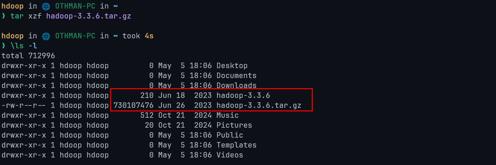

# Introduction to IoT Assignment Two

## Task 1

Using the following figure:


### Q1: Explain the below communication model.

**Push-Pull Communication Model:**

- **Producers push** data to **queues**, which act as an intermediary between producers and consumers.
- **Consumers pull** data from these queues at their own pace, enabling asynchronous communication.
- **Queues buffer** messages and handle mismatched data rates, allowing producers to continue sending data even when consumers are slower or temporarily unavailable.
- Producers and consumers are decoupled, meaning they do not need to know about each other's availability or state.

---

### Q2: State cloud computing service model and deployment models and explain them.

#### Cloud Service Models

Cloud computing offers three primary service models, each serving different needs:

- **Infrastructure as a Service (IaaS)**:
  - Provides virtualized computing resources (e.g., servers, storage, networking).
  - Example: Amazon EC2.
  - Explanation: Users rent infrastructure and manage their own operating systems and applications, offering flexibility but requiring more technical oversight.

- **Platform as a Service (PaaS)**:
  - Offers a platform for developing, testing, and deploying applications without managing underlying infrastructure.
  - Example: Google App Engine.
  - Explanation: Ideal for developers, as it simplifies app development by providing pre-configured tools and environments.

- **Software as a Service (SaaS)**:
  - Delivers fully functional software applications over the internet on a subscription basis.
  - Example: Google Workspace.
  - Explanation: End-users access software without installation or maintenance, making it convenient and cost-effective.

#### Cloud Deployment Models

Cloud deployment models define how cloud resources are hosted and accessed:

- **Public Cloud**:
  - Resources are shared among multiple users over the internet.
  - Example: AWS.
  - Explanation: Cost-effective and scalable, but less control over data security.

- **Private Cloud**:
  - Dedicated to a single organization, hosted on-site or by a provider.
  - Explanation: Offers greater security and customization, though at a higher cost.

- **Hybrid Cloud**:
  - Combines public and private clouds, allowing data and applications to move between them.
  - Explanation: Balances cost and security, ideal for dynamic workloads.

- **Community Cloud**:
  - Shared among organizations with similar needs (e.g., healthcare providers).
  - Explanation: Cost-sharing and tailored security make it suitable for niche groups.

---

### Q3: Compare between virtual machines and containers.

- **Virtual Machines (VMs)**: Emulate entire operating systems and run on a hypervisor. Each VM includes a full OS, making them heavier in terms of resource usage. They provide strong isolation and are ideal for running multiple different OS environments on a single physical machine.

- **Containers**: Share the host OS kernel and run isolated processes in user space. Containers are lightweight, start faster, and use fewer resources compared to VMs. They are ideal for microservices and scalable applications but offer slightly weaker isolation.

| Aspect             | Virtual Machines                                  | Containers                                 |
| ------------------ | ------------------------------------------------- | ------------------------------------------ |
| **OS Support**     | Full OS per VM                                    | Shared host OS kernel                      |
| **Resource Usage** | Heavy, requires significant CPU, memory, storage. | Light, minimal overhead.                   |
| **Startup Time**   | Slower (minutes) due to OS boot.                  | Faster (seconds) as no OS boot is needed.  |
| **Isolation**      | Strong, each VM has its own OS.                   | Weaker, shares OS but isolates apps.       |
| **Use Case**       | Multi-OS, legacy apps                             | Microservices, cloud-native apps           |
| **Portability**    | Less portable due to full OS dependency.          | Highly portable with app and dependencies. |
| **Example**        | VMware VMs.                                       | Docker containers.                         |

**Summary**: VMs are robust and isolated but resource-intensive, while containers are efficient and fast, ideal for scalable IoT applications at SmartTech.

---

### Q4: Implement VMware workstation as an example of the above hypervisor and explain how to create a virtual machine using it.

#### step 1: Install VMware

I need to install VMware Workstation on my machine.
Since I'm using Arch Linux, I'll use my package manager, `pacman`, to handle the installation.


This command will download and build the packages, then install them on my system.

---

#### Step 2: Launch the Application

- Open VMware Workstation.
  

---

#### Step 3: Create a New VM

- Click "File" > "New Virtual Machine" or click on the button found on the start page.
  
- Choose "Typical" (recommended) or "Custom" for advanced settings.
  

---

#### Step 4: Select OS Source

- Insert an ISO file or physical disk for the guest OS (e.g., Linux Mint).
  

---

#### Step 5: Configure VM Settings

Specify OS type (e.g., Linux).


Allocate resources: CPU (e.g., 2 cores), RAM (e.g., 4 GB), disk space (e.g., 20 GB).


---

#### Step 6: Finalize and Start

- Name the VM and choose a storage location.
  
- Click "Finish" to create the VM, then "Power On" to install the OS.
  

---

#### Step 7: Install the OS

- Follow the OS installation prompts within the VM:
  
  
  
  
  
  

Once running, the VM operates like a physical machine, supporting Big Data tools or IoT simulations.

---

### Q5: Critically evaluate the cloud computing open source tools and compare between them.

Here are three prominent open-source cloud tools:

- **OpenStack**:
  - **Pros**: Modular, supports IaaS, widely adopted, large community.
  - **Cons**: Complex setup, steep learning curve.
  - **Use Case**: Large-scale, flexible cloud deployments.

- **Apache CloudStack**:
  - **Pros**: Easy to deploy, user-friendly, good for IaaS.
  - **Cons**: Fewer features than OpenStack.
  - **Use Case**: Simpler private or public clouds.

- **Eucalyptus**:
  - **Pros**: AWS compatibility, straightforward for hybrid clouds.
  - **Cons**: Limited features, smaller community.
  - **Use Case**: AWS-integrated environments.

**Comparison**: OpenStack excels in flexibility but requires expertise. CloudStack is simpler but less versatile. Eucalyptus suits AWS users but lacks breadth. For SmartTech's IoT needs, OpenStack might be ideal for scalability, despite its complexity.

---

## Task 2

### Q6: Explain Types of Big Data and Big Data Job Roles

#### **Types of Big Data**

- **Structured**:
  - Organized data (e.g., SQL databases).
  - Example: Sales records.
- **Semi-Structured**:
  - Partially organized (e.g., JSON, XML).
  - Example: Log files.
- **Unstructured**:
  - Raw, unorganized data (e.g., videos, text).
  - Example: Social media posts.

#### **Big Data Job Roles**

- **Data Engineer**: Builds and maintains data pipelines.
- **Data Analyst**: Interprets data for insights.
- **Data Scientist**: Develops predictive models.
- **Big Data Architect**: Designs data infrastructure and strategy.

---

### Q7: Identify the Data Analytics Lifecycle and Problems in Big Data with Advanced Techniques

#### **Data Analytics Lifecycle**

1. **Data Collection**: Gather data from IoT devices.
2. **Data Preparation**: Clean and organize data.
3. **Data Analysis**: Apply statistical or machine learning methods.
4. **Data Visualization**: Present insights via dashboards.

#### **Problems in Big Data**

- **Volume**: Massive data size.
- **Velocity**: High data generation speed.
- **Variety**: Diverse data types.
- **Veracity**: Data uncertainty or inaccuracy.

#### **Advanced Techniques**

- **Machine Learning**: Predictive models (e.g., regression).
- **Deep Learning**: Complex pattern recognition (e.g., image analysis).
- **Natural Language Processing**: Text analysis.
- **Predictive Analytics**: Forecasting trends.

---

### Q8: Compare Between Data Warehouse, Data Lake, and Data Mart

| **Aspect**    | **Data Warehouse**         | **Data Lake**               | **Data Mart**               |
| ------------- | -------------------------- | --------------------------- | --------------------------- |
| **Data Type** | Structured                 | All types (raw)             | Structured, specific subset |
| **Purpose**   | Analytics, reporting       | Storage, advanced analytics | Focused business analysis   |
| **Schema**    | Defined before storage     | Defined on use              | Predefined                  |
| **Example**   | Enterprise-wide sales data | IoT sensor logs             | Marketing team data         |

**Summary**: Data Warehouses are optimized for structured queries, Data Lakes store diverse raw data, and Data Marts serve specific needs.

---

### Q9: Summarize Clustering, Its Types, and K-Means Algorithm

**Clustering**: Groups similar data points without predefined labels.

#### **Types**

- **Hierarchical**: Builds a tree of clusters (e.g., dendrograms).
- **Partitioning**: Divides data into k clusters (e.g., k-means).
- **Density-Based**: Groups based on data density (e.g., DBSCAN).

#### **K-Means Algorithm**

1. Choose k (number of clusters).
2. Randomly assign k centroids.
3. Assign each data point to the nearest centroid.
4. Recalculate centroids as the mean of assigned points.
5. Repeat until centroids stabilize.

**Example**: Grouping IoT sensor data by usage patterns.

### Q10: Implement a One-Node Hadoop Cluster and Explain Hadoop Components, MapReduce, and Its Steps with Example

#### Hadoop: Single Node Installation on Arch Linux

**What is Apache Hadoop?**

Hadoop is an open-source framework that allows for distributed processing and storage of large datasets across clusters of computers. It provides a scalable and fault-tolerant solution for handling big data applications. Hadoop consists of two main components: Hadoop Distributed File System (HDFS) and Yet Another Resource Negotiator (YARN).

HDFS is a distributed file system that stores data across multiple machines, providing high throughput access to large datasets. YARN is a resource management system that manages and schedules resources in a Hadoop cluster, enabling parallel processing of data.

##### Prerequisite Test

**Step 1 — Update the packages list**

Press open a Terminal then type the following command it will update the packages and it will ask the password type the user password which you used while login if you did not set a login password then just hit enter.

```shell
sudo pacman -Sy
```

**Step 2 — Install OpenJDK 8**

The command `sudo pacman -S jdk8-openjdk` is necessary for Hadoop because it installs the OpenJDK 8 Development Kit, which is a prerequisite for running Hadoop. Hadoop is a Java-based framework, and it requires a compatible Java Development Kit (JDK) to execute its processes and applications

```shell
sudo pacman -S jdk8-openjdk
```

Verify it after installation by the following command

```shell
java -version; javac -version
```


**Step 3 — SSH Server and Client Packages**

This command is necessary for Hadoop as it installs the SSH server and client packages. These packages enable secure communication between Hadoop nodes in a distributed cluster, ensuring efficient data transfer and coordination

```shell
sudo pacman -S openssh
```


**Step 4 — Add a new user for Hadoop**

This step is not necessary but it is perferable to add a new user for the hadoop usage since many things can go wrong for you So it is always recommended to add a new User make sure to remember to username for this installtaion im using **hdoop** you can change the hdoop username to your perferable choice but remember you have to change username for the following commands if you have another username.

Name username to `hdoop`.

```shell
sudo useradd -m -s $(which bash) hdoop
```

Then add password after that hit enter.

```shell
sudo passwd hdoop
```

**Step 5— Add new user to the sudo group**

This step is necessary as it allows your new user to edit the changes without any errors.

```shell
sudo usermod -aG wheel hdoop
```

**Step 6— Switch to your new user**

Now we will switch to the new user so we can download the hadoop and setup it in that user just type the following command it will ask for the password which you set it will creating the new user in **4th Step.**

```shell
su - hdoop
```

As you can see we switch it to our hdoop user

**Step 7 — Genrate SSH key**

Copy the following commands in sequence it will genrate the SSH key

```shell
ssh-keygen -t rsa -P '' -f ~/.ssh/id\_rsa

cat ~/.ssh/id_rsa.pub >> ~/.ssh/authorized_keys

chmod 0600 ~/.ssh/authorized\_keys

ssh localhost
```


**Step 8 — Download Apache Hadoop**

you can download hadoop from the following website go to this website or just type Apache Hadoop download and go to the offical website

[hadoop.apache.org](https://hadoop.apache.org/releases.html)

Decide which version you want to install for this purpose im going to install 3.3.6


Now copy the below link of the version you selected

Copy this link and then go to terminal and type `wget <copied-link>` like this

```shell
wget https://dlcdn.apache.org/hadoop/common/hadoop-3.3.6/hadoop-3.3.6.tar.gz
```


Now unzip the packages make sure to edit the following command if you have downloaded different version you can type _ls_ if you are not sure for the file name

```shell
tar xzf hadoop-3.3.6.tar.gz
```



**Step 9 — Edit 6 files only**

**1st File**

Firstly edit bashrc file this is very important if you installed different version change that version accordingly or if you have username different change it as well.

Open Bashrc file give password if ask

```shell
vim .bashrc
```

Now go the bottom of the file and copy the following code and paste it there. Note : if you have installed different version change the version in the following code accordingly

```shell
#Hadoop Related Options
export HADOOP_HOME=/home/hdoop/hadoop-3.2.4
export HADOOP_INSTALL=$HADOOP_HOME
export HADOOP_MAPRED_HOME=$HADOOP_HOME
export HADOOP_COMMON_HOME=$HADOOP_HOME
export HADOOP_HDFS_HOME=$HADOOP_HOME
export YARN_HOME=$HADOOP_HOME
export HADOOP_COMMON_LIB_NATIVE_DIR=$HADOOP_HOME/lib/native
export PATH=$PATH:$HADOOP_HOME/sbin:$HADOOP_HOME/bin
export HADOOP_OPTS="-Djava.library.path=$HADOOP_HOME/lib/native"
export PATH=$PATH:$HADOOP_HOME/sbin:$HADOOP_HOME/bin
```

Type `i` for insert mode, make your edits, hit `esc` then type `:wq` to save and quit.

Type the following code to save it.

```shell
source ~/.bashrc
```

**2nd File**

Edit the hadoop-env.sh file

```shell
vim $HADOOP_HOME/etc/hadoop/hadoop-env.sh
```

Add this line in the end of the file

```shell
export JAVA_HOME=/usr/lib/jvm/java-8-openjdk
```

**3rd File**

Type following command in terminal to open new file

```shell
vim $HADOOP_HOME/etc/hadoop/core-site.xml
```

Add below lines in this file(between `<configuration>` and `</configuration>`)

```xml
<property>
  <name>hadoop.tmp.dir</name>
  <value>/home/hdoop/tmpdata</value>
  <description>A base for other temporary directories.</description>
</property>
<property>
  <name>fs.default.name</name>
  <value>hdfs://localhost:9000</value>
  <description>The name of the default file system></description>
</property>
```

**4th File**

open the 4th file by following command

```shell
vim $HADOOP_HOME/etc/hadoop/hdfs-site.xml
```

Add below lines in this file(between `<configuration>` and `</configuration>`)

```xml
<property>
  <name>dfs.data.dir</name>
  <value>/home/hdoop/dfsdata/namenode</value>
</property>
<property>
  <name>dfs.data.dir</name>
  <value>/home/hdoop/dfsdata/datanode</value>
</property>
<property>
  <name>dfs.replication</name>
  <value>1</value>
</property>
```

**5th File**

Open the 4th file by following command on Terminal

```shell
vim $HADOOP_HOME/etc/hadoop/mapred-site.xml
```

Add below lines in this file(between `<configuration>` and `</configuration>`)

```xml
<property>
  <name>mapreduce.framework.name</name>
  <value>yarn</value>
</property>
```

**6th File**

Open the 6th file by following command on Terminal

```shell
vim $HADOOP_HOME/etc/hadoop/yarn-site.xml
```

Add below lines in this file(between `<configuration>` and `</configuration>`)

```xml
<property>
  <name>yarn.nodemanager.aux-services</name>
  <value>mapreduce_shuffle</value>
</property>
<property>
  <name>yarn.nodemanager.aux-services.mapreduce.shuffle.class</name>
  <value>org.apache.hadoop.mapred.ShuffleHandler</value>
</property>
<property>
  <name>yarn.resourcemanager.hostname</name>
  <value>127.0.0.1</value>
</property>
<property>
  <name>yarn.acl.enable</name>
  <value>false</value>
</property>
<property>
  <name>yarn.nodemanager.env-whitelist</name>
  <value>JAVA_HOME,HADOOP_COMMON_HOME,HADOOP_HDFS_HOME,HADOOP_CONF_DIR,CLASSPATH_PERPEND_DISTCACHE,HADOOP_YARN_HOME,HADOOP_MAPRED_HOME</value>
</property>
```

**Step 10 — Intializing Hadoop**

Add following command and wait for few second

```shell
hdfs namenode -format
```


**Congratulation you have sucessfully installed the Apache Hadoop Single Node**

**Start Hadoop**

Type this command to start hadoop for all service wait for 10 second it will start the hadoop

```shell
start-all.sh
```

Now go to any browser and type following in the search bar at the top and hit Enter

```txt
localhost:9870
```

To open yarn type the following in the search bar

```txt
localhost:8088
```
