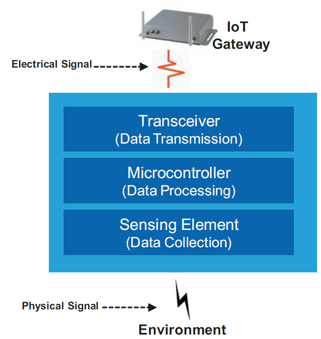
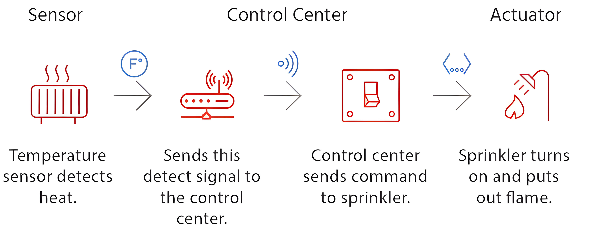
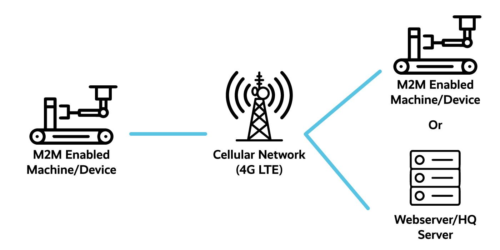
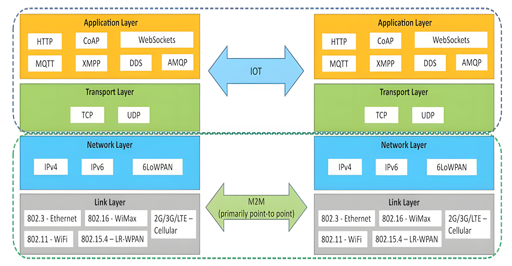

# Introduction to IoT - Lecture 4

## Sensor Definition

A sensor is a device (typically electronic) that detects events or changes in its physical environment (e.g., temperature, sound, heat, pressure, flow, magnetism, motion, chemical, and biochemical parameters) and provides a corresponding output. Most sensors take analog inputs and deliver digital, often electrical, outputs.

## Components of Smart Sensors

Smart sensors collect and transmit data and only notify the IoT gateway when specific conditions are met. An IoT sensing device requires at least three elements:

- Sensor(s)
- Microcontrollers
- Connectivity to send filtered data to an IoT gateway or other systems

## Sensor Types

Common types of sensors include:

1. Temperature Sensors
2. Proximity Sensors
3. Infrared Sensors
4. Ultrasonic Sensors
5. Smoke and Gas Detectors
6. Humidity Sensors
7. Motion Detection Sensors
8. Sound Sensors

### Temperature Sensors

Temperature sensors measure temperature variations by detecting changes in physical properties like resistance or voltage. There are four main types:

#### Thermocouple Sensors

- Consist of two dissimilar conductors (hot and cold junctions) welded together.
- Generate a voltage due to the thermoelectric effect.

#### Resistance Temperature Detector (RTD) Sensors

- Function on the principle that resistance changes with temperature.
- Commonly used in industrial and laboratory settings due to accuracy and stability.

#### Thermistors

- Similar to RTDs but use resistive materials instead of conductive ones.
- Exhibit higher resistance change compared to RTDs.

#### Semiconductor Sensors

- Utilize temperature-sensitive voltage and current diodes.
- Offer high accuracy and linearity over an operating range of -55°C to +150°C.

### Proximity Sensor

A proximity sensor is a non-contact sensor that detects the presence of an object using various techniques like optical (infrared or laser), ultrasonic, Hall Effect, and capacitive methods. Applications include mobile phones, car parking sensors, industrial object alignment, and aircraft ground proximity detection.

### Infrared Sensor (IR Sensor)

- IR sensors detect proximity and objects using light-based sensing.
- Two types: **Transmissive Type** (transmitter and detector facing each other) and **Reflective Type** (transmitter and detector adjacent, detecting reflected signals).
- Common applications: mobile phones, robotics, industrial automation, and automotive systems.

### Ultrasonic Sensor

- Measures distance and velocity using high-frequency sound waves.
- Used for non-contact object detection and distance measurement.
- Example: HC-SR04 ultrasonic sensor measures distances from 2 cm to 400 cm with 3 mm accuracy.

### Smoke and Gas Detector

- Detects smoke and gas to trigger fire alarms or safety systems.
- Typically equipped with visual and audible alarms.

### Humidity Sensor

- Measures moisture and air temperature.
- Reports relative humidity (RH), which is crucial for environmental comfort.

### Sound Sensor

- Detects and measures sound intensity using a microphone.
- Converts detected sound into an electrical signal for processing.

## Sensor to Actuator Flow

Sensors collect data, and actuators use this data to perform specific actions, enabling automated responses in IoT systems.

## Why Actuators?

- Sensors collect and provide data but cannot act on it.
- Actuators interpret sensor data to control environments.
- Example: Shutting down a gas flow when pressure falls below a threshold.

## Sensors vs. Actuators

| **Sensor**                                  | **Actuator**                                 |
| ------------------------------------------- | -------------------------------------------- |
| Detects environmental changes.              | Controls a mechanism based on received data. |
| Connected to input ports of a system.       | Connected to output ports of a system.       |
| Outputs electrical signals.                 | Outputs motion or mechanical action.         |
| Examples: Motion sensors, chemical sensors. | Examples: Electric motors, stepper motors.   |

## Actuator Types

### Electrical Actuators

- Convert electrical energy into mechanical torque.
- Used in multi-turn valves, engines, and automated systems.
- Examples: DC motors, AC motors, stepper motors.

### Electric Motor as an Actuator

- Provides rotary or linear motion.
- Commonly used in washing machines, printers, and ventilation systems.

### Light Bulbs & LEDs as Actuators

- Used as indicators for equipment status.
- Example: A blinking LED as a fault warning.

### Motorized Pump as an Actuator

- Moves gases or liquids in industrial and household systems.
- Example: Water circulation in washing machines and refrigerators.

### Buzzer as an Actuator

- Produces sound signals for alarms and alerts.
- Used in microwave timers, fire alarms, and security systems.

## M2M vs. IoT

### Machine-to-Machine (M2M)

- Describes direct point-to-point communication between machines.
- Example: A temperature sensor activating an air conditioning unit.

### M2M Gateway

- Enables communication between remote M2M networks.
- Bridges non-IP-based protocols with external networks.

### Differences Between IoT and M2M

| **M2M (Machine-to-Machine)**           | **IoT (Internet of Things)**               |
| -------------------------------------- | ------------------------------------------ |
| Direct communication between machines. | Sensors, automation, and cloud platforms.  |
| Uses point-to-point communication.     | Uses cloud communication.                  |
| Does not rely on the Internet.         | Relies on Internet connectivity.           |
| Primarily hardware-based.              | Involves both hardware and software.       |
| Limited device-to-device interactions. | Supports multiple users over the Internet. |

## Communication in IoT vs. M2M

IoT enables cloud-based communication, whereas M2M relies on direct device-to-device connections. IoT facilitates extensive data analysis, while M2M is more focused on real-time operations with limited network reliance.
