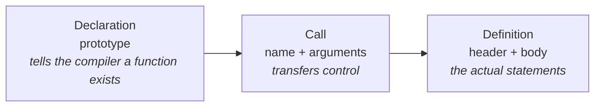
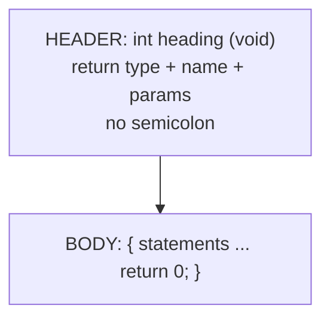
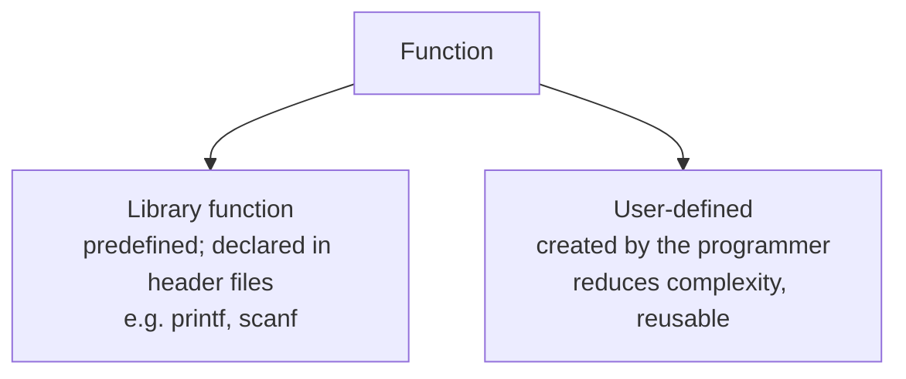
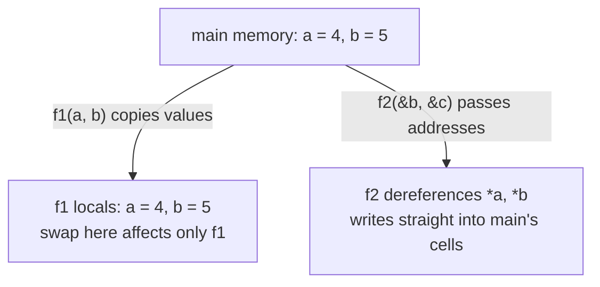
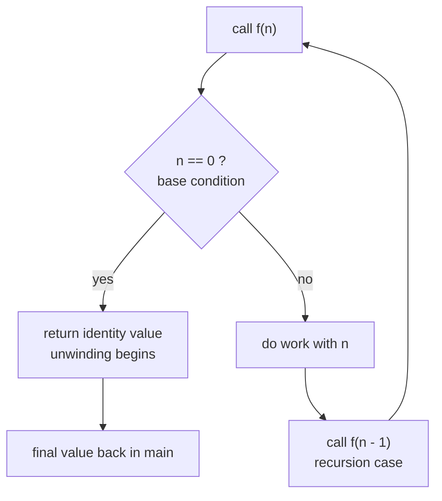
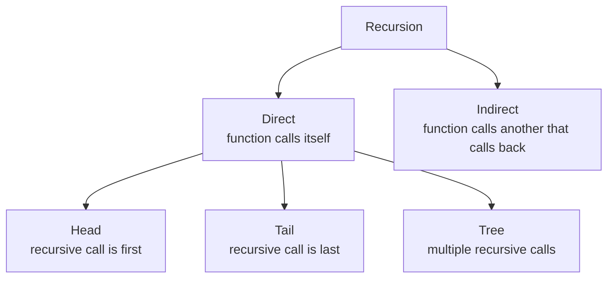
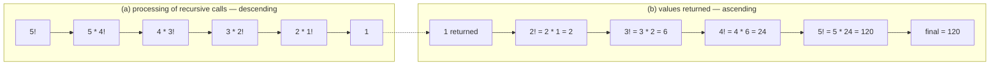

# Advanced C - Lecture 1: Functions

Course roadmap for the term: **Functions → Arrays → Structures & Unions → Pointers → Dynamic Memory Allocation → Strings → File Handling → Pre-processor → Error Handling → Threading**.

## What a Function Is

A **function** is a named block of statements enclosed in `{ }` that runs a specific task when called. It is the basic building block of a C program: it provides **modularity** and **reusability**. Every C program has at least one function — `main()`, the entry point. The same idea is called a **subroutine** or **procedure** in other languages.

Why functions exist:

| Benefit          | Mechanism                                                                                     |
| ---------------- | --------------------------------------------------------------------------------------------- |
| **Reusability**  | Defined once, called many times — across programs too                                         |
| **Modularity**   | Split a large program into named parts instead of one `main` blob                             |
| **Debugging**    | A defect is localized to one function instead of the whole program                            |
| **Abstraction**  | `scanf`/`printf` are usable without knowing how they work; you depend on the _interface_ only |
| **Optimization** | Less duplicated code, fewer lines to maintain                                                 |

## Three Aspects of Function Syntax



### Declaration (prototype)

```c
return_type name_of_the_function (parameter_1, parameter_2);
```

A declaration gives the compiler the **name**, **return type**, and the **number and type of parameters** — enough to check calls, without providing a body. Parameter _names_ are optional:

```c
int sum(int a, int b);   // with names — easier to read
int sum(int, int);       // types only — equally valid
```

> [!NOTE]
> A function in C must be declared before it is called (prototyped globally, or defined above the call).

Skipping the declaration is not an error in itself — the compiler assumes the return type is `int`. But if the real return type differs, the mismatch surfaces as an error later:

```c
#include <stdio.h>

int main()
{
  char c = fun();   // no declaration: compiler assumes fun() returns int
  printf("character is: %c\n", c);
  return 0;
}

char fun()           // actual return type is char
{
  return 'a';
}
```

```
error: call to undeclared function 'fun'; ISO C99 and later do not support implicit function declarations
error: conflicting types for 'fun'
note: previous implicit declaration is here
```

If `fun()` is _defined before_ `main`, the same code compiles and prints `character is: a` — the declaration is embedded in the definition.

### Definition

```c
return_type function_name (para1_type para1_name, para2_type para2_name)
{
  // body of the function
}
```

The definition holds the actual statements executed when control enters the function. Because a definition _starts_ with its own declaration line, defining a function also declares it — no separate prototype needed.



### Call

```c
function_name (argument_list)
```

The call is what brings program control to the definition. An uncalled function's body never executes.

```c
#include <stdio.h>

int sum (int a, int b)      // function definition
{
  return a + b;
}

int main()
{
  int add = sum (10, 30);   // function call
  printf ("Sum is : %d", add);
  return 0;
}
```

`add` becomes `40`: control jumps into `sum`, `a` and `b` receive `10` and `30`, and the `return` hands the value back to the call site.

## Types of Functions



- **Library (built-in) functions** are declared in C **header files**: `scanf()`, `printf()`, `gets()`, `puts()`, `ceil()`, `floor()`.
- **User-defined functions** are written by the programmer; they are modifiable per need, reusable in other programs, and easier to understand, debug, and maintain.

| Header file | Contents                                               |
| ----------- | ------------------------------------------------------ |
| `stdio.h`   | Standard input/output — `printf`, `scanf`              |
| `conio.h`   | Console input/output                                   |
| `string.h`  | String functions — `gets`, `puts`, `strlen`, `strcpy`  |
| `stdlib.h`  | General utilities — `malloc`, `calloc`, `free`, `exit` |
| `math.h`    | Math operations — `sqrt`, `pow`, `ceil`, `floor`       |
| `time.h`    | Time-related functions                                 |
| `ctype.h`   | Character handling — `isalpha`, `isdigit`              |
| `stdarg.h`  | Variable-argument functions (`va_list`, `va_start`)    |
| `signal.h`  | Signal handling                                        |
| `setjmp.h`  | Jump functions                                         |
| `locale.h`  | Locale functions                                       |
| `errno.h`   | Error handling                                         |
| `assert.h`  | Diagnostics — `assert`                                 |

Math functions require the header:

```c
#include <math.h>
```

Verified output:

```text
sqrt(16) = 4.0
pow(2,10) = 1024.0
ceil(4.2) = 5.0
floor(4.8) = 4.0
```

> [!WARNING]
> On Linux, `math.h` functions also need linking against the math library: `gcc prog.c -o prog -lm`. Otherwise you get an undefined reference at link time.

## Functions With and Without Arguments

| Aspect         | With arguments                                | Without arguments                  |
| -------------- | --------------------------------------------- | ---------------------------------- |
| Parameter list | Present in declaration and definition         | Empty `()`                         |
| At call site   | Values passed: `sum(10, 20)`                  | No values: `display()`             |
| Example        | `int sum (int x, int y);` then `sum(10, 20);` | `int display();` then `display();` |

```c
// with arguments
int sum (int x, int y);
sum(10, 20);

// without arguments
int display();
display();
```

## Argument vs. Parameter

| Aspect      | **Formal parameter**                                        | **Actual parameter**                  |
| ----------- | ----------------------------------------------------------- | ------------------------------------- |
| Also called | Formal parameter                                            | Actual parameter                      |
| What it is  | A _variable_ in the declaration/definition of the function  | The _actual value_ passed at the call |
| Lives in    | The called function                                         | The calling function                  |
| Data types  | Written out: the receiving variable's type must be included | None mentioned — only the value is    |

```c
#include <stdio.h>

int sum (int a, int b)        /* a, b are FORMAL parameters */
{
  return a + b;
}

int main ()
{
  int add = sum (10, 30);     /* 10, 30 are ACTUAL parameters */
  printf ("Sum is : %d", add);
  return 0;
}
```

## Passing Parameters: Value vs. Reference

C passes arguments in two ways:



### Call by value

Changing a parameter changes it **for the current function only** — the caller's variables are untouched. The compiler copies the value onto the callee's own storage, so the original data is preserved.

### Call by reference

The actual and formal parameters refer to the **same memory location**. Instead of values, **addresses** are passed, so both share one address space and any change to the formal parameter is reflected back in the actual parameter.

| Aspect                     | Call by value                       | Call by reference                                       |
| -------------------------- | ----------------------------------- | ------------------------------------------------------- |
| What is passed             | The **values** of variables         | The **addresses** of variables                          |
| Memory relationship        | Callee gets its own copy            | Actual and formal share the same address space          |
| Effect of callee's changes | No effect on the caller's variables | Directly manipulates the caller's variables             |
| Can alter caller variables | No                                  | Yes                                                     |
| Best for                   | Small values that should not change | Large amounts of data                                   |
| Risk                       | **Safer** — original data preserved | **Risky** — allows direct modification of original data |

### Traced example: value vs. reference side by side

```c
void f1 (int a, int b)          /* call by VALUE */
{
  int c;
  c = a; a = b; b = c;          /* swaps f1's own copies only */
}

void f2 (int *a, int *b)        /* call by REFERENCE */
{
  int c;
  c = *a; *a = *b; *b = c;      /* swaps the caller's actual cells */
}

int main ()
{
  int a = 4, b = 5, c = 6;
  f1 (a, b);
  f2 (&b, &c);
  printf ("%d", c - a - b);
  return 0;
}
```

Step by step:

| Stage              | `a` | `b` | `c` | Comment                                             |
| ------------------ | --- | --- | --- | --------------------------------------------------- |
| After declarations | 4   | 5   | 6   | Initial values                                      |
| Inside `f1(a, b)`  | 4   | 5   | 6   | `f1`'s locals become 5 and 4; **`main` unchanged`** |
| After `f2(&b, &c)` | 4   | 6   | 5   | `b` and `c` really swapped                          |
| `c - a - b`        |     |     |     | `5 - 4 - 6 = -5`                                    |

Verified output: `-5`.

> [!NOTE]
> `&b` is the **address** of `b`. Inside `f2`, `*a` and `*b` are the caller's `b` and `c`, so assigning through them writes to `main`'s memory.

> [!WARNING]
> Arrays are the exception to "C has no pass by reference". An array parameter decays to a pointer to its first element, so array contents _are_ modified in place:

```c
void arr_param(int a[]) { a[0] = 100; }
// caller: arr[0] == 100 afterwards
```

## Practice Programs

### Even or odd

```c
#include <stdio.h>
void checkEvenOdd();

int main () {
  int num;

  printf ("Enter The Number To Check Even or Odd\n");
  scanf ("%d", &num);
  checkEvenOdd (num);
}

void checkEvenOdd (int num) {
  if (num % 2 == 0) {
    printf ("It is Even\n");
  } else {
    printf ("It is odd\n");
  }
}
```

> [!WARNING]
> The slide declares `void checkEvenOdd();` — an _unprototyped_ declaration — yet defines it with `int num`. This still compiles, but as an empty `()` means "unspecified arguments" the compiler cannot check your call. Prefer `void checkEvenOdd(int num);` so a wrong-arity call becomes a compile error instead of undefined behaviour.

### Prime number

**Prime**: a number greater than 1 with exactly two factors — 1 and itself (2, 3, 5, 7, …).
**Composite**: a positive integer that is not prime, having factors other than 1 and itself (4, 6, 8, 9, 10, …).

```c
#include <stdio.h>
int check_prime (int);

int main ()
{
  int n, result;

  printf ("Enter an integer to check whether it is prime or not.\n");
  scanf ("%d", &n);

  result = check_prime (n);

  if (result == 1)
    printf ("%d is prime.\n", n);
  else
    printf ("%d is not prime.\n", n);

  return 0;
}

int check_prime (int a)
{
  int c;

  for (c = 2; c <= a - 1; c++)
    if (a % c == 0)
      return 0;

  return 1;
}
```

> [!WARNING]
> This version has a boundary bug: the loop never runs for `a < 3`, so it returns 1 (prime) for both **0 and 1**, which are not prime. Verified:
>
> ```text
> 0 is prime.     <-- wrong
> 1 is prime.     <-- wrong
> 4 is not prime.
> ```
>
> Add an explicit guard and stop at the square root (`c * c <= n`), which also cuts the work roughly in half:

```c
int is_prime (int n)
{
  if (n < 2) return 0;              // 0 and 1 are NOT prime
  for (int c = 2; c * c <= n; c++)
    if (n % c == 0) return 0;
  return 1;
}
```

### Palindrome number

A number is a **palindrome** if its reverse equals itself: `5225 → 5225` (palindrome), `123 → 321` (not).

1. Take a number.
2. Find its reverse.
3. If reverse equals the original, it is a palindrome.
4. Otherwise it is not.

```c
#include <stdio.h>
int checkPalindrome (int number)
{
  int temp, remainder, rev = 0;
  temp = number;

  while (number != 0)
  {
    remainder = number % 10;       /* peel off last digit */
    rev = rev * 10 + remainder;    /* append it to the reverse */
    number /= 10;                  /* drop last digit    */
  }

  if (rev == temp) return 0;
  else return 1;
}

int main ()
{
  int number;

  printf ("Enter the number: ");
  scanf ("%d", &number);

  if (checkPalindrome (number) == 0)
    printf ("%d is a palindrome number.\n", number);
  else
    printf ("%d is not a palindrome number.\n", number);

  return 0;
}
```

Verified output:

```text
Enter the number: 1234
1234 is not a palindrome number.
Enter the number: 5225
5225 is a palindrome number.
```

> [!NOTE]
> `temp` preserves the original because `number` is consumed by the loop. The function returns **0 for palindrome**, 1 for not — inverted from `check_prime`, so read the return contract before trusting it.

## Recursion

**Recursion** is calling a function repeatedly until a particular condition is met. A function that calls itself **directly** or **indirectly** is a **recursive function**; the calls themselves are **recursive calls**.

```c
type function_name (args) {
  // function statements
  // base condition
  // recursion case (recursive call)
}
```

- The **recursion case** is the recursive call inside the function.
- The **base condition** determines the exit point of the recursion.



Without the base condition the recursion never terminates — each call pushes another stack frame until the program crashes.

### Applications

Recursion suits problems that are naturally self-similar: **tree and graph algorithms**, **mathematical problems**, **divide and conquer**, **dynamic programming**, **postfix-to-infix conversion**, and **searching and sorting algorithms**. It ranges from simple tasks like printing a linked list to being used extensively in AI.

### Advantages

- Effectively reduces the length of the code.
- Some problems are much easier to express recursively (tree traversals).
- Data structures such as linked lists and trees are **recursive in nature**, so recursive methods map onto them directly.

### Types of recursion



**Direct recursion** is the most common type: a function calls itself within its own body. It has three shapes:

| Type     | Position of the recursive call         | Trace shape         | Note                                                                                                        |
| -------- | -------------------------------------- | ------------------- | ----------------------------------------------------------------------------------------------------------- |
| **Head** | Start of the function, first statement | Linear (descending) | Work happens _before_ the call; frames are held until unwinding                                             |
| **Tail** | End of the function                    | Linear (ascending)  | Nothing happens after the call, so it can be optimized to minimize stack usage (**Tail Call Optimization**) |
| **Tree** | Multiple recursive calls in the body   | Branching tree      | Each call spawns more than one further call                                                                 |

**Indirect recursion**: a function calls another function, which eventually calls the first one (or another in the chain), forming a cycle.

```c
void f (int n);
void g (int n) { if (n > 0) f (n - 1); }   // g -> f
void f (int n) { if (n > 0) g (n - 1); }   // f -> g  (cycle)
```

Verified trace for `f(3)`:

```text
f(3) -> g(2)
g(2) -> f(1)
f(1) -> g(0)
```

> [!NOTE]
> The two functions must be declared before use, or at least the first of the pair — otherwise you hit the implicit-declaration error shown earlier.

### Factorial by recursion

The factorial of a nonnegative integer $n$ is the product:

$$n! = n \cdot (n-1) \cdot (n-2) \cdots 1$$

which becomes the recursive definition:

$$n! = n \cdot (n-1)!$$

so `5! = 5 · 4 · 3 · 2 · 1 = 5 · (4 · 3 · 2 · 1) = 5 · (4!)`. The recursion stops at `1! = 1`.



```c
#include <stdio.h>
int factorialTail (int n)
{
  // Base case
  if (n == 1 || n == 0)
    return 1;
  else
    // Tail recursive call
    return n * factorialTail (n - 1);
}

int main ()
{
  int n = 5;
  int fact1 = factorialTail (n);
  printf ("Resursive Factorial of %d: %d\n", n, fact1);
  return 0;
}
```

Verified output: `Resursive Factorial of 5: 120`.

> [!WARNING]
> Calling this with a **negative** `n` never hits the base condition and recurses until the stack overflows. `n == 1 || n == 0` should be written `n <= 1`.

---

_9 min read (source: 13 min)_
