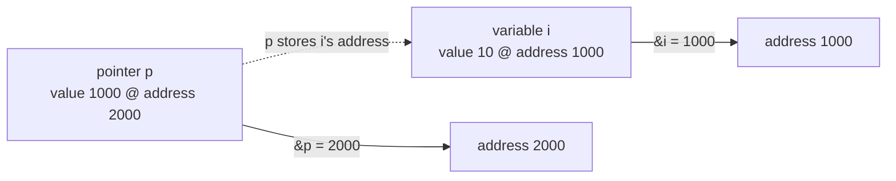
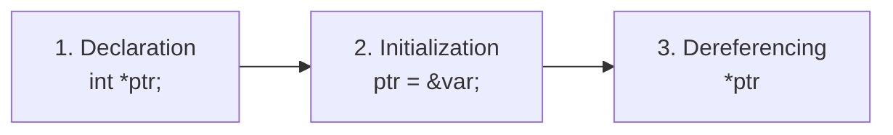

# Advanced C — Lecture 2: Pointers

## Memory Model and Addresses

Main memory is divided into **bytes**; each byte holds **8 bits** and has a unique **address** (0, 1, 2, …, n−1). Every **variable** has a **memory location**, and every location has an **address** readable with the **ampersand (`&`) operator**.



## What a Pointer Is

A **pointer** is a datatype that holds a **memory address** — it points to the location where the first byte of something is stored. A pointer can store the address of a **variable**, **function**, **array**, **structure**, or **another pointer**.

```c
data_type *pointer_name;
```

The declaration states three things: the **data type** of the pointed-to value, the **pointer name**, and the **asterisk `*`** marking the variable as a pointer. The pointed-to type matters because it controls how many bytes `*p` reads and how far `p++` moves.

## The Two Special Operators

| Operator | Name                    | Meaning                                                               |
| -------- | ----------------------- | --------------------------------------------------------------------- |
| `&`      | **Address-of**          | Returns the memory address of its operand                             |
| `*`      | **Indirection (deref)** | Complement of `&`: returns the value stored at the pointed-to address |

`&` and `*` undo each other: `*&i` is `i` again (see the alias quiz below).

## Using a Pointer in Three Steps



1. **Declaration** — create the pointer, no value yet.
2. **Initialization** — store an address in it, normally via `&`.
3. **Dereferencing** — access the value at that address via `*`.

Declaration and initialization can be merged into one step, called a **pointer definition**:

```c
int *ptr = &var;   // definition: declared + initialized at once
```

> [!NOTE]
> Always initialize a pointer before use. An uninitialized pointer holds garbage — reading or writing through it is undefined behaviour (see caution below).

## First Full Example

```c
#include <stdio.h>

void geeks() {
  int var = 10;
  int *ptr;       // declare: type of ptr and var must match
  ptr = &var;     // initialize: store var's address
  printf("Value at ptr = %p\n", ptr);
  printf("Value at var = %d\n", var);
  printf("Value at *ptr = %d\n", *ptr);
}

int main() {
  geeks();
  return 0;
}
```

Verified output (address varies per run):

```text
Value at ptr = 0x7ffe5e45d8b4
Value at var = 10
Value at *ptr = 10
```

`ptr` prints an address (`%p`), `var` and `*ptr` both print `10` — two names for one cell.

## `const` Pointer Quiz

```c
void fun(const int *p) {
  *p = 0;   // ERROR: assignment of read-only location *p
}

int main() {
  const int i = 10;
  fun(&i);
  return 0;
}
```

Output: **compile error** — `read-only variable is not assignable` (verified). `const int *p` means "pointer to constant int": the address can change, the pointed-to value cannot be written through `p`.

## Which Expressions Are Aliases of `i`?

Given `int i = 10; int *p = &i;` with `i` at 1000 holding 10 and `p` at 2000 holding 1000:

| Option | Expression | Evaluates to               | Alias of `i`?              |
| ------ | ---------- | -------------------------- | -------------------------- |
| a)     | `*p`       | `*(1000)` = 10             | **Yes**                    |
| b)     | `*&p`      | `*(&p)` = `*(2000)` = 1000 | No — equals `p`            |
| c)     | `&p`       | 2000                       | No — address of `p` itself |
| d)     | `*i`       | `*(10)` — nonsense         | No — `i` is not an address |
| e)     | `*&i`      | `*(&i)` = `*(1000)` = 10   | **Yes**                    |

Answer: **(a) and (e)**. The rule is mechanical: `*&X` cancels to `X`, so `*&p` is just `p` and `*&i` is just `i`.

## Caution: Uninitialized Pointers

```c
int *ptr;
printf("%d", *ptr);   // undefined behaviour: ptr points nowhere valid
```

```c
int *ptr;
*ptr = 1;             // segmentation fault (SIGSEGV): write to illegal memory
```

A **segmentation fault** is the program trying to read or write an illegal memory location. Never apply `*` to, or assign through, a pointer that has not been given a valid address.

## Pointer Arithmetic

A pointer stores an address, not an ordinary number, so only a few operations are legal:

- **Increment/decrement** of a pointer
- **Addition** of an integer to a pointer
- **Subtraction** of an integer from a pointer
- **Subtraction** of two pointers of the same type
- **Comparison** of pointers

### Increment and decrement scale by type size

`p++` moves by `sizeof(pointed-to type)` bytes, not by 1:

```c
#include <stdio.h>
int main() {
  int a = 22;
  int *p = &a;
  printf("p = %u\n", p);      // e.g. 6422288
  p++;
  printf("p++ = %u\n", p);    // +4 bytes (int)
  p--;
  printf("p-- = %u\n", p);    // -4, restored

  char c = 'a';
  char *r = &c;
  printf("r = %u\n", r);
  r++;
  printf("r++ = %u\n", r);    // +1 byte (char)
  r--;
  printf("r-- = %u\n", r);    // -1, restored
  return 0;
}
```

Verified: `sizeof(int)=4`, `p+1` is 4 bytes ahead; `sizeof(char)=1`, `r+1` is 1 byte ahead. In both cases `(p+1)-p == 1` — pointer difference counts **elements**, not bytes.

> [!NOTE]
> Print pointers with **`%p`** (hexadecimal). The slides use `%u` for readability, but `%p` with a `(void *)` cast is the correct, warning-free form.

### Adding an integer

The integer is first multiplied by the element size, then added:

```text
ptr = 1000 + sizeof(int) * 5 = 1020
```

### Subtracting an integer

Same scaling, opposite direction:

```text
ptr = 1000 - sizeof(int) * 5 = 980
```

```c
int N = 4;
int *ptr1, *ptr2;
ptr1 = &N;
ptr2 = &N;
printf("before: %p\n", ptr2);
ptr2 = ptr2 - 3;              // back by 3 ints = 12 bytes
printf("after:  %p\n", ptr2);
```

Verified: the address drops by exactly 12 bytes.

### Subtracting two pointers

Allowed **only for the same data type**. The result is the **number of elements between them**, computed as address difference divided by element size:

```c
int x = 6, N = 4;
int *ptr1 = &N, *ptr2 = &x;
x = ptr1 - ptr2;   // adjacent ints -> 1
```

```text
ptr1 = 2715594428, ptr2 = 2715594424
Subtraction of ptr1 & ptr2 is 1
```

### Comparing pointers

Relational (`<`, `>`, `<=`, `>=`) and equality (`==`, `!=`) operators work, but meaningfully **only when both pointers point into the same array** (e.g. `ptr < arr + n` as a loop bound).

## Double Pointers

A **pointer to a pointer** stores the address of another pointer: the first pointer holds a variable's address, the second holds the first pointer's address. A double pointer occupies the **same amount of stack space** as a normal pointer.

```mermaid
flowchart LR
  V["val = 5"] <--"|ptr stores &val"| P["ptr"] <--"|d_ptr stores &ptr"| D["d_ptr"]
```

```c
data_type_of_pointer **name_of_variable = &normal_pointer_variable;

int val = 5;
int *ptr = &val;       // address of val
int **d_ptr = &ptr;    // address of ptr
```

Full chain, verified:

```c
#include <stdio.h>
int main() {
  int var = 789;
  int *ptr2;     // pointer for var
  int **ptr1;    // double pointer for ptr2
  ptr2 = &var;
  ptr1 = &ptr2;
  printf("Value of var = %d\n", var);                              // 789
  printf("Value of var using single pointer = %d\n", *ptr2);       // 789
  printf("Value of var using double pointer = %d\n", **ptr1);      // 789
  return 0;
}
```

```text
Value of var = 789
Value of var using single pointer = 789
Value of var using double pointer = 789
```

> [!WARNING]
> In the slides' address-printing example, `printf("address of a: %x\n", p)` passes a pointer where `%x` expects an `unsigned int` — undefined behaviour on 64-bit machines. Use `%p` with `(void *)` casts instead.

### Multilevel pointers

Double pointers are not the limit. To change a double pointer's value through a function you need one more level — a **triple pointer**, i.e. a pointer to a pointer to a pointer:

```c
int ***t_ptr;
```

## Void Pointers

A **void pointer** has no associated data type. It can point to any type but must be **cast** before dereferencing, since the compiler otherwise does not know how many bytes to read:

```c
#include <stdio.h>
int main() {
  int n = 10;
  void *ptr = &n;
  printf("%d", *(int *)ptr);   // cast to int* first -> 10
  return 0;
}
```

## Pre vs. Post Increment Quiz Trio

**Q1** — `int i = 0; int x = i++, y = ++i;` prints `0 2` (verified). Trace: `x = i++` takes 0 then `i`->1; `++i` makes `i`->2 then `y` takes 2.

**Q2** — `int i = 10; int *p = &i; printf("%d\n", *p++);` prints `10` (verified). Postfix `++` binds to `p`, not `*p`: the value at the _old_ address prints, then `p` advances past `i` (`i` itself stays 10).

**Q3** — `int x = 4, y, z; y = --x; z = x--; printf("%d%d%d", x, y, z);` prints `233` (verified). Trace: `y = --x` -> `x`=3, `y`=3; `z = x--` -> `z`=3, `x`=2.

| Expression    | When the ±1 happens | Value used in the enclosing expression |
| ------------- | ------------------- | -------------------------------------- |
| `++x` / `--x` | **Before** (pre)    | The new value                          |
| `x++` / `x--` | **After** (post)    | The old value                          |

The same rule governs `*p++` (deref old `p`, then move) vs. `*--p` / `*(--p)` (move first, then deref):

```c
int a[] = {5, 16, 7, 89, 45, 32, 23, 10};
int *p = &a[2];            // points at 7
printf("%d ", *(--p));     // p -> a[1], prints 16
printf("%d", *(p--));      // prints 16, then p -> a[0]
```

Verified output: `16 16`.

## NULL Pointers

When you have no address to assign yet, initialize the pointer to **NULL** at declaration. A pointer holding NULL is a **null pointer** — a constant with value zero defined in the standard headers:

```c
#include <stdio.h>
int main() {
  int *ptr = NULL;
  printf("The value of ptr is : %x\n", ptr);   // 0
  return 0;
}
```

```text
The value of ptr is 0
```

NULL marks "points to nothing", so a check like `if (ptr != NULL)` can guard every dereference.

## Dangling Pointers

A **dangling pointer** points to memory that no longer exists — typically after `free`:

```c
int main() {
  int *ptr = (int *) malloc(2 * sizeof(int));
  /* ... use it ... */
  free(ptr);   // memory released, but ptr still holds the old address
  return 0;
}
```

Fix: reset the pointer immediately after freeing, so it becomes a harmless NULL instead of a dangling address:

```c
free(ptr);
ptr = NULL;   // no longer dangling
```

## Pointers and Arrays

The **array name is a pointer to its first element**: `myNumbers` and `&myNumbers[0]` print the same address, and `*myNumbers` reads the first element.

```c
int myNumbers[4] = {25, 50, 75, 100};
printf("%p\n", myNumbers);     // address of the array
printf("%p\n", &myNumbers[0]); // same address
printf("%d", *myNumbers);      // 25
```

Other elements are reached by scaling arithmetic — `*(arr + i)` is exactly `arr[i]`:

```c
printf("%d\n", *(myNumbers + 1));   // second element
printf("%d", *(myNumbers + 2));    // third element
```

Or by walking a pointer in a loop:

```c
int myNumbers[4] = {25, 50, 75, 100};
int *ptr = myNumbers;
for (int i = 0; i < 4; i++) {
  printf("%d\n", *(ptr + i));
}
```

### Mid-array pointer offsets

```c
#include <stdio.h>
int main() {
  int x[5] = {1, 2, 3, 4, 5};
  int *ptr;
  ptr = &x[2];                              // points at 3
  printf("*ptr = %d\n", *ptr);              // 3
  printf("*(ptr+1) = %d\n", *(ptr + 1));    // 4
  printf("*(ptr-1) = %d\n", *(ptr - 1));    // 2
  return 0;
}
```

Verified output: `3`, `4`, `2`.

### Forward walk with `ptr++`

```c
const int MAX = 3;
int main() {
  int var[] = {10, 100, 200};
  int i, *ptr;
  ptr = var; // == &var[0]
  for (i = 0; i < MAX; i++) {
    printf("Address of var[%d] = %x\n", i, ptr);
    printf("Value of var[%d] = %d\n", i, *ptr);
    ptr++; // next element (+4 bytes)
  }
  return 0;
}
```

Verified: values 10, 100, 200 with addresses 4 bytes apart (`…dc`, `…e0`, `…e4`).

### Backward walk with `ptr--`

```c
ptr = &var[MAX - 1]; // start at the last element
for (i = MAX; i > 0; i--) {
  printf("Address of var[%d] = %x\n", i - 1, ptr);
  printf("Value of var[%d] = %d\n", i - 1, *ptr);
  ptr--; // previous element
}
```

Verified: values 200, 100, 10 in that order.

### Returning two results through pointers (`minMax`)

```c
#include <stdio.h>
void minMax(int arr[], int len, int *min, int *max) {
  *min = *max = arr[0];
  int i;
  for (i = 1; i < len; i++) {
    if (arr[i] > *max) *max = arr[i];
    if (arr[i] < *min) *min = arr[i];
  }
}

int main() {
  int a[] = {23, 4, 21, 98, 987, 45, 32, 10, 123, 986, 50, 3, 4, 5};
  int min, max;
  int len = sizeof(a) / sizeof(a[0]);
  minMax(a, len, &min, &max);
  printf("Minimum value in the array is: %d and Maximum value is: %d", min, max);
  return 0;
}
```

Verified output:

```text
Minimum value in the array is: 3 and Maximum value is: 987
```

> [!NOTE]
> A function can `return` only one value, but pointer (reference) parameters let it write back as many results as needed — here `&min` and `&max` receive both answers. Note `int arr[]` as a parameter is really `int *arr`, which is why the caller's array is read directly with no copying.

---

_15 min read (source: 14 min)_
