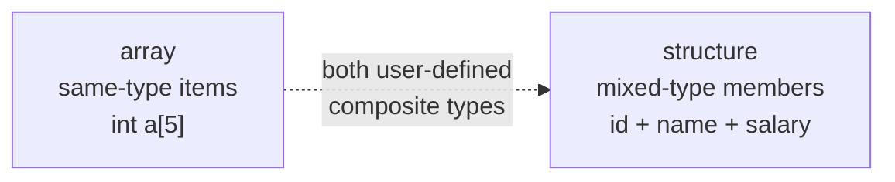
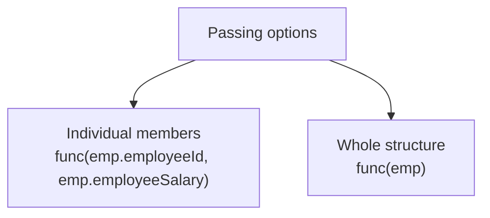
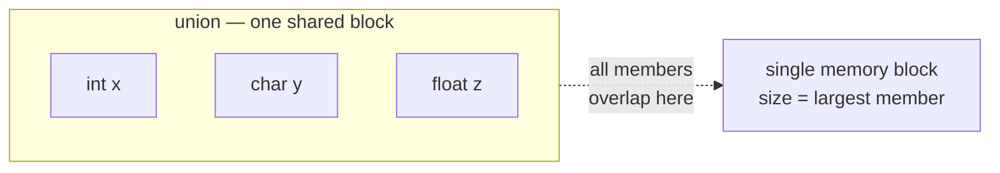

# Advanced C - Lecture 3: Structure and Union

## What a Structure Is

An **array** holds several data items of the **same kind**. A **structure** is another **user-defined data type** that combines data items of **different kinds** into one type. Structures represent a **record** — a convenient way to group several pieces of related information together.



The **`struct` keyword** defines a structure. Its items are called **members**, and each member can be any valid data type.

## Structure Declaration

A structure must be declared before use. The declaration lists member variables with their datatypes, but **allocates no memory** — it is only a **template** (also called a structure **prototype**).

```c
struct structure_name {
  data_type member_name1;
  data_type member_name2;
  ...
};
```

Example template:

```c
struct Employee {
  int employeeId;
  char employeeName[20];
  float employeeSalary;
};
```

## Declaring Structure Variables

Two ways to declare a variable of a structure type:

| Method                 | Where                              | Code                      |
| ---------------------- | ---------------------------------- | ------------------------- |
| **1. Inside `main()`** | Declare with `struct` where needed | `struct Employee e1, e2;` |
| **2. At definition**   | List names after the closing `}`   | `} e1, e2;`               |

**Method 1** is better when the number of variables is **not fixed** — you can declare more, anywhere. **Method 2** is better when the number is **fixed** — it saves re-declaring inside `main()`.

```c
// Method 1
struct Employee {
  int employeeId;
  char employeeName[20];
  float employeeSalary;
};

int main() {
  struct Employee employee1, employee2;
  ...
}

// Method 2
struct Employee {
  int employeeId;
  char employeeName[20];
  float employeeSalary;
} employee1, employee2;
```

## Accessing Structure Members

Two operators reach a member:

| Operator | Name                           | Used with                   |
| -------- | ------------------------------ | --------------------------- |
| `.`      | **Member (dot) operator**      | Structure variable directly |
| `->`     | **Structure pointer operator** | Pointer to a structure      |

```c
#include <stdio.h>
#include <string.h>

struct Employee {
  int employeeId;
  char employeeName[50];
};

int main() {
  struct Employee employee1;   // declare a variable for the structure

  employee1.employeeId = 101;
  strcpy(employee1.employeeName, "Sonoo Jaiswal");   // copy string into char array

  printf("employee 1 id : %d\n", employee1.employeeId);
  printf("employee 1 name : %s\n", employee1.employeeName);
  return 0;
}
```

Verified output:

```text
employee 1 id : 101
employee 1 name : Sonoo Jaiswal
```

> [!NOTE]
> A `char` array member cannot be assigned with `=`. Use `strcpy` (from `string.h`) to copy a string into it.

## `typedef` in C

**`typedef`** stands for **type definition** — it gives a **new name (alias)** to an existing data type.

```c
typedef <existing_name> <alias_name>
```

- `existing_name` — an already-existing type
- `alias_name` — the new name for it

```c
#include <stdio.h>

int main() {
  typedef unsigned int Unit;
  Unit firstValue, secondValue;
  firstValue = 10;
  secondValue = 20;
  printf("Value of i is :%d", firstValue);
  printf("\nValue of j is :%d", secondValue);
  return 0;
}
```

Verified output:

```text
Value of i is :10
Value of j is :20
```

### `typedef` with structures

A plain struct declaration forces the wordy `struct student s1;` form. `typedef` removes the repetition:

```c
// Without typedef — verbose variable declarations
struct Student {
  char studentName[20];
  int studentAge;
};
struct Student student1, student2;

// With typedef — the tag is aliased to a short name
typedef struct Student {
  char studentName[20];
  int studentAge;
} Student;
Student student1, student2;
```

The typedef can also be written **inline** at the struct definition, as shown above — the alias `Student` follows the closing brace.

### `typedef` with pointers

`typedef` can alias a pointer type, so multiple pointers share one declaration line:

```c
// Normal pointer declaration
int *pointer;

// Rename the pointer type
typedef int *IntPtr;

// Now create int* variables using the alias
IntPtr firstPointer, secondPointer;
```

> [!NOTE]
> Without the typedef, `int *p1, p2;` declares only **one** pointer (`p2` is a plain `int`). With `typedef int *IntPtr;`, `IntPtr p1, p2;` declares **two** pointers.

## Array of Structures

An **array of structures** is a collection of multiple structure variables, each holding information about a different entity — also called the **collection of structures**. It stores information about multiple entities of different data types.

```c
#include <stdio.h>
#include <string.h>

struct Student {
  int studentRollNumber;
  char studentName[10];
};

int main() {
  int index;
  struct Student classRecord[5];

  printf("Enter Records of 5 students");
  for (index = 0; index < 5; index++) {
    printf("\nEnter Rollno:");
    scanf("%d", &classRecord[index].studentRollNumber);
    printf("\nEnter Name:");
    scanf("%s", &classRecord[index].studentName);
  }

  printf("\nStudent Information List:");
  for (index = 0; index < 5; index++) {
    printf("\nRollno:%d, Name:%s", classRecord[index].studentRollNumber,
           classRecord[index].studentName);
  }
  return 0;
}
```

Verified output (with input `1 Alice`, `2 Bob`, …):

```text
Student Information List:
Rollno:1, Name:Alice
Rollno:2, Name:Bob
Rollno:3, Name:Charlie
Rollno:4, Name:Diana
Rollno:5, Name:Eve
```

## Nested Structures

A **nested structure** is a **structure within a structure** — one structure declared inside another, just like any other member. The nested variable can be a normal structure variable.

Two ways to nest:

| Way                    | How                                                                                    | Trade-off                                                      |
| ---------------------- | -------------------------------------------------------------------------------------- | -------------------------------------------------------------- |
| **Separate structure** | Create two structures; the dependent one is used as a member inside the main structure | Reusable elsewhere                                             |
| **Embedded structure** | Declare the structure inside the structure                                             | Fewer lines, but **cannot** be reused in other data structures |

### Accessing nested members

Reach the inner member by chaining with the dot operator:

```text
OuterStructure.NestedStructure.member
```

### Example (separate structure, embedded as member)

```c
#include <stdio.h>
#include <string.h>

struct Date {
  int day;
  int month;
  int year;
};

struct Employee {
  int employeeId;
  char employeeName[20];
  struct Date dateOfJoining;   // nested structure
};

int main() {
  struct Employee employee1;

  employee1.employeeId = 101;
  strcpy(employee1.employeeName, "Sonoo Jaiswal");
  employee1.dateOfJoining.day = 10;
  employee1.dateOfJoining.month = 11;
  employee1.dateOfJoining.year = 2014;

  printf("employee id : %d\n", employee1.employeeId);
  printf("employee name : %s\n", employee1.employeeName);
  printf("employee date of joining (dd/mm/yyyy) : %d/%d/%d\n",
         employee1.dateOfJoining.day,
         employee1.dateOfJoining.month,
         employee1.dateOfJoining.year);
  return 0;
}
```

Verified output:

```text
employee id : 101
employee name : Sonoo Jaiswal
employee date of joining (dd/mm/yyyy) : 10/11/2014
```

## Passing a Structure to a Function

Like other variables, a structure can be **passed to a function**. You may pass **individual members** into the function, or pass the **whole structure variable at once**.



## Structure Padding

**Structure padding** is a compiler feature that adds one or more **empty bytes** between member addresses to **align data in memory**.

Why it happens: the processor does **not** read 1 byte at a time — it reads **1 word** at a time. Padding lets each member start on a word boundary, so it can be fetched in a **single cycle**.

| Processor | Bytes read at a time | 1 word equals |
| --------- | -------------------- | ------------- |
| 32-bit    | 4 bytes              | 4 bytes       |
| 64-bit    | 8 bytes              | 8 bytes       |

Padding is done **automatically by the compiler**. It wastes memory, but each variable is accessed within a single cycle.

### Example: members already aligned

```c
struct Student {
  char firstMember;   // 1 byte
  char secondMember;  // 1 byte
  int thirdMember;    // 4 byte
};

int main() {
  struct Student student1;
  printf("The size of the student structure is %zu\n", sizeof(student1));
  return 0;
}
```

Verified output: `The size of the student structure is 8` — the two `char`s (1+1) sit in the first 2 bytes, then 2 padding bytes align the `int` to offset 4, giving 4+4 = 8.

### Example: changing member order

```c
struct Student {
  char firstMember;   // 1 byte
  int secondMember;   // 4 byte
  char thirdMember;   // 1 byte
};
```

Verified output: `The size of the student structure is 12` — the `int` is padded to offset 4 (3 bytes), and a trailing `char` is padded to a full 4-byte word: 4 + 4 + 4 = 12.

> [!WARNING]
> Member **order changes the size** even with identical members. Placing larger members first usually minimizes padding.

## Avoiding Structure Padding

Padding is automatic and makes the structure larger than the sum of its members. When that matters, disable it in two ways:

| Method                        | How                                       | Portability                             |
| ----------------------------- | ----------------------------------------- | --------------------------------------- |
| **`#pragma pack(1)`**         | Compiler directive before the struct      | Widely supported, but compiler-specific |
| **`__attribute__((packed))`** | GCC/Clang attribute after the struct body | GCC/Clang only                          |

### Using `#pragma pack(1)`

```c
#include <stdio.h>

#pragma pack(1)
struct Base {
  int firstMember;    // 4 byte
  char secondMember;  // 1 byte
  double thirdMember; // 8 byte
};

int main() {
  struct Base variable;
  printf("The size of the var is %zu\n", sizeof(variable));
  return 0;
}
```

### Using `__attribute__((packed))`

```c
#include <stdio.h>

struct Base {
  int firstMember;    // 4 byte
  char secondMember;  // 1 byte
  double thirdMember; // 8 byte
} __attribute__((packed));

int main() {
  struct Base variable;
  printf("The size of the var is %zu\n", sizeof(variable));
  return 0;
}
```

Both verified outputs: `The size of the var is 13` (4+1+8, no padding).

> [!NOTE]
> Without packing the same struct is **16 bytes** (verified) — the `double` is aligned to offset 8. Packing saves 3 bytes but may cost slower, unaligned access on some processors.

## Union

A **union** is a **user-defined data type** — a collection of different variables of different data types in the **same memory location**. It can be defined with many members, but **only one member can hold a value at a particular point in time**.

It is declared exactly like a structure, except the **`union` keyword** replaces `struct`. The size of a union always equals the size of its **largest member**.



### Why use a union

- **Embedded systems** — mutually exclusive data members share the same memory, vital when memory is scarce.
- **Saving memory** — all members share one block, so total size is only as large as the biggest member.
- **Hardware access** — interact with hardware registers or bit-fields where one address represents different formats.

### Syntax

```c
// C Union declaration
union UnionName {
  datatype member1;
  datatype member2;
  ...
};

// Define union variables — two methods
// 1. With the declaration
union UnionName {
  datatype member1;
  datatype member2;
  ...
} variable1, variable2, ...;

// 2. After the declaration
union UnionName variable1, variable2, variable3, ...;

// Access union members — dot operator, same as structures
variable1.member1;
variable1.member1.memberA;   // nested union
```

### Example: size of unions

```c
#include <stdio.h>

union Test1 {
  int firstMember;
  int secondMember;
};

union Test2 {
  int firstMember;
  char secondMember;
};

union Test3 {
  int arrayMember[10];
  char secondMember;
};

int main() {
  int size1 = sizeof(union Test1);
  int size2 = sizeof(union Test2);
  int size3 = sizeof(union Test3);

  printf("Sizeof test1: %d\n", size1);
  printf("Sizeof test2: %d\n", size2);
  printf("Sizeof test3: %d\n", size3);
  return 0;
}
```

Verified output:

```text
Sizeof test1: 4
Sizeof test2: 4
Sizeof test3: 40
```

Each union is as big as its largest member: `int` = 4, `int` = 4 (the `char` shares it), `int[10]` = 40.

### Example: members share memory

```c
#include <stdio.h>

union Test {
  int firstMember;
  int secondMember;
};

int main() {
  union Test testVariable;

  testVariable.firstMember = 2;   // secondMember also becomes 2
  printf("After making x = 2:\n x = %d, y = %d\n\n",
         testVariable.firstMember, testVariable.secondMember);

  testVariable.secondMember = 10;   // firstMember is also updated to 10
  printf("After making y = 10:\n x = %d, y = %d\n\n",
         testVariable.firstMember, testVariable.secondMember);
  return 0;
}
```

Verified output:

```text
After making x = 2:
 x = 2, y = 2

After making y = 10:
 x = 10, y = 10
```

Writing one member overwrites the other — both read the same bytes.

## Structure vs. Union

| Aspect           | **Structure**                       | **Union**                                   |
| ---------------- | ----------------------------------- | ------------------------------------------- |
| Keyword          | `struct`                            | `union`                                     |
| Memory           | Each member has **its own** memory  | All members **share** one memory location   |
| Members active   | **All** members hold values at once | Only **one** member holds a value at a time |
| Size             | Sum of members (plus padding)       | Size of the **largest** member              |
| Writing a member | Does **not** affect other members   | **Overwrites** the other members            |
| Use when         | Related data must coexist           | Data is **mutually exclusive**; save memory |

> [!NOTE]
> Both are accessed with the `.` operator (or `->` through a pointer), both are user-defined, and both are declared before use. The difference is purely about **memory sharing**.

---

_13 min read (source: 15 min)_
