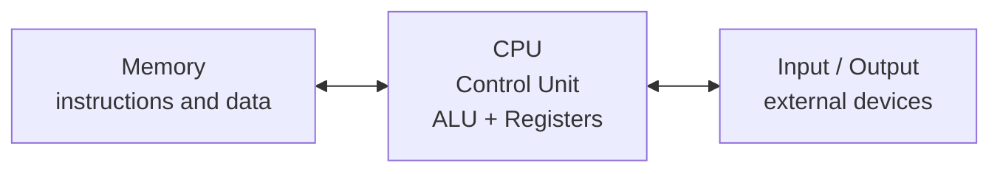

# Computer Architecture - Lecture 1

## Computer Architecture vs. Organization

**Architecture** is the programmer-visible contract; **organization** is the hardware that implements it. Same design, two questions: _what can the programmer see_ vs. _how the silicon does it._

| Computer Architecture          | Computer Organization       |
| ------------------------------ | --------------------------- |
| Programmer-visible features   | Hardware implementation     |
| **Instruction-set architecture** | **Datapath and control unit** |
| Registers and data types      | ALU and register file       |
| Addressing modes              | Pipeline and cache design   |
| Memory and I/O model          | Buses and memory technology |

> [!NOTE] Test the boundary
> `add x5, x6, x7` is **architecture** — the instruction exists and its operands are named. The **ALU** and the **control signals** that carry it out are **organization**. _Why it matters:_ changing the ALU costs nothing in the programmer-visible contract, so the two evolve independently.

## Levels of Abstraction

Each layer hides the one below it, so a programmer never needs the hardware to write correct code.

- **Application programs**
- **High-level language**
- **Compiler / operating system** — translates and manages the layers below
- **Assembly language**
- **Instruction-set architecture** — the boundary this course studies
- **Datapath and control**
- **Digital logic**
- **Transistors and circuits**

> [!WARNING] Common Mistake
> _Architecture_ is not "the whole computer." It is only the programmer-visible slice; everything below the ISA is organization.

## Main Components of a Computer

- **Computer** = **Processor** + **Memory**, wired to **Input/Output**.
  - **Processor** splits into **Control** (decides what happens) and **Datapath** (does the work) — the same split as control unit vs. ALU + registers.
  - **Compiler** and **Interface** sit _outside_ the computer boundary; **evaluating performance** is the engineer's task, not a component.
- **On a real SoC die shot** the same idea appears as silicon: processor datapath blocks (1 and 2), Arm cores, digital logic blocks, DDR SDRAM interface, USB, GPIO, I/O, WiFi, video DAC, audio.

## Von Neumann Architecture



- **Stored-program concept** — instructions and data are stored in memory and accessed by the processor. _Why it matters:_ the program is just data, so a machine can fetch, alter, and loop over instructions.
- **Program Counter (PC)** — holds the address of the next instruction; the Fetch stage reads from it.
- **Instruction memory** — provides the instruction.
- **Data memory** — stores operands and results.

## Instruction-Execution Cycle

| Stage          | What happens                                            |
| -------------- | ------------------------------------------------------- |
| **Fetch**      | Read the instruction using the program counter          |
| **Decode**     | Identify the operation, operands, and control signals   |
| **Execute**    | Perform an ALU operation or calculate an address        |
| **Memory access** | Read or write data when required                     |
| **Write back** | Store the result in the destination register            |

> [!NOTE] Why the order is fixed
> Each stage consumes the previous stage's output — the address from Execute is what Memory access uses — so the five stages repeat once per instruction.

## Computer Performance

```text
CPU Execution Time = Instruction Count × CPI × Clock Cycle Time
CPU Execution Time = (Instruction Count × CPI) / Clock Rate
```

- **Instruction count** — number of instructions executed.
- **CPI** — average clock cycles per instruction.
- **Clock rate** — clock cycles per second.
- **Cache misses, branches, and memory latency** also affect performance, by inflating CPI.

> [!WARNING] Common Mistake
> Execution time counts _cycles_, not instructions. Fewer, fatter instructions cut instruction count but may push CPI up — the product is what matters.

### Microprocessor Trend Data (42 years, source: karlrupp.net)

The historical "**50% improvement every year**" is _not_ explained by clock speed alone.

| Series                                     | Trend                          |
| ------------------------------------------ | ------------------------------ |
| **Transistors** (thousands)                | ~$10^7$ — relentless growth    |
| **Single-thread performance** (SpecINT ×10³) | ~$10^5$ — tracks transistors, flattens after ~2010 |
| **Frequency** (MHz)                        | ~$10^3$ — plateaus after ~2005 |
| **Typical power** (watts)                  | ~$10^2$ — roughly flat         |
| **Number of logical cores**                 | ~1 until ~2004, then grows     |

> [!NOTE] The takeaway
> Transistor count kept climbing, yet frequency and power did not — so post-2010 speedups came from **more cores** and better **microarchitecture**, not from raising the clock.

## Power Consumption Trends

```text
Dynamic power ∝ activity × capacitance × voltage² × frequency
```

- Voltage and frequency are now roughly constant, while **capacitance per transistor decreases** and **transistor count (activity) increases**.
- **Leakage power** is also rising — a function of transistor count and voltage.

| Era            | Event                                          | Consequence                                |
| -------------- | ---------------------------------------------- | ------------------------------------------ |
| Early 2000s    | Frequency increases raise power                | **Power wall**; frequency stagnates after |
| Early 2010s    | **Dennard scaling** (voltage scaling) ends      | **Dark silicon** (unusable cores) and **dim silicon** (occasional turbo) |

## Home Work 1

**Computer System Abstraction and Von Neumann Architecture** — a 2–3-page report, due **Week 2**, submitted as a **PDF**.

1. Define computer architecture and computer organization.
2. Draw and label a Von Neumann architecture diagram.
3. Differentiate between RISC and CISC architecture.
4. Explain the stored-program concept and instruction cycle.
5. Discuss the **Von Neumann bottleneck**.

## References

- Patterson, D. A., & Hennessy, J. L. (2018). _Computer Organization and Design: The Hardware/Software Interface, RISC-V Edition_. Morgan Kaufmann, Elsevier.
- **RISC-V International** — RISC-V ISA resources and specifications.
- **RARS** — RISC-V Assembler and Runtime Simulator.
- Course notes and laboratory manual.

> [!WARNING] Exam Note
> Use one approved textbook edition consistently in the official course specification.

## Lecture Objectives

1. Define **computer architecture** and **computer organization**.
2. Identify the main components of a computer system.
3. Explain the **stored-program concept** and **Von Neumann architecture**.
4. Distinguish between **hardware**, **software**, and **firmware**.
5. Explain the basic **instruction-execution cycle**.
6. Introduce **RISC-V** as the instruction-set architecture used in this course.

> [!NOTE] Not covered in the slides
> Objectives 4 and 6 are stated but the deck never defines hardware/software/firmware or introduces RISC-V — only the textbook and RARS references. Expect them in the homework and exam.

**Next lecture:** data representation and RISC-V instruction basics.

_7 min read (source: 5 min)_
