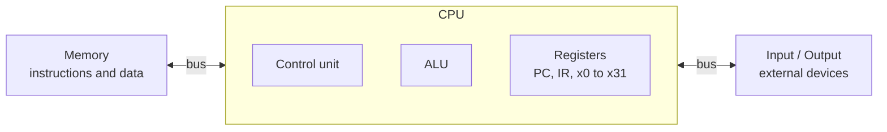
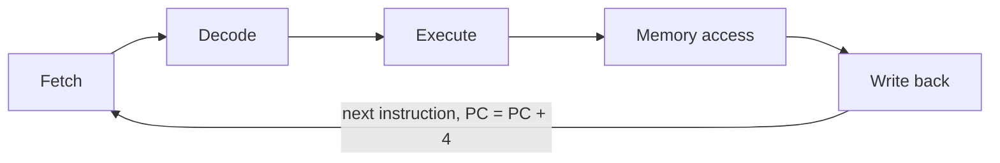

| Data    | Details                  |
| :------ | :----------------------- |
| Name    | ‎أحمد علي أحمد علي عثمان |
| Code    | 20241807                 |
| Section | 1                        |

# Computer Architecture - Home Work 1

## Computer System Abstraction and Von Neumann Architecture

Prepare a 2-3-page report.

1. Define computer architecture and computer organization.
2. Draw and label a Von Neumann architecture diagram.
3. Differentiate between RISC and CISC architectures.
4. Explain the stored-program concept and instruction cycle.
5. Discuss the Von Neumann bottleneck.

---

## 1. Computer Architecture vs. Computer Organization

**Computer architecture** is the set of features a programmer can see. It covers the instruction set, registers, data types, addressing modes, and the memory and I/O model. Example: `add x5, x6, x7` adds the values in registers x6 and x7 and puts the sum in x5.

**Computer organization** is how the hardware carries out those features. It covers the datapath, control unit, ALU, register file, pipeline, cache, buses, and memory technology. Example: the ALU and the control signals that run the `add` instruction.

> [!IMPORTANT] Key consequence
> Two processors can share one architecture and have different organizations. Intel and AMD both build x86 chips with different internal designs, and a program runs unchanged on both. Only a change in architecture breaks the program.

## 2. Von Neumann Architecture

| Block      | Component        | Function                                                                                             |
| ---------- | ---------------- | ---------------------------------------------------------------------------------------------------- |
| **Memory** | Instructions     | Hold the program and supplies each instruction                                                       |
|            | Data             | Holds operands and results                                                                           |
| **CPU**    | Control Unit     | Fetches and decodes instructions, then issues control signals                                        |
|            | Registers        | PC holds the next instruction address, IR holds the current instruction, x0 to x31 hold working data |
|            | ALU              | Performs arithmetic and logic                                                                        |
| **I/O**    | External devices | Keyboard, monitor, disk, network                                                                     |

## 3. RISC vs. CISC

**RISC:** _Reduced_ Instruction Set Computer.
**CISC:** _Complex_ Instruction Set Computer.

| Feature              | RISC                        | CISC                                    |
| -------------------- | --------------------------- | --------------------------------------- |
| Instruction set      | Small and simple            | Large and complex                       |
| Instruction length   | Fixed, 32 bits in RISC-V    | Variable, 1 to 15 bytes in x86          |
| Work per instruction | One simple step             | Several steps, such as load, add, store |
| Memory access        | Only load and store         | Many instructions use memory directly   |
| Registers            | Many, 32 in RISC-V          | Fewer, 16 general ones in x86-64        |
| Pipelining           | Easy, with a simple decoder | Harder, with a complex decoder          |
| Code size            | Larger programs             | Smaller programs                        |
| Control unit         | Mostly hardwired            | Often microprogrammed                   |
| Examples             | RISC-V, ARM, MIPS           | x86, VAX                                |

RISC trades more instructions for simpler, faster hardware. CISC trades hardware complexity for shorter programs. Modern x86 chips split complex instructions into simple internal micro-operations, so they borrow the RISC idea inside.

> [!NOTE] Modern reality
> A modern x86 processor splits each complex instruction into simple internal micro-operations and runs them on a RISC-style pipeline. The difference now lies mainly in the instruction set seen by the programmer.

## 4. The Stored-Program Concept and the Instruction Cycle

### The Stored-Program Concept

A program and its data are both stored as binary numbers in the same memory. The CPU reads each instruction from memory, using the program counter (PC) as the address. To run a different program, you load different contents into memory. Early machines like ENIAC needed rewiring for each new job. John von Neumann described the stored-program design in his 1945 EDVAC report.

Two results follow.

- The PC moves to the next instruction after each fetch, so a program runs in order by default.
- A branch changes the PC, which lets programs jump, loop, and call functions.

### The Instruction Cycle

The CPU repeats five stages for every instruction, one state per clock cycle:

| Step | Stage         | What happens                                                                         |
| ---- | ------------- | ------------------------------------------------------------------------------------ |
| 1    | Fetch         | Read the instruction at the address in the PC, load it into the IR, set PC to PC + 4 |
| 2    | Decode        | Identify the operation and operands, and set the control signals                     |
| 3    | Execute       | The ALU computes a result or an address                                              |
| 4    | Memory access | Read or write data memory, only for load and store instructions                      |
| 5    | Write back    | Store the result in the destination register                                         |

Each stage needs the output of the one before it, so the order is fixed. Not every instruction uses every stage. An `add` skips memory access. A store or a branch skips write back.

Trace of `add x5, x6, x7`. Fetch reads the instruction. Decode reads x6 and x7 from the register file. Execute adds them in the ALU. Write back stores the sum in x5.

## 5. The Von Neumann Bottleneck

### The Problem

Instructions and data share one memory and one path to the CPU. The CPU cannot fetch an instruction and read data in the same cycle, so the two take turns on the bus. This limit is the Von Neumann bottleneck.

> "The CPU spends most of its time waiting for memory, not computing."

Memory speed makes it worse. A 3 GHz CPU has a cycle of about 0.33 ns. A DRAM access takes roughly 60 to 100 ns, which is 200 cycles or more. Every instruction needs one memory access to be fetched, and every load or store needs a second one. The CPU spends much of its time waiting for memory.

### The Consequences

| Effect                   | Explanation                                         |
| ------------------------ | --------------------------------------------------- |
| CPU waits                | The datapath stalls until the transfer finishes     |
| Fetch competes with data | An operand access delays the next instruction fetch |

### The Solutions

| Solution                         | What it does                                                                    | Remaining limit                      |
| -------------------------------- | ------------------------------------------------------------------------------- | ------------------------------------ |
| Harvard architecture             | Separate instruction and data memories and buses, so both are read in one cycle | Two memory spaces, harder to program |
| Modified Harvard, split L1 cache | One address space, with separate L1 instruction and data caches                 | Memory below L1 is still shared      |
| Wider buses and faster DRAM      | Raise memory bandwidth                                                          | Limits on pin count and signal rate  |

> [!NOTE] Closing Point
> Caches and pipelines **hide** the bottleneck and do not remove it. A cache miss or a branch misprediction sends the CPU back to slow memory. This is why the lecture lists cache misses, branches, and memory latency next to instruction count, CPI, and clock rate as factors in execution time.
