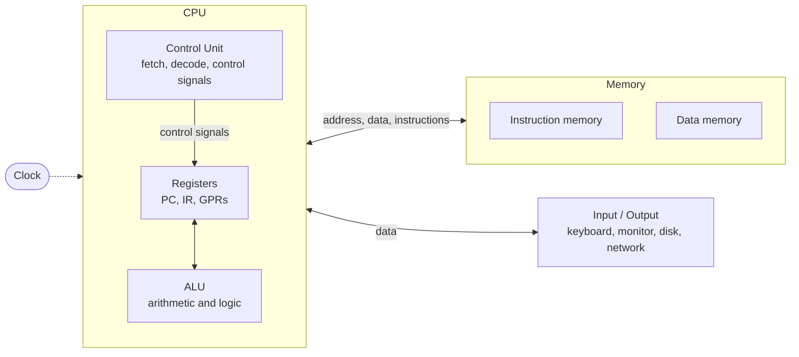

| Data    | Details                  |
| :------ | :----------------------- |
| Name    | ‎أحمد علي أحمد علي عثمان |
| Code    | 20241807                 |
| Section | 1                        |

# Computer Architecture - Home Work 1

## Computer System Abstraction and Von Neumann Architecture

Prepare a 2–3-page report.

1. Define computer architecture and computer organization.
2. Draw and label a Von Neumann architecture diagram.
3. Different between RISC and CISC architecture.
4. Explain the stored-program concept and instruction cycle.
5. Discuss the Von Neumann bottleneck.

**Due:** Week 2 · **Submitted as:** handwritten paper

---

### Answer

> [!NOTE] Handwriting Layout
> Draw the three diagrams in this answer as plain rectangles with straight lines — no curves, no shading. Every table here is a two- or three-column grid, which is quick to rule on paper. Target 2–3 pages; the trimming order is listed at the end.

## 1. Computer Architecture vs. Computer Organization

Both terms describe the same machine but answer different questions. **Computer architecture** is the set of features **visible to the programmer** — the interface between software and hardware. **Computer organization** is the way that interface is **physically implemented** — the internal structure and the flow of information inside the machine.

| Basis      | Computer Architecture                                                | Computer Organization                                              |
| ---------- | -------------------------------------------------------------------- | ------------------------------------------------------------------ |
| Answers    | *What* can the programmer use?                                       | *How* is it built?                                                 |
| Nature     | Programmer-visible, technology-independent                          | Internal, technology-dependent                                     |
| Covers     | Instruction set, registers, data types, addressing modes, memory and I/O model | Datapath, control unit, ALU, register file, clock, pipelining, cache, bus and memory technology |
| Control unit | Not specified                                                      | Hardwired **or** microprogrammed                                   |
| Example    | The instruction `add x5, x6, x7` and the existence of registers `x5–x7` | The physical ALU that adds, the control signals issued, the pipeline that issues it |

The dividing line is **intent versus implementation**. A programmer must know the instruction format, the available registers, and the addressing modes — that is architecture, and the program cannot run without it. The programmer never sees the datapath, the register file, or whether the control unit is hardwired or microprogrammed — that is organization, and the design can be replaced freely.

> [!IMPORTANT] The Key Consequence
> Two processors that implement the **same architecture** can have completely different organizations, and software written for one runs unchanged on the other. Only a change in architecture breaks the program.

## 2. Von Neumann Architecture

Draw this as **three boxes in a row** — memory on the left, CPU in the middle (subdivided into three parts), input/output on the right.

```text
        ┌─────────────┐   Address, Data,   ┌──────────────────────────┐   Data   ┌────────────────┐
        │   MEMORY    │ ◄── Instructions ─► │           CPU            │ ◄───────► │ INPUT / OUTPUT │
        │             │                     │                          │           │                │
        │ ┌─────────┐ │                     │  ┌────────────────────┐  │           │ • Keyboard     │
        │ │  Instr. │ │                     │  │   Control Unit     │  │           │ • Monitor      │
        │ │  memory │ │                     │  │  (fetch, decode,   │  │           │ • Disk         │
        │ ├─────────┤ │                     │  │   control signals) │  │           │ • Network      │
        │ │  Data   │ │                     │  └──────────┬─────────┘  │           └────────────────┘
        │ │  memory │ │                     │             │ signals     │
        │ └─────────┘ │                     │             ▼             │
        └─────────────┘                     │  ┌────────────────────┐  │
                                            │  │ Registers          │  │
                                            │  │  PC | IR | GPRs    │  │
                                            │  ├─────────┬──────────┤  │
                                            │  │         │   ALU    │  │
                                            │  │         │ arith &  │  │
                                            │  │         │  logic   │  │
                                            │  └─────────┴──────────┘  │
                                            │  Clock drives every stage│
                                            └──────────────────────────┘
```

The same figure, rendered:



**Labels to write beside the diagram:**

| Block      | Component            | Function                                                          |
| ---------- | -------------------- | ----------------------------------------------------------------- |
| **Memory** | Instruction memory   | Holds the program; supplies each instruction                       |
|            | Data memory          | Holds operands and results                                         |
| **CPU**    | Control Unit         | Fetches, decodes, and generates the control signals                |
|            | Registers            | **PC** = address of next instruction, **IR** = holds the instruction being decoded, **GPRs** = general-purpose working registers |
|            | ALU                  | Performs arithmetic and logic                                      |
| **I/O**    | External devices     | Keyboard, monitor, disk, network                                   |
| **Clock**  | —                    | Times every state change; the cycle repeats on each clock edge     |

The two arrows are the **address path** and the **data path**, and they run in **both directions**: the CPU sends an address out, and the instruction or data comes back. That two-way traffic over one shared path is exactly the problem discussed in section 5.

## 3. RISC vs. CISC

**RISC** = *Reduced* Instruction Set Computer. **CISC** = *Complex* Instruction Set Computer. The names describe the instruction set and the design philosophy behind it.

| Feature                    | RISC                                 | CISC                            |
| -------------------------- | ------------------------------------ | ------------------------------- |
| Instruction length         | Fixed                                | Variable                        |
| Instruction set            | Small, simple, regular               | Large, complex                  |
| Addressing modes per instruction | Few (1–2)                       | Many (up to 8)                  |
| Memory access              | Only **load/store** touch memory     | Any instruction may access memory |
| Instructions per cycle     | Many (pipelined)                     | Fewer, multi-cycle              |
| General-purpose registers  | Many (32+)                           | Few                             |
| Code density               | Low — more instructions needed       | High — fewer instructions needed |
| Control unit               | Mostly hardwired                     | Mostly microprogrammed          |
| Pipelining                 | Easy and regular                     | Difficult and irregular         |
| Examples                   | **RISC-V, ARM, MIPS, SPARC**         | **x86, x86-64, IA-64**          |
| Design goal                | Simple fast hardware, more cycles per program | Complex hardware, fewer cycles per program |

**The trade-off:** RISC keeps each instruction trivial, so the hardware can decode and pipeline it in one cycle — but the same task then needs *more* instructions. CISC crams more work into one instruction, so the program is shorter, but the decoder must handle many formats, which slows the clock and blocks pipelining.

> [!NOTE] Modern Reality
> The gap has narrowed. A modern x86 processor first translates each complex CISC instruction into simple internal operations, then executes those on a RISC-style pipeline. Today the distinction describes mainly the *instruction set interface*, not the internal hardware.

## 4. The Stored-Program Concept and the Instruction Cycle

### The Stored-Program Concept

Proposed by **John von Neumann (1945)**: a program and its data are both encoded in binary and held in **the same memory**, so the processor can fetch an instruction, treat it as data, and execute it. The program is not wired into the machine — it is merely numbers sitting in memory.

Its consequences:

- **The CPU can modify the program itself** — instructions are data, so they can be read, changed, and rewritten (self-modifying code).
- **Instructions are reached sequentially by default** — the **PC** advances automatically after each fetch.
- **Branches and loops become possible** — since the PC is just a register, redirecting it changes control flow.
- **Memory must be addressable and readable by both** the CPU and the I/O devices.
- It is the direct cause of the bottleneck in section 5.

### The Instruction-Execution Cycle

The CPU repeats five stages for every instruction, one state per clock cycle:

```text
Fetch ──► Decode ──► Execute ──► Memory Access ──► Write Back ──┐
  ▲                                                           │
  └───────────────────────────────────────────────────────────┘
```

| #   | Stage            | What happens                                                                                       |
| --- | ---------------- | -------------------------------------------------------------------------------------------------- |
| 1   | **Fetch**        | Read the instruction from memory at the address held in the PC; load it into the **IR**; set `PC ← PC + 4` (2 for a compressed RISC-V instruction) |
| 2   | **Decode**       | The control unit identifies the operation and the operands, and determines the control signals needed |
| 3   | **Execute**      | The ALU performs the arithmetic or logic operation, **or** calculates the effective address of the operand |
| 4   | **Memory access** | Read an operand from, or write a result to, data memory — only load/store instructions need this stage |
| 5   | **Write back**   | Store the result in the destination register                                                          |

> [!NOTE] Why the Order Cannot Change
> Each stage consumes the previous stage's output — Decode needs the instruction Fetch produced, and Memory access needs the address Execute calculated. Stages 4 and 5 are also conditional: a pure ALU instruction skips them, which is one reason RISC programs have a low CPI.

- **Single-cycle:** all five stages complete in one clock cycle — simple, but the clock must be slow enough for the slowest stage.
- **Multi-cycle / pipelined:** each stage takes one cycle, but several instructions are in the pipeline at once, so several complete per cycle.

## 5. The Von Neumann Bottleneck

### The Problem

Because instructions and data share **one memory and one communication path**, **only one of them can be transferred at a time**. The CPU can be fetching an instruction *or* reading/writing data, never both simultaneously.

> "The CPU spends most of its time waiting for memory, not computing."

This happens because **CPU speed grew far faster than memory speed**. Every instruction needs at least one memory access just to be fetched, and every load/store needs a second. The bus and the memory therefore become the limit, so performance is bound by memory **bandwidth and latency** rather than by the arithmetic hardware. Since the bus is a shared resource, **more instructions means more memory traffic means slower execution** — exactly opposite to what the programmer intends.

### The Consequences

| Effect                   | Explanation                                                          |
| ------------------------ | -------------------------------------------------------------------- |
| CPU waits                | The datapath stalls until the transfer completes                     |
| Fetch competes with data | A memory access for an operand delays the next fetch                 |
| Instruction count is penalised | Longer programs are slower for *every* instruction, not just their own |

### The Solutions

| Solution                             | What it does                                                                    | Residual bottleneck                    |
| ------------------------------------ | ------------------------------------------------------------------------------ | -------------------------------------- |
| **Harvard architecture**             | Separate instruction and data memories with separate buses — the CPU can fetch an instruction *and* access data in the same cycle | Two memory spaces, harder for the programmer |
| **Modified Harvard / split L1 cache** | One address space, but separate L1 instruction and L1 data caches              | Practically eliminated at the L1 level |
| **Wider, faster buses, DRAM improvements** | Raise memory bandwidth                                                   | Physical limits on pin count and signal rate |

> [!NOTE] Closing Point
> Caches and pipelines **hide** the bottleneck rather than remove it, because they only capture locality. The moment a program jumps to a cold address — a branch misprediction or a cache miss — the CPU waits for memory again. This is why cache misses, branches, and memory latency are listed alongside the three formula terms as contributors to execution time.

---

## Handwriting Layout

| Section | What to draw                              | Space    |
| ------- | ----------------------------------------- | -------- |
| 1       | Table only — no diagram                  | ~⅓ page  |
| 2       | The three-box sketch, with the 7 labels   | ~⅓ page  |
| 3       | Table only — no diagram                  | ~¼ page  |
| 4       | Five-stage list; optionally the stage chain | ~½ page |
| 5       | Two tables                                | ~½ page  |

**If you run short of space**, cut in this order:

1. The "Modern Reality" note in section 3.
2. The solutions table in section 5 — keep only the Harvard row.
3. The stage chain drawing in section 4.

> [!WARNING] Never Cut
> The diagram in section 2 and the bottleneck definition in section 5 carry the most marks.
