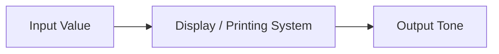

# Computer Graphics - Lecture 1

## Lecture Objectives

Define **Computer Graphics**, **RGB**, **pixel**, **resolution**, **bit depth**, **tone**, **quantization**, and **quantization error**; identify major **applications**; distinguish **2D vs. 3D** and **raster graphics**.

## What Is Computer Graphics?

**Computer Graphics** is the field of computer science concerned with **creating, manipulating, storing, and displaying images using computers**. It spans six areas:

- **Image creation**, **image processing**, **image representation**
- **Image display**, **animation**, **visualization**

### Why We Study It

Represent **visual information** · **design and visualize** objects · create **interactive applications** · **simulate** real-world environments · present **complex data** visually · create **games, animations, and movies**.

### Applications

| Domain                | Domain                     |
| --------------------- | -------------------------- |
| **CAD** (computer-aided design) | Scientific visualization |
| **Computer games**    | **Virtual reality** (VR)   |
| **Medical imaging**   | **User interfaces**        |
| **Animation & movies** | **Education & training**   |

## 2D vs. 3D Graphics

| | **2D Graphics**                     | **3D Graphics**                        |
| --- | ----------------------------------- | -------------------------------------- |
| Coordinates | **(x, y)** — two                   | **(x, y, z)** — three                  |
| Represents | Objects on a **plane**             | **Depth** and spatial structure        |
| Primitives / apps | Points, lines, circles, curves, polygons | 3D games, CAD, animation, simulation, VR, 3D modeling |
| Typical use | Icons, diagrams, charts, technical drawings, 2D games | — |

> [!NOTE] The boundary is the third coordinate
> Adding **z** is what creates occlusion — without it, 2D shapes can only overlap _within_ the plane.

## Raster vs. Vector Graphics

| **Raster**             | **Vector**                       |
| ---------------------- | -------------------------------- |
| Made of **pixels**     | Made of **geometric objects**     |
| **Pixel-based**        | **Mathematical representation**   |
| **Resolution-dependent** | Scaled **mathematically**       |
| Used for **photographs** | Used for **logos, diagrams, CAD** |
| **JPEG, PNG, BMP**     | **SVG** and many CAD representations |

> [!WARNING] Common Mistake
> Vector art is _not_ resolution-independent in file size — the precision is unbounded, but rendering still needs finite pixels. "Scales mathematically" means geometry is recomputed, not magnified.

## Raster Images and the Pixel

- A **raster image** is a rectangular **grid of pixels**; each pixel stores **color**, **intensity**, or **brightness**.
- **Pixel = Picture Element** — the **smallest addressable element** of a raster image.

**Each pixel has:**

- A **position**
- A **value**
- An **intensity** or **color**

For a color pixel: $\text{Pixel} = (R, G, B)$

An image is represented by **rows**, **columns**, and **pixel values**. A **4 × 4** image contains **4 × 4 = 16 pixels**.

## Image Resolution

**Resolution** is the number of pixels used to represent an image.

| Resolution     | Total pixels |
| -------------- | ------------ |
| 640 × 480      | 307,200      |
| 1280 × 720     | 921,600      |
| 1920 × 1080    | 2,073,600    |
| 3840 × 2160    | 8,294,400    |

> [!NOTE] Resolution ≠ quality
> Higher resolution generally allows more **spatial detail**, but image quality also depends on **pixel density**, **display size**, **source quality**, **focus and optics**, **compression**, and **viewing distance**. A high-resolution image of a poor source still looks poor.

## Color: The RGB Model

**RGB** stands for **Red**, **Green**, **Blue**. A pixel is $(R, G, B)$; e.g. $(255, 0, 0) =$ **Red**.

| RGB value          | Color      |
| ------------------ | ---------- |
| (0, 0, 0)          | **Black**  |
| (255, 0, 0)        | **Red**    |
| (0, 255, 0)        | **Green**  |
| (0, 0, 255)        | **Blue**   |
| (255, 255, 0)      | **Yellow** |
| (255, 0, 255)      | **Magenta** |
| (0, 255, 255)      | **Cyan**   |
| (255, 255, 255)    | **White**  |

### Additive Color Model

RGB is **additive**: primaries are **Red + Green + Blue**, and intensities _accumulate_.

- Red + Green = **Yellow**
- Red + Blue = **Magenta**
- Green + Blue = **Cyan**
- Red + Green + Blue = **White**

> [!NOTE] Why "additive"
> _Why it matters:_ each primary is a light source, so raising a channel can only add light — hence pure white at maximum and no way to produce black by combining channels. Black is the _absence_ of light, not a mix.

## Grayscale and Bit Depth

- A **grayscale** image represents **intensity rather than color**. For an **8-bit** grayscale image: $2^8 =$ **256** intensity levels, with **0 → Black** and **255 → White**.
- **Bit depth** determines the number of **discrete values** that can be represented.

$$\text{Number of possible values} = 2^{\text{bit depth}}$$

| Bit depth     | Levels                             | Represents                |
| ------------- | ---------------------------------- | ------------------------- |
| **1-bit**     | $2^1 =$ **2 levels**               | Black / White             |
| **8-bit**     | $2^8 =$ **256 levels**             | Grayscale                 |
| **24-bit RGB** | $2^8 \times 2^8 \times 2^8 =$ **16,777,216 colors** (8 bits per channel) | Color |

> [!WARNING] Common Mistake
> 24-bit RGB is **8 bits per channel × 3 channels**, not 24 usable levels. Channel depth is 8; total colors are $2^{24}$.

## Color vs. Grayscale vs. Tone

|                     | **Color**                              | **Grayscale**                        | **Tone**                              |
| ------------------- | -------------------------------------- | ------------------------------------ | ------------------------------------- |
| **Definition**      | Image using **different colors**       | **Shades of gray** from black to white | Level of **brightness or darkness**  |
| **Main components** | Red, Green, Blue (**RGB**) or other components | Black, white, intermediate grays | Dark tones, midtones, light tones    |
| **Colors**          | Contains **multiple colors**           | **No colors**, only gray levels      | _Does not refer to color itself_ — brightness/darkness |
| **Example**         | Red, Green, Blue, Yellow              | Black → Gray → White                 | Dark → Midtone → Light                |
| **8-bit**           | Depends on color model and channels   | **256 intensity levels (0–255)**      | Different brightness levels in range  |
| **Value 0**         | Depends on the color channel          | **Black**                            | Very dark tone                        |
| **Value 128**       | Depends on the color channel          | **Middle gray**                      | Midtone                               |
| **Value 255**       | Depends on the color channel          | **White**                            | Light tone                            |
| **Main purpose**    | Represent the **colors** of an image  | Represent **intensity without color** | Control/describe visual **brightness and darkness** |
| **Simple example**  | A natural color photograph            | A black-and-white photograph         | Dark, middle, and bright areas of an image |

**Tone** is the **brightness or intensity level** in an image — a ladder from **Dark → Midtone → Light**, ordered **Black, Dark Gray, Gray, Light Gray, White**. It matters for **image appearance**, **contrast**, **detail**, and **display reproduction**.

> [!WARNING] Common Mistake
> **Tone is not a color model.** Grayscale stores intensity _in pixels_; tone is the perceptual result of that intensity once reproduced. That is why every color model has a tone but only color has hue.

## Tone Reproduction and Gamma

**Tone reproduction** is the process of **mapping input image values to output values** produced by a display or printer. The relationship may be **linear** or **nonlinear**.



**Gamma** ($\gamma$) models the nonlinearity between digital input and displayed intensity:

$$I_{display} = I_{input}^{\gamma}$$

> [!NOTE] Key idea
> **Equal numeric changes do not always produce equal changes in displayed brightness.** _Why it matters:_ a linear mapping would make mid-tones look washed out, so $\gamma$ compensates for the display's response.

## Quantization

**Quantization** converts a **continuous** or high-resolution value into one of a **finite number of discrete levels**.

Example: `0.00, 0.01, 0.02, 0.03, ... 0.99, 1.00` → **256 grayscale levels**.

Four grayscale levels:

| Continuous Value | Quantized Level | Shade       |
| ---------------- | --------------- | ----------- |
| 0.00 – 0.24      | **0**           | Black       |
| 0.25 – 0.49      | **1**           | Dark Gray   |
| 0.50 – 0.74      | **2**           | Light Gray  |
| 0.75 – 1.00      | **3**           | White       |

> [!NOTE] The bucketing rule
> Each continuous value falls into the interval that contains it, so level count $K = 4$ here. The slide's linear ramp shows the same effect at $K = 2, 4, 16, 32$ — fewer levels means wider bands.

## Quantization Error

**Quantization error** is the **difference between the original value and the quantized value**.

```text
Original = 137  ->  Quantized = 128
Error = 137 - 128 = 9
```

## Posterization and Dithering

- **Posterization** — using **too few tone levels** produces **visible bands** in smooth gradients.

- **Dithering** — **distributes the quantization error among neighboring pixels** to create a **smoother visual appearance**.

```text
Original -> Quantization      -> Few levels -> Posterization
Original -> Quantization + Dithering -> Smoother appearance
```

> [!WARNING] Common Mistake
> Dithering **does not eliminate** the quantization error — it only **reduces its visible effect**. The error is still there; it has been traded for spatial noise.

> [!NOTE] The pair
> **Quantization reduces the number of levels**, while **dithering hides the resulting banding**. Neither one alone produces a smooth result at low level counts.

## Quick Review Questions

1. What is Computer Graphics?
2. What is the difference between 2D and 3D Graphics?
3. What is a Pixel?
4. What does Raster Graphics mean?
5. What is Image Resolution?
6. What does RGB stand for?
7. What is the difference between Black and White in RGB?
8. How many levels can 8 bits represent?
9. What is Bit Depth?
10. What is Quantization?
11. What is Quantization Error?
12. What is Posterization?

_9 min read (source: 10 min)_