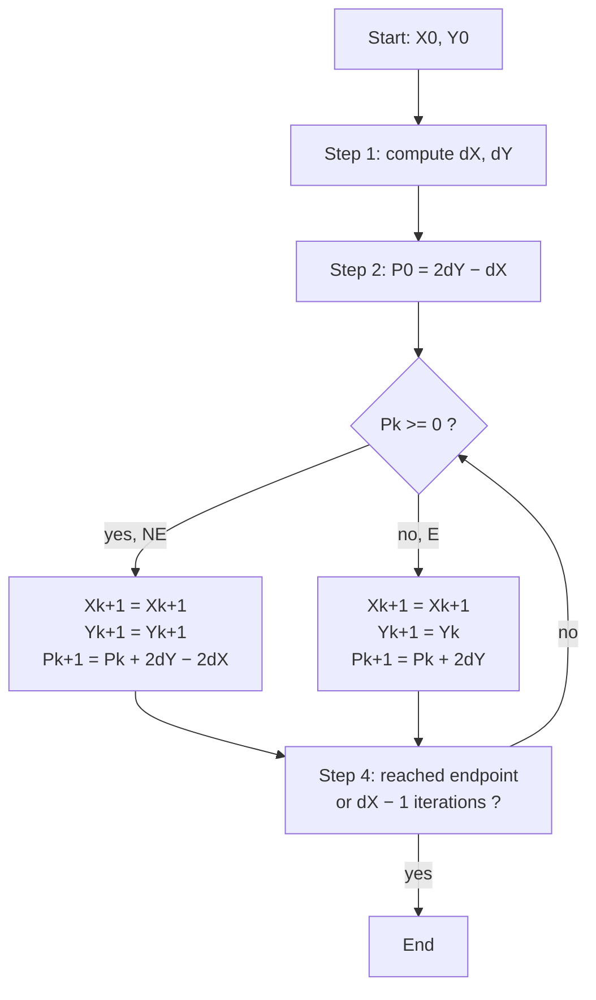

# Computer Graphics - Lecture 2

## What Is a Vector?

A **vector** is a mathematical quantity that has a **magnitude** (how long it is) and a **direction** (where it points).

$$\text{Vector} = \text{Magnitude} + \text{Direction}$$

In 3D graphics a vector has three **components**: $V = (V_x, V_y, V_z)$

| Component | Represents        |
| --------- | ----------------- |
| $V_x$     | X — left / right  |
| $V_y$     | Y — up / down     |
| $V_z$     | Z — forward / backward |

A 2D vector drops $V_z$: $V = (V_x, V_y)$, where $V_x$ is the horizontal component and $V_y$ the vertical.

> [!NOTE] Simple example
> For a 3D object with **Point A → Point B**, the vector between them is **Direction + Magnitude** — it tells us where the vector points and how long it is.

## Why Do We Need Vectors?

Vectors represent:

- **Direction** — the direction in which an object moves or points
- **Light source** — the direction from which light reaches a surface
- **Surface faces / normals** — the orientation of a surface in 3D space
- **Movement** — the displacement of an object from one position to another
- **Camera direction** — the direction in which the camera is looking

## Vector Magnitude

The **magnitude** of a vector is its **length**.

**2D:**

$$|V| = \sqrt{V_x^2 + V_y^2}$$

**Example:** if $V = (3, 4)$

$$|V| = \sqrt{3^2 + 4^2} = \sqrt{9 + 16} = \sqrt{25} = 5$$

**3D:**

$$|V| = \sqrt{V_x^2 + V_y^2 + V_z^2}$$

**Example:** if $V = (2, 3, 6)$

$$|V| = \sqrt{2^2 + 3^2 + 6^2} = \sqrt{4 + 9 + 36} = \sqrt{49} = 7$$

## Vector Direction

The **direction** tells us where the vector points.

**2D — direction angle:**

$$\theta = \tan^{-1}\left(\frac{V_y}{V_x}\right)$$

**Example:** for $V = (3, 4)$: $\theta = \tan^{-1}\left(\frac{4}{3}\right) \approx 53.13^\circ$, so magnitude $= 5$ and direction $\approx 53.13^\circ$.

**3D — angles with each axis:**

$$\alpha = \cos^{-1}\left(\frac{V_x}{|V|}\right), \quad \beta = \cos^{-1}\left(\frac{V_y}{|V|}\right), \quad \gamma = \cos^{-1}\left(\frac{V_z}{|V|}\right)$$

- $\alpha$ = angle with the **X-axis**
- $\beta$ = angle with the **Y-axis**
- $\gamma$ = angle with the **Z-axis**

> [!NOTE] 2D vs. 3D direction
> _Why it differs:_ a 2D vector needs **one** angle ($\theta$) because the plane fixes the frame. In 3D a single angle is ambiguous — direction needs **three** angles against the axes, and each is measured with $\cos^{-1}$ rather than $\tan^{-1}$ because a component is projected onto a unit axis.

## Vector Operations

### Addition

**Addition** combines two or more vectors to obtain a **resultant vector**.

2D: $A = (A_x, A_y)$ and $B = (B_x, B_y)$

$$A + B = (A_x + B_x, \; A_y + B_y)$$

**Example:** $A = (4, 2)$, $B = (-2, 4)$

$$A + B = (4 + (-2), \; 2 + 4) = R = (2, 6)$$

**3D:** $(A_x, A_y, A_z) + (B_x, B_y, B_z) = (A_x + B_x, \; A_y + B_y, \; A_z + B_z)$

> [!NOTE] Why
> Vector addition combines different directional effects into one resultant vector.

### Subtraction

**Subtraction** finds the **difference** or **direction** between two vectors or points.

$$A - B = (A_x - B_x, \; A_y - B_y)$$

**Example:** $A = (7, 6)$, $B = (2, 3)$

$$A - B = (7 - 2, \; 6 - 3) = (5, 3)$$

**Why:** find the direction from one point to another · calculate the distance between two points · determine relative position or movement.

### Scalar Multiplication

A **scalar** is a **single number** used to multiply a vector.

$$kV = (kV_x, \; kV_y)$$

**Example:** $V = (2, 3)$ multiplied by 2 → $2V = (2 \times 2, \; 2 \times 3) = (4, 6)$

| Scalar  | Effect on the vector        |
| ------- | --------------------------- |
| $k > 1$ | Vector becomes **longer**   |
| $0 < k < 1$ | Vector becomes **shorter** |
| $k < 0$ | **Direction reverses**      |

**Why:** scale the magnitude of a vector · control the amount of movement · change the size of a direction vector.

> [!NOTE] The odd one out
> $k < 0$ is the only case that changes **direction** — a negative scalar is a rotation by 180° plus a scale.

### Dot Product

The **dot product** combines two vectors and produces a **scalar** value.

$$A \cdot B = A_xB_x + A_yB_y + A_zB_z$$

**Example:** $A = (1, 2, 3)$, $B = (4, 5, 6)$

$$A \cdot B = 1 \cdot 4 + 2 \cdot 5 + 3 \cdot 6 = 4 + 10 + 18 = 32$$

It is related to the angle between vectors:

$$A \cdot B = |A||B|\cos\theta$$

**Why:** determines the **relationship between two directions** — especially **lighting**, the **angle between vectors**, **surface orientation**, and how much light reaches a surface.

### Cross Product

The **cross product** combines two 3D vectors and produces a **new vector perpendicular to both**.

$$C = A \times B$$

$$A \times B = \left(A_yB_z - A_zB_y, \; A_zB_x - A_xB_z, \; A_xB_y - A_yB_x\right)$$

**Example:** $A = (1, 0, 0)$, $B = (0, 1, 0)$ → $A \times B = (0, 0, 1)$ — perpendicular to both.

**Why:** calculate **surface normals** · find a perpendicular direction · determine surface orientation · important in 3D geometry and lighting.

### Comparison

| Operation               | Input           | Output  | Main Purpose                     |
| ----------------------- | --------------- | ------- | -------------------------------- |
| **Addition**            | Vector + Vector | Vector  | Combine movements / effects      |
| **Subtraction**         | Vector − Vector | Vector  | Find difference / direction      |
| **Scalar Multiplication** | Number × Vector | Vector | Change magnitude                 |
| **Dot Product**         | Vector · Vector | Scalar  | Relationship / angle / lighting  |
| **Cross Product**       | Vector × Vector | Vector  | Perpendicular direction / normal |

> [!WARNING] Exam Note
> The **dot product is the only operation that returns a scalar**. Every other one returns a vector — that single distinction answers several comparison questions.

## 2D Transformations

### Translation

**Translation** moves an object from one position to another **without changing its size or shape**.

Given $P = (x, y)$ and translation $T = (T_x, T_y)$:

$$P' = (x + T_x, \; y + T_y)$$

**Example:** $P = (2, 3)$, $T = (4, 2)$ → $P' = (2 + 4, \; 3 + 2) = (6, 5)$

**Why:** move an object on the screen · change its position · move characters, shapes, or objects in a scene · implement object movement.

### Scaling

**Scaling** changes the **size** of an object by multiplying its coordinates by **scaling factors**.

Given $P = (x, y)$ and factors $S = (S_x, S_y)$:

$$P' = (S_x x, \; S_y y)$$

**Example:** $P = (2, 3)$, $S = (2, 2)$ → $P' = (2 \times 2, \; 3 \times 2) = (4, 6)$

| Type                 | Condition | Effect                          |
| -------------------- | --------- | ------------------------------- |
| **Uniform**          | $S_x = S_y$ | Same proportion in both directions |
| **Non-uniform**      | $S_x \neq S_y$ | **Different scaling** in X and Y |

**Why:** enlarge an object · reduce an object · resize shapes and images · create zooming effects.

> [!NOTE] The distinction
> Uniform scaling preserves **shape and aspect ratio**; non-uniform scaling **distorts** it. Scaling factors below 1 shrink, above 1 enlarge.

### Rotation

**Rotation** changes the **orientation** of an object by rotating it through an angle $\theta$ around a fixed point, usually the **origin**.

$$x' = x\cos\theta - y\sin\theta$$
$$y' = x\sin\theta + y\cos\theta$$

$$P' = (x\cos\theta - y\sin\theta, \; x\sin\theta + y\cos\theta)$$

**Example:** rotate $P = (1, 0)$ by $\theta = 90^\circ$, where $\cos 90^\circ = 0$ and $\sin 90^\circ = 1$:

$$x' = 1 \cdot 0 - 0 \cdot 1 = 0$$
$$y' = 1 \cdot 1 + 0 \cdot 0 = 1$$

So the point moved from the **positive X-axis** to the **positive Y-axis**, giving $P' = (0, 1)$.

**Why:** change the orientation of an object · rotate shapes around a point · rotate characters, cameras, and objects · used in animation and 2D transformations.

### Reflection

**Reflection** creates a **mirror image** of an object with respect to an **axis or a line**.

| Reflection     | Rule             | Example        | Result     |
| -------------- | ---------------- | -------------- | ---------- |
| **About X-axis** | $(x, y) \to (x, -y)$ | $P = (3, 4)$ | $P' = (3, -4)$ |
| **About Y-axis** | $(x, y) \to (-x, y)$ | $P = (3, 4)$ | $P' = (-3, 4)$ |

**Why:** create mirror images · flip objects horizontally or vertically · generate symmetric shapes · used in 2D graphics and image processing.

> [!NOTE] Reading the rules
> Reflection **about the X-axis** negates **y** (flips vertically); reflection **about the Y-axis** negates **x** (flips horizontally). The axis name is the one that stays the same.

### Transformation Comparison

| Transformation | What it changes        | Formula                     | Preserves size/shape      |
| -------------- | ---------------------- | --------------------------- | ------------------------- |
| **Translation** | Position               | $P' = P + T$                | Both                      |
| **Scaling**    | Size                   | $P' = S \cdot P$            | Shape only if $S_x = S_y$ |
| **Rotation**   | Orientation            | $P' = R(\theta) \cdot P$    | Both                      |
| **Reflection** | Orientation (mirrored) | $(x, y) \to (\pm x, \pm y)$ | Both                      |

## Bresenham's Line Algorithm

**Bresenham's line algorithm** generates the pixels of a line using only **integer arithmetic** — no floating-point rounding per pixel, which is why it matters for raster graphics.

**Given:** starting coordinates $(X_0, Y_0)$ and ending coordinates $(X_n, Y_n)$.

### Steps

**Step 1** — Calculate the deltas from the input:

$$\Delta X = X_n - X_0, \qquad \Delta Y = Y_n - Y_0$$

**Step 2** — Calculate the initial **decision parameter** $P_K$. $P_K$ helps decide which pixel comes next.

$$P_0 = 2\Delta Y - \Delta X$$

- $P_K < 0$ → pixel in **East (E)** direction
- $P_K \geq 0$ → pixel in **North-East (NE)** direction

**Step 3** — Given current point $(X_k, Y_k)$ and next point $(X_{k+1}, Y_{k+1})$, follow the two cases:

| Case                | Condition | $X_{k+1}$     | $Y_{k+1}$     | $P_{k+1}$             |
| ------------------- | --------- | ------------- | ------------- | --------------------- |
| **Case 1 (E)**      | $P_k < 0$   | $X_k + 1$     | $Y_k$         | $P_k + 2\Delta Y$        |
| **Case 2 (NE)**     | $P_k \geq 0$ | $X_k + 1$     | $Y_k + 1$     | $P_k + 2\Delta Y - 2\Delta X$ |

For the case $0 < m < 1$ (slope less than 1), these are the only two choices:

$$P_k \geq 0 \Rightarrow NE = (X_k + 1, \; Y_k + 1)$$
$$P_k < 0 \Rightarrow E = (X_k + 1, \; Y_k)$$

**Step 4** — Keep repeating Step 3 until the end point is reached, or the number of iterations equals $(\Delta X - 1)$ times.

> [!NOTE] Why the order matters
> $\Delta X$ and $\Delta Y$ must be known before $P_0$ can be computed, and $P_0$ must be known before the first pixel step. Each step then **updates** $P_k$ in place rather than recomputing it, which is the source of the algorithm's speed.

### Worked Example

Line with endpoints $(20, 10)$ and $(30, 18)$:

$$m = 0.8, \quad \Delta x = 10, \quad \Delta y = 8, \quad P_0 = 2\Delta y - \Delta x = 6$$
$$2\Delta y = 16, \qquad 2\Delta y - 2\Delta x = -4$$

Plot the initial point $(x_0, y_0) = (20, 10)$ and determine successive pixel positions:

| $k$ | Current Point | $P_k$ | Decision | Next Point |
| --- | ------------- | ----- | -------- | ---------- |
| 0 | (20,10) | 6  | NE       | (21,11)    |
| 1 | (21,11) | 2  | NE       | (22,12)    |
| 2 | (22,12) | -2 | E        | (23,12)    |
| 3 | (23,12) | 14 | NE       | (24,13)    |
| 4 | (24,13) | 10 | NE       | (25,14)    |
| 5 | (25,14) | 6  | NE       | (26,15)    |
| 6 | (26,15) | 2  | NE       | (27,16)    |
| 7 | (27,16) | -2 | E        | (28,16)    |
| 8 | (28,16) | 14 | NE       | (29,17)    |
| 9 | (29,17) | 10 | NE       | (30,18)    |

**Resulting pixels:**

(20,10), (21,11), (22,12), (23,12), (24,13), (25,14), (26,15), (27,16), (28,16), (29,17), (30,18)

> [!WARNING] Common Mistake
> At $k = 2$, $P_k = -2 < 0$, so the step is **East only** — $y$ stays at 12 — yet $X$ still increments. The negative-$P$ case moves in **x only**; skipping the $X$ increment is the usual error.

> [!NOTE] The $P_k$ cycle
> $P_k$ repeats every **two** steps (6, 2, −2, 14, 10, 6, 2, −2, 14, 10 …) because the NE and E updates differ by $2\Delta X = 20$. Verifying this cycle is the fastest way to check a hand-computed table.

## Quick Review Questions

1. What is a vector and what are its two defining properties?
2. How do you compute the magnitude of a 2D and a 3D vector?
3. How is the direction of a 3D vector described?
4. What does the dot product return, and what is it used for in lighting?
5. What does the cross product return, and how is it used to find surface normals?
6. Which vector operation returns a scalar instead of a vector?
7. State the transformation formulas for translation, scaling, rotation, and reflection.
8. How does uniform scaling differ from non-uniform scaling?
9. What does the decision parameter $P_k$ control in Bresenham's algorithm?
10. What are the updates to $P_{k+1}$ for the NE and E cases?

_15 min read (source: 12 min)_