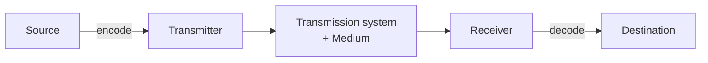

# Data Communication - Lecture 1

## Core Vocabulary

| Term              | Definition                                                                                                          | Boundary                                     |
| ----------------- | ------------------------------------------------------------------------------------------------------------------- | -------------------------------------------- |
| **Data**          | Raw representation of facts: numbers, characters, symbols — _before_ interpretation                                 | No meaning yet; bytes `25, 6, 2026` are data |
| **Information**   | Data organized and interpreted so it means something to someone                                                     | Same bytes read as a date -> _25 June 2026_  |
| **Signal**        | The physical form data takes to travel a medium: voltage on wire, light pulse in fibre, radio wave                  | Without a signal, no communication happens   |
| **Communication** | The whole activity of exchanging information between sender and receiver, across space and time, using agreed rules | Requires **both** hardware and software      |

> [!WARNING] Common Mistake
> Never say "the data travelled through the cable." The **signal** physically travels; the data is only what the signal represents.

## The Communication Model

Every communication system, from a WhatsApp voice note to an industrial sensor, shares the same five elements.

| #   | Element                 | Function                                                                             | Example (WhatsApp voice note)                                  |
| --- | ----------------------- | ------------------------------------------------------------------------------------ | -------------------------------------------------------------- |
| 1   | **Source**              | Generates the data to be transmitted                                                 | Microphone + app recording the note                            |
| 2   | **Transmitter**         | Converts and **encodes** source data into a signal the medium can carry              | Phone's radio chip turning digitized voice into a radio signal |
| 3   | **Transmission system** | The path the signal actually travels — a single cable up to an entire network        | Mobile towers + backbone + the Internet                        |
| 4   | **Receiver**            | Accepts the signal and **decodes** it back into usable data (reverse of transmitter) | Friend's phone radio receiving and decoding                    |
| 5   | **Destination**         | Takes the incoming data and uses it                                                  | Speaker + app on the friend's phone                            |

> [!NOTE] Why the transmitter exists
> Raw data (digital 1s and 0s) usually cannot travel a medium in its original form. It must become an electrical, optical, or radio signal first.

### The Medium and the Protocol

- **Medium** — the line connecting the boxes; the physical path the signal travels through.
  - **Guided:** signal confined to a physical path — copper wire, twisted pair, optical fibre.
  - **Unguided:** signal radiates freely — radio waves, Wi-Fi, satellite links.
  - _Why it matters:_ the medium sets how far a signal travels, how fast data moves, and cost.
- **Protocol** — the agreed set of rules governing the exchange; without it both ends interpret the same bits differently.

## Communication Tasks

Six functions the sender and receiver must agree on. Without agreement on all six, no connection works no matter how good the cable.

| Task                             | Purpose                                                               |
| -------------------------------- | --------------------------------------------------------------------- |
| **Interfacing**                  | Physically connecting the device to the transmission medium           |
| **Signal generation**            | Producing a signal the medium can actually carry                      |
| **Synchronization**              | Making sender and receiver agree on timing so bits are read correctly |
| **Exchange management**          | Agreeing when to start, pause, and end a conversation                 |
| **Error detection / correction** | Noticing (and sometimes fixing) bits that arrive wrong                |
| **Flow control**                 | Preventing a fast sender from overwhelming a slow receiver            |

## Course Structure

**Aim:** build theoretical knowledge and analytical skill for transmission techniques, serial interfaces, error detection/control, multiplexing, switching, and routing.

| Learning Outcome                                     | Coverage     |
| ---------------------------------------------------- | ------------ |
| **LO1** Communication systems and data transmission  | Lectures 1–2 |
| **LO2** Serial interfaces and coding techniques      | Lectures 3–4 |
| **LO3** Error detection, error control, flow control | Lectures 5–6 |
| **LO4** Multiplexing, switching, routing             | Lectures 7–8 |

| Session | Topic                                                            |
| ------- | ---------------------------------------------------------------- |
| 1       | Communication model; analog vs. digital signals (LO1.1)          |
| 2       | Transmission modes and techniques; transmission media (LO1.2)    |
| 3       | Serial interfaces: RS-232 and RS-485 (LO2.1)                     |
| 4       | UART/USART and line coding techniques (LO2.2)                    |
| 5       | Error detection: parity, checksum, CRC (LO3.1)                   |
| 6       | ARQ and flow control (LO3.2)                                     |
| 7       | Multiplexing and switching: FDM, TDM, circuit vs. packet (LO4.1) |
| 8       | Routing techniques and course review (LO4.2)                     |

- **Textbook:** W. Stallings, _Data and Computer Communications_, 8th edition — Chapter 1 this lecture.
- **Assignments:** #1 covers LO1–LO2 (week 7); #2 covers LO3–LO4 (week 14).

## Everyday Data Communication

Four ordinary actions, each a data communication problem:

- **Voice note** — voice becomes data, crosses a mobile network, becomes sound again with no noticeable delay.
- **Video streaming** — huge data volumes must arrive fast _and_ in order, or the video freezes or corrupts.
- **Web browsing** — a request travels thousands of kilometres and a reply returns in well under a second.
- **Factory sensor** — a temperature reading over RS-485 to a control room, the scenario ICT technologists work in daily.

## Lecture Objectives

1. Define **data**, **information**, and **signal**, and explain how they differ.
2. Identify the five model components in a real-world system.
3. Explain the purpose of each of the six communication tasks.
4. Distinguish analog from digital signals on bandwidth, noise immunity, and cost.
5. Apply the model end-to-end to a real system such as a voice call.
6. Justify an analog vs. digital choice for a given scenario.

_10 min read (source: 10 min)_
