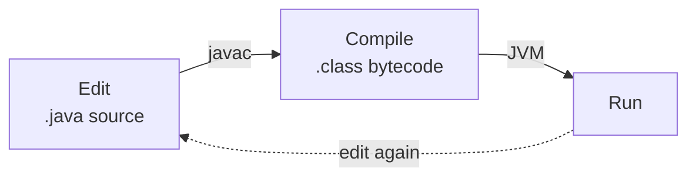
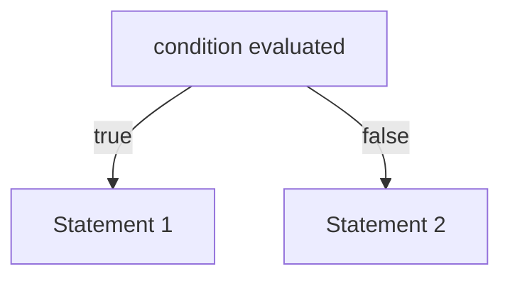
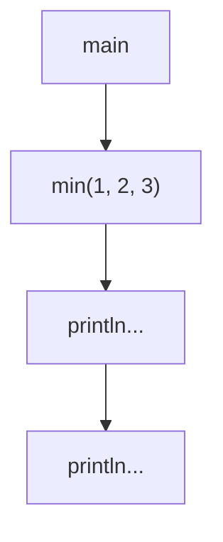

# Java II - Lecture 1

## Course Information

Textbook: Liang, *Introduction to Java Programming and Data Structures* (2022) — Chapters 2, 4, 5, 6, 7.

### Term Project

A drawing application built with the techniques from Chapters 2 and 12.

| Requirement                    | Implementation                                                      |
| ------------------------------ | ------------------------------------------------------------------- |
| Select shape, color, fill      | A separate child window holding all GUI components                  |
| Store the shapes                | An **array of `MyShape` objects**; `MyShape` is the hierarchy's **superclass** |
| Multiple separate drawings      | **`JDesktopPane`** + **`JInternalFrame`** child windows              |
| Draw the shape                  | The user clicks inside any `JInternalFrame`                         |

## Why Java

Programming makes a computer do what you want. Java's value is not the language itself but the **general programming skills** it develops, and those transfer to many other languages.

> [!NOTE] Java-specific constraint
> Everything must live inside a class. There are **no global functions and no global data** — including `main`.

## Code Life Cycle



**Write once, compile anywhere.** The compiler produces bytecode once; the JVM adapts it to the host OS at run time.

| Element          | Role                                 |
| ---------------- | ------------------------------------ |
| `class` keyword  | Declares a class                     |
| `//`             | Starts a comment                      |
| `{ }`            | Delimit the class body                |
| Java             | **Case sensitive** — `Class` ≠ `class` |
| `main`           | Entry point                           |

## Text Output

Applications write to the terminal through the standard output object **`System.out`**.

```java
public class TestIO {
  public static void main(String[] args) {
    System.out.println("Welcome to java");      // single line
    System.out.println("Welcome to \n java");  // escape sequence: two lines
    System.out.print("Welcome to");            // no newline
    System.out.println("java");                // completes that same line
    System.out.printf("%s\n%s\n", "Welcome to", "java");  // formatted
  }
}
```

| Method     | Adds a newline | Takes a format string |
| ---------- | -------------- | --------------------- |
| `print`    | No             | No                    |
| `println`  | Yes            | No                    |
| `printf`   | No             | Yes                   |

**Escape sequences:** `\n` newline · `\t` tab · `\\` backslash · `\"` quote · `\r` carriage return

**printf conversions:** `%d` integer · `%.2f` floating point · `%s` string · `%c` character · `%e` scientific · `%%` literal percent

```java
String msg1 = new String("Hello");  // explicit construction
String msg2 = "Hello";              // literal — no constructor call
String msg3 = "Year " + 2005;       // valid: String concatenation
```

## Text Input

Input arrives from the terminal window while the program executes.

```java
import java.util.Scanner;               // import the class

Scanner input = new Scanner(System.in); // Scanner object on System.in
int num1 = input.nextInt();             // read values
System.out.printf("the square is : %d\n", num1 * num1);
```

| Method         | Reads                              |
| -------------- | ---------------------------------- |
| `nextInt()`    | `int`                              |
| `nextDouble()` | `double`                           |
| `nextLine()`   | whole line, including spaces       |

## Variables and Constants

A variable declaration performs **declaration**, **memory allocation**, and **initialization** in one step.

```java
int total = 0;                    // data type + variable name + value
int count, temp, result;          // several variables in one declaration
```

A **constant** holds one value for its entire existence.

```java
final double PI = 3.14159265;
```

Why constants: they name otherwise unclear literals, they let you change a value in one place, and they stop inadvertent errors.

> [!WARNING]
> `final` blocks reassignment; it does not freeze a value. A `final` *reference* to a mutable object still lets you change the object's contents. Lecture 2 covers `final` fields in depth.

## Expressions and Operators

An **expression** combines operators and operands. An arithmetic expression works like a method applied to numerical data, producing a numeric result.

| Operator      | Meaning        | Operator               | Meaning            |
| ------------- | -------------- | ---------------------- | ------------------ |
| `+`           | Addition       | `++`                   | Increment           |
| `-`           | Subtraction    | `--`                   | Decrement           |
| `*`           | Multiplication | `+=` `-=` `*=` `/=`   | Assignment          |
| `/`           | Division       |                        |                     |
| `%`           | Remainder      |                        |                     |

```java
count = count + 1;   // same effect as the next two
count += 1;
count++;

count = count - 10;
count -= 10;
```

### Operator Precedence

| Expression                | Evaluation order                                             |
| ------------------------- | ------------------------------------------------------------ |
| `a + b + c + d + e`       | 1, 2, 3, 4 — equal precedence runs left to right             |
| `a + b * c - d / e`       | 3, 1, 4, 2 — `*` `/` bind tighter than `+` `-`               |
| `a / (b + c) - d % e`     | 2, 1, 4, 3 — parentheses force the inner evaluation first     |
| `a / (b * (c + (d - e)))` | 4, 3, 2, 1 — innermost nesting first                          |

`(` `)` beat `*` `/` `%`, which beat `+` `-`.

## Data Conversions

| Type         | Trigger                        | Rule                                                        |
| ------------ | ------------------------------ | ----------------------------------------------------------- |
| **Implicit** | Automatic, no cast written     | **Widening** only — promotion to a larger, lossless type      |
| **Explicit** | You write a **cast**           | Widening **and** narrowing                                    |

```java
double MyResult;
MyResult = 12.0 / 5.0;            // OK
int myInt = (int) MyResult;       // narrowing: truncation, not rounding
MyResult = (double) myInt / 3.0;  // cast first, or integer division kicks in
```

> [!WARNING] Integer division
> `4.0 / 8` and `4 / 8.0` both give `0.5` — one `double` operand promotes the other. `4 / 8` gives `0` because both operands are `int`, so the fraction is discarded.
> `4 + 5 / 9 + 1.0 + 5 / 9 / 10.0` = `4 + 0 + 1.0 + 0.0` = **5.0**, because `5 / 9` is already `0` before any promotion applies.

## Class `Math`

Every `Math` method is **static**: call it by preceding the method name with `Math` and a dot. Arguments may be constants, variables, or expressions.

```java
// Solve the quadratic equation ax² + bx + c = 0
public class Quadratic {
  public static void main(String[] args) {
    double a, b, c, d;
    // input coefficient values..
    // calculate roots
    d = Math.sqrt(b * b - 4.0 * a * c);
    double root1 = (-b + d) / (2.0 * a);
    double root2 = (-b - d) / (2.0 * a);
    // print them out
    System.out.println(root1);
    System.out.println(root2);
  }
}
```

`Math.sqrt(x)` square root · `Math.pow(x, y)` $x^y$ · `Math.abs(x)` absolute value · `Math.round(x)` rounds a double to `long`

## Conditional Statements

A conditional statement chooses which statement runs next.

| Statement            | Purpose                                        |
| -------------------- | ---------------------------------------------- |
| `if` / `if-else`     | Two-way branch                                 |
| Conditional operator | Shorthand if-else inside an expression         |
| `switch`             | Multiple selection                             |

### `if` and `if-else`

```java
if (condition)
  statement1;
else
  statement2;
```

The condition **must be a boolean expression** — a boolean variable, `a == b`, `a <= b` — evaluating to `true` or `false`. Group several statements into a **block statement** delimited by braces `{ ... }`.

| Relational       | Meaning                | Logical | Meaning |
| ---------------- | ---------------------- | ------- | ------- |
| `<` `>` `<=` `>=`| less / greater than    | `&&`    | and     |
| `==` `!=`        | equal / not equal      | `\|\|`  | or      |
|                  |                        | `!`     | not     |



### Conditional Operator

The **ternary** operator embeds a conditional in an expression.

```java
// long form
if (n1 > n2)
  max = n1;
else
  max = n2;

// shorthand — ? and : form the ternary operator
max = (n1 > n2) ? n1 : n2;
```

### `switch`

Multiple selection over a **constant integral expression** of type `byte`, `short`, `int`, or `char`.

| Part          | Role                                                  |
| ------------- | ----------------------------------------------------- |
| `case` labels | The constant values being selected                    |
| `break`       | Optional — **without it execution falls through** to the next case |
| `default`     | Optional — the branch taken when no label matches     |

## Loops and Iterations

```java
while (condition);
  statement;

do {
  statement;
} while (condition);

for (initialization; condition; increment)
  statement;
```

> [!WARNING] `while` vs. `do`
> `while` is **pre-test**: the body may run **zero** times. `do…while` is **post-test**: the body always runs **at least once**. That decides whether the control variable needs a value before the loop starts.

```java
// while: month must be initialized, or the first test reads garbage
int month = -1;
while (month < 1 || month > 12) {
  System.out.print("Enter a month (1 to 12): ");
  month = scan.nextInt();
}

// do...while: no initialization needed — the body assigns it first
int month;
do {
  System.out.print("Enter a month(1 to 12): ");
  month = scan.nextInt();
} while (month < 1 || month > 12);
// beginning of the next statement
```

Validation uses `||` so the loop repeats when the value falls **outside** the valid range.

### The `for` Loop

```java
int sum = 0;
for (int counter = 1; counter <= max; counter++)
  sum += counter;
System.out.println(sum);
```

| Part                 | Role                                       |
| -------------------- | ------------------------------------------ |
| `int counter = 1`    | Initializes the control variable           |
| `counter <= max`     | Continuation test — false ends the loop    |
| `sum += counter`     | Loop body — may hold multiple statements   |
| `counter++`          | Increments the control variable            |

### `break` and `continue`

| Statement   | Effect                                                                            |
| ----------- | --------------------------------------------------------------------------------- |
| `break;`    | Exits the loop immediately; execution resumes at the first statement after the control statement |
| `continue;` | Skips the rest of the loop body                                                   |

Where the continuation test runs differs:

- `while` and `do…while`: the test is evaluated **immediately** after `continue`.
- `for`: the **increment** expression runs first, then the test.

## Methods

A method groups a sequence of statements: it takes input, performs actions, and produces output. In Java, every method is defined **within a class**.

```java
public class MyClass {
  static int min(int num1, int num2) {          // method header
    int minValue = num1 < num2 ? num1 : num2;   // method body
    return minValue;
  }
}
```

| Header part              | Role                                                |
| ------------------------ | --------------------------------------------------- |
| `static`                 | Method properties — static or instance              |
| `int`                    | Return type                                         |
| `min`                    | Method name                                          |
| `(int num1, int num2)`   | Parameter list — type and name of each parameter    |

Parameter names in a declaration are **formal arguments**; the values passed at the call site are **actual arguments**, and they are assigned to the formal arguments on every call.

```java
int num = min(2, 3);
```

**The `return` statement.** The return type declares the type of value sent back to the calling location. A method returning nothing has return type **`void`**. `return`'s expression must conform to the return type.

### Method Call Stack

A method can call another, which calls another. Each call pushes a frame; the innermost returns first.



## Arrays

An **array** is a data structure grouping related elements of the same type.

| Property        | Detail                                                                                    |
| --------------- | ----------------------------------------------------------------------------------------- |
| Element type    | All elements share one type; elements may be **primitive** or **reference** (e.g. `String`) |
| Length          | **Fixed** once created                                                                     |
| Index           | Referenced by index or subscript; must be a **nonnegative integer**. An expression may serve as an index |
| Identity        | Arrays are **objects**, so they are **reference types**                                     |
| Length storage  | Every array stores its length in a `length` **instance variable**                            |

```java
int[] a;            // declare
int a[];            // equivalent declaration
a = new int[5];     // create

for (int i = 0; i < 5; i++)
  a[i] = i * i;     // initialize
```

> [!NOTE]
> `length` is `final` — read it (for example `a.length`), never assign to it. The length cannot change after creation.

## Common Mistakes to Avoid

| Mistake                                   | Why it is wrong                                          |
| ----------------------------------------- | -------------------------------------------------------- |
| `4 / 8` expecting `0.5`                   | Both operands are `int`; integer division truncates to `0` |
| `(int) MyResult` expecting rounding       | Casting truncates toward zero — use `Math.round`         |
| Naming an identifier `Class` or `String`  | Reserved words, and Java is case sensitive               |
| Testing an uninitialized local in `while` | Locals have no default value; `do…while` assigns first   |
| Omitting `break` in `switch`              | Execution falls through to the next case                 |
| Assigning to an array's `length`          | It is `final` — the length cannot change                 |
| Declaring data outside a class            | Java has no global functions and no global data          |

## Exit Questions

1. What is `4 + 5 / 9 + 1.0 + 5 / 9 / 10.0`? Show each step. *(Analyze)*
2. Rewrite the month-validation loop with `do…while`; why is no initial value needed? *(Apply)*
3. Name the four parts of a `for` header and what each controls. *(Understand)*
4. A colleague writes `double total = 10 / 3;` and gets `3.3333` on one machine, `3.0` on another. Explain the difference. *(Evaluate)*
5. Explain why `System.out.print("a"); System.out.println("b");` and `System.out.println("ab");` print the same thing, while swapping either for `printf` changes the result. *(Understand)*

_13 min read (source: 13 min)_
