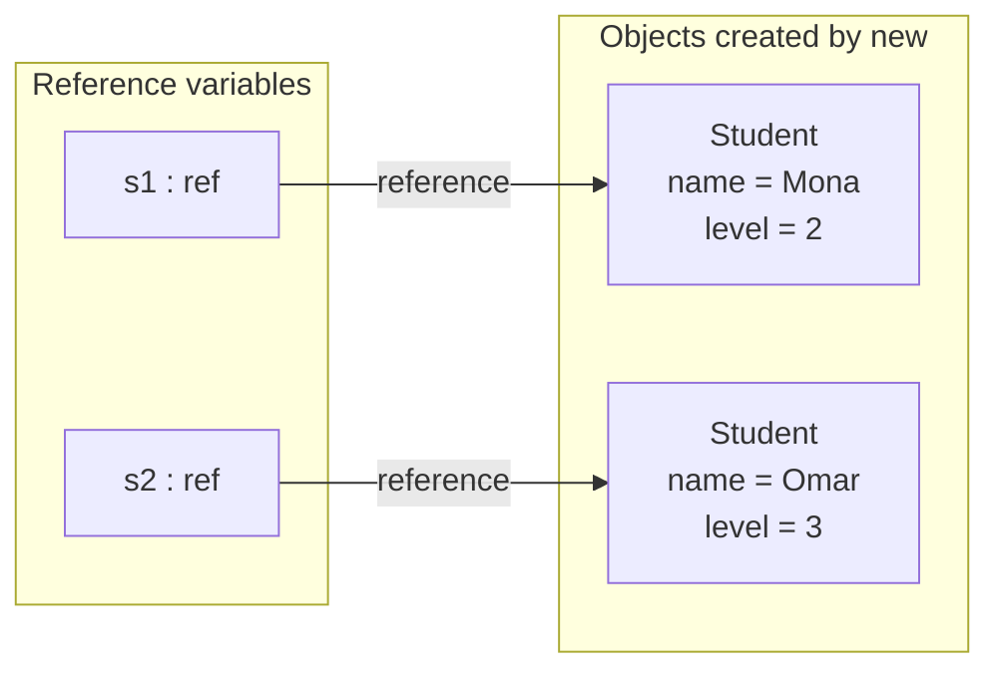
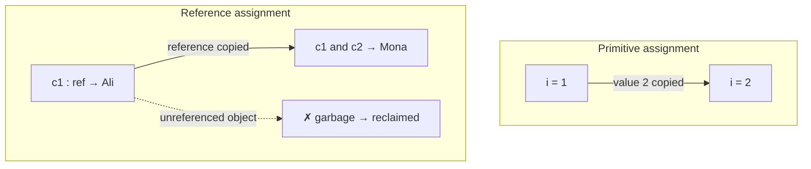
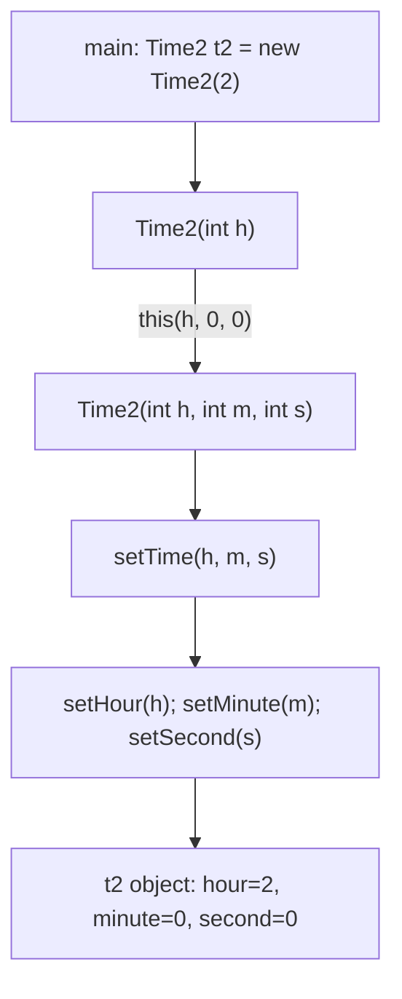
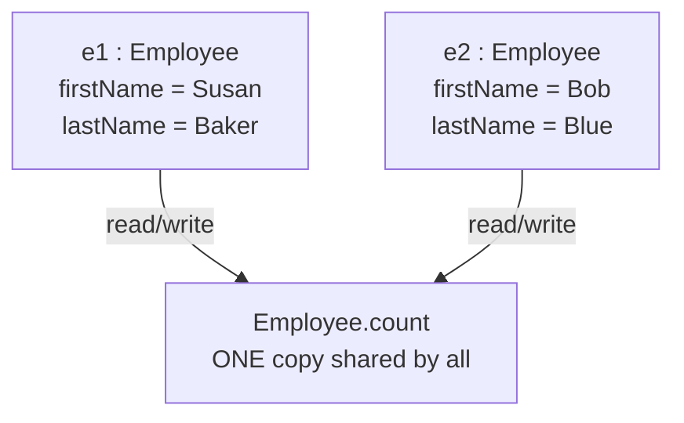

# Java II - Lecture 2

## Classes and Objects

| Term         | Definition                                                                    | Boundary                                                    |
| ------------ | ----------------------------------------------------------------------------- | ------------------------------------------------------------ |
| **Class**    | Template/blueprint that defines an object's data fields and methods (Liang §9.2) | A class is _not_ a running thing — it holds no values itself |
| **Object**   | An instance of a class; creating one is called **instantiation**               | Each object has its own **state**, all share the same methods |
| **State**    | The values currently held by an object's data fields                           | Changes per object, never shared                              |
| **Behavior** | The operations the class exposes as methods                                    | Shared by every instance of the class                        |

> [!NOTE] Concept check
> `Car` = class. "The red car down there in the car park" = object.

### Why a class needs both data and operations

Every **data type** pairs a set of allowed values with a set of allowed operations. `int` gives you $-2^{31}$ to $2^{31}-1$ plus `+ - * / %`. A class generalizes the same pairing, so a class defined in Java is a user-defined data type. (Liang §9.2)

**Encapsulation** — the bundling of data and the procedures that act on it into one unit (the class). It is the main feature of object-oriented programming.

> [!NOTE] Java-specific constraint
> Everything must live inside a class. Java has **no global functions and no global data**.

### Four pillars of OOP

**Encapsulation**, **abstraction**, **inheritance**, **polymorphism**. This lecture covers encapsulation and the object/has-a relationships; inheritance arrives in the next lecture.

## UML Class Diagrams

**UML** is a modeling language for the structural, behavioral, and architectural aspects of a system. A class diagram shows objects and the relationships among them.

A class is drawn as a rectangle with **three stacked compartments**:

| Compartment | Contents                              | Example             |
| ----------- | ------------------------------------- | ------------------- |
| Top         | Class name                            | `Student`           |
| Middle      | Attributes: `name: Type`              | `- name : String`   |
| Bottom      | Operations: `op(p: Type): ReturnType` | `+ getName() : String` |

**Visibility marks:** `-` private · `+` public · `#` protected · `~` package

**Static members are underlined** in UML.

```text
      ┌───────────────────────────────┐
      │           Student             │
      ├───────────────────────────────┤
      │ - name : String               │
      │ - level : int                 │
      ├───────────────────────────────┤
      │ + Student(name: String,       │
      │     level: int)               │
      │ + getName() : String          │
      │ + setLevel(level: int) : void │
      └───────────────────────────────┘
```

```java
// Generated from the UML above
public class Student {
  private String name;
  private int level;

  public Student(String name, int level) {...}
  public String getName() {...}
  public void setLevel(int level) {...}
}
```

## Defining and Using a Class

Class **attributes** (data) are implemented as **fields**; class **operations** (behaviors) are implemented as **methods**.

- The class lives in a `.java` file.
- A class **without `main`** cannot execute on its own — you need a separate driver class.
- Why a second class instead of `import student.java`? A class file is a compilation unit, not a library; a public class is imported by its **name**, and the compiler finds it on the classpath.

```java
// StudentTest.java
public class StudentTest {
  public static void main(String[] args) {
    // define object(s)
    // call a method
  }
}
```

### Creating objects

```java
// Worked example: store two students and display each
Student s1 = new Student();
Student s2 = new Student();

s1.name = "Mona";
s2.name = "Omar";
s1.level = 2;
s2.level = 3;

s1.display();
s2.display();
```

```text
Output
Mona is in level 2
Omar is in level 3
```

- `new Student()` **creates** the object.
- `s1`, `s2` are **reference variables** that let you reach the objects.
- The **dot operator `.`** accesses an object's data fields and methods.

### Reference variables in memory

A class is a **reference type**: a variable of a class type holds a reference to an object, not the object itself.



- `Student s1;` alone creates no object. `s1` is `null` until `new` runs.
- Each object gets its own copy of the instance variables.

## Access Modifiers

| Modifier              | Accessible from                                          | Used for                          |
| --------------------- | ------------------------------------------------------- | --------------------------------- |
| `public`              | Everywhere                                              | Methods that form the client API  |
| `private`             | Inside the declaring class only (**data hiding**)        | Data fields, by default           |
| `protected`           | Same package + subclasses                                | Extensibility                    |
| Package (no modifier) | Same package                                             | Package-private helpers           |

Public members are the client's view of the services the class provides. Outside the class definition you cannot access or change private data.

> [!NOTE] Subtlety
> `private` members remain usable inside their own class, even when reached through a *different* object of that same class.

### Find the Error: private members

```java
// Student.java
public class Student {
  private String name;
  private int level;
}

// StudentTest.java
public class StudentTest {
  public static void main(String[] a) {
    Student s1 = new Student();   // line 3
    s1.name = "Mona";             // line 4  <-- error
    System.out.println(s1.name);  // line 5  <-- error
  }
}
```

Lines 4 and 5: `name has private access in Student`. `StudentTest` is a different class. Fix: keep the field private and expose `s1.setName("Mona")` / `s1.getName()`.

## Set/get Methods and Encapsulation

An object needs access to its own data, so it provides accessor methods.

| Method kind     | Alias            | Purpose                                         |
| --------------- | ---------------- | ----------------------------------------------- |
| **Accessor**    | get method       | Read data — simple retrieval of a field         |
| **Mutator**     | set method       | Change data — manipulation driven by application |
| **Boolean test**| `isX()`          | For fields that are boolean                     |

```java
public class Student {
  private String name;
  private int level;

  public void setName(String name) {
    this.name = name;
  }
  public String getName() {
    return name;
  }
  public void setLevel(int level) {
    if (level >= 1 && level <= 4)
      this.level = level;
    else
      System.out.println("Invalid level: " + level);
  }
  public int getLevel() {
    return level;
  }
}
```

```java
// main
Student s1 = new Student();
System.out.println("Before: " + s1.getName() + ", " + s1.getLevel());
s1.setName("Mona");
s1.setLevel(2);
s1.setLevel(9);          // rejected
System.out.println("After: " + s1.getName() + ", " + s1.getLevel());
```

```text
Output
Before: null, 0
Invalid level: 9
After: Mona, 2
```

Why private + get/set: it blocks direct tampering with data, it makes the class easier to maintain (the inside can change while clients do not), and it fixes the naming convention.

## Default Values

| Location                              | Default value                          |
| ------------------------------------- | -------------------------------------- |
| Instance variable, primitive numeric  | `0` (`byte char short int long float double`) |
| Instance variable, `boolean`          | `false`                                |
| Instance variable, `char`             | `'\u0000'`                             |
| Instance variable, reference type     | `null` (`String`, arrays, objects)     |
| **Local variable**                    | _none_ — must be assigned before use   |

```java
// A — data fields: compiles
public class Student {
  String name;
  int level;
  boolean graduated;

  public static void main(String[] a) {
    Student s = new Student();
    System.out.println(s.name + " " + s.level + " " + s.graduated);
  }
}
// Output: null 0 false

// B — local variables: compile error
int x;      // error: variable x might not have been initialized
String y;   // error: variable y might not have been initialized
```

> [!WARNING] Boundary
> Data fields get defaults; **local variables do not** (Liang §9.5.2). Calling a method on a `null` reference throws `NullPointerException` at run time.

## Primitive vs. Reference Variables



| Assignment                    | Result                                                    |
| ----------------------------- | --------------------------------------------------------- |
| `int i = j;`                  | The **value** is copied into `i`                           |
| `c1 = c2;` (objects)          | The **reference** is copied — both names point to one object |

Assigning one reference variable to another copies the reference, not the object. An object no variable references is **garbage**; the Java runtime detects garbage and reclaims its space automatically (**garbage collection**, Liang §9.5).

## Constructors

A constructor initializes an object's data fields at creation time. Five properties:

1. Its name is identical to the class name.
2. It has **no return type** — not even `void`.
3. `new` invokes it when the object is created.
4. Its role is initializing data fields.
5. Like methods, constructors can be **overloaded**.

```java
public class Student {
  // data

  public Student() {      // empty (no-arg) constructor — usually public
  }

  // set/get methods
}
```

> [!WARNING] Common mistake: `public void Student()`
> A return type turns it into an ordinary method. `new Student()` then uses the compiler's default constructor and the method is never called.
> ```java
> public class Student {
>   private String name = "Unknown";
>   public void Student() {   // NOT a constructor
>     name = "Mona";
>   }
>   public String getName() { return name; }
> }
> // new Student(); getName() prints: Unknown
> ```

### The default constructor

The compiler provides a **default constructor with no parameters** in any class that does not explicitly declare one.

- Once you declare **any** constructor, the compiler creates **no** default constructor.
- Fields initialized by the default constructor take their default values.

```java
public class Student {
  private String name;
  private int level;

  public Student(String name, int level) {   // any explicit constructor
    this.name = name;
    this.level = level;
  }
}

Student s1 = new Student("Mona", 2);  // line 1: compiles
Student s2 = new Student();            // line 2: compile error
```

Fix 1 — add a no-arg constructor that delegates: `public Student() { this("Unknown", 1); }`
Fix 2 — always pass arguments: `new Student("Omar", 1)`

### Overloaded constructors

Overloading lets one class be initialized in different ways. The compiler picks among declarations by **signature**: number of parameters, parameter types, and order of parameter types.

```java
public class Student {
  private String name;
  private int level;

  public Student() {                    // (1)
    this("Unknown", 1);
  }
  public Student(String name) {         // (2)
    this(name, 1);
  }
  public Student(String name, int level) {   // (3)
    this.name = name;
    this.level = level;
    System.out.println("Created " + name + " (" + level + ")");
  }
}

// main
new Student();
new Student("Omar");
new Student("Sara", 3);
```

```text
Output
Created Unknown (1)
Created Omar (1)
Created Sara (3)
```

Each short constructor chains to the fullest one with `this(...)`, so the initialization logic lives in one place.

## The `this` Reference

`this` is the reference an object holds to itself. Use it **implicitly** to reach the object's instance variables and other methods from inside member methods, or **explicitly** in a non-static method body.

### Common mistake: hidden data field

```java
public Student(String name) {
  name = name;        // parameter ← parameter: the field is untouched
}
```

| Wrong               | Correct                  |
| ------------------- | ------------------------ |
| `name = name;`      | `this.name = name;`      |

When a parameter shares a field's name, the field is **hidden**. Naming the parameter after the field is good practice, provided you write `this.`.

### `this(...)` invokes another constructor

- `this(arg-list)` calls another constructor **of the same class**.
- It must be the **first statement** in the constructor (Liang §9.14.2).
- The `this` reference cannot appear inside a `static` method.

```java
public class Student {
  private String name;
  private int level;

  public Student(String name) {
    System.out.println("Creating...");   // line 5
    this(name, 1);                        // line 6  <-- error
  }

  public Student(String name, int level) {
    this.name = name;
    this.level = level;
  }
}
```

Line 6 fails: `call to this must be first statement in constructor`. Move the `this(name, 1);` call above the print.

> [!NOTE]
> Java 25+ relaxes this rule slightly. Follow the textbook rule for this course.

## Case Study: the `Time2` Class

`Time2` represents time of day in **universal-time format** (24-hour clock).

| Member              | Role                                            |
| ------------------- | ----------------------------------------------- |
| `hour`, `minute`, `second` | Instance variables                       |
| `setTime`           | Validation entry point                          |
| `toUniversalString()` | `hh:mm:ss` (24-hour)                          |
| `toString()`        | `hh:mm:ss AM/PM`                                 |
| 5 constructors     | Overloaded                                       |



```text
toUniversalString():  02:00:00
toString():           2:00:00 AM
```

One `new` can run several constructors. Validation lives in `setTime` and the set methods, so every constructor produces a valid object.

## Garbage Collection and `finalize`

Resource leaks are common in C and C++. The JVM collects garbage automatically.

- It reclaims memory occupied by objects no longer used.
- When no references to an object remain, the object is **eligible** for collection, typically when the JVM runs its garbage collector.
- Nulling references early is good practice so the collector can act sooner.

**`finalize()`** — called by the garbage collector for termination housekeeping on an object just before its memory is reclaimed.

| Property                       | Detail                                                   |
| ------------------------------ | -------------------------------------------------------- |
| Signature                      | No parameters, return type `void`                         |
| Timing                         | **Not guaranteed** — unclear if or when it runs           |
| Course guidance                | Avoid it                                                 |
| Modern status                  | **Deprecated since Java 9** — never use in new code      |

## Static Class Members

A **static field** is a class variable: it represents class-wide information and only one copy exists, shared by all objects of the class. Declare it with the `static` keyword.



| Feature            | Instance variable                  | Static (class) variable            |
| ------------------ | ---------------------------------- | ---------------------------------- |
| Copies             | One per object                     | **One per class**                 |
| Exists before any object is created | No          | Yes                                |
| Visibility change  | Seen by that object only           | If one object changes it, **all objects see the change** |
| Accessed via       | `obj.field`                        | `ClassName.field` — easy to spot  |

Accessing a static member when no objects exist:

- **public** — qualify with the class name and a dot: `Math.PI`.
- **private** — expose a public static method and call it qualified: `ClassName.getCount()`.

Static methods are used to access static variables, and can be called whether or not objects exist — through the class name or through created objects. An uninitialized static variable still gets a default value.

### Static methods cannot touch instance members

A static method may use only static variables and methods. An instance method may use both instance and static members.

```java
public class Counter {
  private int id;                 // line 2
  private static int total = 0;   // line 3

  public static void show() {
    System.out.println(total);    // line 6
    System.out.println(id);       // line 7  <-- error
  }
}
```

Line 7: `non-static variable id cannot be referenced from a static context`. `show()` is called on the class, so there is no object whose `id` could be used.

> [!NOTE] Why `main` is static
> `main` is static, which is why you create objects **inside** it rather than expecting an object to already exist.

**Design rule:** anything that does not depend on a specific object belongs in `static`.

### static import

Enables access to a class's static members by their **unqualified** names, dropping the class name and dot.

| Form                        | Effect                                    |
| --------------------------- | ----------------------------------------- |
| Single static import        | Imports one particular static member      |
| Static import on demand     | Imports all static members of a class     |

Useful for calling `Math` functions by their simple names.

## `final` Instance Variables

`final` marks a variable as **not modifiable** — a constant. It prevents accidental modification.

A final variable is initialized either **at its declaration** or **by each constructor**, so each object can end up with a different value. With multiple constructors, **every** constructor must initialize each final variable.

```java
public class Account {
  private final int ACCOUNT_NUMBER;   // per-object constant
  private double balance;

  public Account(int number) {
    ACCOUNT_NUMBER = number;           // line 6: legal
  }

  public void change(int number) {
    ACCOUNT_NUMBER = number;           // line 9: error
  }
}
```

Line 9 fails: `cannot assign a value to final variable ACCOUNT_NUMBER`. Line 6 is legal — a final field may be assigned once, in its declaration or in each constructor.

| Kind              | Declaration                       | Meaning                                          |
| ----------------- | --------------------------------- | ------------------------------------------------ |
| Per-object final  | `private final int ACCOUNT_NUMBER;` | Each object has its own value, fixed after construction |
| Class-wide constant | `public static final int MAX_COURSES = 7;` | One value for all objects (`Math.PI` pattern) |

> [!NOTE]
> Naming convention: constants use **UPPER_CASE with underscores**.

## Case Study: Student with static Members and an Array

```java
public class Student {
  public static final int MAX_COURSES = 7;   // constant shared by all students
  private static int count = 0;              // one counter for the whole class
  private String name;
  private String[] courses = new String[MAX_COURSES];  // per-student array
  private int numberOfCourses = 0;

  public Student(String name) {
    this.name = name;
    count++;                                 // each construction adds one
  }
  public static int getCount() {
    return count;
  }
  public boolean addCourse(String course) {
    if (numberOfCourses == MAX_COURSES)
      return false;                          // refuse the 8th course
    courses[numberOfCourses] = course;
    numberOfCourses++;
    return true;
  }
  public int getNumberOfCourses() { return numberOfCourses; }
  public String getName() { return name; }
}
```

```java
// StudentTest.java (main)
System.out.println("Students: " + Student.getCount());
Student s1 = new Student("Mona");
Student s2 = new Student("Omar");
System.out.println("Students: " + Student.getCount());

for (int i = 1; i <= 8; i++)
  if (!s1.addCourse("Course" + i))
    System.out.println("Cannot add Course" + i);

System.out.println(s1.getName() + " has " + s1.getNumberOfCourses() + " courses");
```

```text
Students: 0
Students: 2
Cannot add Course8
Mona has 7 courses
```

`addCourse` protects the array by refusing the 8th course instead of crashing.

**Challenge answers:**

- (a) Check the existing entries with a linear scan before appending, returning `false` on a duplicate.
- (b) `count` counts all students across the class, so one shared copy serves; `numberOfCourses` belongs to one student, so each object needs its own.

## Composition

A class can hold references to objects of other classes as members. This is **composition**, a **has-a** relationship.

| Owner          | Owned part      |
| -------------- | --------------- |
| AlarmClock     | two `Time` objects — current time and alarm time |
| Robot          | MechanicalArm   |
| Car            | Wheel           |
| Student        | BirthDate       |

```text
Student ──────1──── Date
   └─────────2────── Date        (dateOfBirth, admissionDate)
              has-a
```

- **Aggregation** models a has-a relationship: an object contains (owns) others as data fields (Liang §10.4.2).
- **Composition** is the case where the owned object depends on the owner and cannot exist alone. UML draws a **filled diamond** at the owner.
- An **empty diamond** shows plain aggregation, e.g. an `Address` several students may share.
- `has-a` (composition) ≠ `is-a` (inheritance, next lecture). A Student **has a** Date; a Student **is a** Person.

```java
public class Student {
  private String name;
  private Date dateOfBirth;     // has-a
  private Date admissionDate;   // has-a

  public Student(String name, Date dateOfBirth, Date admissionDate) {
    this.name = name;
    this.dateOfBirth = dateOfBirth;
    this.admissionDate = admissionDate;
  }
  @Override
  public String toString() {
    return name + " Born: " + dateOfBirth + " Admitted: " + admissionDate;
  }
}
```

```java
// main — birth 12/3/1990, admission 21/8/2013
Date birth = new Date(3, 12, 1990);
Date adm = new Date(8, 21, 2013);
Student s = new Student("Mona", birth, adm);
System.out.println(s);
```

```text
Date object constructor for date 3/12/1990
Date object constructor for date 8/21/2013
Mona Born: 3/12/1990 Admitted: 8/21/2013
```

`System.out.println(s)` calls `toString()` implicitly, which in turn calls `toString()` of each `Date`.

> [!WARNING] Argument order
> The `Date` constructor is `Date(month, day, year)`. Writing `new Date(21, 8, 2013)` for 21 August prints `Invalid month (21) set to 1.` and stores 1/8/2013. Always check the constructor's parameter order.

## Common Mistakes to Avoid

| Mistake                                              | Why it is wrong / what to do                                    |
| ---------------------------------------------------- | ----------------------------------------------------------------- |
| `public void Student()`                              | A return type makes it a method, not a constructor               |
| `new Student()` after writing `Student(String, int)` | The default constructor is no longer provided                   |
| `name = name;` in a constructor                      | Assigns the parameter to itself; write `this.name = name;`        |
| `s1.name` from another class when `name` is private  | Compile error; use get/set methods                               |
| Using a local variable before assigning it           | Local variables have no default value                            |
| Calling a method on a `null` reference               | `NullPointerException` at run time                               |
| Using an instance variable inside a static method     | No object exists in a static context                             |
| Assigning a final field outside its declaration/constructor | A final variable can be assigned only once                |
| `c1 = c2` to "copy" an object                        | Copies the reference; both names share one object                |

## Key Syntax Reference

```java
public class Student {
  public static final int MAX = 7;      // class constant
  private static int count = 0;         // static (class) variable
  private String name;                  // instance variable

  public Student() { this("Unknown"); } // no-arg constructor
  public Student(String name) {         // overloaded constructor
    this.name = name;                   // this.field
    count++;
  }
  public String getName() { return name; }        // getter
  public void setName(String name) { this.name = name; }  // setter
  public static int getCount() { return count; }  // static method
}

Student s = new Student("Mona");       // create an object
String n = s.getName();                 // dot operator
int c = Student.getCount();             // ClassName.staticMember
```

## Design Principles to Remember

1. Design the class first in UML: decide its data fields and the services it offers.
2. Keep data private and validate in set methods and constructors, so every object stays valid.
3. Put shared initialization in one constructor and reuse it through `this(...)`.
4. Make class-wide data `static` and per-object data an instance member.

## Exit Questions

1. State two differences between a constructor and an ordinary method. *(Understand)*
2. What does this print? Explain each value. *(Analyze)*

   ```java
   public class Box {
     private int size;
     private static int made = 0;
     public Box(int size) { this.size = size; made++; }
     public static void main(String[] args) {
       Box a = new Box(5);
       Box b = new Box(7);
       b = a;
       System.out.println(a.size + " " + b.size + " " + Box.made);
     }
   }
   ```

3. A class declares only `Student(String name)`. Why does `new Student()` fail, and how do you fix it? *(Analyze)*
4. Find and fix the bug. What is printed after the fix? *(Analyze)*

   ```java
   public class Account {
     private double balance;
     public Account(double balance) { balance = balance; }   // bug
     public double getBalance() { return balance; }
   }
   // main: System.out.println(new Account(500).getBalance());
   ```

5. Write a class `Rectangle` with private fields `width` and `height`, a constructor that uses `this`, a `getArea()` method, and a static counter of created rectangles. *(Apply / Create)*
6. A colleague makes all data fields public "to save time". Give two reasons why private fields with get/set methods are a better design. *(Evaluate)*

> [!NOTE]
> Answer 2: `5 5 2` — `b = a` copies the reference, so both names reach the same Box; `made` counts both constructions. Answer 4: write `this.balance = balance;`, then the output is `500.0`.

## Textbooks

Liang, *Introduction to Java Programming and Data Structures* (2022) — Ch. 9 (§9.1–9.14) and §10.4. Code figures: Deitel, Ch. 8.

_25 min read (source: 38 min)_
