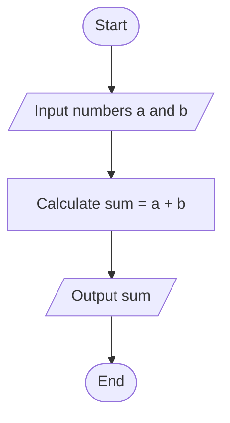
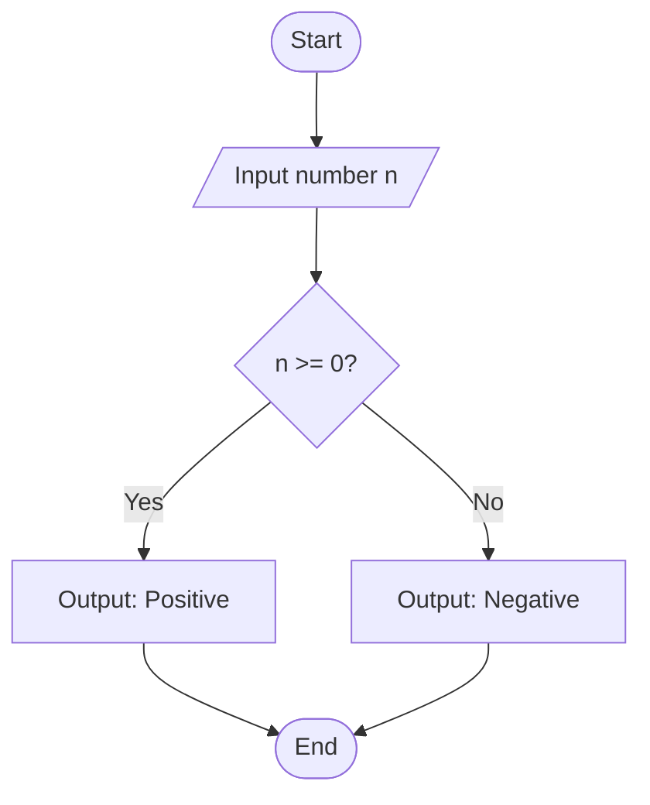
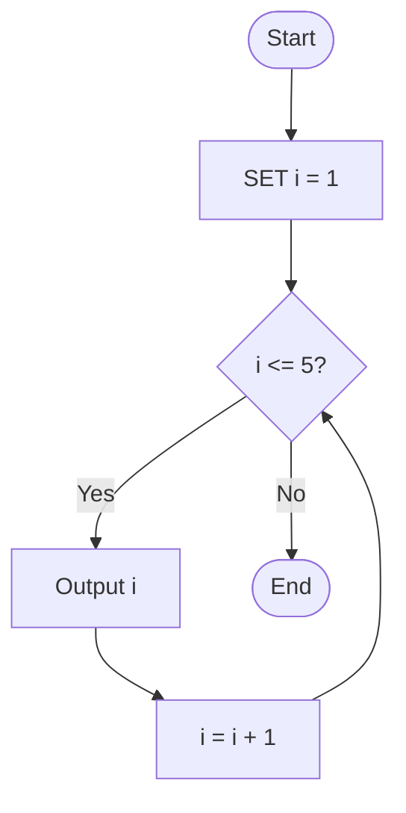

# Lecture 1-3: Algorithm and Flowcharts

## 1. Core Concepts

### Programming

- **Definition:** The process of writing instructions for a computer to execute. It involves problem-solving, logic, and creativity.
- **Importance:** Enhances logical thinking and problem-solving skills and is essential in fields like software development, data science, AI, and automation.

### Problem Solving

- **Core Principle:** The central activity of computer science.
- **Programmer's Task:**
  1. Understand how a human solves the problem.
  2. Translate this human method into an "algorithm" a computer can perform.
  3. Write the algorithm using the specific syntax of a programming language.

## 2. The Problem-Solving Process

### Stages of Problem Solving

1. **Analyzing the problem:** Identifying inputs, processes, and outputs.
2. **Writing the algorithm steps:** Using pseudocode or flowcharts.
3. **Writing the program:** Coding in a specific programming language.
4. **Translating the program:** Compiling the program into machine code.
5. **Executing, testing, and debugging:** Running the program and fixing errors.
6. **Documenting the software:** Creating documentation for future reference and maintenance.

### Problem Analysis

This stage requires answering three fundamental questions:

- **Q1:** What are the desired results or **outputs**?
- **Q2:** What data is available, representing the program's **inputs**?
- **Q3:** What method or set of **processes** will be used to transform the inputs into the desired outputs?

## 3. Algorithms

### Definition

- A well-defined set of rules and procedures for solving a problem in a finite number of steps.
- An ordered set of unambiguous, step-by-step instructions that describes a process.
- Can be implemented in more than one programming language.

### Characteristics of a Good Algorithm

- **Well-Defined Inputs and Outputs:** Must have clear input values and produce a definite output.
- **Definiteness (Unambiguity):** Each step must be precise, with only one possible meaning.
- **Finiteness:** The algorithm must terminate after a finite number of steps.
- **Effectiveness:** Each step must be simple and executable in a reasonable time.
- **Correctness:** The algorithm must correctly solve the problem and produce accurate results.
- **Generality:** Should be applicable to a range of inputs for problems of the same type.
- **Step-by-Step Execution:** Follows a sequential or logical order.

### Algorithm Design Methods

Algorithms are commonly designed using two main tools before coding:

- **Pseudocode:** Uses English-like phrases to outline the program's logic.
- **Flowchart:** Graphically depicts the logical steps and their relationships using standard symbols.

## 4. Pseudocode

### Definition & Purpose

- A method for representing an algorithm using simplified, language-agnostic commands.
- Allows the programmer to focus on the problem-solving logic rather than programming language syntax.
- It is easily converted into actual code once complete.

### Components

Pseudocode consists of **Keywords**, **Sections**, and **Statements**.

### Syntax

#### Program start/end

BEGIN, END: Start and end of a program.

#### Conditionals

IF condition Then: Start of an if statement.
ELSE: else block.
ELSE IF condition Then: else-if block.
ENDIF: End of an if statement.

#### I/O

INPUT varname1, varname2: Take user input.
OUTPUT "Some text", variable_name: Print output.

#### Variables

SET var = value: Initalize a variable.
var = new_value: Reassign/modify a variable.

#### Loops

WHILE condition DO: Start a while loop
ENDWHILE: End a while loop

### Advantages and Disadvantages

| Advantages                                                     | Disadvantages                                 |
| -------------------------------------------------------------- | --------------------------------------------- |
| Easy to understand.                                            | Can become lengthy for very complex problems. |
| Does not require memorizing special symbols or formats.        |                                               |
| Does not use any special syntax or strict rules.               |                                               |
| Easy to convert into a program in any language.                |                                               |
| Requires less space on paper compared to flowcharts.           |                                               |
| Replaces symbolic representations with simple English phrases. |                                               |

### Statement Structures

1. **Sequential Statements:**
   - **Definition:** Instructions are executed in order, one after another, without any condition disrupting the sequence.
   - **Example (Add two numbers):**

```python
BEGIN
  INPUT a, b
  SET sum = a + b
  OUTPUT "Sum is:", sum
END
```

2. **Decision (Selection) Statements:**
   - **Definition:** A choice is made between two or more alternatives based on a given condition (e.g., `IF-ELSE`).
   - **Example (Divide two numbers with error checking):**

```python
BEGIN
  INPUT numerator, denominator
  IF denominator == 0 THEN
    OUTPUT "Error: Cannot divide by zero"
  ELSE
    SET result = numerator / denominator
    OUTPUT "Result is:", result
  ENDIF
END
```

3. **Repetition (Looping) Statements:**
   - **Definition:** An instruction or sequence of instructions is repeated several times. Also known as iteration.
   - `**While**` **Loop:** Repeats a set of statements as long as a specified condition is true.
   - **Example (Print "Welcome" five times):**

```python
BEGIN
  SET count = 1
  WHILE count <= 5 DO
    OUTPUT "Welcome"
    SET count = count + 1
  ENDWHILE
END
```

## 5. Flowcharts

### Definition & Purpose

- A graphical representation showing the sequence of steps in a process or program.
- Uses a set of globally agreed-upon geometric shapes where each shape represents a specific function (e.g., process, decision, input/output).
- They simplify understanding, aid in analysis, guide development, serve as documentation, and improve communication.

### Flowchart Symbols

| Symbol Name            | Shape                   | Function                                                                                  |
| ---------------------- | ----------------------- | ----------------------------------------------------------------------------------------- |
| **Terminator**         | Oval                    | Signifies the **Start** and **End** points of the process.                                |
| **Process**            | Rectangle               | Indicates a processing step, calculation, or operation.                                   |
| **Decision**           | Diamond                 | Represents a point where the flow can branch based on a yes/no condition.                 |
| **Data (I/O)**         | Parallelogram           | Indicates data **input** or **output**.                                                   |
| **Connector**          | Circle                  | Connects different parts of the chart, often across pages or distant areas.               |
| **Preparation / Loop** | Hexagon                 | Used to represent a `for` loop, defining initial conditions, increments, and termination. |
| **Document**           | Wavy-bottomed Rectangle | Represents data that can be read by people, such as a printed output.                     |
| **Flow Line**          | Arrow                   | Connects shapes and indicates the direction of flow.                                      |

### Drawing Guidelines

- A flowchart must be **neat, complete, easy to follow, and unambiguous**.
- The natural flow direction is **top-to-bottom** and **left-to-right**.
- **Start** (Terminator) has only one outgoing line.
- **End** (Terminator) has only one incoming line.
- **Process** (Rectangle) has one incoming and one outgoing line.
- **Decision** (Diamond) has one incoming line and typically two outgoing lines (e.g., Yes/No).

### Flowchart Examples

**Example 1: Adding Two Numbers (Sequential)**



**Example 2: Checking if a Number is Positive (Decision)**



**Example 3: Printing Numbers 1 to 5 (Pre-test Loop)**



### Advantages and Disadvantages

| Advantages                                                      | Disadvantages                                                                     |
| --------------------------------------------------------------- | --------------------------------------------------------------------------------- |
| **Communication:** Standard symbols make logic easy to explain. | **Complexity:** Flowcharts for complex logic can become very large and confusing. |
| **Analysis:** Helps in analyzing problems effectively.          | **Modification:** Changes may require redrawing the entire chart.                 |
| **Documentation:** Serves as important program documentation.   | **Reproduction:** Drawing symbols can be tedious.                                 |
| **Efficient Coding:** Acts as a guide for writing code.         | **Excessive Detail:** Too much detail can obscure the main solution path.         |
| **Error Detection:** Logic can be traced to find errors early.  |                                                                                   |

### Repetition Structures in Flowcharts

Each loop must have a termination condition, which can be tested at two different points:

1. **Pre-test Loop:**
   - The termination condition is checked **before** the process inside the loop is executed.
   - If the condition is initially false, the loop body will not execute at all.
2. **Post-test Loop:**
   - The termination condition is checked **after** the process inside the loop is executed.
   - The loop body is guaranteed to execute at least once.
