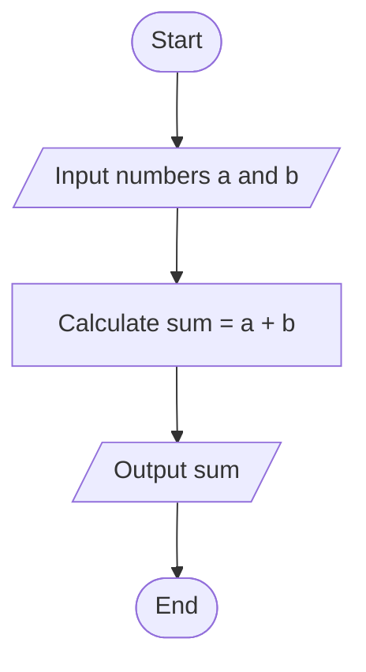
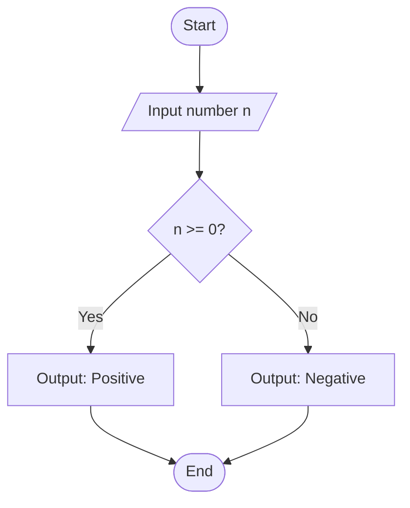
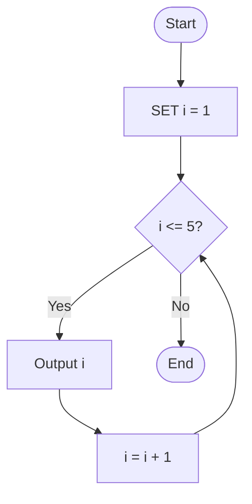

# Lecture 1-3: Algorithm and Flowcharts

## 1. Core Concepts

### Programming

- **Definition:** The process of writing instructions for a computer to execute. It involves problem-solving, logic, and creativity.
- **Importance:** Enhances logical thinking and problem-solving skills and is essential in fields like software development, data science, AI, and automation.

### Problem Solving

- **Core Principle:** The central activity of computer science.
- **Programmer's Task:**
  1. Understand how a human solves the problem.
  2. Translate this human method into an "algorithm" a computer can perform.
  3. Write the algorithm using the specific syntax of a programming language.

## 2. The Problem-Solving Process

### Stages of Problem Solving

1. **Analyzing the problem:** Identifying inputs, processes, and outputs.
2. **Writing the algorithm steps:** Using pseudocode or flowcharts.
3. **Writing the program:** Coding in a specific programming language.
4. **Translating the program:** Compiling the program into machine code.
5. **Executing, testing, and debugging:** Running the program and fixing errors.
6. **Documenting the software:** Creating documentation for future reference and maintenance.

### Problem Analysis

This stage requires answering three fundamental questions:

- **Q1:** What are the desired results or **outputs**?
- **Q2:** What data is available, representing the program's **inputs**?
- **Q3:** What method or set of **processes** will be used to transform the inputs into the desired outputs?

## 3. Algorithms

### Definition

- A well-defined set of rules and procedures for solving a problem in a finite number of steps.
- An ordered set of unambiguous, step-by-step instructions that describes a process.
- Can be implemented in more than one programming language.

### Characteristics of a Good Algorithm

- **Well-Defined Inputs and Outputs:** Must have clear input values and produce a definite output.
- **Definiteness (Unambiguity):** Each step must be precise, with only one possible meaning.
- **Finiteness:** The algorithm must terminate after a finite number of steps.
- **Effectiveness:** Each step must be simple and executable in a reasonable time.
- **Correctness:** The algorithm must correctly solve the problem and produce accurate results.
- **Generality:** Should be applicable to a range of inputs for problems of the same type.
- **Step-by-Step Execution:** Follows a sequential or logical order.

### Algorithm Design Methods

Algorithms are commonly designed using two main tools before coding:

- **Pseudocode:** Uses English-like phrases to outline the program's logic.
- **Flowchart:** Graphically depicts the logical steps and their relationships using standard symbols.

## 4. Pseudocode

### Definition & Purpose

- A method for representing an algorithm using simplified, language-agnostic commands.
- Allows the programmer to focus on the problem-solving logic rather than programming language syntax.
- It is easily converted into actual code once complete.

### Components

Pseudocode consists of **Keywords**, **Sections**, and **Statements**.

### Syntax

#### Program start/end

`BEGIN`: Start of a program.
`END`: End of a program.

#### Conditionals

`IF condition Then`: Start of an if statement.
`ELSE`: else block.
`ELSE IF condition Then`: else-if block.
`ENDIF`: End of an if statement.

#### I/O

`INPUT varname1, varname2`: Take user input.
`OUTPUT "Some text ", variable_name`: Print output.

#### Variables

`SET var = value`: Initalize a variable.
`var = new_value`: Reassign/modify a variable.

#### Loops

`WHILE condition DO`: Start a while loop
`ENDWHILE`: End a while loop

### Advantages and Disadvantages

| Advantages                                                     | Disadvantages                                 |
| -------------------------------------------------------------- | --------------------------------------------- |
| Easy to understand.                                            | Can become lengthy for very complex problems. |
| Does not require memorizing special symbols or formats.        |                                               |
| Does not use any special syntax or strict rules.               |                                               |
| Easy to convert into a program in any language.                |                                               |
| Requires less space on paper compared to flowcharts.           |                                               |
| Replaces symbolic representations with simple English phrases. |                                               |

### Statement Structures

1. **Sequential Statements:**
   - **Definition:** Instructions are executed in order, one after another, without any condition disrupting the sequence.
   - **Example (Add two numbers):**

```python
BEGIN
  INPUT a, b
  SET sum = a + b
  OUTPUT "Sum is:", sum
END
```

2. **Decision (Selection) Statements:**
   - **Definition:** A choice is made between two or more alternatives based on a given condition (e.g., `IF-ELSE`).
   - **Example (Divide two numbers with error checking):**

```python
BEGIN
  INPUT numerator, denominator
  IF denominator == 0 THEN
    OUTPUT "Error: Cannot divide by zero"
  ELSE
    SET result = numerator / denominator
    OUTPUT "Result is:", result
  ENDIF
END
```

3. **Repetition (Looping) Statements:**
   - **Definition:** An instruction or sequence of instructions is repeated several times. Also known as iteration.
   - **While Loop:** Repeats a set of statements as long as a specified condition is true.
   - **Example (Print "Welcome" five times):**

```python
BEGIN
  SET count = 1
  WHILE count <= 5 DO
    OUTPUT "Welcome"
    SET count = count + 1
  ENDWHILE
END
```

## 5. Flowcharts

### Definition & Purpose

- A graphical representation showing the sequence of steps in a process or program.
- Uses a set of globally agreed-upon geometric shapes where each shape represents a specific function (e.g., process, decision, input/output).
- They simplify understanding, aid in analysis, guide development, serve as documentation, and improve communication.

### Flowchart Symbols

| Symbol Name            | Shape                   | Function                                                                                  |
| ---------------------- | ----------------------- | ----------------------------------------------------------------------------------------- |
| **Terminator**         | Oval                    | Signifies the **Start** and **End** points of the process.                                |
| **Process**            | Rectangle               | Indicates a processing step, calculation, or operation.                                   |
| **Decision**           | Diamond                 | Represents a point where the flow can branch based on a yes/no condition.                 |
| **Data (I/O)**         | Parallelogram           | Indicates data **input** or **output**.                                                   |
| **Connector**          | Circle                  | Connects different parts of the chart, often across pages or distant areas.               |
| **Preparation / Loop** | Hexagon                 | Used to represent a `for` loop, defining initial conditions, increments, and termination. |
| **Document**           | Wavy-bottomed Rectangle | Represents data that can be read by people, such as a printed output.                     |
| **Flow Line**          | Arrow                   | Connects shapes and indicates the direction of flow.                                      |

### Drawing Guidelines

- A flowchart must be **neat, complete, easy to follow, and unambiguous**.
- The natural flow direction is **top-to-bottom** and **left-to-right**.
- **Start** (Terminator) has only one outgoing line.
- **End** (Terminator) has only one incoming line.
- **Process** (Rectangle) has one incoming and one outgoing line.
- **Decision** (Diamond) has one incoming line and typically two outgoing lines (e.g., Yes/No).

### Flowchart Examples

**Example 1: Adding Two Numbers (Sequential)**



**Example 2: Checking if a Number is Positive (Decision)**



**Example 3: Printing Numbers 1 to 5 (Pre-test Loop)**



### Advantages and Disadvantages

| Advantages                                                      | Disadvantages                                                                     |
| --------------------------------------------------------------- | --------------------------------------------------------------------------------- |
| **Communication:** Standard symbols make logic easy to explain. | **Complexity:** Flowcharts for complex logic can become very large and confusing. |
| **Analysis:** Helps in analyzing problems effectively.          | **Modification:** Changes may require redrawing the entire chart.                 |
| **Documentation:** Serves as important program documentation.   | **Reproduction:** Drawing symbols can be tedious.                                 |
| **Efficient Coding:** Acts as a guide for writing code.         | **Excessive Detail:** Too much detail can obscure the main solution path.         |
| **Error Detection:** Logic can be traced to find errors early.  |                                                                                   |

### Repetition Structures in Flowcharts

Each loop must have a termination condition, which can be tested at two different points:

1. **Pre-test Loop:**
   - The termination condition is checked **before** the process inside the loop is executed.
   - If the condition is initially false, the loop body will not execute at all.
2. **Post-test Loop:**
   - The termination condition is checked **after** the process inside the loop is executed.
   - The loop body is guaranteed to execute at least once.

---

# Lecture 4: Introduction to C++

### Core Concepts

- **Definition:** C++ is a high-level, object-oriented, cross-platform programming language developed by Bjarne Stroustrup as an extension of the C language.
- **Primary Use:** Used to create high-performance applications, giving programmers significant control over system resources and memory.
- **Key Characteristics:**
  - **Object-Oriented:** Provides a clear program structure and allows for code reuse.
  - **Fast & Efficient:** It is a compiler-based language, resulting in faster programs compared to interpreted languages like Python or Java.
  - **Portable:** C++ source code (`.cpp` files) can be compiled and run on multiple platforms with few or no changes.
  - **Popular:** Widely used in operating systems, graphical user interfaces (GUIs), and embedded systems.

### Comparison: C vs. C++

| Feature             | C                                                                                   | C++                                                                      |
| ------------------- | ----------------------------------------------------------------------------------- | ------------------------------------------------------------------------ |
| **Paradigm**        | Procedural                                                                          | Procedural & Object-Oriented                                             |
| **OOP Support**     | Does **not** support OOP features.                                                  | **Supports** key OOP features.                                           |
| **Core Difference** | Lacks concepts like classes, objects, inheritance, polymorphism, and encapsulation. | Developed as an extension of C to include the OOP features that C lacks. |
| **Syntax**          | Both languages share almost the same basic syntax.                                  |                                                                          |

### Key Features of C++

- **Object-Oriented Programming (OOP):** Structures programs efficiently. Key concepts include:
  - Data Abstraction
  - Data Encapsulation
  - Inheritance
  - Polymorphism
  - Data Hiding
- **Compiler-Based:** A compiler converts C++ source code directly into machine language, making execution fast and efficient.
- **Memory Management:** Supports dynamic memory allocation using pointers. Programmers must manually deallocate memory after use.
- **Pointers:** A variable that stores the memory address of another variable, allowing for direct memory interaction.
- **Broad Library:** Offers a vast standard library of built-in functions, accessed via header files (e.g., `<iostream>`).
- **Operator Overloading:** Allows programmers to provide special meanings to operators for specific data types.
- **Case Sensitive:** Treats uppercase and lowercase letters differently (e.g., `cout` is not the same as `Cout`).
- **Exception Handling:** Provides mechanisms to catch and manage errors that arise during program execution.
- **Platform Dependency vs. Portability:**
  - **Platform Dependent:** A compiled C++ program (`.exe` file) can only run on the operating system where it was compiled.
  - **Portable:** The C++ source code (`.cpp` file) can be moved to a different operating system and recompiled to work there.

### The C++ Compilation and Linking Process

The process transforms a C++ source file (`.cpp`) into an executable file (`.exe`) through several distinct phases.

| Phase   | Phase Name                | Description                                                                       | Output File              |
| ------- | ------------------------- | --------------------------------------------------------------------------------- | ------------------------ |
| 1       | **Preprocessing**         | Handles directives starting with `#` (e.g., `#include`, `#define`).            | `.i` (preprocessed file) |
| 2       | **Lexical Analysis**      | Breaks the source code into units called tokens (keywords, identifiers, etc.).    | (internal)               |
| 3       | **Syntax Analysis**       | Checks if the tokens follow the grammatical rules of C++.                         | (internal)               |
| 4       | **Semantic Analysis**     | Checks the logical meaning, such as variable declarations and type compatibility. | (internal)               |
| 5       | **Intermediate Code Gen** | Generates a machine-independent intermediate representation of the code.          | `.ir`                    |
| 6       | **Code Optimization**     | Improves the intermediate code to make the program faster or use less memory.     | (internal)               |
| 7       | **Code Generation**       | Translates the optimized code into assembly language.                             | `.s` (assembly file)     |
| 8       | **Assembly**              | Translates assembly code into machine-readable object code.                       | `.o` (object file)       |
| 9       | **Linking**               | Combines the object file with necessary libraries to create the final executable. | `.exe`                   |

### Development Tools

- **Text Editor:** A program for writing plain text code (e.g., Notepad). Requires a separate compiler.
- **Integrated Development Environment (IDE):** A software suite that combines a text editor, compiler, and debugger into a single application (e.g., Dev C++, Visual Studio, Code Blocks).

### Types of Programming Errors

| Error Type             | When Detected      | Description                                                                       | Example                                                      |
| ---------------------- | ------------------ | --------------------------------------------------------------------------------- | ------------------------------------------------------------ |
| **Compile-time Error** | During compilation | A syntax or grammatical mistake in the code. The program will not compile.        | Missing a semicolon `;`.                                     |
| **Runtime Error**      | During execution   | Occurs while the program is running, often causing it to crash.                   | Division by zero.                                            |
| **Logical Error**      | After execution    | The program runs without crashing but produces an incorrect or unexpected result. | Using `*` for multiplication when division `/` was intended. |

### Basic C++ Program Structure

**Example Code:**

```cpp
#include <iostream>
using namespace std;

int main() {
  cout << "Hello World!";
  return 0;
}
```

**Syntax Rules & Explanation:**

- `#include <iostream>`: A **preprocessor directive** that includes the `iostream` header library, which is necessary for input/output operations.
- `using namespace std;`: Allows the use of names for objects (like `cout`) from the standard library without the `std::` prefix.
  - **Alternative:** If this line is omitted, you must use `std::cout` instead of `cout`.
- `int main() { ... }`: The **main function** where program execution begins. All code inside the curly braces `{}` is executed.
- `cout << "Hello World!";`: This is a **statement**.
  - `cout`: An object used to print output to the screen.
  - `<<`: The **insertion operator**, which sends the data on its right to the object on its left.
  - `"Hello World!"`: A string literal. Text must be enclosed in double quotes. Numbers do not need quotes.
- `return 0;`: Terminates the `main` function and indicates successful execution.
- `;` (Semicolon): Every C++ statement must end with a semicolon. Omitting it causes a **compile-time error**.

---

# Lecture 5: Visual Studio and C++ Basics

### Creating a C++ Project in Visual Studio

**Steps to Create a Project:**

1. Launch Visual Studio 2022.
2. Select **Create a new project**.
3. Choose the **Empty Project** template for C++.
4. Configure the project:
   - Enter a **Project name** (e.g., `Project_NTCU`).
   - Select the **Location** to save the files.
5. Click **Create**.

**Steps to Add a Source File:**

1. In the **Solution Explorer** pane, right-click the **Source Files** folder.
2. Select **Add > New Item...**.
3. In the dialog box, name the file with a `.cpp` extension (e.g., `first_program.cpp`).
4. Click **Add**.

### Running and Managing the Project

**Comparison of Execution Modes:**

| Action                      | Shortcut    | Debugger Attached | Console Stays Open? | Use Case                                      |
| --------------------------- | ----------- | ----------------- | ------------------- | --------------------------------------------- |
| **Start Debugging**         | `F5`        | Yes               | No (by default)     | To find and fix bugs.                         |
| **Start Without Debugging** | `Ctrl + F5` | No                | Yes                 | To run the program and view the final output. |

> [!NOTE]
> To prevent the console from closing immediately when using `F5`, navigate to `Tools > Options > Debugging`.
> Uncheck "Automatically close the console when debugging stops."

**Resolving** `main()` **Function Conflicts:** A project can only have one `main()` function in the build. To keep multiple files with `main()` in a project, you must exclude all but one from the build process.

**Steps to Exclude a File from Build:**

1. In Solution Explorer, right-click the `.cpp` file to exclude.
2. Select **Properties**.
3. Set **Configuration** to **Active (Debug)** and **Platform** to **x64**.
4. Navigate to **Configuration Properties -> General**.
5. Find the **Excluded From Build** option and change its value from **No** to **Yes**.
6. Click **Apply**, then **OK**.

### Visual Studio Project Structure

| File Extension / Name      | Description                                                                                                              |
| -------------------------- | ------------------------------------------------------------------------------------------------------------------------ |
| `*.cpp`                    | The source file containing the actual C++ code (functions, `main()`, logic).                                             |
| `*.sln` (Solution File)    | Organizes and manages one or more projects. Contains references to project files and build configurations.               |
| `*.vcxproj` (Project File) | An XML file containing all project settings, including source files, compiler options, and build instructions.           |
| `*.vcxproj.filters`        | Controls the visual organization of files in Solution Explorer (e.g., "Source Files" folder). Does not affect the build. |
| `*.vcxproj.user`           | Stores user-specific settings like debugging options. Not typically shared.                                              |

### Core C++ Syntax

- **Comments**: Used to explain code; they are ignored by the compiler.
  - **Single-line**: `// This is a comment`
  - **Multi-line**: `/* This is a multi-line comment */`
- **New Lines**: Can be created using the `\n` escape sequence or `endl`.
  - `cout << "Hello World!" << "\n";`
  - `cout << "Hello World!" << endl;`

**Common Escape Sequences:**

| Sequence | Description                             |
| -------- | --------------------------------------- |
| `\n`     | Inserts a new line.                     |
| `\t`     | Inserts a horizontal tab.               |
| `\\`     | Inserts a backslash character (`\`).    |
| `\"`     | Inserts a double-quote character (`"`). |

### Variables and Data Types

- **Variable**: A container for storing a data value. It must be declared with a specific data type.
- **Declaration**: Defining a variable without assigning a value.
  - _Example_: `int x;`
- **Assignment**: Giving a value to a previously declared variable.
  - _Example_: `x = 20;`
- **Initialization**: Declaring a variable and assigning it a value in one step.
  - _Example_: `int count = 0;`

**Classification of C++ Data Types:**

1. **Primary**: Basic types like `int`, `char`, `float`, `bool`.
2. **Derived**: Types derived from primary types, like `Array`, `Function`, `Pointer`.
3. **User-Defined**: Types created by the programmer, like `Class`, `Structure`, `Enum`.

**Basic Data Types:**

| Data Type | Description                                                                                                                   | Size           |
| --------- | ----------------------------------------------------------------------------------------------------------------------------- | -------------- |
| `int`     | Stores whole numbers without decimals.                                                                                        | 2 or 4 bytes   |
| `float`   | Stores fractional numbers. Sufficient for 6-7 decimal digits.                                                                 | 4 bytes        |
| `double`  | Stores fractional numbers. Sufficient for up to 15 decimal digits.                                                            | 8 bytes        |
| `char`    | Stores a single character/letter/number or ASCII value. Values are enclosed in single quotes (e.g., `'A'`).                   | 1 byte         |
| `string`  | Stores a sequence of characters (text). Values are enclosed in double quotes (e.g., `"Hello"`). Requires `#include <string>`. | 24 to 32 bytes |
| `boolean` | Stores one of two states: `true` or `false`.                                                                                  | 1 byte         |

- **Scientific Numbers**: Floating-point numbers can be represented with an "e" or "E" to indicate the power of 10.
  - _Example_: `float f1 = 27E3;` is equivalent to 27000.
- **ASCII Values**: The `char` type can use ASCII decimal values to represent characters.
  - _Example_: `char myVar = 65;` will store the character 'A'.

### Operators

#### Arithmetic Operators

| Operator | Name                       | Example |
| -------- | -------------------------- | ------- |
| `+`      | Addition                   | `x + y` |
| `-`      | Subtraction                | `x - y` |
| `*`      | Multiplication             | `x * y` |
| `/`      | Division                   | `x / y` |
| `%`      | Modulus (remainder)        | `x % y` |
| `++`     | Increment (increases by 1) | `++x`   |
| `--`     | Decrement (decreases by 1) | `--x`   |

#### Assignment Operators

| Operator | Example   | Equivalent To |
| -------- | --------- | ------------- |
| `=`      | `x = 9`   | `x = 9`       |
| `+=`     | `x += 9`  | `x = x + 9`   |
| `-=`     | `x -= 9`  | `x = x - 9`   |
| `*=`     | `x *= 9`  | `x = x * 9`   |
| `/=`     | `x /= 9`  | `x = x / 9`   |
| `%=`     | `x %= 9`  | `x = x % 9`   |
| `&=`     | `x &= 9`  | `x = x & 9`   |
| `\|=`    | `x \|= 9` | `x = x \| 9`  |
| `^=`     | `x ^= 9`  | `x = x ^ 9`   |
| `>>=`    | `x >>= 9` | `x = x >> 9`  |
| `<<=`    | `x <<= 9` | `x = x << 9`  |

#### Comparison Operators

Used to compare two values. They return `1` (true) or `0` (false).

| Operator | Name                     | Example  |
| -------- | ------------------------ | -------- |
| `==`     | Equal to                 | `x == y` |
| `!=`     | Not equal to             | `x != y` |
| `>`      | Greater than             | `x > y`  |
| `<`      | Less than                | `x < y`  |
| `>=`     | Greater than or equal to | `x >= y` |
| `<=`     | Less than or equal to    | `x <= y` |

#### Logical Operators

Used to determine the logic between variables or values.

| Operator | Name        | Description                                                 | Example              |
| -------- | ----------- | ----------------------------------------------------------- | -------------------- |
| `&&`     | Logical AND | Returns `true` if **both** statements are true.             | `x < 10 && x > 5`    |
| `\|\|`     | Logical OR  | Returns `true` if **one** of the statements is true.        | `x < 5 \|\| x > 10`    |
| `!`      | Logical NOT | Reverses the result; returns `false` if the result is true. | `!(x < 5 && x < 10)` |

### String Manipulation

- **Concatenation**: Strings can be joined using the `+` operator or the `append()` method.
  - `string fullName = firstName + lastName;`
  - `string fullName = firstName.append(lastName);`
- **Combining Numbers and Strings**: It is an error to directly add a number to a string. The number must first be converted to a string using `to_string()`.
  - `string result = "Age: " + to_string(25);`

### User Input

The `cin` object is used to get user input from the keyboard.

- _Example_:

### Operator Precedence

The order in which C++ evaluates operators in an expression, from highest to lowest priority:

1. `()` (Parentheses)
2. `*`, `/`, `%` (Multiplication, Division, Modulus)
3. `+`, `-` (Addition, Subtraction)
4. `>`, `<`, `>=`, `<=` (Comparison)
5. `==`, `!=` (Equality)
6. `&&` (Logical AND)
7. `\|\|` (Logical OR)
8. `=` (Assignment)

---

# Lecture 6: Logical Operators and Conditional Statements

### 1. Operators

#### Arithmetic Operators

Used to perform common mathematical operations.

| Operator | Description         | Example (N1=10, N2=5) | Result |
| -------- | ------------------- | --------------------- | ------ |
| `+`      | Addition            | `N1 + N2`             | 15     |
| `-`      | Subtraction         | `N1 - N2`             | 5      |
| `*`      | Multiplication      | `N1 * N2`             | 50     |
| `/`      | Division            | `N1 / N2`             | 2      |
| `%`      | Modulus (Remainder) | `N1 % N2`             | 0      |
| `++`     | Increment           | `++N2`                | 6      |
| `--`     | Decrement           | `--N1`                | 9      |

#### Assignment Operators

Used to assign values to variables, often combined with an arithmetic or bitwise operation.

| Operator | Example   | Equivalent To |
| -------- | --------- | ------------- |
| `=`      | `x = 9`   | `x = 9`       |
| `+=`     | `x += 9`  | `x = x + 9`   |
| `-=`     | `x -= 9`  | `x = x - 9`   |
| `*=`     | `x *= 9`  | `x = x * 9`   |
| `/=`     | `x /= 9`  | `x = x / 9`   |
| `%=`     | `x %= 9`  | `x = x % 9`   |
| `&=`     | `x &= 9`  | `x = x & 9`   |
| `\|=`    | `x \|= 9` | `x = x \| 9`  |
| `^=`     | `x ^= 9`  | `x = x ^ 9`   |
| `>>=`    | `x >>= 9` | `x = x >> 9`  |

#### Comparison Operators

Used to compare two values and return a boolean result (`true` or `false`, often represented as `1` or `0`). An example is `!=` (Not equal). `(8 != 5)` evaluates to `true` (1).

#### Logical Operators

Used to combine conditional statements.

| Operator | Name        | Description                                                 | Example              |
| -------- | ----------- | ----------------------------------------------------------- | -------------------- |
| `&&`     | Logical AND | Returns `true` if both statements are true.                 | `a < 8 && a < 12`    |
| `\|\|`     | Logical OR  | Returns `true` if **one** of the statements is true.        | `x < 5 \|\| x > 10`    |
| `!`      | Logical NOT | Reverses the result; returns `false` if the result is true. | `!(a < 7 && a < 15)` |

#### Mathematical Functions (`<cmath>`)

- `floor(x)`: Rounds a number **down** to the nearest integer.
  - `floor(4.99)` results in `4`
  - `floor(-3.7)` results in `-4`

---

### 2. Conditional Statements

`if` **Statement**

Executes a block of code if a specified condition is true.

`if...else` **Statement**

Executes one block of code if a condition is true and another block if it is false.

`if...else if...else` **Statement**

Specifies a new condition to test if the first condition is false.

`switch` **Statement**

Tests the value of a variable against a list of predefined constant values (`case`).

- **Purpose:** Selects one of many code blocks to be executed.
- `break` **Keyword:** Exits the `switch` block. If omitted, execution "falls through" to the next `case`.
- `default` **Keyword:** Specifies the code to run if there is no `case` match.

---

### 3. Loops

#### `while` Loop

Executes a block of code as long as a specified condition is true. The condition is checked **before** the loop body is executed.

- **When to use:** Recommended when the number of iterations is **unknown**.

#### `do...while` Loop

A variant of the `while` loop where the code block is executed **at least once**, and the condition is checked **after** the loop body.

- **When to use:** Recommended when the iteration count is unknown and the body must run **at least once**.

#### `for` Loop

Executes a block of code a known number of times. It consists of three parts: initialization, condition, and increment/decrement.

- **When to use:** Recommended when the number of iterations is **known**.

#### Nested Loops

A loop placed inside another loop. The inner loop executes fully for each iteration of the outer loop.

- **Example Use Case:** Printing patterns, like a triangle of stars, where the outer loop controls the rows and the inner loop controls the columns (stars per row).

---

# Lecture 7: C++ Arrays and Vectors

## Arrays (C-Style)

### Definition & Purpose

An **array** is a data structure used to store multiple values of the same data type in a single variable.

### Declaration and Initialization

There are several ways to declare and initialize an array.

**1. Declare with size, then assign values**
If an array is declared without initial values, specifying its size is mandatory.

```cpp
string syllabus[3];
syllabus[0] = "C++";
syllabus[1] = "Java";
syllabus[2] = "Database";
```

> [!NOTE]
> If an array is declared without initial values, specifying its size is mandatory.
> Failure to do so (`string syllabus[];`) will result in a compilation error.

**2. Declare and initialize simultaneously**

```cpp
int numbers[5] = {10, 20, 30, 40, 50};
```

**3. Omit size during initialization**
The compiler automatically determines the size based on the number of elements.

```cpp
string cars[] = {"Volvo", "BMW", "Ford"};
```

### Accessing and Modifying Elements

Elements are accessed using a zero-based **index number** inside square brackets `[]`.

```cpp
string syllabus[] = {"C++", "Java", "Database"};

// Accessing
cout << syllabus[0]; // Outputs "C++"

// Modifying
syllabus[1] = "SQL"; // Changes "Java" to "SQL"
```

## Looping Through Arrays

Iterate through an array using a counter variable for the index.

```cpp
string syllabus[] = {"C++", "Java", "Database"};

for (int i = 0; i < 3; i++) {
  cout << syllabus[i] << endl;
}
```

### `for-each` Loop (C++11 and later)

A simpler syntax for iterating over each element without using an index counter.

```cpp
int myNumbers[5] = {10, 20, 30, 40, 50};

for (int i : myNumbers) {
  cout << i << endl;
}
```

## Array Size Management

### Calculating Array Size programmatically

To make loops more robust, you can calculate the number of elements using `sizeof`.

```cpp
int myNumbers[] = {10, 20, 30, 40, 50, 60};

// Total bytes / bytes of one element
int length = sizeof(myNumbers) / sizeof(myNumbers[0]);

for (int i = 0; i < length; i++) {
  cout << myNumbers[i] << endl;
}
```

## Limitations of C-Style Arrays

- **Fixed Size:** Cannot be changed after definition.
- **No Built-in Functions:** Lacks utilities like `push_back()` or `size()`.
- **No Bounds Checking:** Accessing `arr[10]` on a size-5 array leads to undefined behavior and may crash the program.
- **Inflexible:** When passing an array to a function, its size must typically be passed as a separate argument.
- **Difficult for Dynamic Data:** Adding and removing elements requires manual shifting of all subsequent elements.

## Multi-Dimensional Arrays

### Definition and Syntax

A multi-dimensional array is an **array of arrays**.

### Initialization and Access

```cpp
// [Rows][Columns]
string letters[2][3] = {
  { "A", "B", "C" },
  { "D", "E", "F" }
};

// Accessing "C"
cout << letters[0][2];

// Modifying "A" to "Z"
letters[0][0] = "Z";
```

## Vectors (Resizable Arrays)

### Definition and Purpose

For dynamic data, C++ provides the `std::vector` container. Vectors are resizable arrays that can grow and shrink as needed.

### Key Features

- Found in the `<vector>` library.
- Size is dynamic, not fixed.
- Comes with many useful built-in functions.

### Basic Usage

```cpp
#include <iostream>
#include <vector>
using namespace std;

int main() {
  // Declare and Initialize
  vector<string> syllabus = {"C++", "Java", "Database"};

  // Add an Element
  syllabus.push_back("Python");

  // Modern way to get size
  cout << "Size: " << syllabus.size() << endl;

  return 0;
}
```

---

# Lecture 8-9: Functions & Structures

## C++ Functions

- **Definition:** A block of code that only runs when it is called.
- **Purpose:** To perform specific actions and enable code reuse (define once, use many times).
- **Parameters:** Data can be passed into a function.
- **Syntax Components:**
  - **Declaration:** Specifies the function's return type, name, and parameters.
  - **Definition:** The body of the function, containing the code to be executed.
- `void` **Keyword:** Used as the return type to indicate that the function does not return any value.

#### Basic Syntax

```cpp
void functionName(/* parameters */) {
  // declaration: void functionName()
  // definition: code to be executed
}
```

#### Separating Declaration and Definition

For code optimization, organization, and readability, the declaration and definition of a function can be separated.

- **Common Structure:**
  1. **Function Declaration:** Placed above the `main()` function.
  2. **Function Call:** Made from within the `main()` function.
  3. **Function Definition:** Placed below the `main()` function.
- **Example:**

```c++
#include <iostream>
using namespace std;

// Function Declaration
void myFunction();

int main() {
  // Function Call
  myFunction();
  return 0;
}

// Function Definition
void myFunction() {
  cout << "Hello, world!" << endl;
}
```

## C++ Structures (`struct`)

### Core Concepts

- **Definition:** A composite data type used to combine multiple variables of different types into a single named entity.
- **Purpose:** To group and organize several related variables into one place for easier management and access.
- **Member:** Each variable declared inside a structure is known as a member of that structure.
- **Contrast with Array:** Unlike an array, which stores elements of a single data type, a structure can contain members of many different data types (e.g., `int`, `string`, `bool`).

### Declaration and Member Access

To define a structure, use the `struct` keyword. To access its members, use the dot operator (`.`).

#### Example: Student Structure

```cpp
// 1. Define the structure
struct Student {
  string name;  // member
  int age;       // member
  float grade;   // member
};

int main() {
  // 2. Create a variable (instance) of the structure
  Student s1;

  // 3. Assign data to members using the dot operator
  s1.name = "Ali";
  s1.age = 20;
  s1.grade = 88.5;

  // 4. Access and print member data
  cout << "Name: " << s1.name << endl;
  cout << "Age: " << s1.age << endl;
}
```

### Array of Structures

An array can be created where each element is a `struct` object. This is useful for storing and managing multiple records efficiently.

#### Example: Array of Employees

```cpp
struct Employee {
  int id;
  string name;
  float salary;
};

int main() {
  // Initialize a 1D array of Employee structures
  Employee emp[4] = {
    {101, "Mohamed", 15000},
    {102, "Nada", 12000},
    {103, "Youssef", 5500},
    {104, "Belal", 5500}
  };

  // Loop through the array and access each element's members
  for (int i = 0; i < 4; i++) {
    cout << emp[i].id << " - " << emp[i].name << " - " << emp[i].salary << endl;
  }
}
```

### Functions within Structures (C++ Only)

In C++, a `struct` can contain member functions in addition to data members. This allows the structure to behave similarly to a class, with the key difference that its members are `public` by default.

#### Example: Rectangle with `area()` function

```cpp
struct Rectangle {
  int width, height;

  // Member function defined inside the structure
  int area() {
    return width * height;
  }
};

int main() {
  Rectangle r1 = {5, 10};
  // Call the member function using the dot operator
  cout << "Area = " << r1.area() << endl; // Output: Area = 50
}
```

### Multiple Variables from a Single Structure Definition

You can declare multiple `struct` variables from a single (often unnamed) definition by separating the variable names with a comma.

#### Example: Declaring Multiple Car Variables

```cpp
// Define a structure and declare two variables of its type
struct {
  string brand;
  string model;
  int year;
} myCar1, myCar2;

int main() {
  myCar1.brand = "BMW";
  myCar1.model = "X5";
  myCar1.year = 1999;

  myCar2.brand = "Ford";
  myCar2.model = "Mustang";
  myCar2.year = 1969;

  cout << myCar1.brand << " " << myCar1.model << endl;
  cout << myCar2.brand << " " << myCar2.model << endl;
}
```

---

# Self-Study Topics Summary

## Identifying the Pointer and Its Types

### Pointer (Definition)

- A variable that stores the **memory address** of another variable.

### Declaration & Initialization

```cpp
int x = 10;
int* p = &x;   // p points to x
```

### Dereferencing

```cpp
*p = 20;       // modifies x
```

### Pointer Types

- **Null Pointer**: points to nothing

```cpp
int* p = nullptr;
```

- **Void Pointer**: generic pointer, must be cast before dereferencing

```cpp
void* p;
```

- **Pointer to Pointer**

```cpp
int** pp;
```

- **Array Pointer**

```cpp
int arr[3];
int* p = arr;
```

- **Object Pointer**

```cpp
MyClass* obj;
```

## Identifying the Class and Object in C++

### Class (Definition)

- A **user-defined type** that groups data (attributes) and functions (methods).

```cpp
class Car {
public:
  int speed;
  void accelerate();
};
```

### Object (Definition)

- An **instance** of a class.

```cpp
Car c1;
```

## Simple C++ Program (Class + Array + Methods)

```cpp
#include <iostream>
using namespace std;

class Student {
public:
  int marks[3];

  int total() {
    return marks[0] + marks[1] + marks[2];
  }
};

int main() {
  Student s;
  s.marks[0] = 80;
  s.marks[1] = 70;
  s.marks[2] = 90;

  cout << s.total();
}
```

## C++ Program Using Pointer (Real-World Problem)

### Problem: Update salary using pointer

```cpp
#include <iostream>
using namespace std;

int main() {
  double salary = 5000;
  double* p = &salary;

  *p += 1000;  // increment salary
  cout << salary;
}
```

## Program Including Class and Object

```cpp
#include <iostream>
using namespace std;

class BankAccount {
public:
  double balance;

  void deposit(double amount) {
    balance += amount;
  }
};

int main() {
  BankAccount acc;
  acc.balance = 2000;
  acc.deposit(500);
}
```

## Program Using Class + Object + Pointer (Real-World)

### Problem: Modify object data using pointer

```cpp
#include <iostream>
using namespace std;

class Product {
public:
  int price;
};

int main() {
  Product p;
  p.price = 100;

  Product* ptr = &p;
  ptr->price += 50;

  cout << p.price;
}
```

## C++ Files

### File Types

- **`.cpp`** -> implementation
- **`.h` / `.hpp`** -> declarations

### Header File Example

```cpp
// math.h
int add(int a, int b);
```

### Source File Example

```cpp
// math.cpp
#include "math.h"
int add(int a, int b) {
  return a + b;
}
```

### Include Usage

```cpp
#include "math.h"
```

## C++ Exceptions

### Exception Handling Keywords

- `try`
- `throw`
- `catch`

### Basic Structure

```cpp
try {
  if (x == 0)
    throw x;
}
catch (int e) {
  cout << "Error";
}
```

### Standard Exceptions

- `std::exception`
- `std::runtime_error`
- `std::out_of_range`

### Purpose

- Handle **runtime errors**
- Prevent program crash
- Separate error-handling logic from main logic

## C++ File Handling

### Required Header

```cpp
#include <fstream>
```

### File Stream Classes

- **`ofstream`** -> write to file
- **`ifstream`** -> read from file
- **`fstream`** -> read and write

---

### File Open Modes

- `ios::out` -> write (default for `ofstream`)
- `ios::in` -> read
- `ios::app` -> append
- `ios::trunc` -> overwrite existing content
- `ios::binary` -> binary mode

---

### Opening a File

```cpp
ofstream out("data.txt");
ifstream in("data.txt");
```

Or explicitly:

```cpp
fstream file;
file.open("data.txt", ios::in | ios::out);
```

---

### Reading from a File (Line by Line)

```cpp
ifstream file("data.txt");
string line;

while (getline(file, line)) {
  cout << line << endl;
}
file.close();
```

---

### Writing to a File (Overwrite)

```cpp
ofstream file("data.txt", ios::out | ios::trunc);
file << "Hello World\n";
file.close();
```

---

### Writing to a File (Append)

```cpp
ofstream file("data.txt", ios::out | ios::app);
file << "New Line\n";
file.close();
```

---

### Checking File State

```cpp
if (!in.is_open()) { /* error */ }
if (in.fail()) { /* read/write error */ }
```

---

### Closing a File

```cpp
file.close();
```

---

### Full Program: Read, Overwrite, Append

```cpp
#include <iostream>
#include <fstream>
#include <string>

using namespace std;

int main() {
  // Overwrite file
  ofstream outFile("example.txt", ios::out | ios::trunc);
  outFile << "Line 1\n";
  outFile << "Line 2\n";
  outFile.close();

  // Append to file
  ofstream appendFile("example.txt", ios::out | ios::app);
  appendFile << "Line 3 (appended)\n";
  appendFile.close();

  // Read file line by line
  ifstream inFile("example.txt");
  string line;

  while (getline(inFile, line)) {
    cout << line << endl;
  }
  inFile.close();

  return 0;
}
```

---

### Common File Operations

- Read/write text data
- Store program output
- Persist user data
