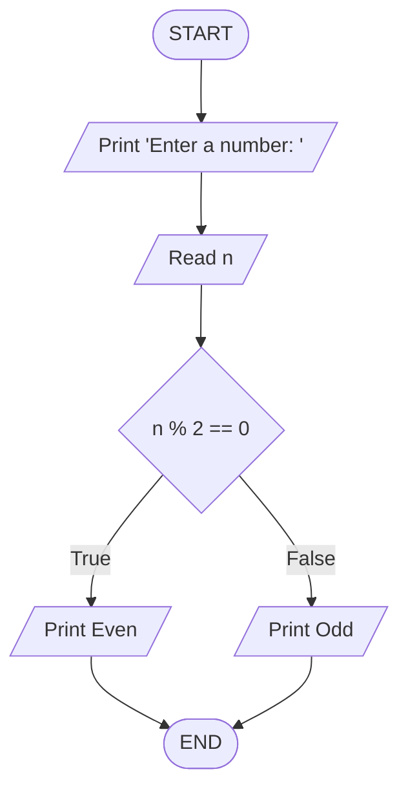

# Ahmad Ali Ahmad Othman - Section 1 - Task 2

## Question 1

Write the algorithm to print the first five natural numbers and trace it in table?

### Algorithm

```txt
Start
Assign i = 0
Loop i < 5:
  Print "Iteration | Value of i"
  Print "-------------------------"
  Print "i | i + 1"
  Increment i += 1
End
```

### Flowchart


## Question 2

Write the algorithm to sum the odd numbers of the first 5 integers and trace it in table?

### Algorithm

```txt
Start
Initialize i = 0, sum = 0
Loop i < 5:
  Print "Iteration | Sum"
  Print "------------------"
  IF i % 2 == 0:
    Increment sum += i
  Print "i | sum"
  Increment i += 1
End
```

### Flowchart


## Question 3

Write the algorithm to Convert Celsius to Fahrenheit?

### Algorithm

```txt
Start
Print "Enter temprature in Celsius: "
Input c
Assign f = (c * 1.8) + 32
Print f
End
```

### Flowchart


## Question 4

Write the algorithm to Check if a Number is Even or Odd

### Algorithm

```txt
Start
Print "Enter a number: "
Input n
IF n % 2 == 0:
  Print "Even"
Else:
  Print "Odd"
End
```

### Flowchart



## Question 5

Write the algorithm that Find the Largest of Two Numbers

### Algorithm

```txt
Start
Print "Enter first number: "
Input x
Print "Enter second number: "
Input y
IF x < y:
  Print "y is bigger"
Else:
  Print "x is bigger"
End
```

### Flowchart


## Question 6

Write an algorithm which Grading System Based on Marks

### Algorithm

```txt
Start
Print "Enter your grade: "
Input grade
IF 90 <= grade && grade <= 100:
  Print "A"
Else if 80 <= grade && grade <= 89:
  Print "B"
Else if 70 <= grade && grade <= 79:
  Print "C"
Else if 60 <= grade && grade <= 69:
  Print "D"
Else:
  Print "Failed"
End
```

### Flowchart


## Question 7

Write the algorithm for a multiplication table

### Algorithm

```txt
Start
Print "Enter a number: "
Read n
Assign i = 1
Loop i <= 12:
  Print "n * i"
  Increment i += 1
End
```

### Flowchart


## Question 8

Write the algorithm to list the factors of the integer n

### Algorithm

```txt
Start
Read n
Assign i = 1
Loop i <= n:
  IF n % i == 0:
    Print i
  Increment i += 1
End
```

### Flowchart


## Question 9

Write the algorithm to print Prime Numbers

### Algorithm

```txt
Start
Print "Enter limit: "
Input n
Assign i = 2
Loop i <= n:
  Assign j = 2, isPrime = true
  Loop j < i:
    IF i % j == 0:
      Assign isPrime = false
      Break
  IF isPrime == true:
    Print i
End
```

### Flowchart


## Question 10

Write the algorithm to calculating the next mathematical series

### Algorithm

```txt
Start
Input x, n
Assign y = 0, i = 1
Loop i <= n:
  Assign factorial = 1, j = 1
  Loop j <= i:
    Assign factorial = factorial * j
    Increment j += 1
  Assign term = (1 / factorial) * ((x + 5) 2 * x) ^ 2
  Assign y = y + term
  Increment i += 1
Print y
End
```

### Flowchart


## Question 11

Draw a flowchart to read the sales representative file of a major company, which includes:

- Representative number (N),
- Sales amount (A),
- Representative name (M),
  Calculate the sales commission at 2.5% for sales less than 50,000 pounds, and 5.5% for sales above that amount. Print lists that include the representative number, sales amount, commission value, and representative name. The lists end with the total sales amount and the total commission value for the sales representative.

### Algorithm

```txt
Start
Assign totalSales = 0, totalCommission = 0
Read N # Representative Number
While N != 555:
  Read M, A # Name (M), Sales Amount (A)

  IF A < 50000:
    Assign commission = A * 0.025
  Else:
    commission = A * 0.055

  Print N, M, A, commission
  Assign totalSales += A
  Assign totalCommission += commission
  Read N # Next Representative Number

Print totalSales, totalCommission
End
```

### Flowchart


