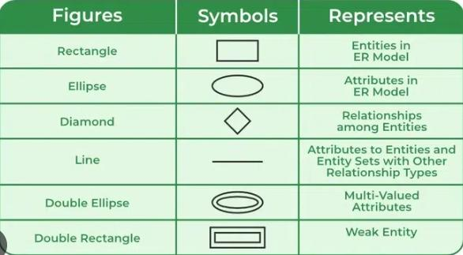
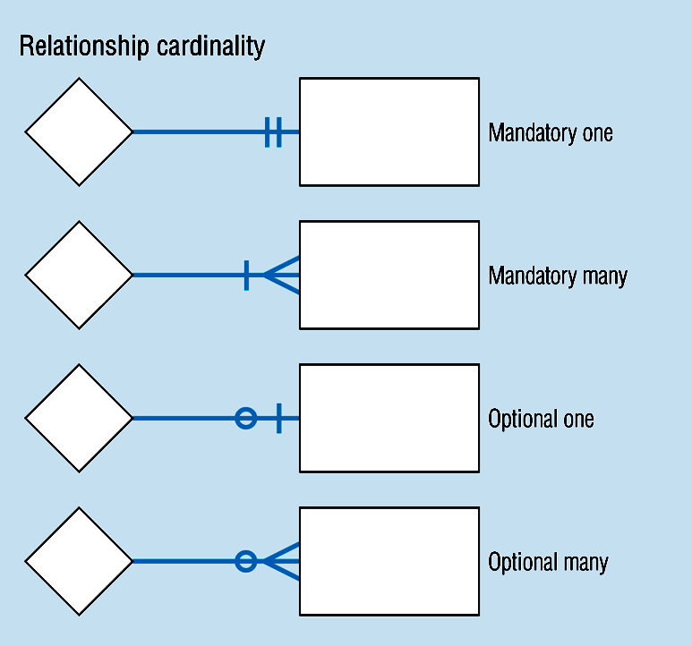
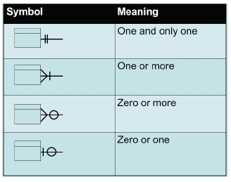

# Lecture 3: Entity Relationship Diagram (ERD)

## Database Model

- A **database** can be represented as:
  - A collection of **entities**.
  - **Relationships** among those entities.

- The **Entity Relationship (ER) diagram** serves as a **blueprint** for database design.
- The **ER model** provides a **graphical view** of the logical data structure.

## Entity Relationship Diagram (ERD)

- **ERD** is a **graphical tool** used for:
  - Modeling data.
  - Designing logical database structures.
  - Understanding the relationships between entities.

- Identifies **concepts (entities)** and the **relationships** between them.

## Purposes of an ERD

- Provides a **clear understanding** of the data to be stored.
- Serves as **documentation** for the database design.
- Helps **communicate** the logical structure to end-users and developers.

## Components of an ERD

1. **Entity** – An object or concept about which data is stored.
2. **Relationship** – An association between entities.
3. **Cardinality** – Specifies the number of entity instances involved in a relationship.
4. **Attribute** – A property or characteristic of an entity.

## Classification of Relationships

### 1. Optional Relationships

- An entity may or may not be associated with another.
  - Example:
    - An _Employee_ may or may not be assigned to a _Department_.
    - A _Patient_ may or may not be assigned to a _Bed_.

### 2. Mandatory Relationships

- An entity must be associated with at least one other entity.
  - Example:
    - Every _Course_ must be taught by at least one _Teacher_.
    - Every _Mother_ must have at least one _Child_.

## Types of Cardinality (Mapping)

| Type                   | Example                                                                            | Description                                                  |
| ---------------------- | ---------------------------------------------------------------------------------- | ------------------------------------------------------------ |
| **One-to-One (1:1)**   | A _Manager_ heads one _Department_ and vice versa.                                 | Each entity instance is related to exactly one in the other. |
| **One-to-Many (1:N)**  | One _Department_ has many _Employees_.                                             | One entity relates to multiple instances of another.         |
| **Many-to-Many (M:N)** | A _Teacher_ teaches many _Students_, and a _Student_ is taught by many _Teachers_. | Entities relate to multiple instances of each other.         |

## Cardinality Constraints

Cardinality defines the **minimum** and **maximum** number of relationships an entity can participate in.

**Example:**

- Each _School_ may enroll zero or many _Students_.
- Each _Student_ attends exactly one _School_.

## Steps to Create an ERD

1. **Identify the entities.**
2. **List each entity's attributes.**
3. **Identify primary keys (PKs).**
4. **Determine relationships** between entities.
5. **Define cardinality** for each relationship.
6. **Draw the ERD.**
7. **Validate and refine** the ERD.

## Example: Company Scenario

### Scenario Description

- A company has several **departments**, each with a **supervisor** and at least one **employee**.
- Employees belong to one or more departments.
- Employees work on one or more **projects**.
- A project must have at least one employee assigned.

### Steps

#### 1. Identify Entities

- Department
- Supervisor
- Employee
- Project

#### 2. Find Relationships

- Department is assigned an Employee.
- Department is run by a Supervisor.
- Employee belongs to a Department.
- Employee works on a Project.
- Project uses Employees.

#### 3. Draw Rough ERD

- Entities are rectangles.
- Relationships are diamonds connected with lines.

#### 4. Define Cardinality

- Each _Department_ has **one Supervisor**.
- Each _Supervisor_ manages **one Department**.
- Each _Department_ has **one or more Employees**.
- Each _Employee_ may belong to **multiple Departments**.
- Each _Project_ has **one or more Employees**.
- Each _Employee_ can have **zero or more Projects**.

#### 5. Define Cardinality Values

- One and only one
- One or more
- Zero or more
- Zero or one

## Identifying and Mapping Attributes

### Identify Attributes

- List essential properties for each entity:
  - _Department Name_
  - _Employee Number_, _Employee Name_
  - _Supervisor Name_, _Supervisor Number_
  - _Project Number_, _Project Name_

### Map Attributes

- Assign each attribute to exactly one entity.
- Avoid duplicate attributes across entities.

### Example

| Entity         | Attributes       |
| -------------- | ---------------- |
| **Employee**   | EmpNo, EmpName   |
| **Department** | DeptNo, DeptName |
| **Project**    | ProjNo, ProjName |
| **Supervisor** | SupNo, SupName   |

## Weak Entity Sets

### Definition

A **weak entity**:

- Depends on another entity for its existence.
- Cannot be uniquely identified without a **strong entity**.

### Examples

| Strong Entity | Weak Entity | Attributes                      |
| ------------- | ----------- | ------------------------------- |
| **Patient**   | Treatment   | TreatmentID, Description, Dates |
| **Course**    | Module      | ModuleNumber, ModuleName        |
| **Book**      | Chapter     | ChapterNumber, ChapterTitle     |

### Notation

- **Double Rectangle** -> Weak Entity
- **Double Diamond** -> Weak Relationship
- **Dashed Underline** -> Discriminator attribute

### Example

A _Person_ entity has subtypes _Employee_ and _Customer_ identified by a discriminator attribute `PersonType`.

## Example Exercises

### Example 1 – Hospital System

- Entities: Patient, Doctor, Test
- Relationships:
  - Doctor–Patient association
  - Test–Patient link
  - Doctor performs Tests

- Attributes:
  - **Patient:** Name, SSN, Insurance, Admission/Discharge Dates
  - **Doctor:** Name, SSN, Specialization
  - **Test:** TestID, Name, Date, Result, Time

- Purpose: Organize patient data, ensure accountability, and maintain integrity.

### Example 2 – Car Sales Company

- Entities: Car, Customer, Employee, Invoice
- Relationships:
  - Employee sells Cars.
  - Customer receives Invoices.
  - Invoice belongs to Customer.

- Attributes:
  - **Car:** SerialNo, Model, Color, Year
  - **Customer:** Name, Phone, Address, Location
  - **Employee:** ID, Name, Address, Qualification
  - **Invoice:** InvoiceNo, Date, Amount

- Purpose: Manage sales efficiently and maintain relationships among staff, clients, and inventory.

## Assignment Exercises

### 1. Car Accident Management System

- Entities: Person, Car, Accident
- Relationships:
  - Person owns Car.
  - Car participates in Accident.
  - Person involved in Accident as Driver.

- Attributes:
  - **Person:** DriverID, Name, Address
  - **Car:** LicenseNo, Model, Year
  - **Accident:** ReportNo, Location, Date

### 2. Company Database System

- Entities: Employee, Department, Project, Dependent
- Relationships:
  - Employee assigned to Department.
  - Department managed by one Employee.
  - Employees work on multiple Projects.
  - Department controls Projects.
  - Employees have Dependents.

- Attributes include:
  - **Employee:** SSN, Name, Address, Salary, Gender, Birthdate
  - **Department:** DeptName, DeptNo, Location
  - **Project:** ProjName, ProjNo, Location, HoursWorked
  - **Dependent:** DepName, Gender, BirthDate, Relationship

## Summary Table

| Concept              | Description                                                    |
| -------------------- | -------------------------------------------------------------- |
| **Entity**           | Real-world object represented in the database                  |
| **Attribute**        | Characteristic or property of an entity                        |
| **Relationship**     | Association between two or more entities                       |
| **Cardinality**      | Defines the numerical nature of a relationship                 |
| **Weak Entity**      | Dependent entity identified through a strong one               |
| **ERD Purpose**      | Visualizes and structures the database logically               |
| **Key Deliverables** | Entities, Attributes, Relationships, Cardinalities, ER Diagram |
