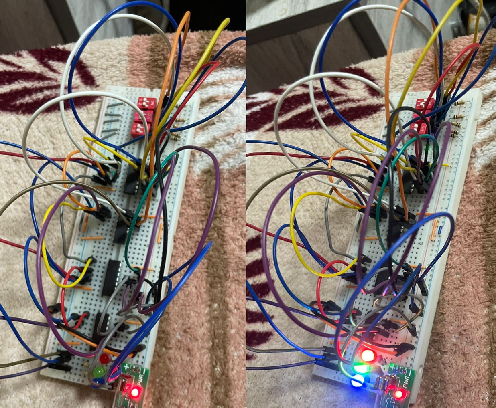

# Digital Engineering - Assignment 2

## Team Members

- أحمد علي أحمد عثمان - 20240592
- أدم أحمد شوقي محمد - 20240594
- اسلام محمد سيد محمد - 20240476
- اشرف ابراهيم محمد ابراهيم - 20240465
- حسن محمود كامل السعيد - 20240231

## Truth Tables

### Addition (Control = 0)

| control | a0  | a1  | b0  | b1  | sum1 | sum2 | carry |
| :-----: | :-: | :-: | :-: | :-: | :--: | :--: | :---: |
|    0    |  0  |  0  |  0  |  0  |  0   |  0   |   0   |
|    0    |  0  |  0  |  0  |  1  |  0   |  1   |   0   |
|    0    |  0  |  0  |  1  |  0  |  1   |  0   |   0   |
|    0    |  0  |  0  |  1  |  1  |  1   |  1   |   0   |
|    0    |  0  |  1  |  0  |  0  |  0   |  1   |   0   |
|    0    |  0  |  1  |  0  |  1  |  0   |  0   |   1   |
|    0    |  0  |  1  |  1  |  0  |  1   |  1   |   0   |
|    0    |  0  |  1  |  1  |  1  |  1   |  0   |   1   |
|    0    |  1  |  0  |  0  |  0  |  1   |  0   |   0   |
|    0    |  1  |  0  |  0  |  1  |  1   |  1   |   0   |
|    0    |  1  |  0  |  1  |  0  |  0   |  1   |   0   |
|    0    |  1  |  0  |  1  |  1  |  0   |  0   |   1   |
|    0    |  1  |  1  |  0  |  0  |  1   |  1   |   0   |
|    0    |  1  |  1  |  0  |  1  |  1   |  0   |   1   |
|    0    |  1  |  1  |  1  |  0  |  0   |  0   |   1   |
|    0    |  1  |  1  |  1  |  1  |  0   |  1   |   1   |

           

### Subtraction (control = 1)

| control | a0  | a1  | b0  | b1  | sum1 | sum2 | borrow |
| :-----: | :-: | :-: | :-: | :-: | :--: | :--: | :----: |
|    1    |  0  |  0  |  0  |  0  |  0   |  0   |   1    |
|    1    |  0  |  0  |  0  |  1  |  0   |  1   |   0    |
|    1    |  0  |  0  |  1  |  0  |  1   |  1   |   0    |
|    1    |  0  |  0  |  1  |  1  |  1   |  0   |   0    |
|    1    |  0  |  1  |  0  |  0  |  0   |  1   |   1    |
|    1    |  0  |  1  |  0  |  1  |  0   |  0   |   1    |
|    1    |  0  |  1  |  1  |  0  |  1   |  0   |   1    |
|    1    |  0  |  1  |  1  |  1  |  1   |  1   |   0    |
|    1    |  1  |  0  |  0  |  0  |  1   |  0   |   1    |
|    1    |  1  |  0  |  0  |  1  |  1   |  1   |   0    |
|    1    |  1  |  0  |  1  |  0  |  0   |  0   |   1    |
|    1    |  1  |  0  |  1  |  1  |  0   |  1   |   0    |
|    1    |  1  |  1  |  0  |  0  |  1   |  1   |   1    |
|    1    |  1  |  1  |  0  |  1  |  1   |  0   |   1    |
|    1    |  1  |  1  |  1  |  0  |  0   |  1   |   1    |
|    1    |  1  |  1  |  1  |  1  |  0   |  0   |   1    |

## TinkerCAD

   

## Logic Circuit Design

                   

## Circuit Images

