# Digital Engineering Summary

## Analog vs. Digital

Analog -> Continuously variable, proportional indicator.
Digital -> Discrete, moves in defined steps

Digital systems: Use quantities with discrete values, can manipulate logical information or physical quantities that are represented in a digital form.
Analog systems: Use Analog quantities with variable values, can manipulate physical quantities that are represented in analog form.

Physical quantities/measurements are converted into a proportional voltage or current (electrical signal).
This signal is then used by the system for display, processing, or control purposes.

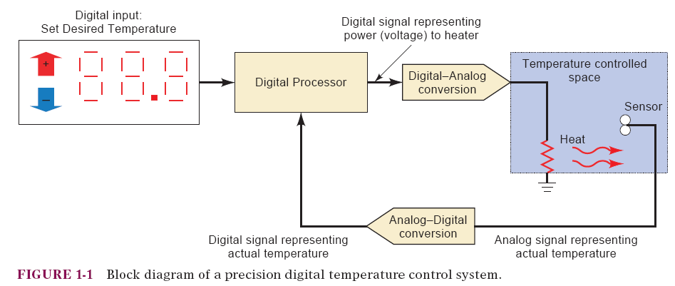

## Timing Diagram

Timing diagrams are used extensively to show how digital signals change with time and the relationship between two or more digital signals.

Has defined ranges for binary 0 and binary 1.

All input and output signals will normally fall within one of these ranges, except during transitions from one level to another.
The transitions on the timing diagram are drawn as vertical lines, and so they appear to be instantaneous, when in reality they are not.

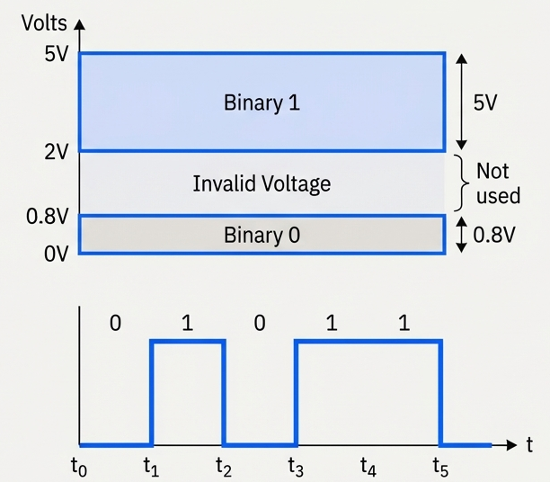

Common range is:

- 0V~0.8V -> Binary 0 (off state)
- 2V~5V -> Binary 1 (on state)
- Any value outside that is considered undefined behavior and invalid signal.

## Parallel and Serial Transmission

Parallel transmission: Each bit has its own line and they all travel simultaneously at the same time.

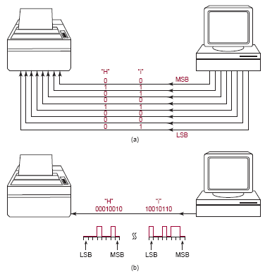

Serial transmission: There is only one single line transmitting all bits, they move one-by-one.

## Memory

Normal logic circuits doesn't have memory, once the input is gone the output resets to its original state.
Logic circuits that have memory is different, even if the input is gone the output remains on its current state.

Memory can be temporary or permanent.

## Digital Computers

**Definition:** A computer is a system of hardware that performs arithmetic operations, manipulates data, and makes decisions.

Computers are faster than human but needs **a complete set of instructions** to operate.

A **program** is a **set of instructions** programmed by one or more people to complete a task.

Programs are placed in the computer's memory unit in **binary-coded form**.

The computer takes these instruction codes from memory and performs then one-by-one.

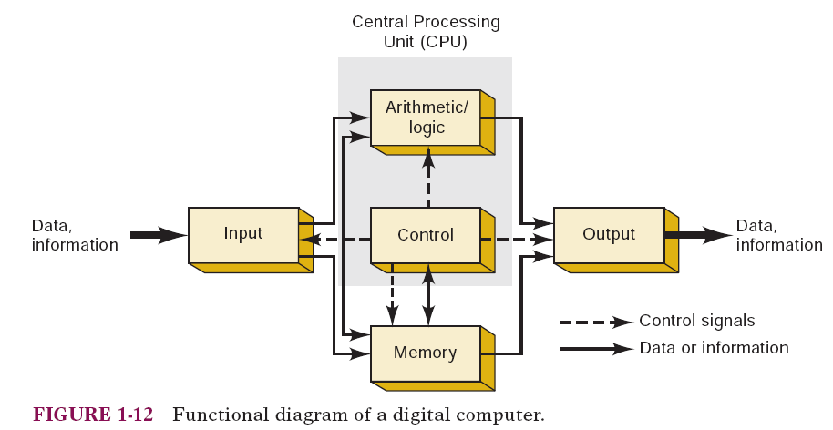

### Microprocessors & Microcomputers

- A **microprocessor** is a central processing unit (CPU) in an integrated circuit that can be connected to the other components of a computer system.
- A **microcomputer** is a computer that use a microprocessor as its CPU.
- General-purpose microcomputers (e.g., PCs, PDAs, etc.) perform a variety of tasks in a wide range of applications.

### Microcontroller

A **microcontroller** is a computer that cannot be programmed by the user, they just perform their intended control task. They also are called embedded controllers or dedicated computers.

Microcontrollers have all the elements of a **complete computer** (CPU, memory, and I/O ports), all contained on a single integrated circuit.

Examples: Your car's antilock braking system, the fridge's cooling system, the microwave's oven clock.

## Digital Number Systems

## Introduction to Numbering Systems

**Definition**: A numbering system is a way to represent numbers in different bases.

**Common Systems**:

- **Binary (Base-2)**
- **Octal (Base-8)**
- **Decimal (Base-10)**
- **Hexadecimal (Base-16)**

## Binary Number System (Base-2)

- **Digits Used**: `0`, `1`
- **Structure**: Each digit in a binary number represents a power of 2, with the rightmost digit representing $2^0$, the next $2^1$, and so on.
- **Usage**: Binary is essential for computers, as digital circuits operate in two states (on/off).

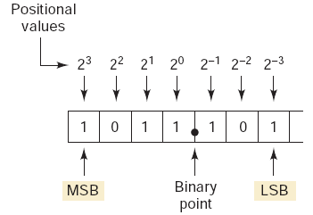

A **Bit** represents a single digit, **Byte** represents **8-bits**.

- The most significant bit (**MSB**) is the **leftmost** bit (**largest** weight).
- The least significant bit (**LSB**) is the **rightmost** bit (**smallest** weight).

To calculate the largest number that can be represented using N bits, use the following formula:

$$
2^N -1
$$

Example: What is the largest number that can be represented using eight bits?

$$
2^8 - 1 = 255_{10} = 1111\ 1111_2
$$

Summary: Using $N$ bits, we can count through $2^N$ different decimal numbers ranging from 0 to $2^{N-1}$ .

## Decimal Number System (Base-10)

- **Digits Used**: `0~9`
- **Structure**: Each digit represents a power of 10.
- **Usage**: Standard system used in everyday life for counting and arithmetic.

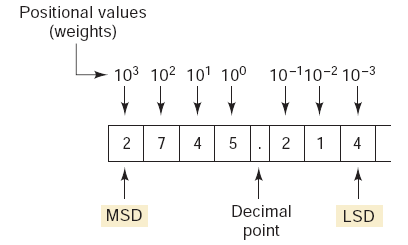

## Hexadecimal Number System (Base-16)

- **Digits Used**: `0~9`, `A=10`, `B=11`, `C=12`, `D=13`, `E=14`, `F=15`
- **Structure**: Each digit represents a power of 16.
- **Usage**: Widely used in programming, particularly for color codes in web design (e.g., `#FF5733`) and memory addresses.

### Counting in Hexadecimal

Hexadecimal counting is base-16, where each digit increases from 0 to F. After F, the digit resets to 0 and a carry is added to the next higher position, exactly like decimal counting but with 16 symbols.

Example: `3D, 3E, 3F, 40, 41, 42` (F rolls over to 0 and increments the next digit: 3-> 4).

Using $N$ hex digits, we can count through $16^N$ different decimal numbers ranging from 0 to $16^{N-1}$ .

Example: What is the largest number that can be represented using three digits?

We can count from $(000)_{16}$ to $(FFF)_{16}$

$$
16^3 - 1 = 4095_{10} = FFF_{16}
$$

## Octal Number System (Base-8)

- **Digits Used**: `0~7`
- **Structure**: Each digit represents a power of 8.
- **Historical Context**: Used as a shorthand for binary in computing, though hexadecimal is more common today.

## Conversions Between Number Systems

### Binary to Decimal Conversion

1. Each binary digit represents a power of 2.
2. Multiply each binary digit by its positional power of 2 and add the results.

Example: $(1011.101)_2 = (??)_{10}$

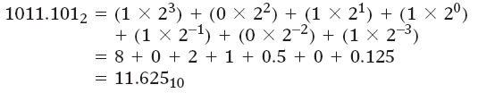

Answer: $(1011.101)_2 = (11.625)_{10}$

---

Example: $(11011)_2 = (??)_{10}$

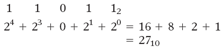

Answer: $(11011)_2 = (27)_{10}$

---

### Decimal to Binary Conversion: Division Method

To convert a decimal number to binary:

1. Divide the number by 2.
2. Write down the quotient (division result) and remainder.
3. Repeat with the quotient until it reaches 0.
4. The binary number is the remainders read in reverse order.

Example 1: $(25)_{10} = (??)_2$

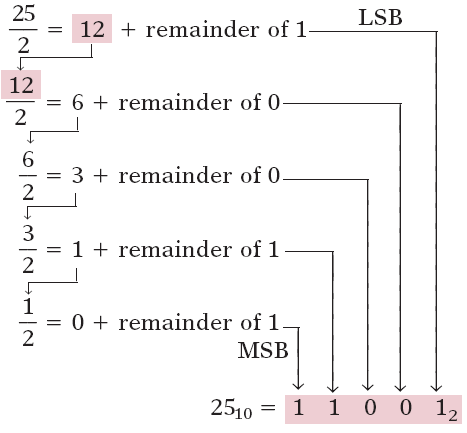

Answer 1: $(25)_{10} = (11001)_2$

---

Example 2: $(13)_{10} = (??)_2$

- $13 \div 2 = 6$ remainder `1`
- $6 \div 2 = 3$ remainder `0`
- $3 \div 2 = 1$ remainder `1`
- $1 \div 2 = 0$ remainder `1`

Answer 2: $(13)_{10} = (1101)_2$

---

### Decimal to Binary Conversion: Subtraction Method

1. Start with the largest power of 2 less than or equal to the number.
2. Subtract that power of 2, write a `1` in its position.
3. If the power of 2 is greater than the remainder, write `0`.

**Example 1:** Convert Decimal `213` to Binary:

Powers of 2 to consider:  
`128 64 32 16 8 4 2 1`

Step-by-step:

- (213 - 128 = 85) -> `1` in the `128` position
- (85 - 64 = 21) -> `1` in the `64` position
- `32 > 21` -> `0` in the `32` position
- (21 - 16 = 5) -> `1` in the `16` position
- `8 > 5` -> `0` in the `8` position
- (5 - 4 = 1) -> `1` in the `4` position
- `2 > 1` -> `0` in the `2` position
- (1 - 1 = 0) -> `1` in the `1` position

Binary:  
`1101 0101`

**Example 2:** Convert Decimal `168` to Binary:

- $168 - 128 = 40$ -> `1` in `128` position.
- $40 - 32 = 8$ -> `1` in `32` position.
- $8 - 8 = 0$ -> `1` in `8` position.

Binary: `1010 1000`

---

### Decimal to Octal Conversion

1. Divide the decimal number by 8.
2. Write down the remainder.
3. Repeat until the quotient is 0.
4. Read the remainders in reverse order.

Example: Convert Decimal `65` to Octal:

- $65 \div 8 = 8$ Remainder 1
- $8 \div 8 = 1$ Remainder 0
- $1 \div 8 = 0$ Remainder 1

Octal: `101`

### Decimal to Hexadecimal Conversion

1. Divide by 16.
2. Record quotient and remainder.
3. Continue dividing until quotient is 0.
4. Convert remainders above 9 to hexadecimal digits (e.g., 10 = A).

Example: Decimal `255` to Hexadecimal:

- $255 \div 16 = 15$ Remainder 15 (F)
- $15 \div 16 = 0$ Remainder 15 (F)

Hexadecimal: `FF`

### Octal to Binary Conversion

1. Convert each octal digit to its 3-digit binary equivalent. Use the following reference table:

| **Octal** | **Binary** | **Octal** | **Binary** |
| --------- | ---------- | --------- | ---------- |
| 0         | 000        | 4         | 100        |
| 1         | 001        | 5         | 101        |
| 2         | 010        | 6         | 110        |
| 3         | 011        | 7         | 111        |

Example: Octal `57` -> Binary `101 111`.

### Binary to Octal Conversion

1. Group binary digits into sets of three from the right.
2. Convert each group to its octal equivalent.

Example: Binary `110 101 011` -> Octal `653`.

### Hexadecimal to Binary Conversion

1. Convert each hexadecimal digit to its 4-bit binary equivalent. Use the following reference table:

| **Hex** | **Binary** | **Hex** | **Binary** |
| ------- | ---------- | ------- | ---------- |
| 0       | 0000       | 8       | 1000       |
| 1       | 0001       | 9       | 1001       |
| 2       | 0010       | A       | 1010       |
| 3       | 0011       | B       | 1011       |
| 4       | 0100       | C       | 1100       |
| 5       | 0101       | D       | 1101       |
| 6       | 0110       | E       | 1110       |
| 7       | 0111       | F       | 1111       |

Example: Hexadecimal `2A3` -> Binary `0010 1010 0011`.

### Binary to Hexadecimal Conversion

1. Group binary digits into sets of four.
2. Convert each group to hexadecimal.

Example: Binary `0001 1010 1101` -> Hexadecimal `1AD`.

### Summary

- **Binary**: A base-2 system using `0` and `1`, essential for computing.
- **Decimal**: Base-10 system, standard in everyday life.
- **Hexadecimal**: Base-16, using `0~9` and `A~F`, used in IPv6 and MAC addresses.
- **Conversions**:
  - **Binary <-> Decimal <-> Hexadecimal**: Often requires intermediate binary representation.
  - **Decimal <-> Octal <-> Hexadecimal**: Follow division methods or positional notation.

## Binary-Coded Decimal (BCD)

BCD represents each decimal digit (0-9) with a 4-bit binary code.

| Decimal | BCD (4-bit Binary) |
| :-----: | :----------------: |
|    0    |        0000        |
|    1    |        0001        |
|    2    |        0010        |
|    3    |        0011        |
|    4    |        0100        |
|    5    |        0101        |
|    6    |        0110        |
|    7    |        0111        |
|    8    |        1000        |
|    9    |        1001        |

BCD encodes decimal numbers for applications where decimal representation is important, such as digital displays, timers, calculators, and avometers.

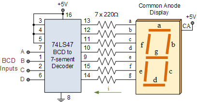

**Example:**

The decimal number 29 is represented in BCD as:

- $2$ = $0010$
- $9$ = $1001$

Therefore, $29$ in BCD is $0010 \space 1001$.

**Example:**

Convert $0110\ 1000\ 0011\ 1001$ (BCD) to its decimal equivalent.

**Solution:**

Split the number into 4-bit groups:

- $0110$ -> 6
- $1000$ -> 8
- $0011$ -> 3
- $1001$ -> 9

Combine the digits:  
**Decimal = 6839**

### BCD vs. Binary

| Aspect                       | Binary Code                                | BCD Code                                        |
| ---------------------------- | ------------------------------------------ | ----------------------------------------------- |
| Representation of $137_{10}$ | $1000\ 1001_2$                             | $0001\ 0011\ 0111_2$                            |
| Encoding method              | Entire number converted directly to base-2 | Each decimal digit encoded separately in 4 bits |
| Conversion to/from decimal   | More complex                               | Simple and straightforward                      |
| Digits to remember           | Full binary weighting                      | Only 4-bit codes for digits 0–9                 |
| Hardware implementation      | Requires more complex logic                | Easier logic circuits                           |
| Main advantage               | Compact representation                     | Ease of decimal conversion                      |

## Gray Code

Gray code is a binary numbering system where only **one bit changes between successive values**, reducing errors caused by rapid signal changes in digital systems.

**Key application:**

Used in **shaft position encoders** to accurately represent mechanical rotation without ambiguity during transitions.

### Conversion Examples

#### Example 1: Binary -> Gray

Convert **Binary `101101`** to Gray code.

Rule:

- Gray MSB = Binary MSB
- Each next Gray bit = XOR of current binary bit with previous binary bit

Step-by-step:

| Binary (B) | Operation    | Gray (G) |
| ---------- | ------------ | -------- |
| 1          | MSB copied   | 1        |
| 0          | $1 \oplus 0$ | 1        |
| 1          | $0 \oplus 1$ | 1        |
| 1          | $1 \oplus 1$ | 0        |
| 0          | $1 \oplus 0$ | 1        |
| 1          | $0 \oplus 1$ | 1        |

Result:
Binary `101101` -> **Gray `111011`**

---

#### Example 2: Gray -> Binary

Convert **Gray `111011`** back to binary.

Rule:

- Binary MSB = Gray MSB
- Each next Binary bit = XOR of current Gray bit with previous binary bit

Step-by-step:

| Gray (G) | Operation    | Binary (B) |
| -------- | ------------ | ---------- |
| 1        | MSB copied   | 1          |
| 1        | $1 \oplus 1$ | 0          |
| 1        | $1 \oplus 0$ | 1          |
| 0        | $0 \oplus 1$ | 1          |
| 1        | $1 \oplus 1$ | 0          |
| 1        | $1 \oplus 0$ | 1          |

Result:
Gray `111011` -> **Binary `101101`**

## Byte, Nibble, and Word

- A **byte** is 8 bits and is the standard unit for storing data.
- A **nibble** is 4 bits (half a byte).
- A **word** is the number of bits a system processes at once and depends on the CPU architecture.
  **Example:**
  A 64-bit processor has a word size of **64 bits (8 bytes)**, while a simple microcontroller may have an **8-bit word size**.

## Alphanumeric Codes and ASCII Code

- Computers use **alphanumeric codes** to represent letters, numbers, punctuation, and symbols.
- These codes allow non-numerical information to be processed and transmitted.

- ASCII is a **7-bit code** with **128 possible characters**.
- Used for keyboard input, internal storage, and communication with external devices.
  **Example:**
  ASCII for `'A'` = `0100 0001` (decimal 65).

## Parity Method for Error Detection

- A **parity bit** is added to transmitted data to detect errors.
- **Even parity:** total number of 1s (including parity bit) is even.
- **Odd parity:** total number of 1s is odd.
  **Example:**
  Data `101 1001` has four 1s -> even parity bit = `0` (they are already even -> 4).
  Data `110 0011` has four 1s -> odd parity bit = `1` (to make them odd -> 5).

## ASCII with Even Parity Example (HELLO)

7-bit ASCII + 1 parity bit:

- H -> `100 1000` (2 ones) -> parity `0` -> `0100 1000`
- E -> `100 0101` (3 ones) -> parity `1` -> `1100 0101`
- L -> `100 1100` (3 ones) -> parity `1` -> `1100 1100`
- L -> `100 1100` (3 ones) -> parity `1` -> `1100 1100`
- O -> `100 1111` (5 ones) -> parity `1` -> `1100 1111`

These 8-bit strings are what would be transmitted using **ASCII with even parity**.

## Boolean Constants and Variables

- Boolean values are **binary only**: `0` or `1`.
- Boolean variables represent **logic levels**, not numeric quantities.
- Logic levels correspond to **voltage states** in digital circuits.
- Inputs are logic variables whose values determine output logic levels.
- Boolean algebra is simpler than ordinary algebra:
  - No fractions, negatives, roots, logarithms, etc.

- **Three basic logic operations only**:
  - **OR**
  - **AND**
  - **NOT**

- Logic operations are implemented using **logic gates** (built from electronic components).
- Boolean algebra expresses **input–output relationships** of logic circuits.

## Truth Tables

- A **truth table** lists:
  - All possible input logic combinations
  - Corresponding output logic levels

- Used to fully describe a logic circuit's behavior.

## OR Operation (OR Gate - 7432)

**Expression:**

$$
X = A + B
$$

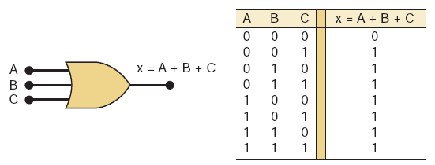

- Output is `1` if **any input is 1**.
- When inputs transition simultaneously:
  - Inputs may briefly be in an **undefined region**
  - Output may show a **glitch (spike)**

- Glitch characteristics depend on **input transition speed**.

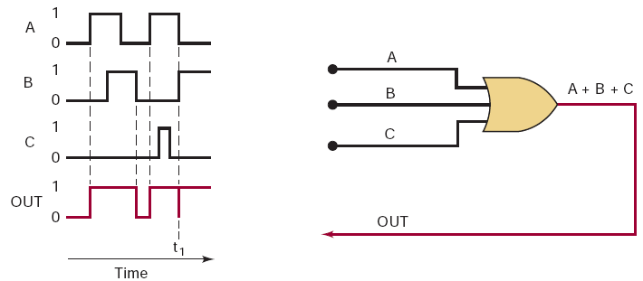

## AND Operation (AND Gate - 7408)

**Expression:**

$$
X = A \cdot B
$$

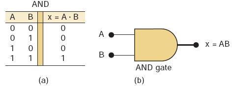

- Output is `1` **only when both inputs are 1**.
- Observations:
  - If `B = 0` -> `X = 0` regardless of `A`
  - If `B = 1` -> `X = A`

- AND gate can function as an **inhibit/enable circuit**:
  - `B = 0` -> inhibit (output forced to 0)
  - `B = 1` -> enable (A passes to output)

## NOT Operation (Inverter Gate - 7404)

**Expressions:**

$$
X = \overline{A} \quad \text{or} \quad X = A'
$$

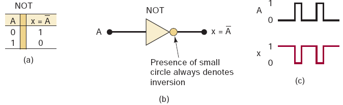

- Output is the **complement** of the input.
- Single-input logic operation.

## NOR and NAND Gates

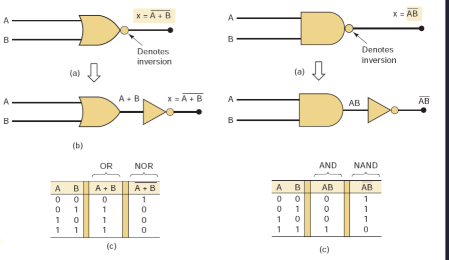

**NOR Gate - 7402**

**Formula:**

$$
\begin{gather}
A \ \text{nor}\  B
\\\\
= \overline{(A \ + \ B)}
\\\\
= \overline{A} \cdot \overline{B}
\end{gather}
$$

- Equivalent to **OR + NOT**.
- OR output HIGH -> **NOR output LOW**.

|  A  |  B  | $\overline{A + B}$ |
| :-: | :-: | :----------------: |
|  0  |  0  |         1          |
|  0  |  1  |         0          |
|  1  |  0  |         0          |
|  1  |  1  |         0          |

- Output is HIGH **only when all inputs are LOW**.

**NAND Gate - 7400**

**Formula:**

$$
\begin{gather}
A \ \text{nand}\  B
\\\\
= \overline{(A \ \cdot \ B)}
\\\\
= \overline{A} + \overline{B}
\end{gather}
$$

- Equivalent to **AND + NOT**.
- AND output HIGH -> **NAND output LOW**.

|  A  |  B  | $\overline{A \cdot B}$ |
| :-: | :-: | :--------------------: |
|  0  |  0  |           1            |
|  0  |  1  |           1            |
|  1  |  0  |           1            |
|  1  |  1  |           0            |

- Output is LOW **only when all inputs are HIGH**.

## Exclusive-OR (XOR Gate - 7486) and Exclusive-NOR (XNOR Gate - 74266) Circuits

- Two special logic circuits frequently used in digital systems.

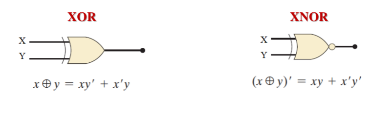

## XOR Gate

|  A  |  B  | $A \oplus B$ |
| :-: | :-: | :----------: |
|  0  |  0  |      0       |
|  0  |  1  |      1       |
|  1  |  0  |      1       |
|  1  |  1  |      0       |

- Output is **HIGH** when the two inputs are **different**.
- XOR gates have **only two inputs** (no 3- or 4-input versions).
- XOR operation is:
  - **Commutative**
  - **Associative**

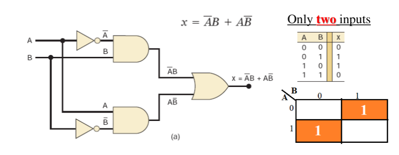

## XOR Properties

- **Commutative:** order of inputs does not affect output.
- **Associative:** grouping of operations does not affect output.

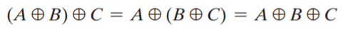
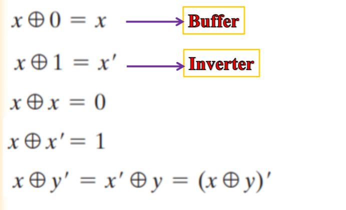

## Exclusive-NOR (XNOR) Gate

- Produces the **complement of XOR** output.

**Formula:**

$$
\begin{gather}
A \ \text{xnor}\  B = \overline{(A \ \oplus \ B)}
\\
= A \ \odot \ B
\\
=  A \cdot B + \overline{A} \cdot \overline{B}
\end{gather}
$$

|  A  |  B  | $A \odot B$ |
| :-: | :-: | :---------: |
|  0  |  0  |      1      |
|  0  |  1  |      0      |
|  1  |  0  |      0      |
|  1  |  1  |      1      |

- Output is HIGH when inputs are at the **same**.

## Algebraic Description of Logic Circuits

- **Any logic circuit** can be fully described using **OR, AND, NOT**.
- These three operations are the **basic building blocks** of digital systems.

## Boolean Theorems (Rules)

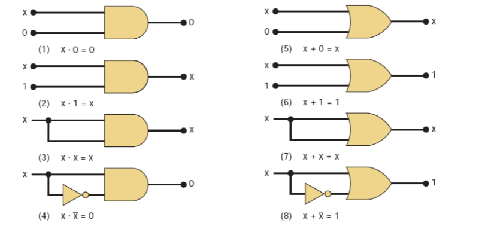
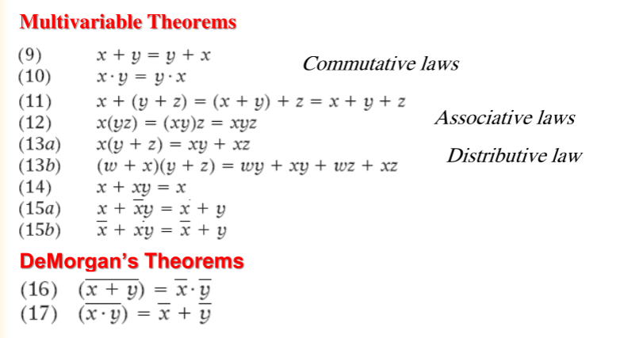

- Boolean expressions can be **simplified** using standard theorems.
- Used to reduce circuit complexity and gate count.

## DeMorgan's Theorems

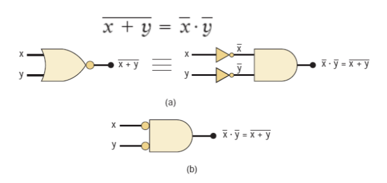
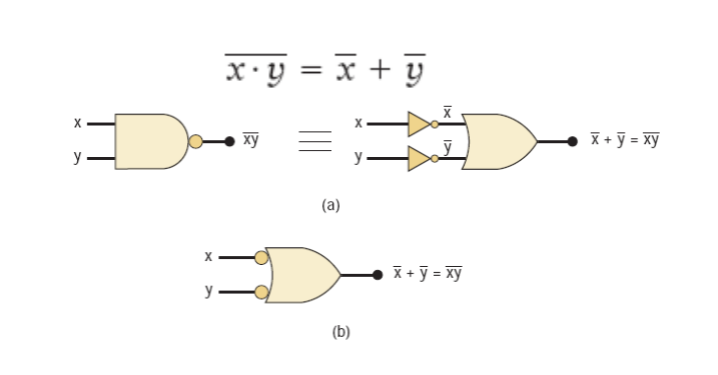

- Provide rules for **complementing expressions**.
- Convert:
  - AND -> OR (with inverted inputs)
  - OR -> AND (with inverted inputs)

## Universality of NAND and NOR Gates

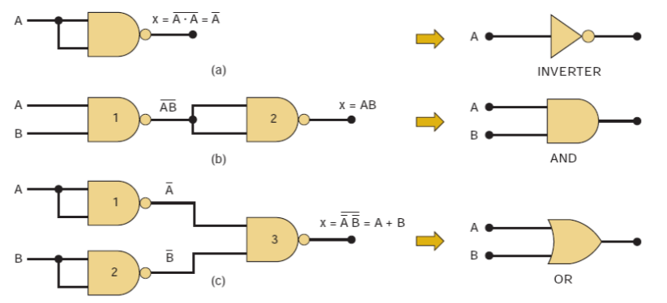
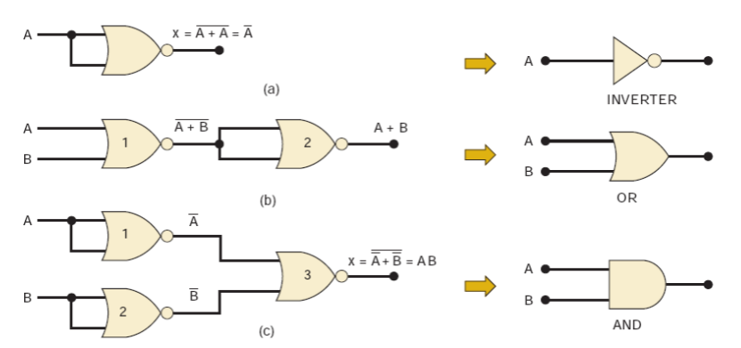
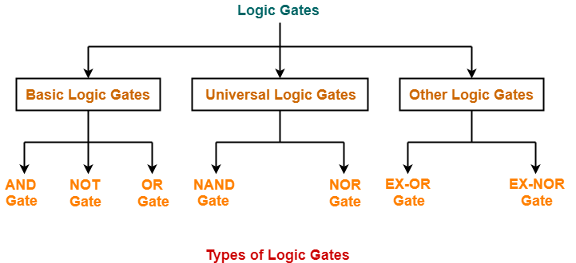

- **NAND** and **NOR** are **universal gates**.
- Any logic function (AND, OR, NOT) can be implemented using **only NAND** or **only NOR** gates.

## Alternative (Bubbled) Logic Gates

- **Alternative / Alternate / Bubbled gates** produce the **same output** as standard gates.
- Used when the original gate symbol is unavailable.

**Deriving an Alternate Symbol**

1. Invert **all inputs and outputs** (add bubbles).
2. Change **AND <-> OR**.
3. **Inverter**: operation symbol does **not** change.

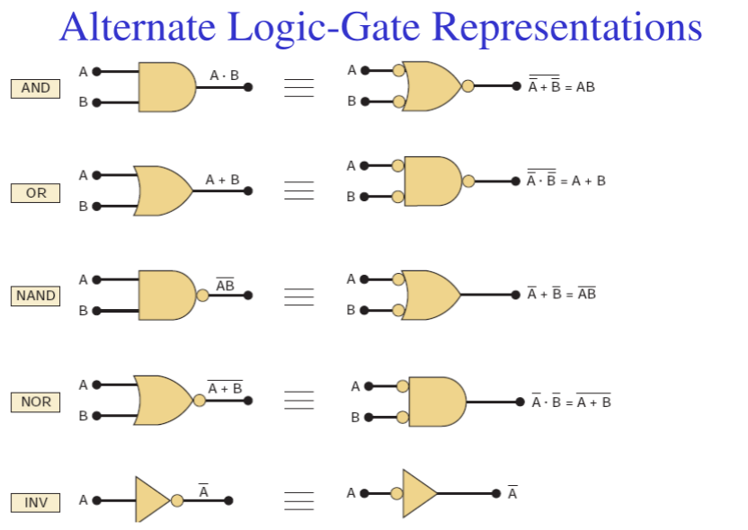

## Active-HIGH and Active-LOW Signals

- **No bubble** on a line -> **Active-HIGH**
- **Bubble present** -> **Active-LOW**
- Bubbles define how a circuit's operation is interpreted.

**Output Activity**

- Action occurs at logic `1` -> output is **active-HIGH**
- Action occurs at logic `0` -> output is **active-LOW**
- If both states cause actions, either representation may be used.

**Design Guideline**

- Prefer **bubble-to-bubble** and **non-bubble-to-non-bubble** connections.

## Asserted Levels

- **Asserted** = signal is in its **active** state
- **Unasserted** = signal is **inactive**

## Labeling Logic Signals

**Active-LOW Signals**

- Indicated using an **overbar**
- No overbar -> **active-HIGH**

**Bistate Signals**

- Signal has **two active meanings**, one for HIGH and one for LOW.

Example: 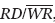

- HIGH -> **Read (RD)**
- LOW -> **Write (WR)**

## IEEE/ANSI Standard Logic Symbols

- **IEEE/ANSI Standard 91-1984** defines a newer set of logic symbols.

## Sum-of-Products (SoP) Form

- Logic expression written as **OR of product (AND) terms**.
- Each product term contains variables in **complemented or uncomplemented** form.
- Required for some simplification and design methods.

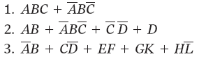

## Product-of-Sums (PoS) Form

- Logic expression written as **AND of sum (OR) terms**.
- Each sum term contains variables in **complemented or uncomplemented** form.

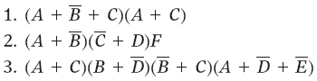

## Simplifying Logic Circuits

- Goal: **reduce terms, variables, gates, and connections**.
- Benefits:
  - Lower cost
  - Smaller size
  - Improved reliability

**Methods**

1. Algebraic simplification
2. Karnaugh Map (K-map)

## Standard Forms

- **Product term:** (XYZ) -> AND of literals
- **Sum term:** (X + Y + Z) -> OR of literals

In Boolean algebra:

- Product = AND
- Sum = OR

## Minterms and Maxterms

- **Minterm:** output = 1 for one input combination, 0 for all others.
- **Maxterm:** output = 0 for one input combination, 1 for all others.
- Minterm and maxterm with the same subscript are **complements**.
- Boolean functions can be written as a **sum of minterms** from the truth table.

## Karnaugh Map (K-Map)

- Graphical method to simplify logic expressions or derive circuits from truth tables.
- Practical limit: **5–6 variables**.

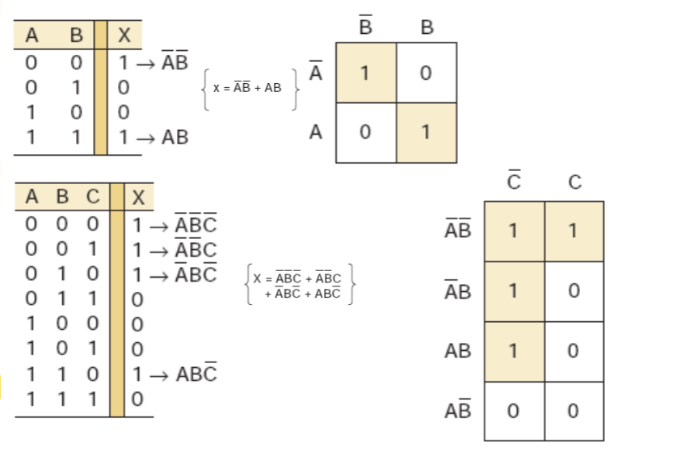
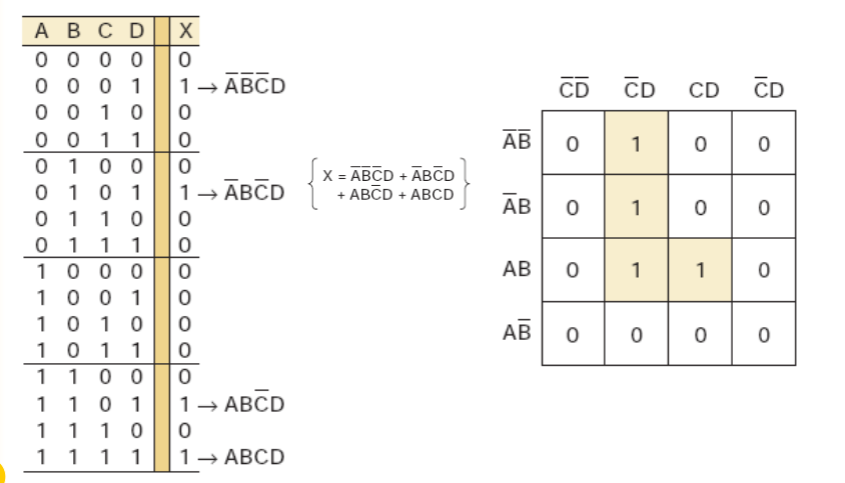

## Looping in K-Maps

- Adjacent 1s are grouped to simplify expressions.
- Group sizes: **pairs, quads, octets** (2, 4, 8).

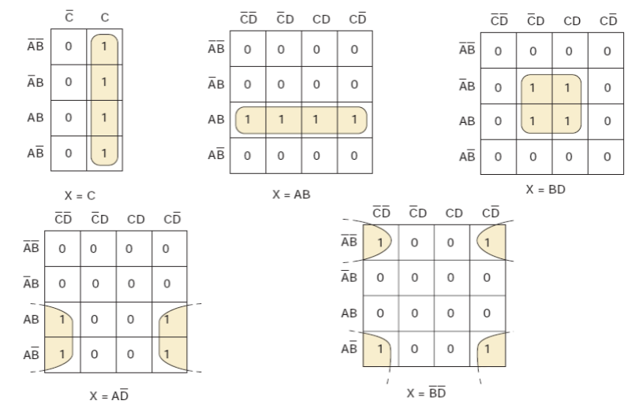

## K-Map Simplification Steps

1. Place 1s and 0s from the truth table.
2. Loop **isolated 1s**.
3. Loop pairs with single adjacency.
4. Loop octets (8 squares) when possible.
5. Loop quads (4 squares) using the fewest loops.
6. Loop remaining pairs if needed.
7. OR all terms generated by loops.

## Don't-Care Conditions

- Input combinations that **never occur** or have **unspecified outputs**.
- Can be treated as **0 or 1** to achieve further simplification.

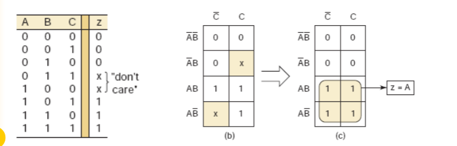

## Exclusive-OR (XOR) Gate

- Output **active-HIGH (=1)** when **exactly one input is HIGH**.
- Only **2-input XOR gates** exist; no 3- or 4-input versions.
- IEEE/ANSI symbol:

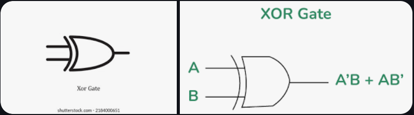

- Common ICs:
  - 74LS86 (TTL)
  - 74C86 (CMOS)
  - 74HC86 (High-speed CMOS)

## Exclusive-NOR (XNOR) Gate

- Output **HIGH when inputs are equal** (complement of XOR).
- Often implemented by connecting **XOR output to an inverter**.
- Common ICs:
  - 74LS266 (TTL)
  - 74C266 (CMOS)
  - 74HC266 (High-speed CMOS)

## Parity Generator and Checker

- **Purpose:** Detect single-bit errors in transmission by adding a **parity bit**.
- **Even parity:** total 1s (including parity bit) = **even**.
- **Odd parity:** total 1s (including parity bit) = **odd**.

**Example 1: Even parity generator (4-bit data $D_0 D_1 D_2 D_3$)**

$$
P = D_0 \oplus D_1 \oplus D_2 \oplus D_3
$$

**Example 2: Odd parity generator (3-bit data $D_0 D_1 D_2$)**

$$
P = \overline{D_0 \oplus D_1 \oplus D_2}
$$

## Combinational Circuits

- Output depends **only on current inputs**, no memory or feedback.
- Components: interconnection of logic gates transforming **input data -> output data**.

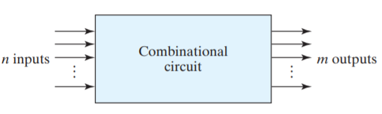

- **Applications:** Often connected to registers; if registers included -> **sequential circuit**.
- **Standard combinational circuits:**
  - Adders
  - Subtractors
  - Comparators
  - Decoders
  - Encoders
  - Multiplexers

## Half-Adder (HA)

**Purpose:** Adds **two single-bit inputs** to produce **sum** and **carry**.

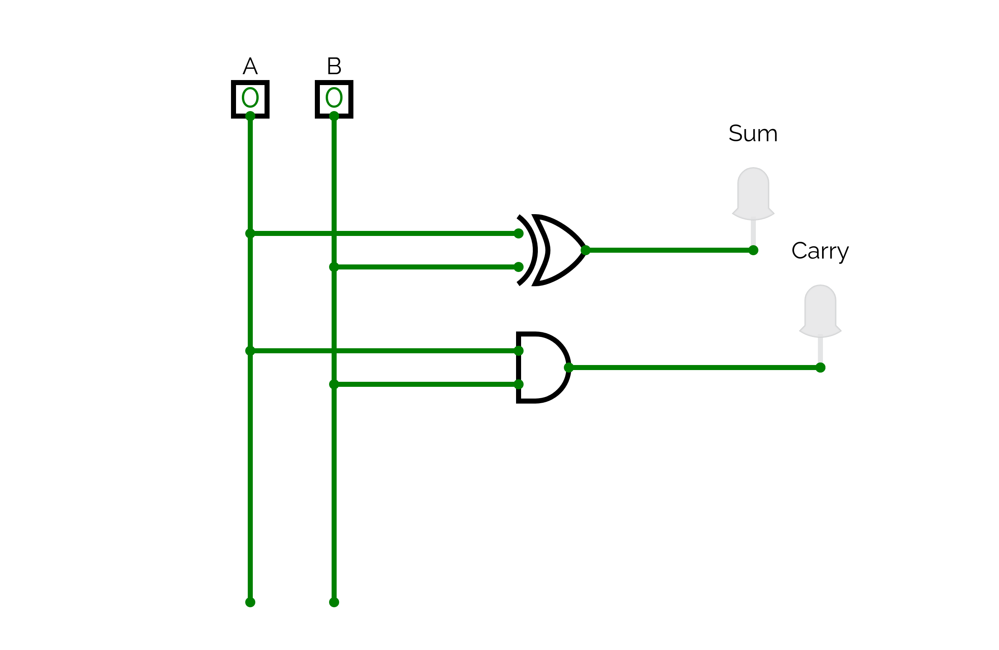

### Inputs and Outputs

- Inputs: $A$, $B$
- Outputs:
  - Sum ($S$) = $A \oplus B$
  - Carry ($C$) = $A \cdot B$

### Truth Table

| A   | B   | Sum (S) | Carry (C) |
| --- | --- | ------- | --------- |
| 0   | 0   | 0       | 0         |
| 0   | 1   | 1       | 0         |
| 1   | 0   | 1       | 0         |
| 1   | 1   | 0       | 1         |

### Logic Formulas

$$
S = A \oplus B
$$

$$
C = A \cdot B
$$

**Explanation:**

- **Sum** is HIGH when inputs are **different**.
- **Carry** is HIGH when **both inputs are 1**.
- Can only handle **two inputs**, so it cannot propagate carry from a previous addition.

## Full-Adder (FA)

**Purpose:** Adds **three single-bit inputs** (including carry-in) to produce **sum** and **carry-out**.

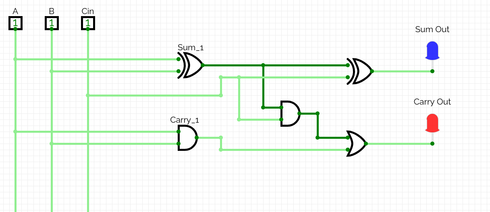

### Inputs and Outputs

- Inputs: $A$, $B$, $C_{in}$
- Outputs:
  - Sum ($S$) = $A \oplus B \oplus C_{in}$
  - Carry ($C_{out}$) = $(A \cdot B) + (B \cdot C_{in}) + (A \cdot C_{in})$

### Truth Table

| A   | B   | Cin | Sum (S) | Cout |
| --- | --- | --- | ------- | ---- |
| 0   | 0   | 0   | 0       | 0    |
| 0   | 0   | 1   | 1       | 0    |
| 0   | 1   | 0   | 1       | 0    |
| 0   | 1   | 1   | 0       | 1    |
| 1   | 0   | 0   | 1       | 0    |
| 1   | 0   | 1   | 0       | 1    |
| 1   | 1   | 0   | 0       | 1    |
| 1   | 1   | 1   | 1       | 1    |

### Logic Formulas

$$
S = A \oplus B \oplus C_{in}
$$

$$
C_{out} = (A \cdot B) + (B \cdot C_{in}) + (A \cdot C_{in})
$$

**Explanation:**

- **Sum** is HIGH when an **odd number of inputs are 1**.
- **Carry-out** is HIGH when **at least two inputs are 1**.
- Can handle **carry from previous stage**, so suitable for **multi-bit addition**.

## Half-Subtractor (HS)

**Purpose:** Subtracts **two single-bit inputs** to produce **difference** and **borrow**.

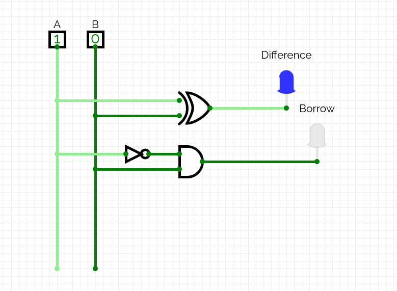

### Inputs and Outputs

- Inputs: $A$, $B$
- Outputs:
  - Difference ($D$) = $A \oplus B$
  - Borrow ($B_{out}$) = $\bar{A} \cdot B$

### Truth Table

| A   | B   | Difference (D) | Borrow (Bout) |
| --- | --- | -------------- | ------------- |
| 0   | 0   | 0              | 0             |
| 0   | 1   | 1              | 1             |
| 1   | 0   | 1              | 0             |
| 1   | 1   | 0              | 0             |

### Logic Formulas

$$
D = A \oplus B
$$

$$
B_{out} = \bar{A} \cdot B
$$

**Explanation:**

- **Difference** is HIGH when inputs are **different**.
- **Borrow** is HIGH when $B = 1$ and $A = 0$.
- Cannot handle a borrow from a previous stage.

## Full-Subtractor (FS)

**Purpose:** Subtracts **three single-bit inputs** (including borrow-in) to produce **difference** and **borrow-out**.

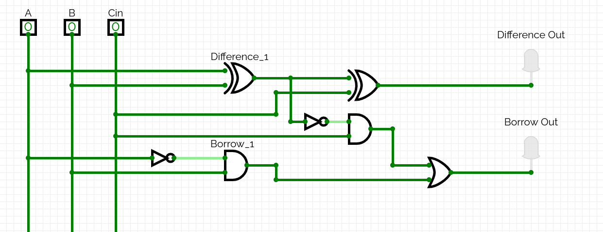

### Inputs and Outputs

- Inputs: $A$, $B$, $B_{in}$
- Outputs:
  - Difference ($D$) = $A \oplus B \oplus B_{in}$
  - Borrow ($B_{out}$) = $(\bar{A} \cdot B) + (\bar{A} \cdot B_{in}) + (B \cdot B_{in})$

### Truth Table

| A   | B   | Bin | Difference (D) | Bout |
| --- | --- | --- | -------------- | ---- |
| 0   | 0   | 0   | 0              | 0    |
| 0   | 0   | 1   | 1              | 1    |
| 0   | 1   | 0   | 1              | 1    |
| 0   | 1   | 1   | 0              | 1    |
| 1   | 0   | 0   | 1              | 0    |
| 1   | 0   | 1   | 0              | 0    |
| 1   | 1   | 0   | 0              | 0    |
| 1   | 1   | 1   | 1              | 1    |

### Logic Formulas

$$
D = A \oplus B \oplus B_{in}
$$

$$
B_{out} = (\bar{A} \cdot B) + (\bar{A} \cdot B_{in}) + (B \cdot B_{in})
$$

**Explanation:**

- **Difference** is HIGH when an **odd number of inputs are 1**.
- **Borrow-out** is HIGH when subtraction requires borrowing.
- Can handle **borrow from previous stage**, making it suitable for **multi-bit subtraction**.

## 3-bit Adder

- **Description**: This is a 3-bit ripple carry adder composed of three Full Adder stages where the initial carry input is tied to 0 to perform binary addition.
- **Logic Expression**:
  - $S$: Sum
  - $C$: Carry
  - $S_i = a_i \oplus b_i \oplus C_i$
  - $C_{i+1} = (a_i \cdot b_i) + (C_i \cdot (a_i \oplus b_i))$
  - _Initial condition_: $C_0 = 0$

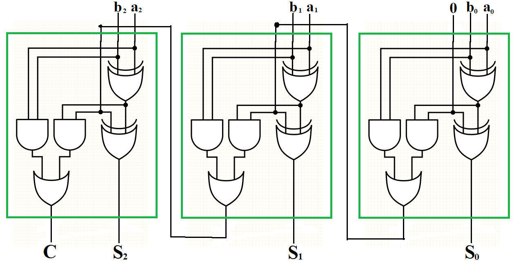

## 3-bit Subtractor

- **Description**: This circuit performs 3-bit binary subtraction ($A - B$) by feeding $a_i$, the complement $\overline{b_i}$, and an initial borrow/carry of 1 into Full Adder stages to implement 2's complement logic.
- **Logic Expression**:
  - $D$: Difference
  - $B$: Borrow
  - $D_i = a_i \oplus \overline{b_i} \oplus B_i$
  - $B_{i+1} = (a_i \cdot \overline{b_i}) + (B_i \cdot (a_i \oplus \overline{b_i}))$
  - _Initial condition_: $B_0 = 1$

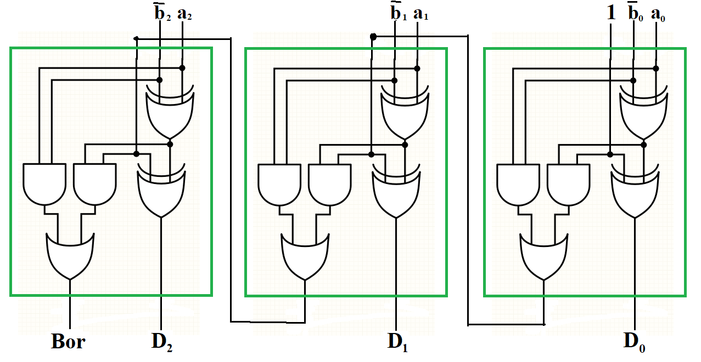

## 3-bit Adder-Subtractor

- **Description**: This multi-function circuit uses a Control Bit ($M$) and XOR gates to conditionally invert the $b$ inputs and set the initial carry, allowing it to act as either an adder ($M=0$) or a subtractor ($M=1$).
- **Logic Expression**:
  - $M$: Control Bit
  - $C$: Carry
  - $Result_i = a_i \oplus (b_i \oplus M) \oplus C_i$
  - $C_{i+1} = (a_i \cdot (b_i \oplus M)) + (C_i \cdot (a_i \oplus (b_i \oplus M)))$
  - _Initial condition_: $C_0 = M$

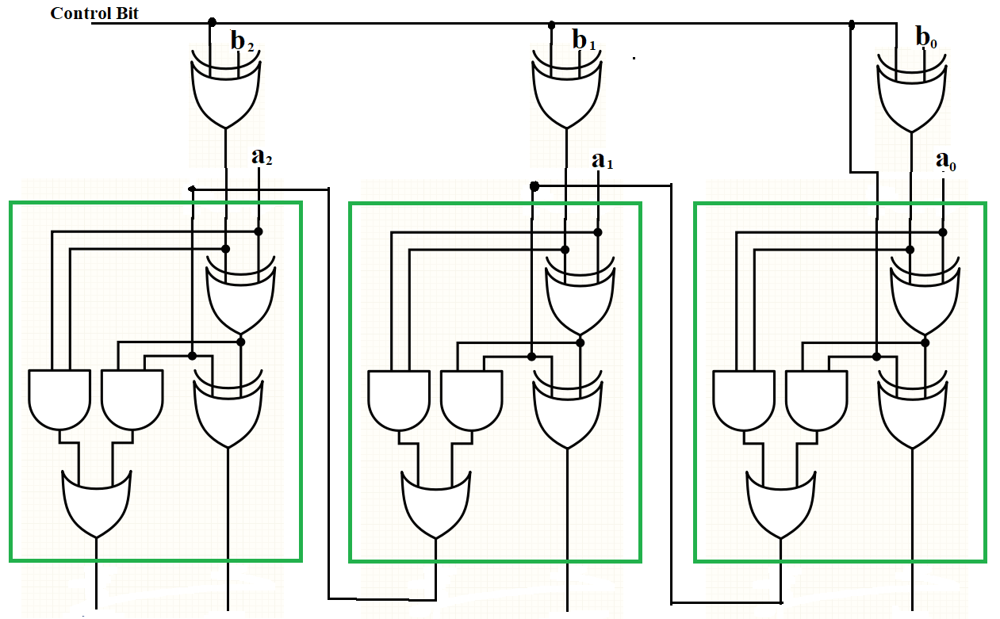

## 2's Complement Logic Circuit

**Purpose:** Represents **negative numbers** in binary and enables **subtraction using addition**.

### Inputs and Outputs

- Inputs:
  - Binary number: $A$
  - Control bit: $SUB$
- Outputs:
  - 2's complement result: $A_{2C}$

### Logic Description

2's complement is generated in **two steps**:

1. **One's complement**: invert all bits
2. **Add 1** to the inverted result

### Logic Formulas (per bit)

$$
A \rightarrow \overline{A}
$$

$$
A_{2C} = \overline{A} + 1
$$

### 1-Bit Truth Table (with Carry-In)

| A   | Cin | $\overline{A}$ | Sum | Cout |
| --- | --- | -------------- | --- | ---- |
| 0   | 0   | 1              | 1   | 0    |
| 0   | 1   | 1              | 0   | 1    |
| 1   | 0   | 0              | 0   | 0    |
| 1   | 1   | 0              | 1   | 0    |

### Explanation

- Bitwise **NOT** converts $A$ to **one's complement**
- Adding **1** completes the **2's complement**
- Enables subtraction using:
  $$
  A - B = A + (2's\ complement\ of\ B)
  $$
- Used internally in **ALUs and CPUs**

## Arithmetic and Logic Unit (ALU)

**Purpose:** Performs **arithmetic** and **logical operations** on binary data.

### Inputs and Outputs

- Inputs:
  - Operands: $A$, $B$
  - Control signals: $S_1$, $S_0$
- Outputs:
  - Result: $F$
  - Status flags (optional): Zero, Carry, Overflow

### Example Operation Selection Table

| S1  | S0  | Operation    | Description            |
| --- | --- | ------------ | ---------------------- |
| 0   | 0   | $A + B$      | Addition               |
| 0   | 1   | $A - B$      | Subtraction (2's comp) |
| 1   | 0   | $A \cdot B$  | AND                    |
| 1   | 1   | $A \oplus B$ | XOR                    |

### Internal Logic

- **Arithmetic block**
  - Full adders
  - 2's complement logic for subtraction
- **Logic block**
  - AND, OR, XOR, NOT gates
- **Multiplexer**
  - Selects output based on control signals

### Explanation

- ALU is the **core computation unit** of the CPU
- Uses **control signals** to choose the operation
- Combines **adders, logic gates, and multiplexers**
- Scales to multi-bit designs (e.g., 32-bit, 64-bit)

## Decoder

- **Function:** A decoder activates exactly one of its $2^n$ output lines based on the binary combination of its $n$ input lines.
- **Complexity:** An $n$-to-$2^n$ decoder requires $2^n$ AND gates, each with $n$ inputs.

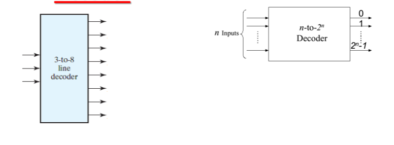

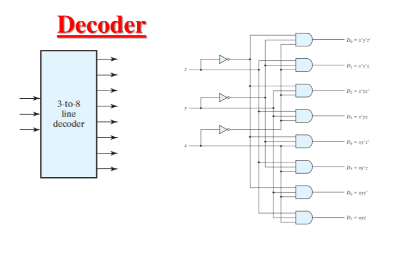

### Logic Implementation of a 3-to-8 Decoder

For a 3-to-8 decoder with inputs $x, y, z$, the outputs $D_0$ through $D_7$ correspond to the minterms of the inputs:

- $D_0 = \overline{x}\overline{y}\overline{z}$ (Binary 000)
- $D_1 = \overline{x}\overline{y}z$ (Binary 001)
- $D_2 = \overline{x}y\overline{z}$ (Binary 010)
- $D_3 = \overline{x}yz$ (Binary 011)
- $D_4 = x\overline{y}\overline{z}$ (Binary 100)
- $D_5 = x\overline{y}z$ (Binary 101)
- $D_6 = xy\overline{z}$ (Binary 110)
- $D_7 = xyz$ (Binary 111)

### Formulas for Decoder Logic

Here is how you would formally represent the output logic for a specific line (e.g., $D_5$): 

$$D_5 = x \cdot \overline{y} \cdot z$$

### Design a 2-bit multiplier using decoder

The table below shows the relationship between two 2-bit inputs ($a$ and $b$) and the 4-bit product ($r$).

Mathematically, this represents $(a_1 a_0)_2 \times (b_1 b_0)_2 = (r_3 r_2 r_1 r_0)_2$.

| $a_1$ | $a_0$ | $b_1$ | $b_0$ | $r_3$ | $r_2$ | $r_1$ | $r_0$ |
| ----- | ----- | ----- | ----- | ----- | ----- | ----- | ----- |
| 0     | 0     | 0     | 0     | 0     | 0     | 0     | 0     |
| 0     | 0     | 0     | 1     | 0     | 0     | 0     | 0     |
| 0     | 0     | 1     | 0     | 0     | 0     | 0     | 0     |
| 0     | 0     | 1     | 1     | 0     | 0     | 0     | 0     |
| 0     | 1     | 0     | 0     | 0     | 0     | 0     | 0     |
| 0     | 1     | 0     | 1     | 0     | 0     | 0     | 1     |
| 0     | 1     | 1     | 0     | 0     | 0     | 1     | 0     |
| 0     | 1     | 1     | 1     | 0     | 0     | 1     | 1     |
| 1     | 0     | 0     | 0     | 0     | 0     | 0     | 0     |
| 1     | 0     | 0     | 1     | 0     | 0     | 1     | 0     |
| 1     | 0     | 1     | 0     | 0     | 1     | 0     | 0     |
| 1     | 0     | 1     | 1     | 0     | 1     | 1     | 0     |
| 1     | 1     | 0     | 0     | 0     | 0     | 0     | 0     |
| 1     | 1     | 0     | 1     | 0     | 0     | 1     | 1     |
| 1     | 1     | 1     | 0     | 0     | 1     | 1     | 0     |
| 1     | 1     | 1     | 1     | 1     | 0     | 0     | 1     |

## Encoder

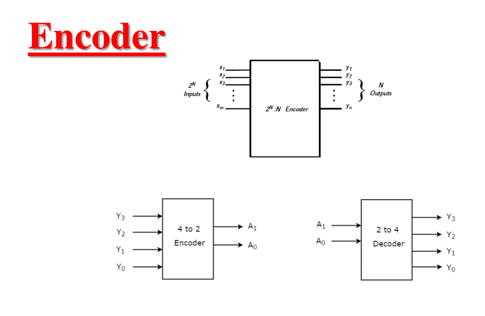

### Truth Table of an Octal-to-Binary Encoder

The following table represents the logic of an 8x3 encoder, where each of the eight input lines ($D_0$ through $D_7$) corresponds to an octal digit, and the three output lines ($x, y, z$) provide the equivalent 3-bit binary code.

| $D_0$ | $D_1$ | $D_2$ | $D_3$ | $D_4$ | $D_5$ | $D_6$ | $D_7$ | $x$ | $y$ | $z$ |
| ----- | ----- | ----- | ----- | ----- | ----- | ----- | ----- | --- | --- | --- |
| 1     | 0     | 0     | 0     | 0     | 0     | 0     | 0     | 0   | 0   | 0   |
| 0     | 1     | 0     | 0     | 0     | 0     | 0     | 0     | 0   | 0   | 1   |
| 0     | 0     | 1     | 0     | 0     | 0     | 0     | 0     | 0   | 1   | 0   |
| 0     | 0     | 0     | 1     | 0     | 0     | 0     | 0     | 0   | 1   | 1   |
| 0     | 0     | 0     | 0     | 1     | 0     | 0     | 0     | 1   | 0   | 0   |
| 0     | 0     | 0     | 0     | 0     | 1     | 0     | 0     | 1   | 0   | 1   |
| 0     | 0     | 0     | 0     | 0     | 0     | 1     | 0     | 1   | 1   | 0   |
| 0     | 0     | 0     | 0     | 0     | 0     | 0     | 1     | 1   | 1   | 1   |

### Logic Equations

Based on the truth table, the Boolean expressions for the outputs are derived by identifying which input lines activate each specific output bit:

- $z = D_1 + D_3 + D_5 + D_7$
- $y = D_2 + D_3 + D_6 + D_7$
- $x = D_4 + D_5 + D_6 + D_7$

## Priority Encoder

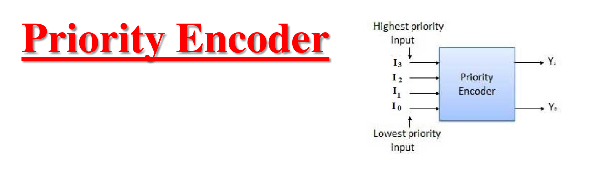

### Understanding Priority Encoders

In a standard encoder, only one input can be active at a time. A **priority encoder** solves this limitation by ensuring that if two or more inputs are high simultaneously, the input with the highest priority takes precedence.

For the 4-bit priority encoder shown:

- If $I_3$ is 1, the output will be `11` regardless of the states of $I_2, I_1,$ and $I_0$.
- If $I_3$ is 0 and $I_2$ is 1, the output will be `10` regardless of $I_1$ and $I_0$.

## Multiplexer

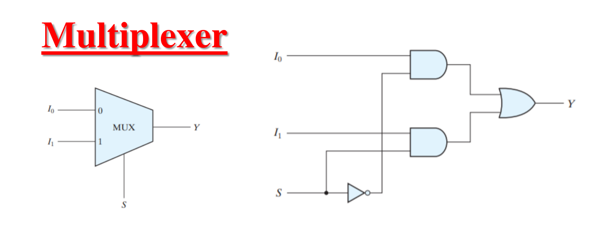

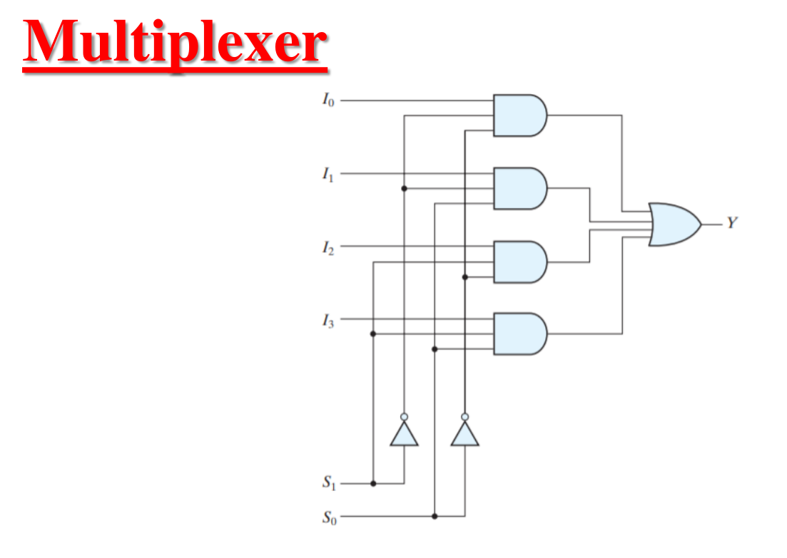

### Truth Table: 2-to-1 Multiplexer

For a 2-to-1 MUX, the select line $S$ determines which input ($I_0$ or $I_1$) is routed to the output $Y$.

| **S** | **Y** |
| ----- | ----- |
| 0     | $I_0$ |
| 1     | $I_1$ |

**Boolean Equation:** $Y = \overline{S} \cdot I_0 + S \cdot I_1$

### Truth Table: 4-to-1 Multiplexer

For a 4-to-1 MUX, two select lines ($S_1, S_0$) are required to choose between the four available inputs.

| **S1​** | **S0​** | **Y** |
| ------- | ------- | ----- |
| 0       | 0       | $I_0$ |
| 0       | 1       | $I_1$ |
| 1       | 0       | $I_2$ |
| 1       | 1       | $I_3$ |

**Boolean Equation:**

$$
Y = \overline{S_1} \cdot \overline{S_0} \cdot I_0 + \overline{S_1} \cdot S_0 \cdot I_1 + S_1 \cdot \overline{S_0} \cdot I_2 + S_1 \cdot S_0 \cdot I_3
$$
