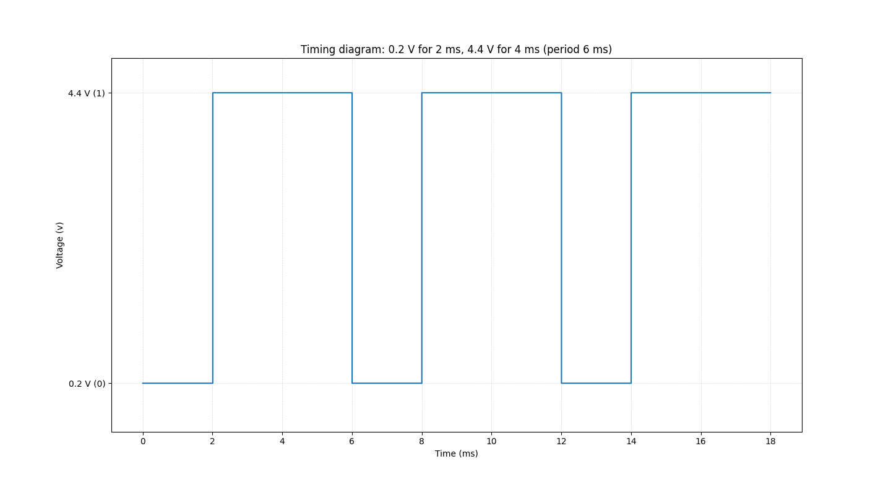
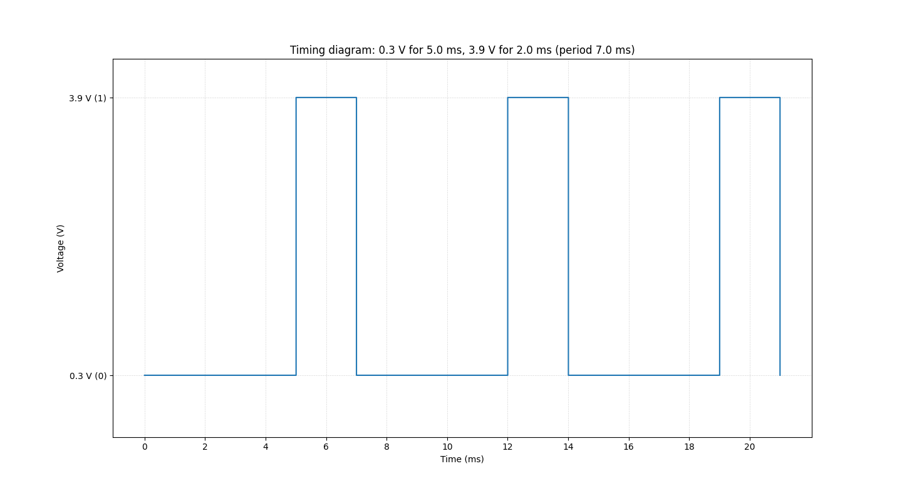

# Ahmad Ali Ahmad Othman - Section 1 - Sheet 1

## 1. Which of the following are analog quantities, and which are digital?

1.  Number of atoms in a sample of material -> Digital
2.  Altitude of an aircraft -> Analog
3.  Pressure in a bicycle tire -> Analog
4.  Current through a speaker -> Analog
5.  Timer setting on a microwave oven -> Digital

## 2. Which of the following are analog quantities, and which are digital?

1. Width of a piece of lumber -> Analog
2. The amount of time before the oven buzzer goes off -> Analog
3. The time of day displayed on a quartz watch -> Display
4. Altitude above sea level measured on a staircase -> Digital
5. Altitude above sea level measured on a ramp -> Analog

## 3. Convert the following binary numbers to their equivalent decimal values:

### A. $11001_2$

$$
\begin{gather}
11001_2 = 1 * 2^4 + 1 * 2^3 + 0 * 2^2  + 0 * 2^1 + 1 * 2^0 \space =
\\\\ 16 + 8 + 0 + 0 + 1 = 25_{10}
\end{gather}
$$

   

### B. $1001.1001_2$

$$
\begin{gather}
1001.1001_2 = 1 * 2^3 + 0 * 2^2  + 0 * 2^1 + 1 * 2^0 + 1 * 2^{-1} + 0 * 2^{-2} + 0 * 2^{-3} + 1 * 2^{-4} \space =
\\\\ 8 + 0 + 0 + 1 + 0.5000 + 0 + 0 + 0.0625 = 9.5625_{10}
\end{gather}
$$

### C. $01\space00\space11\space01\space10\space01.10\space11\space00_2$

$$
\begin{gather}
010011011001.10110_2 = 1 * 2^{10} + 0 * 2^9  + 0 * 2^8 + 1 * 2^7 + 1 * 2^6 + 0 * 2^5 + 1 * 2^4 + 1 * 2^3
\\ + \space 0 * 2^2 + 0 * 2^1 + 1 * 2^0 + 1 * 2^{-1} + 0 * 2^{-2} + 1 * 2^{-3} + 1 * 2^{-4} + 0 * 2^{-5} + 0 * 2^{-6} \space =
\\ 1024 + 0 + 0 + 128 + 64 + 0 + 16 + 8 + 0 + 0 + 1 \\
+ \space 0.500000 + 0 + 0.125000 + 0.062500 + 0 + 0 = 1241.6875_{10}
\end{gather}
$$

## 4. Convert the following binary numbers to decimal.

**A. $100112_2$**

$$
\begin{gather}
10011_2 = 1 * 2^4 + 0 * 2^3 + 0 * 2^2 + 1 * 2^1 + 1 * 2^0 \space =
\\\\ 16 + 0 + 0 + 2 + 1 = 19_{10}
\end{gather}
$$

**(b) $1100.0101_2$**

$$
\begin{gather}
1100.0101_2 = 1 * 2^3 + 1 * 2^2 + 0 * 2^1 + 0 * 2^0 + 0 * 2^{-1} + 1 * 2^{-2} + 0 * 2^{-3} + 1 * 2^{-4} \space =
\\\\ 8 + 4 + 0 + 0 + 0 + 0.2500 + 0 + 0.0625 = 12.3125_{10}
\end{gather}
$$

**C. $01\space00\space11\space10\space01\space00.10\space01\space00_2$**

$$
\begin{gather}
10011100100.10010_2 = 1 * 2^{10} + 0 * 2^9 + 0 * 2^8 + 1 * 2^7 + 1 * 2^6 + 1 * 2^5 + 0 * 2^4 + 0 * 2^3 + 1 * 2^2 + 0 * 2^1 + 0 * 2^0
\\\\ + 1 * 2^{-1} + 0 * 2^{-2} + 0 * 2^{-3} + 1 * 2^{-4} + 0 * 2^{-5} \space =
\\\\ 1024 + 0 + 0 + 128 + 64 + 32 + 0 + 0 + 4 + 0 + 0 + 0.5000 + 0 + 0 + 0.0625 + 0 = 1252.5625_{10}
\end{gather}
$$

## 5. Using three bits, show the binary counting sequence from $000$ to $111$.

| Decimal | Binary |
| ------- | ------ |
| 0       | 000    |
| 1       | 001    |
| 2       | 010    |
| 3       | 011    |
| 4       | 100    |
| 5       | 101    |
| 6       | 110    |
| 7       | 111    |

## 6. Using six bits, show the binary counting sequence from $000000$ to $111111$.

| Decimal | Binary | Decimal | Binary |
| ------- | ------ | ------- | ------ |
| 0       | 000000 | 32      | 100000 |
| 1       | 000001 | 33      | 100001 |
| 2       | 000010 | 34      | 100010 |
| 3       | 000011 | 35      | 100011 |
| 4       | 000100 | 36      | 100100 |
| 5       | 000101 | 37      | 100101 |
| 6       | 000110 | 38      | 100110 |
| 7       | 000111 | 39      | 100111 |
| 8       | 001000 | 40      | 101000 |
| 9       | 001001 | 41      | 101001 |
| 10      | 001010 | 42      | 101010 |
| 11      | 001011 | 43      | 101011 |
| 12      | 001100 | 44      | 101100 |
| 13      | 001101 | 45      | 101101 |
| 14      | 001110 | 46      | 101110 |
| 15      | 001111 | 47      | 101111 |
| 16      | 010000 | 48      | 110000 |
| 17      | 010001 | 49      | 110001 |
| 18      | 010010 | 50      | 110010 |
| 19      | 010011 | 51      | 110011 |
| 20      | 010100 | 52      | 110100 |
| 21      | 010101 | 53      | 110101 |
| 22      | 010110 | 54      | 110110 |
| 23      | 010111 | 55      | 110111 |
| 24      | 011000 | 56      | 111000 |
| 25      | 011001 | 57      | 111001 |
| 26      | 011010 | 58      | 111010 |
| 27      | 011011 | 59      | 111011 |
| 28      | 011100 | 60      | 111100 |
| 29      | 011101 | 61      | 111101 |
| 30      | 011110 | 62      | 111110 |
| 31      | 011111 | 63      | 111111 |

## 7. What is the maximum number that we can count up to using 10 bits?

**General rule:** $2^{bits} - 1$

$2^{10} - 1 = 1023$

  

## 8. What is the maximum number that we can count up to using 14 bits?

$2^{14} - 1 = 16383$

## 9. How many bits are needed to count up to a maximum of 511?

**General rule:** $\lceil \log_2(max) \rceil$ -> Ceil the log2 of the maximum.

$2^n - 1 = 511, \space 2^n = 512, \space n = 9$ or $\log_2(512) = 9$

## 10. How many bits are needed to count up to a maximum of 63?

$2^n - 1 = 63, \space 2^n = 64, \space n = 6$ or $\log_2(64) = 6$

## 11. Draw the timing diagram for a digital signal that continuously alternates between 0.2 V (binary 0) for 2 ms and 4.4 V (binary 1) for 4 ms.

## 12. Draw the timing diagram for a signal that alternates between 0.3 V (binary 0) for 5 ms and 3.9 V (binary 1) for 2 ms.

## 13. Suppose that the decimal integer values from 0 to 15 are to be transmitted in binary.

0. Numbers $0$ to $15$ are represented by 4 bits ($2^4 = 16$).
1. How many lines will be needed if parallel representation is used?
   - Parallel representation sends all bits simultaneously (at the same time), each on its own separate line.
   - That means it would use **4 Lines**.
2. How many will be needed if serial representation is used?
   - Serial representation sends all bits sequentially one after the other, using a single line.
   - It would use **1 Line**.

## 14. How is a microprocessor different from a microcomputer?

### Microprocessor

- A microprocessor is a single processor core that fetches, decodes, and executes instructions.
- It requires external memory (ROM/RAM), a memory decoder, an oscillator, and I/O ports to form a complete microcomputer.
- Handles arithmetic, logic, and control operations — cannot operate alone.

### Microcomputer

- A complete computer system built around a microprocessor.
- Consists of the **microprocessor + memory (RAM/ROM) + I/O ports + storage + power supply**, etc.
- Fully functional — capable of running programs and performing tasks independently.

## 15. How is a microcontroller different from a microcomputer?

### Microcontroller

- A microcontroller is a compact system-on-chip (SoC) with an integrated CPU, memory (RAM, ROM), and programmable I/O peripherals, designed for specific tasks.
- Used for dedicated control tasks in embedded systems (e.g., washing machines, sensors, robotics).
- Optimized for **control and efficiency**, not high-speed computing.

### Microcomputer

- A **complete general-purpose computing system** that may use a microprocessor or microcontroller as its CPU.
- Used for general-purpose computing (e.g., personal computers, workstations).
- Optimized for **flexibility** and **processing power**.
