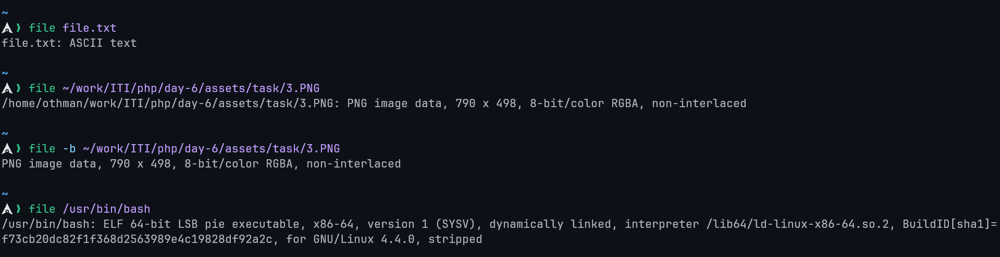
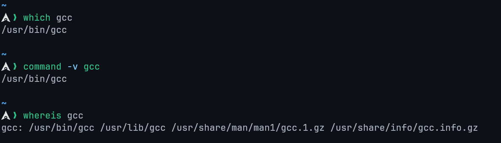
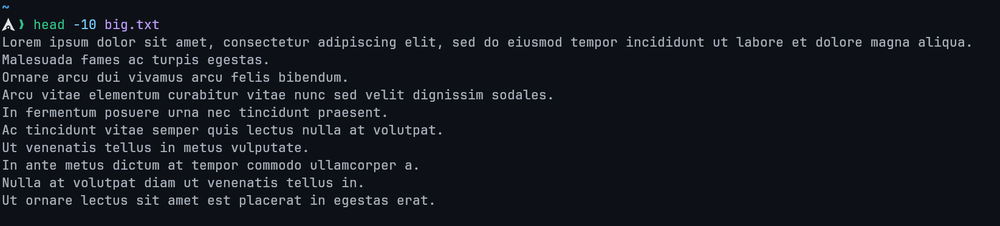
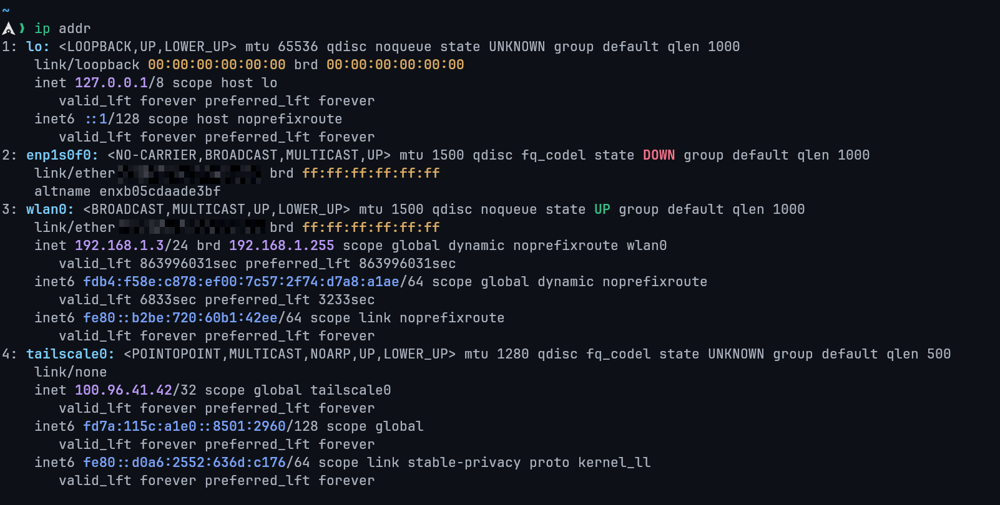
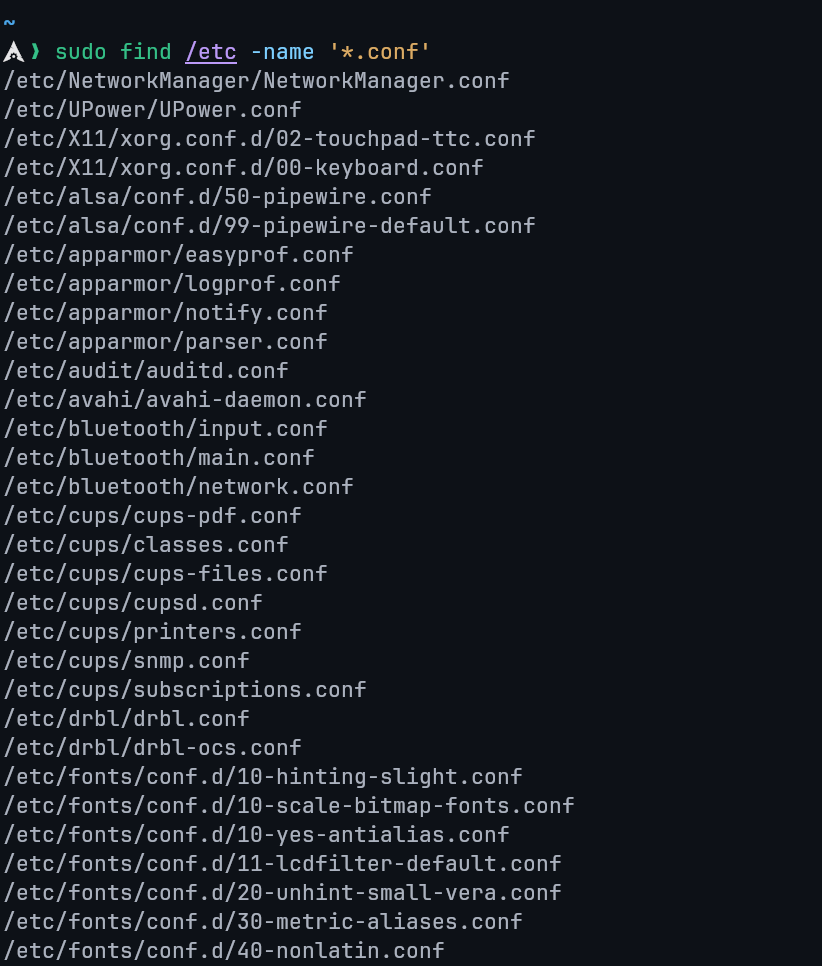
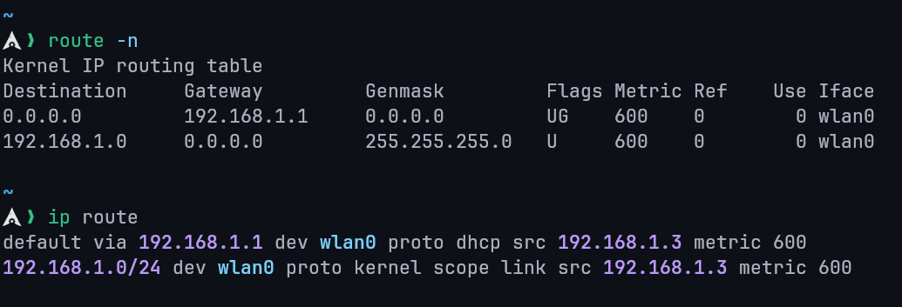
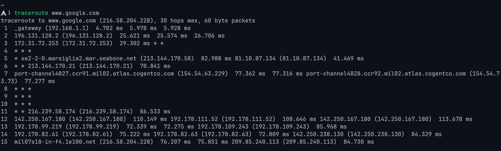

# Student Details

| Field   | Value                    |
| :------ | :----------------------- |
| Name    | ‎أحمد علي أحمد علي عثمان |
| Code    | 20240592                 |
| Section | 1                        |
| Number  | 15                       |

# Linux Essentials Assignment 2

## Task No.01

### 1.1 Explain types of processes in linux and how you can display all currently running processes in full format on a system.

#### Types of Processes in Linux

1. **Parent process**  
   A parent process is any process that creates another process using system calls such as `fork()` or `clone()`. Every process in Linux has a parent process, except for the very first process started by the kernel. If a process is launched from a terminal, its parent is typically the shell (e.g., `bash`, `sh`), **not the kernel directly**.
2. **Child process**  
   A child process is a process created by another process (its parent). The child inherits certain attributes from its parent (such as environment variables and file descriptors) but has a unique process ID (PID). Each child process always has exactly one parent at any given time.
3. **Orphan process**  
   An orphan process occurs when a parent process terminates **before** its child finishes execution. When this happens, the orphaned child is automatically re-parented to the system's init process (`systemd` on modern Linux systems, historically `init`). The orphan's PPID becomes the PID of `systemd` usually PID 1 or PID 0.
4. **Zombie process**  
   A zombie process is a process that has completed execution but still has an entry in the process table because its parent has not yet collected its exit status using `wait()` or `waitpid()`. Zombie processes consume no CPU and minimal memory, but they remain visible in process listings until reaped by their parent.
5. **Daemon process**  
   A daemon process is a long-running background process that typically starts during system boot or on demand and does not interact directly with a terminal. Daemons are usually detached from any controlling TTY, which is why their TTY field often appears as `?` in process listings. Examples include `sshd`, `cron`, and `systemd` services.

#### Displaying All Running Processes in Full Format

To display **all currently running processes in full format**, use:

```shell
ps -ef
```

- `-e` : show all processes
- `-f` : full-format listing (UID, PID, PPID, CPU usage, start time, TTY, and command)

Alternatively, a more detailed output can be obtained with:

```shell
ps aux
```

- `-a` : Shows information about all users
- `-x` : Shows information about processes without terminals
- `-u` : displays the process for a specific user.

---

### 1.2 Explore the Function of the Following Commands

## `cat` Command

The `cat` (concatenate) command is a basic utility used to read, combine, and write file contents.

**Functions:**

- Display the contents of one or more files to standard output.
- Concatenate multiple files.
- Create or overwrite files via redirection.
- Append data to existing files.

**Examples:**

```shell
# Show contents of file.txt
cat file.txt

# Show contents of file1.txt followed by file2.txt
cat file1.txt file2.txt

# Show contents with line numbers
cat -n file.txt

# Copy contents of file.txt to new.txt (overwrite)
cat file.txt > new.txt

# Append contents of file.txt to new.txt
cat file.txt >> new.txt

# Create a new file using standard input (Ctrl+D to save)
cat > test.txt
```

Note: While `cat` can create files, editors like `vim` or `nano` are more suitable for interactive editing.

## `file` Command

The `file` command determines a file's type by examining its contents rather than relying on the file extension.

**Functions:**

- Identify file types (text, binary, executable, archive, media, etc.).
- Detect encodings and binary formats.

**Examples:**

```shell
# Identify the type of a file
file myfile

# Check multiple files
file file1 file2

# Show MIME type
file --mime-type image.png
```

**Example output:**



## `route` Command

The `route` command displays or modifies the system's IP routing table.

**Functions:**

- View current routing information.
- Add or delete network routes.

**Examples:**

```shell
# Display routing table
route -n

# Add a default gateway
sudo route add default gw 192.168.1.1

# Delete a route
sudo route del default
```

## `nice` Command

The `nice` command is used to start a process with a specific scheduling priority.

**Functions:**

- Adjust process priority at startup.
- Influence CPU scheduling without stopping the process.

**Examples:**

```shell
# Run a command with lower priority
nice -n 10 myscript.sh

# Check priority (NI column)
top
```

Lower nice values mean higher priority. Only root can assign negative values.

## `grep` Command

The `grep` command searches for patterns in text using regular expressions.

**Functions:**

- Search text in files or command output.
- Filter command results.
- Support regular expressions.

**Examples:**

```shell
# Search for a word in a file
grep "error" log.txt

# Case-insensitive search
grep -i "warning" log.txt

# Recursive search
grep -r "TODO" src/
```

## `gunzip` Command

The `gunzip` command decompresses files compressed with `gzip`.

**Functions:**

- Decompress `.gz` files.
- Restore original file contents.

**Examples:**

```shell
# Decompress file.gz
gunzip file.gz

# Keep original compressed file
gunzip -k file.gz
```

## `netstat` Command

The `netstat` command displays network connections, routing tables, and interface statistics.

**Functions:**

- View open ports and active connections.
- Display listening services.

**Examples:**

```shell
# Show all listening ports
netstat -tuln

# Show active connections
netstat -an
```

## `sed` Command

The `sed` (stream editor) command performs text transformations on input streams.

**Functions:**

- Search and replace text.
- Edit files non-interactively.
- Process text pipelines.

**Examples:**

```shell
# Replace 'foo' with 'bar'
sed 's/foo/bar/' file.txt

# Replace globally
sed 's/foo/bar/g' file.txt

# Edit file in-place
sed -i 's/foo/bar/g' file.txt
```

## `top` Command

The `top` command provides a real-time view of system processes and resource usage.

**Functions:**

- Monitor CPU and memory usage.
- View running processes dynamically.
- Manage process priorities interactively.

**Examples:**

```shell
# Start process monitor
top
```

Useful interactive keys:

- `k` kill a process
- `r` renice a process
- `q` quit

## `bg` Command

The `bg` command resumes a stopped job in the background.

**Functions:**

- Continue suspended jobs without occupying the terminal.
- Works with job control in shells.

**Examples:**

```shell
# Suspend a running process
Ctrl+Z

# Resume it in the background
bg

# Resume a specific job
bg %1
```

---

### 1.3 Create basic linux commands for the following tasks

#### Locate the executable files or location of a program from the file system.

Locates the executable of the `gcc` command.



#### Display the starting content of a file

Shows the first 10 lines of `big.txt`.



#### Determine the path along which a packet travels

```shell
traceroute <destination>
```

#### Display IP Address, Hardware and MAC address. It is also used configure network interfaces

```shell
ip addr
```



#### Stop a process

```shell
kill <PID>
```

#### Search for all .conf files under /etc

```shell
sudo find /etc -name '*.conf'
```



#### Display CPU and memory usage of a process

```shell
top
```

Alternatively, for a specific process:

```shell
top -p <PID>
# Or
ps -p <PID> -o %cpu,%mem,cmd
```


#### Display routing table

```shell
route -n
# or
ip route
```



#### Trace the path to `www.google.com`

```shell
traceroute www.google.com
```



#### Redirect the output of `ls` to a file `files.txt`

```shell
ls > files.txt
```

---

### 1.4 Employ Commands Used to Manage a Linux Server

#### Copy multiple files and directories

```shell
cp file1 file2 /destination/
```

Copy directories recursively:

```shell
cp -r dir1 dir2 /destination/
```

#### Take a backup for an existing file

```shell
cp file.txt file.txt.bak
```

#### Remove duplicate lines of a file

```shell
sort file.txt | uniq
```

Overwrite file with unique lines:

```shell
sort file.txt | uniq > clean.txt
```

#### View only active connections

```shell
netstat -an | grep ESTABLISHED
```

#### Search for a particular information inside a text file

```shell
grep "keyword" filename.txt
```

#### Compress a directory into a `.tar.gz` backup

```shell
tar -czvf backup.tar.gz directory/
```

#### Show last 50 lines

```shell
tail -n 50 filename.txt
```

#### Show kernel version

```shell
uname -r
```

#### Locate a program's path


---

### 1.5 Use Core Linux Commands

#### Display the first 30 lines of a file named `logs.txt`

```shell
head -n 30 logs.txt
```

#### Start a program with lower priority (nice value = 10)

```shell
nice -n 10 script.sh
```

#### Display all processes running under the user `root`

```shell
ps -u root
```

Full format:

```shell
ps -u root -f
```

#### Count how many words are inside the file `report.txt`

```shell
wc -w report.txt
```

#### List all processes that are running in the background for the current user

```shell
jobs
```

#### Display the file content in reverse order

```shell
tac filename.txt
```

#### Query DNS to fetch the IP address or domain name from DNS records

```shell
nslookup domain.com
```

Alternative:

```shell
dig domain.com
```

#### Change the hostname of the server

```shell
hostnamectl set-hostname new-hostname
```

#### Show the parent process ID (PPID) of a process with PID 2000

```shell
ps -o ppid= -p 2000
```

#### Remove duplicates and save into a new file

```shell
sort file.txt | uniq > unique.txt
```
